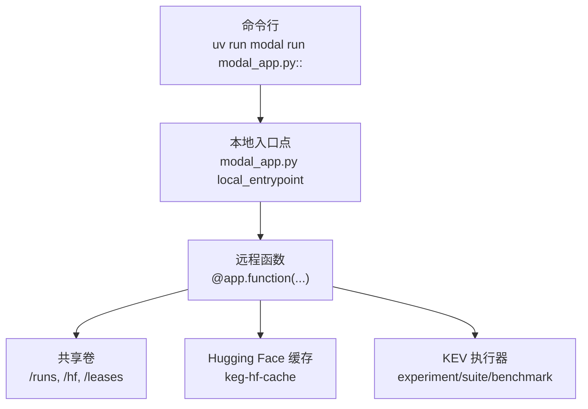
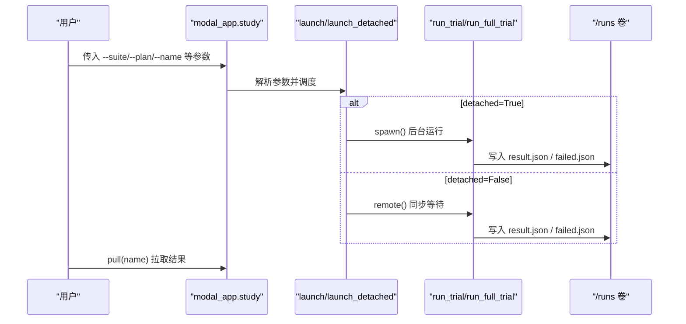
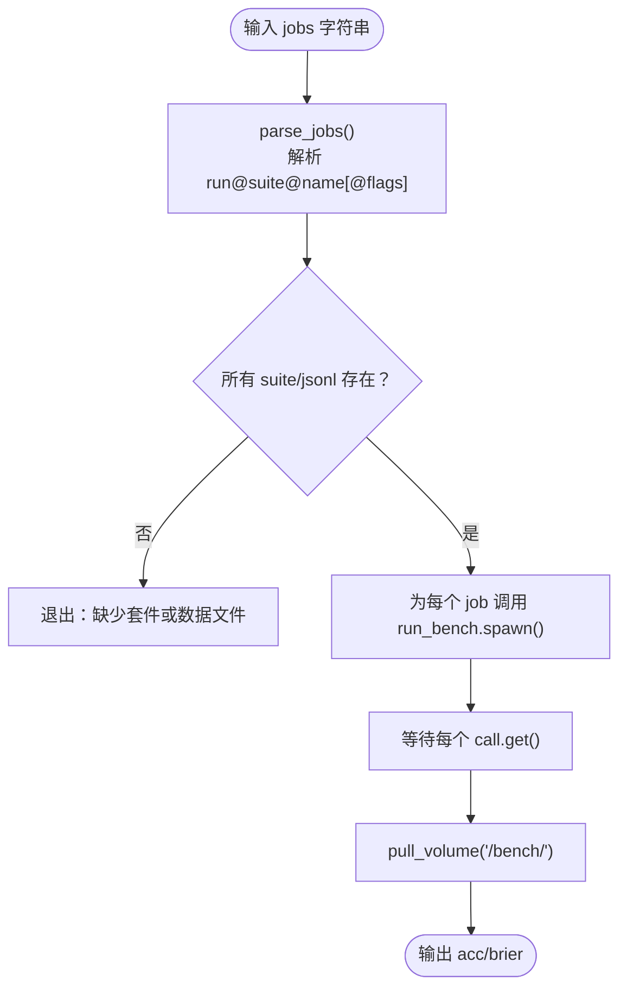
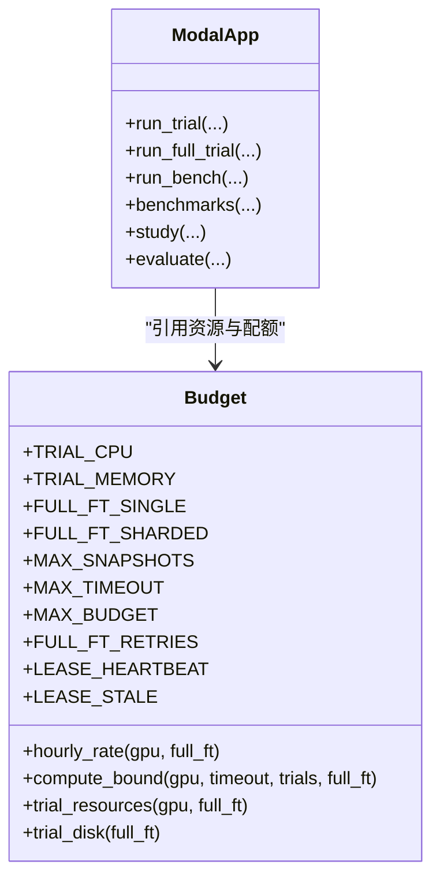
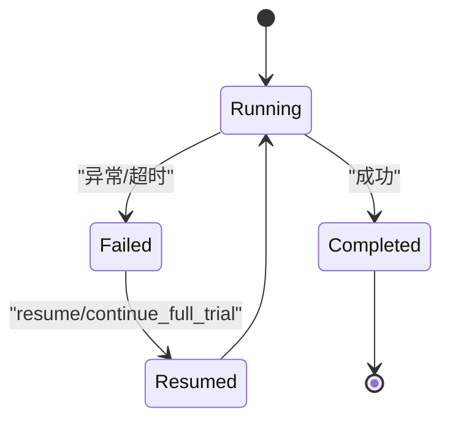

# 部署命令

<cite>
**本文引用的文件**   
- [modal_app.py](file://modal_app.py)
- [budget.py](file://kev/budget.py)
- [pyproject.toml](file://pyproject.toml)
</cite>

## 目录
1. [简介](#简介)
2. [项目结构与入口](#项目结构与入口)
3. [核心部署命令总览](#核心部署命令总览)
4. [命令参数参考](#命令参数参考)
5. [资源分配与配额](#资源分配与配额)
6. [错误处理、重试与续跑](#错误处理重试与续跑)
7. [监控与告警建议](#监控与告警建议)
8. [常见问题排查](#常见问题排查)
9. [结论](#结论)

## 简介
本文面向使用 Modal 运行 KEV 研究、评估和基准测试的工程师，系统化说明以下部署场景的命令格式与配置方法：
- 快速冒烟测试：`uv run modal run modal_app.py::smoke`
- 并行研究：`uv run modal run modal_app.py::study --suite ... --plan ... --name ...`
- 模型评估：`uv run modal run modal_app.py::evaluate --run ... --suite ... --name ...`
- 基准测试：`uv run modal run modal_app.py::benchmarks --jobs ...`

文档同时覆盖 GPU 类型选择、并发容器数量限制、超时设置、预算控制、错误处理、重试机制以及续跑策略。

## 项目结构与入口
Modal 应用通过 `modal_app.py` 暴露多个本地入口点（local entrypoint），每个入口点负责解析用户参数、构造远程函数调用、拉起容器并拉取结果。关键入口包括：
- `smoke`：快速冒烟测试
- `study`：按计划并行启动多个 trial
- `evaluate`：对已有 checkpoint 在指定 suite 上评分
- `benchmarks`：批量对多个 run@suite@name 任务执行 benchmark

**图表来源** 
- [modal_app.py:53-83](file://modal_app.py#L53-L83)
- [modal_app.py:96-115](file://modal_app.py#L96-L115)
- [modal_app.py:245-267](file://modal_app.py#L245-L267)
- [modal_app.py:612-629](file://modal_app.py#L612-L629)

**章节来源**
- [modal_app.py:53-83](file://modal_app.py#L53-L83)
- [modal_app.py:295-309](file://modal_app.py#L295-L309)
- [modal_app.py:612-629](file://modal_app.py#L612-L629)

## 核心部署命令总览

### 快速冒烟测试
- 命令：`uv run modal run modal_app.py::smoke`
- 作用：以最小规模套件和计划验证端到端流程，适合 T4 免费额度或快速回归。
- 行为：内部调用 `launch(...)` 启动一个 study，默认使用当前环境中的 GPU 类型（由 `KEV_GPU` 决定）。

**章节来源**
- [modal_app.py:1258-1260](file://modal_app.py#L1258-L1260)
- [modal_app.py:38-42](file://modal_app.py#L38-L42)

### 并行研究（study）
- 命令：`uv run modal run modal_app.py::study --suite <路径> --plan <JSON> --name <名称>`
- 可选参数：
  - `--gpu`：GPU 类型，如 H100/H200/B200/T4；支持多卡表示法 `H200:8`
  - `--existing`：逗号分隔的 checkpoint 列表（Hub id 或 `/runs/...`）
  - `--transfer`：转移评测套件路径
  - `--budget`：研究预算上限（美元）
  - `--timeout`：单次尝试最大时长（秒）
  - `--detached`：是否后台拉起（默认 True）
- 行为：根据 plan 生成多个 trial，分别以独立容器运行；结果写入共享卷 `/runs/<study>/<trial>/...`。

**图表来源** 
- [modal_app.py:1073-1078](file://modal_app.py#L1073-L1078)
- [modal_app.py:96-115](file://modal_app.py#L96-L115)
- [modal_app.py:1232-1238](file://modal_app.py#L1232-L1238)

**章节来源**
- [modal_app.py:1073-1078](file://modal_app.py#L1073-L1078)
- [modal_app.py:1081-1093](file://modal_app.py#L1081-L1093)
- [modal_app.py:1232-1238](file://modal_app.py#L1232-L1238)

### 模型评估（evaluate）
- 命令：`uv run modal run modal_app.py::evaluate --run <checkpoint> --suite <路径> --name <名称>`
- 可选参数：
  - `--gpu`：GPU 类型
  - `--transfer`：附加 transfer 评测套件
- 行为：将给定 checkpoint 在 suite 的开发集上进行评分，结果写入 `/runs/<name>/...`。

**章节来源**
- [modal_app.py:1263-1266](file://modal_app.py#L1263-L1266)

### 基准测试（benchmarks）
- 命令：`uv run modal run modal_app.py::benchmarks --jobs "<run>@<suite-or-jsonl>@<name>[@flags],..."`
- 可选参数：
  - `--gpu`：GPU 类型
  - `--timeout`：统一超时（秒）；未设置时按 suite 自动计算
- 行为：对每个 job 调用 `run_bench`，结果拉取到本地 `runs/<name>/...`。

**图表来源** 
- [modal_app.py:590-609](file://modal_app.py#L590-L609)
- [modal_app.py:612-629](file://modal_app.py#L612-L629)
- [modal_app.py:259-267](file://modal_app.py#L259-L267)

**章节来源**
- [modal_app.py:590-609](file://modal_app.py#L590-L609)
- [modal_app.py:612-629](file://modal_app.py#L612-L629)
- [modal_app.py:259-267](file://modal_app.py#L259-L267)

## 命令参数参考

### 通用参数
- `--gpu`：GPU 类型，支持单卡或多卡表示法（例如 `H200:8`）。默认值来自环境变量 `KEV_GPU`。
- `--timeout`：单次尝试最大时长（秒）。不同命令有默认值或按 suite 动态计算。
- `--budget`：研究预算上限（美元），用于 admission bound 校验。
- `--detached`：是否后台拉起（study）。

### study 参数
- `--suite`：评测套件路径（仓库内相对路径）。
- `--plan`：实验计划 JSON 文件路径。
- `--name`：本次研究的名称，对应 `/runs/<name>/...`。
- `--existing`：逗号分隔的 checkpoint 列表（Hub id 或 `/runs/...`）。
- `--transfer`：附加 transfer 评测套件路径。

### evaluate 参数
- `--run`：要评估的 checkpoint（Hub id 或 `/runs/...`）。
- `--suite`：评测套件路径。
- `--name`：输出名称。
- `--transfer`：附加 transfer 评测套件路径。

### benchmarks 参数
- `--jobs`：逗号分隔的任务列表，每项格式为 `run@suite-or-jsonl@name[@flags]`。
- `--gpu`：GPU 类型。
- `--timeout`：统一超时（秒）；未设置时使用按 suite 计算的默认值。

**章节来源**
- [modal_app.py:1073-1078](file://modal_app.py#L1073-L1078)
- [modal_app.py:1263-1266](file://modal_app.py#L1263-L1266)
- [modal_app.py:612-629](file://modal_app.py#L612-L629)
- [modal_app.py:590-609](file://modal_app.py#L590-L609)

## 资源分配与配额

### GPU 类型与并发
- GPU 类型：H100、H200、B200、T4。可通过 `KEV_GPU` 环境变量或 `--gpu` 指定。
- 并发容器数量：`max_containers=24`，适用于训练与评测函数。
- 多卡表示法：`H200:8` 表示单个容器内使用 8 张 GPU。

**图表来源** 
- [budget.py:1-50](file://kev/budget.py#L1-L50)
- [budget.py:53-108](file://kev/budget.py#L53-L108)
- [modal_app.py:103-115](file://modal_app.py#L103-L115)

### 内存与 CPU
- 普通 trial：CPU 4 核，内存请求/限制为 `(65536, 196608)` MiB。
- 全量微调（full_ft）：
  - 单卡：`(368640, 409600)` MiB
  - 多卡：`(409600, 471040)` MiB
  - 临时磁盘：1 TiB（ephemeral_disk）

### 超时与预算
- 最大超时：LoRA 研究 28800 秒（8 小时），全量微调 86400 秒（24 小时）。
- 最大预算：LoRA 研究 $250，全量微调 $1000。
- 续跑次数：全量微调最多允许 1 + FULL_FT_RETRIES 次尝试。

**章节来源**
- [budget.py:1-50](file://kev/budget.py#L1-L50)
- [budget.py:53-108](file://kev/budget.py#L53-L108)
- [modal_app.py:103-115](file://modal_app.py#L103-L115)

## 错误处理、重试与续跑

### 失败记录
- 若 trial 抛出异常，系统会写入 `failed.json`，包含错误类型与消息摘要。
- 全量微调中，失败不会继续运行，而是返回失败状态供上层读取。

### 重试机制
- Modal 侧重试：默认关闭（`retries=0`），避免重复计费与并发冲突。
- 全量微调续跑：通过 `continue_full_trial` 基于 lease 与 attempt ledger 安全续跑，最多允许 1 + FULL_FT_RETRIES 次尝试。

### 续跑策略
- `resume`：对已完成 checkpoint 但无结果的 trial 进行后续评测；对未完成的全量微调 trial 触发下一次尝试。
- Lease 心跳：每 60 秒刷新一次，超过 900 秒视为 stale，允许新尝试接管。

**图表来源** 
- [modal_app.py:118-177](file://modal_app.py#L118-L177)
- [modal_app.py:1116-1189](file://modal_app.py#L1116-L1189)
- [modal_app.py:1202-1229](file://modal_app.py#L1202-L1229)

**章节来源**
- [modal_app.py:118-177](file://modal_app.py#L118-L177)
- [modal_app.py:1116-1189](file://modal_app.py#L1116-L1189)
- [modal_app.py:1202-1229](file://modal_app.py#L1202-L1229)
- [budget.py:33-44](file://kev/budget.py#L33-L44)

## 监控与告警建议

### 日志与指标
- 每个 trial 输出设备信息、torch 版本、是否继续运行、最终 objective、clean_acc、wall_seconds 与 gates 检查结果。
- 基准测试输出 acc 与 brier，便于横向对比。

### 告警触发点
- `failed.json` 出现：标记 trial 失败，需人工介入或自动重试。
- 预算超支：admission bound 拒绝新的 attempt。
- Lease stale：旧容器可能仍在写盘，新尝试需等待。

### 监控集成建议
- 定期扫描 `/runs/<study>/<trial>/result.json` 与 `failed.json`，聚合成功率与耗时。
- 监控 Modal 调用状态（timeout/refused/running），结合 lease heartbeat 判断容器健康。
- 对基准测试输出进行趋势分析，识别性能退化。

**章节来源**
- [modal_app.py:144-177](file://modal_app.py#L144-L177)
- [modal_app.py:612-629](file://modal_app.py#L612-L629)
- [modal_app.py:1116-1189](file://modal_app.py#L1116-L1189)

## 常见问题排查

### 问题：套件路径不存在
- 现象：benchmarks 启动时报错缺少套件或数据文件。
- 解决：确认 `--suite` 或 `.jsonl` 路径在当前 checkout 中存在。

**章节来源**
- [modal_app.py:620-622](file://modal_app.py#L620-L622)

### 问题：全量微调磁盘不足
- 现象：snapshot 写入失败，trial 被标记为 failed。
- 解决：减少快照数量（MAX_SNAPSHOTS=8），或清理历史 runs。

**章节来源**
- [budget.py:11-18](file://kev/budget.py#L11-L18)

### 问题：Lease 冲突导致无法续跑
- 现象：continue_full_trial 报 lease fresh，等待旧容器结束。
- 解决：等待 LEASE_STALE（900 秒）后重试，或检查旧容器是否仍在运行。

**章节来源**
- [modal_app.py:1172-1178](file://modal_app.py#L1172-L1178)
- [budget.py:33-44](file://kev/budget.py#L33-L44)

## 结论
本文系统化了 KEV 在 Modal 上的部署命令与资源配置，涵盖 smoke、study、evaluate、benchmarks 四大场景，详细说明了参数用法、GPU 选择、并发限制、超时与预算控制，以及错误处理、重试与续跑机制。通过理解这些命令与配置，用户可以高效地运行研究、评估与基准测试，并在大规模实验中保持稳定性与可观测性。