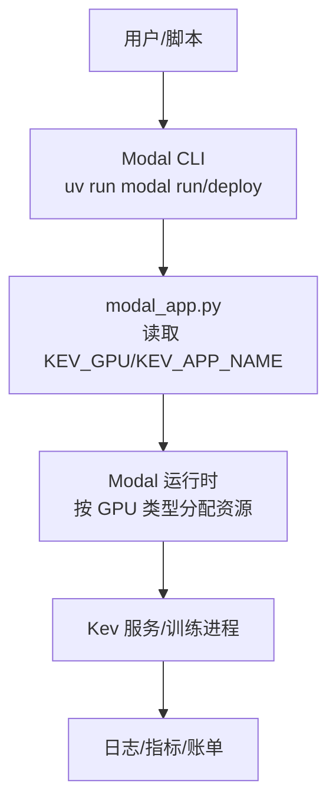
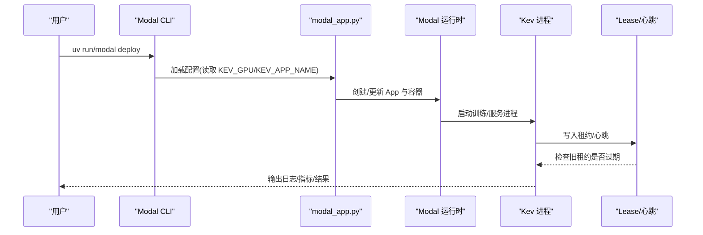
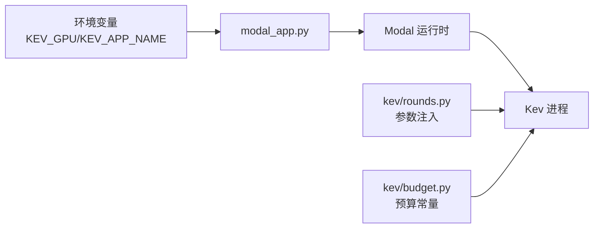

# 成本优化策略

<cite>
**本文引用的文件**   
- [modal_app.py](file://modal_app.py)
- [AGENTS.md](file://AGENTS.md)
- [PLAN.md](file://PLAN.md)
- [README.md](file://README.md)
- [kev/budget.py](file://kev/budget.py)
- [kev/rounds.py](file://kev/rounds.py)
</cite>

## 目录
1. [引言](#引言)
2. [项目结构](#项目结构)
3. [核心组件](#核心组件)
4. [架构总览](#架构总览)
5. [详细组件分析](#详细组件分析)
6. [依赖关系分析](#依赖关系分析)
7. [性能与成本考量](#性能与成本考量)
8. [故障排查指南](#故障排查指南)
9. [结论](#结论)
10. [附录](#附录)

## 引言
本指南面向在 Modal 平台上运行 Kev 训练与服务任务的团队，聚焦“GPU 类型选择、自动扩缩容、空闲实例清理、成本监控与预算控制、以及批量任务调度与缓存复用”等关键主题。文档基于仓库中的部署入口、环境配置与实验说明，给出可操作的策略、公式与案例，帮助你在保证质量的前提下显著降低 GPU 成本。

## 项目结构
本项目围绕以下与成本优化直接相关的代码与文档：
- 部署入口与环境变量：modal_app.py 定义默认 GPU、应用名传播与 Modal App 初始化。
- 实验与运行说明：AGENTS.md 与 PLAN.md 描述 KEV_GPU 选择、部署命令、预算上限、并发与续跑机制。
- 预算常量与约束：kev/budget.py 提供预算相关常量（如最大快照数、超时等）。
- 轮次与参数传递：kev/rounds.py 将 app/GPU 等环境变量注入到子进程或远程调用中。
- 快速入门示例：README.md 包含使用 T4 的端到端示例。

图表来源
- [modal_app.py:2-52](file://modal_app.py#L2-L52)
- [AGENTS.md:246-247](file://AGENTS.md#L246-L247)

章节来源
- [modal_app.py:2-52](file://modal_app.py#L2-L52)
- [AGENTS.md:246-247](file://AGENTS.md#L246-L247)

## 核心组件
- GPU 类型选择与默认值
  - 通过环境变量 KEV_GPU 指定 GPU 类型；默认值为 H100；T4 用于免费层。
  - 该变量在部署与运行阶段被传入工作进程，影响底层资源分配与计费。
- 应用隔离与命名
  - KEV_APP_NAME 用于隔离不同研究部署，避免多环境互相干扰。
- 预算与重试
  - 全权重尝试受预算上限限制；每个 study 有费用上限；失败时支持有限次数续跑。
- 并发与续跑协调
  - 通过 lease 与心跳机制避免重复启动；旧租约未过期则拒绝新续跑，直到其结束或过期。

章节来源
- [modal_app.py:41-52](file://modal_app.py#L41-L52)
- [AGENTS.md:94-117](file://AGENTS.md#L94-L117)
- [AGENTS.md:246-247](file://AGENTS.md#L246-L247)

## 架构总览
下图展示从命令行到 Modal 运行时再到 Kev 进程的完整链路，并标注成本敏感点（GPU 类型、并发、超时、预算）。

图表来源
- [modal_app.py:41-52](file://modal_app.py#L41-L52)
- [AGENTS.md:94-117](file://AGENTS.md#L94-L117)

## 详细组件分析

### GPU 类型选择策略：T4（免费层）vs H100/H200（高性能）
- 选择原则
  - 开发/冒烟测试：优先 T4（免费层），成本低、适合小规模验证。
  - 生产/大规模推理或训练：H100/H200，吞吐高、延迟低，但单价更高。
- 性能与成本对比要点
  - H100/H200 在高并发长上下文场景下具备明显吞吐优势；T4 更适合小批量、短上下文或离线批处理。
  - 在相同任务规模下，H100/H200 的单次运行时间更短，但单位时间成本更高；需结合 SLA 与吞吐目标做权衡。
- 实践建议
  - 先用 T4 完成端到端验证与回归；再切换到 H100/H200 进行压测与上线。
  - 对长上下文推理，优先 H100/H200；对短上下文或离线批处理，评估 T4 是否满足 SLA。

章节来源
- [modal_app.py:41-46](file://modal_app.py#L41-L46)
- [AGENTS.md:246-247](file://AGENTS.md#L246-L247)
- [README.md:308](file://README.md#L308)

### 自动扩缩容与并发管理：max_containers、并发任务、资源利用率
- 扩缩容与并发
  - 通过控制并发任务数量与容器上限，平衡吞吐与成本。
  - 在高并发场景下，优先使用高性能 GPU（H100/H200）以降低排队与尾延迟；在低峰期或离线任务，使用 T4 降低成本。
- 资源利用率优化
  - 合理设置 batch size 与累积步数，使 GPU 利用率接近饱和但不溢出显存。
  - 对长上下文任务，采用分块预填充与 KV 缓存复用，减少重复计算。
- 并发与续跑保护
  - Lease + 心跳机制确保同一任务不会被重复执行；旧租约未过期则拒绝新续跑，避免资源浪费。

章节来源
- [AGENTS.md:94-117](file://AGENTS.md#L94-L117)

### 空闲实例清理：超时、自动终止与资源回收
- 超时与终止
  - 为训练/服务任务设置合理的超时上限，防止长时间空转。
  - 结合预算上限与失败重试次数，避免无限续跑导致成本失控。
- 资源回收
  - 任务结束后释放容器与 GPU；利用 Modal 的自动伸缩特性，在无任务时缩容至零。
  - 对长驻服务，启用健康检查与优雅退出，确保资源及时回收。

章节来源
- [AGENTS.md:94-117](file://AGENTS.md#L94-L117)

### 成本监控工具：控制台、预算告警与费用报告
- 控制台与账单
  - 通过 Modal 控制台查看 GPU 使用时长、并发量与费用趋势。
- 预算告警
  - 设置月度/周度预算阈值，触发告警通知；结合 KEV_GPU 切换策略动态调整。
- 费用分析报告
  - 导出任务级费用明细，按 GPU 类型、任务类别、时间段聚合分析，定位高成本热点。

章节来源
- [AGENTS.md:94-117](file://AGENTS.md#L94-L117)

### 最佳实践：批量任务调度、GPU 共享与缓存复用
- 批量任务调度
  - 将相似任务合并批次，提升 GPU 利用率；对长上下文任务使用长度分组与分块预填充。
- GPU 共享策略
  - 在小模型或轻量任务上考虑多任务共享单卡；在大模型或高并发场景独占 GPU。
- 缓存复用技巧
  - 复用 KV 缓存与前缀缓存，减少重复计算；对静态输入（如系统提示）使用前缀缓存。

章节来源
- [AGENTS.md:325-328](file://AGENTS.md#L325-L328)

### 成本计算公式与优化案例
- 基础公式
  - 单次任务成本 = 运行时长 × GPU 单价
  - 日均成本 = Σ(各任务运行时长 × GPU 单价)
  - 月均成本 = Σ(日成本)
  - 单位产出成本 = 总成本 / 产出（如请求数、评测记录数）
- 优化案例
  - 将冒烟测试从 H100 迁移至 T4，单次成本显著下降；仅在压测与上线时使用 H100/H200。
  - 对长上下文推理，采用分块预填充与 KV 缓存，减少重复计算，降低单位请求成本。
  - 通过 Lease + 心跳避免重复执行，减少无效 GPU 占用。

章节来源
- [AGENTS.md:94-117](file://AGENTS.md#L94-L117)
- [AGENTS.md:325-328](file://AGENTS.md#L325-L328)

## 依赖关系分析
- 环境变量依赖
  - KEV_GPU：决定 GPU 类型；默认 H100；T4 用于免费层。
  - KEV_APP_NAME：隔离不同研究部署。
- 模块依赖
  - modal_app.py 负责读取环境变量并初始化 Modal App。
  - kev/rounds.py 将 app/GPU 等参数注入到子进程或远程调用中。
  - kev/budget.py 提供预算相关常量与约束。

图表来源
- [modal_app.py:41-52](file://modal_app.py#L41-L52)
- [kev/rounds.py:1044](file://kev/rounds.py#L1044)
- [kev/budget.py](file://kev/budget.py)

章节来源
- [modal_app.py:41-52](file://modal_app.py#L41-L52)
- [kev/rounds.py:1044](file://kev/rounds.py#L1044)
- [kev/budget.py](file://kev/budget.py)

## 性能与成本考量
- GPU 类型与任务匹配
  - 短上下文/离线批处理：T4 优先；长上下文/高并发：H100/H200 优先。
- 并发与吞吐
  - 提高并发需评估 GPU 容量与队列延迟；必要时扩容至高性能 GPU。
- 内存与显存
  - 长上下文任务注意显存峰值；采用分块预填充与 KV 缓存复用。
- 成本与 SLA 权衡
  - 在满足 SLA 的前提下，优先选择低成本 GPU；在高峰期临时扩容高性能 GPU。

[本节为通用指导，不直接分析具体文件]

## 故障排查指南
- 重复执行问题
  - 检查 Lease 与心跳是否正常；确认旧租约是否已过期或被正确释放。
- 预算超支
  - 核对预算上限与重试次数；检查是否存在异常续跑或长时间空转。
- GPU 类型不生效
  - 确认 KEV_GPU 环境变量是否正确传入；检查部署命令与运行命令是否一致。
- 长上下文 OOM
  - 调整分块大小与缓存策略；降低并发或切换更大显存的 GPU。

章节来源
- [AGENTS.md:94-117](file://AGENTS.md#L94-L117)

## 结论
通过在 Modal 平台上合理选择 GPU 类型、精细控制并发与扩缩容、严格管理超时与预算、并结合批量调度与缓存复用，可以在保证质量与 SLA 的前提下显著降低 GPU 成本。建议以 T4 作为默认开发环境，仅在必要场景切换到 H100/H200，并通过 Lease+心跳与预算上限防止资源浪费。

[本节为总结性内容，不直接分析具体文件]

## 附录
- 快速参考
  - 使用 T4 进行端到端验证：参考 README 中的示例命令。
  - 部署与运行：参考 AGENTS.md 与 PLAN.md 中的命令与步骤。
  - 预算与重试：参考 AGENTS.md 中的预算上限与续跑机制。

章节来源
- [README.md:308](file://README.md#L308)
- [AGENTS.md:94-117](file://AGENTS.md#L94-L117)
- [PLAN.md:396](file://PLAN.md#L396)