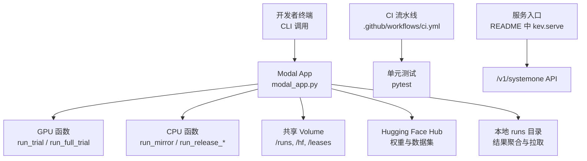
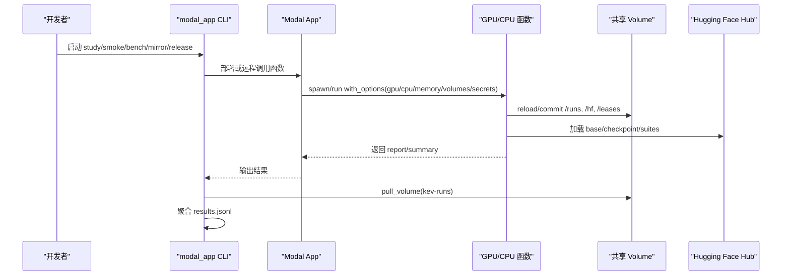
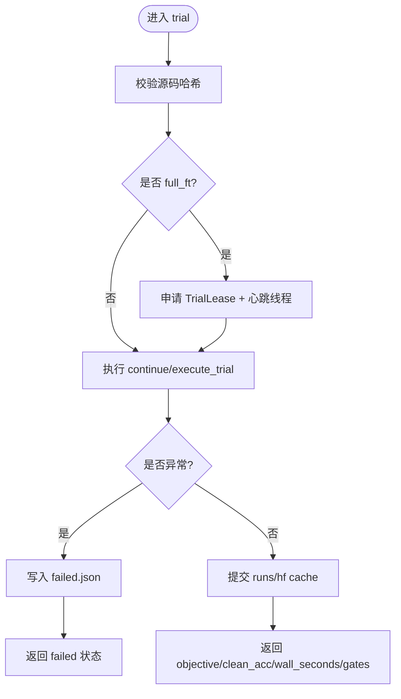
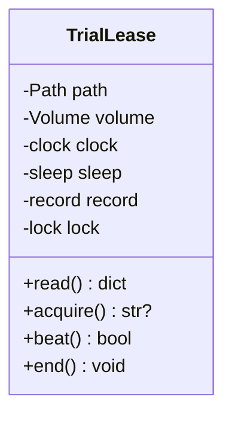
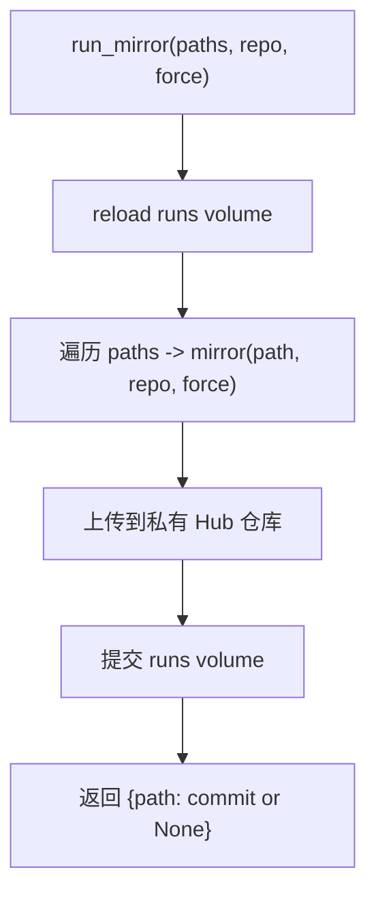
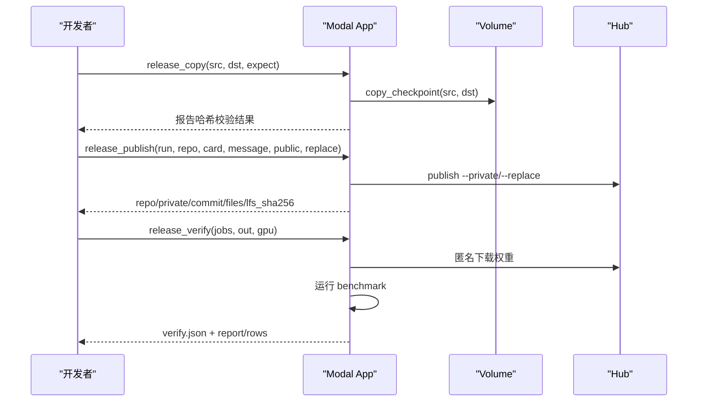
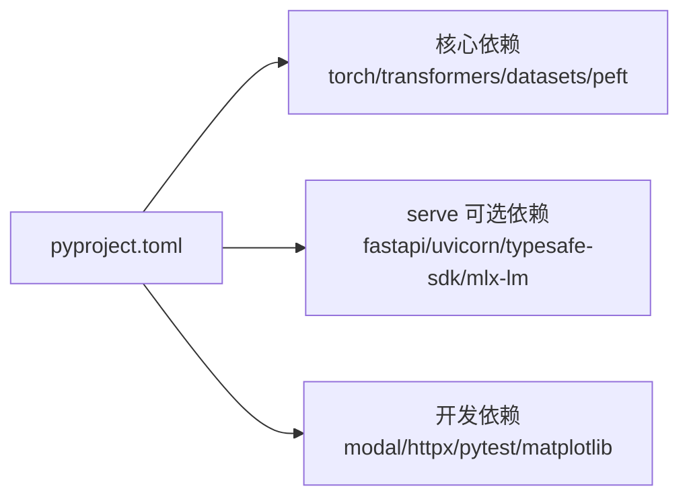
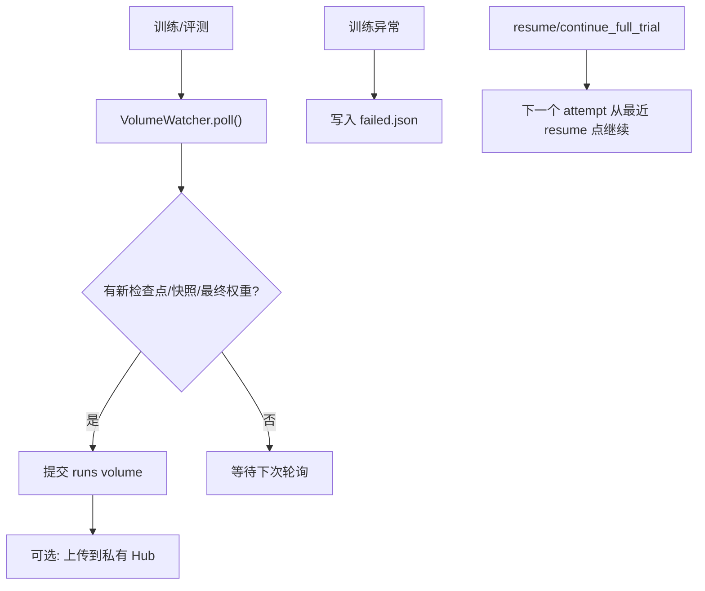

# 生产环境最佳实践

<cite>
**本文引用的文件**   
- [modal_app.py](file://modal_app.py)
- [README.md](file://README.md)
- [pyproject.toml](file://pyproject.toml)
- [.github/workflows/ci.yml](file://.github/workflows/ci.yml)
</cite>

## 目录
1. [引言](#引言)
2. [项目结构](#项目结构)
3. [核心组件](#核心组件)
4. [架构总览](#架构总览)
5. [详细组件分析](#详细组件分析)
6. [依赖关系分析](#依赖关系分析)
7. [性能与容量规划](#性能与容量规划)
8. [安全与访问控制](#安全与访问控制)
9. [备份、持久化与灾难恢复](#备份持久化与灾难恢复)
10. [CI/CD 与自动化部署](#cicd-与自动化部署)
11. [监控告警与可观测性](#监控告警与可观测性)
12. [故障处理预案](#故障处理预案)
13. [结论](#结论)

## 引言
本指南面向将 Kev 的决策模型以 Modal 为运行时进行生产部署的工程团队。文档基于仓库中的 Modal 应用入口、服务说明、依赖定义和 CI 配置，总结高可用、备份恢复、安全、性能、自动化运维以及成本控制的实践要点，并提供可直接落地的配置模板与排障清单。

Kev 提供 TypeSafe 兼容的 `/v1/systemone` API，支持本地或云端 GPU 推理；Modal 侧通过函数式容器执行训练、评估、镜像发布等任务，并通过共享 Volume 持久化权重、检查点和结果。

**章节来源**
- [README.md:13-23](file://README.md#L13-L23)
- [README.md:172-184](file://README.md#L172-L184)

## 项目结构
仓库围绕“研究脚本 + 推理服务 + Modal 编排”展开：
- `modal_app.py`：Modal App 定义、GPU/CPU 函数、Volume 挂载、Secret 注入、作业调度与结果拉取。
- `README.md`：API、部署方式、性能表、训练与评测命令。
- `pyproject.toml`：Python 依赖、可选 serve 依赖、Modal 开发依赖版本。
- `.github/workflows/ci.yml`：Python 单元测试与前端类型检查流水线。

**图示来源**
- [modal_app.py:33-83](file://modal_app.py#L33-L83)
- [modal_app.py:96-116](file://modal_app.py#L96-L116)
- [modal_app.py:272-293](file://modal_app.py#L272-L293)
- [modal_app.py:667-706](file://modal_app.py#L667-L706)
- [README.md:172-184](file://README.md#L172-L184)

**章节来源**
- [modal_app.py:33-83](file://modal_app.py#L33-L83)
- [README.md:172-184](file://README.md#L172-L184)
- [pyproject.toml:37-54](file://pyproject.toml#L37-L54)
- [.github/workflows/ci.yml:1-35](file://.github/workflows/ci.yml#L1-L35)

## 核心组件
- Modal App 与镜像构建：固定 Python 版本、锁定依赖、安装 CUDA/Triton 相关包，并挂载本地源码与 evals/scripts/tests。
- 训练与评估函数：按 study/trial 维度在独立容器中运行，挂载 `/runs` 与 HF 缓存 Volume。
- 全量微调重试与租约：使用 `TrialLease` 与心跳机制避免并发尝试冲突。
- 检查点与快照镜像：`run_mirror` 将完整 checkpoint 上传到私有 Hub 仓库。
- 发布流程：复制、校验、发布 release checkpoint，支持公开或私有仓库。
- 匿名验证：模拟无 Token 用户下载公开权重并跑评测，确保对外可用性。

**章节来源**
- [modal_app.py:53-83](file://modal_app.py#L53-L83)
- [modal_app.py:96-116](file://modal_app.py#L96-L116)
- [modal_app.py:855-930](file://modal_app.py#L855-L930)
- [modal_app.py:272-293](file://modal_app.py#L272-L293)
- [modal_app.py:667-706](file://modal_app.py#L667-L706)
- [modal_app.py:722-746](file://modal_app.py#L722-L746)

## 架构总览
下图展示从 CLI 到 Modal 函数、Volume、HF Hub 的关键交互路径，以及本地结果拉取与聚合。

**图示来源**
- [modal_app.py:96-116](file://modal_app.py#L96-L116)
- [modal_app.py:272-293](file://modal_app.py#L272-L293)
- [modal_app.py:541-562](file://modal_app.py#L541-L562)
- [modal_app.py:1041-1063](file://modal_app.py#L1041-L1063)

## 详细组件分析

### 训练与评估函数（run_trial / run_full_trial）
- 每个 trial 一个容器，GPU 由环境变量 `KEV_GPU` 决定。
- 挂载 `/runs` 与 `/hf`，可选挂载 `/leases`。
- 全量微调需要更大 ephemeral_disk，并在失败时写入 `failed.json`。
- 通过 `expected_sources` 校验容器内源码哈希，保证可追溯性。

**图示来源**
- [modal_app.py:118-176](file://modal_app.py#L118-L176)

**章节来源**
- [modal_app.py:96-116](file://modal_app.py#L96-L116)
- [modal_app.py:118-176](file://modal_app.py#L118-L176)

### 全量微调重试与租约（TrialLease）
- 使用 `/leases/<study>/<trial>/attempt.json` 记录 nonce、attempt、call_id、started、heartbeat、ended。
- 心跳线程周期性刷新 heartbeat，防止被误判为 stale。
- acquire() 拒绝已被 fresh lease 占用的尝试；end() 标记结束，避免后续等待 stale。

**图示来源**
- [modal_app.py:855-930](file://modal_app.py#L855-L930)

**章节来源**
- [modal_app.py:855-930](file://modal_app.py#L855-L930)

### 检查点与快照镜像（run_mirror）
- CPU 函数，挂载 `/runs`，读取 Volume 上的完整 checkpoint 目录。
- 调用 `kev.mirror` 上传到私有 Hub 仓库，创建缺失仓库且拒绝公开仓库。
- 上传失败不抛异常，保留 Volume 副本为主数据源。

**图示来源**
- [modal_app.py:272-284](file://modal_app.py#L272-L284)

**章节来源**
- [modal_app.py:272-284](file://modal_app.py#L272-L284)

### 发布流程（release_copy / release_publish / release_verify）
- `run_release_copy`：复制 Volume 上 checkpoint 到 release 目录，校验权重哈希。
- `run_release_publish`：从 Volume 发布到私有 Hub，支持 `--private` 与 `--replace`。
- `run_release_verify`：匿名环境下载公开权重并评测，验证外部可用性。

**图示来源**
- [modal_app.py:667-706](file://modal_app.py#L667-L706)
- [modal_app.py:722-746](file://modal_app.py#L722-L746)

**章节来源**
- [modal_app.py:667-706](file://modal_app.py#L667-L706)
- [modal_app.py:722-746](file://modal_app.py#L722-L746)

## 依赖关系分析
- Python 运行时与核心库：torch、transformers、accelerate、datasets、peft、pydantic、scikit-learn。
- 服务可选依赖：fastapi、uvicorn、typesafe-sdk、mlx-lm（仅 Apple Silicon）。
- 开发依赖：httpx、matplotlib、modal==1.5.5、pytest。

**图示来源**
- [pyproject.toml:21-30](file://pyproject.toml#L21-L30)
- [pyproject.toml:37-54](file://pyproject.toml#L37-L54)

**章节来源**
- [pyproject.toml:21-30](file://pyproject.toml#L21-L30)
- [pyproject.toml:37-54](file://pyproject.toml#L37-L54)

## 性能与容量规划
- GPU 选择与吞吐：README 提供不同模型与 GPU 的延迟与 QPS 表；Kev-27B 在 B200/H200/H100 上表现接近，受 compute-bound 影响。
- 内存与显存：Kev-9B 约需 17 GB 显存；Kev-27B 权重 51 GB，加上 serving buffers 约 66 GB。
- 批处理与缓存：服务端对重复文本做缓存，减少重复计算；请求按 token budget 分批 forward。
- Modal 资源：函数定义中明确 cpu/memory/timeout/max_containers；全量微调需要更大 ephemeral_disk。

建议：
- 根据模型大小选择 GPU：Kev-0.8B 可在 L4，Kev-4B/9B 推荐 L40S/H100，Kev-27B 推荐 B200/H200/H100。
- 设置合理的 timeout 与 memory，避免频繁超时重试导致成本上升。
- 使用批量请求与缓存策略提升吞吐。

**章节来源**
- [README.md:355-383](file://README.md#L355-L383)
- [modal_app.py:103-116](file://modal_app.py#L103-L116)

## 安全与访问控制
- API Key：服务端可通过 `KEV_API_KEY` 要求 `Authorization: Bearer <key>`。
- Secret 管理：Modal 函数通过 `modal.Secret.from_name(...)` 注入 HF_TOKEN 等密钥，避免硬编码。
- 网络隔离：服务端默认绑定 `127.0.0.1`，如需外网暴露应通过反向代理或 Modal 提供的 HTTPS 端点。
- 访问控制列表：仓库未内置 ACL；建议在网关层实现 IP/租户白名单与速率限制。

生产建议：
- 所有敏感信息通过 Modal Secret 注入，不在镜像或代码中暴露。
- 对外暴露的服务必须启用 API Key 校验，并在网关层实施鉴权与限流。
- 私有 Hub 仓库用于镜像权重，避免公开泄露。

**章节来源**
- [README.md:250-259](file://README.md#L250-L259)
- [modal_app.py:44-50](file://modal_app.py#L44-L50)
- [modal_app.py:82-83](file://modal_app.py#L82-L83)
- [modal_app.py:272-284](file://modal_app.py#L272-L284)

## 备份、持久化与灾难恢复
- 数据持久化：
  - `/runs`：试验结果、checkpoint、snapshots、locked test 摘要。
  - `/hf`：HF 缓存（base weights、triton cache）。
  - `/leases`：全量微调尝试的租约文件。
- 检查点管理：
  - `VolumeWatcher` 轮询 `latest.json`、snapshot 目录与 final checkpoint，触发 Volume 提交与镜像上传。
  - 全量微调失败时写入 `failed.json`，避免重复执行。
- 灾难恢复：
  - 主数据源为 Volume；`run_mirror` 失败不影响 Volume。
  - 可使用 `modal_app.py::mirror_snapshots` 重新上传。
  - 通过 `resume` 继续未完成的全量微调或完成校准/评测。

**图示来源**
- [modal_app.py:795-841](file://modal_app.py#L795-L841)
- [modal_app.py:1116-1189](file://modal_app.py#L1116-L1189)

**章节来源**
- [modal_app.py:795-841](file://modal_app.py#L795-L841)
- [modal_app.py:1116-1189](file://modal_app.py#L1116-L1189)

## CI/CD 与自动化部署
- CI 流水线：
  - Python 环境：checkout、setup uv、sync serve 依赖、运行单元测试。
  - Playground：Node 22、npm ci、lint、typegen、tsc 类型检查。
- 部署流程：
  - `modal deploy modal_app.py` 部署 App，使 study 在云端存活并可断线重连。
  - `modal run modal_app.py::study` 启动 study，支持 detached 模式。
  - `modal run modal_app.py::pull --name <study>` 拉取结果并聚合。

生产建议：
- 将 `modal deploy` 纳入发布流水线，确保 App 版本与代码一致。
- 使用 `remote_source_hashes` 校验部署镜像源码哈希，防止不一致。
- 将 `release_copy` 与 `release_publish` 作为受控发布步骤，要求人工审批。

**章节来源**
- [.github/workflows/ci.yml:1-35](file://.github/workflows/ci.yml#L1-L35)
- [modal_app.py:979-990](file://modal_app.py#L979-L990)
- [modal_app.py:1074-1078](file://modal_app.py#L1074-L1078)
- [modal_app.py:1232-1238](file://modal_app.py#L1232-L1238)

## 监控告警与可观测性
当前仓库未内置集中式监控与告警系统，但可通过以下手段增强可观测性：
- 日志采集：收集 Modal 函数 stdout/stderr，关联 call_id 与 trial label。
- 指标上报：将 `wall_seconds`、`clean_acc`、`gates`、错误率、重试次数上报至监控系统。
- 健康检查：定期调用 `/v1/models` 与 `/v1/systemone` 健康接口。
- 成本追踪：统计 GPU 类型、时长、并发数，结合 README 价格表估算成本。

建议：
- 在网关层记录请求 ID、延迟、错误码，并与 Modal call_id 关联。
- 对超时、失败、lease 冲突等关键事件设置告警阈值。
- 定期生成容量与成本报表，优化 GPU 选型与并发策略。

[本节为通用运维建议，不直接分析具体文件]

## 故障处理预案
常见问题与处理：
- 源码不一致：部署镜像与本地 checkout 的 `kev/*.py` 哈希不一致，需重新部署 App。
- 租约冲突：多个尝试同时抢占同一 trial，新尝试会被拒绝；等待旧尝试结束或 stale。
- 检查点未提交：VolumeWatcher 轮询失败会重试；检查 Volume 权限与网络。
- 权重无法下载：确认 HF_TOKEN 已正确注入 Secret，且目标仓库可访问。
- 匿名验证失败：检查公开仓库权限与 LFS 文件完整性。

处理步骤：
- 查看函数日志与 `failed.json`。
- 使用 `resume` 继续未完成 trial 或完成评测。
- 使用 `mirror_snapshots` 重新上传权重。
- 使用 `release_verify` 验证公开权重可用性。

**章节来源**
- [modal_app.py:979-990](file://modal_app.py#L979-L990)
- [modal_app.py:855-930](file://modal_app.py#L855-L930)
- [modal_app.py:1116-1189](file://modal_app.py#L1116-L1189)
- [modal_app.py:722-746](file://modal_app.py#L722-L746)

## 结论
Kev 的生产部署以 Modal 为运行时，通过函数式容器、共享 Volume 与 Secret 管理实现训练、评估、发布与验证的闭环。生产环境应重点关注：
- 高可用：多副本函数、租约防抖、心跳续租、失败重试与恢复。
- 备份恢复：Volume 为主数据源，私有 Hub 镜像为冗余。
- 安全：Secret 注入、API Key、私有仓库。
- 性能：合理 GPU 选型、批处理与缓存、资源配额。
- 自动化：CI/CD、受控发布、匿名验证。
- 可观测性：日志、指标、健康检查、成本追踪。