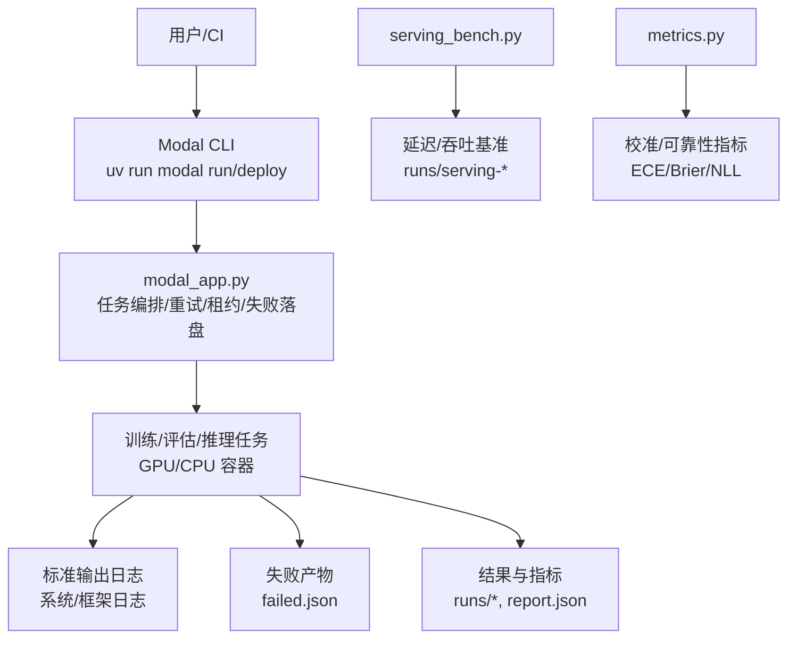
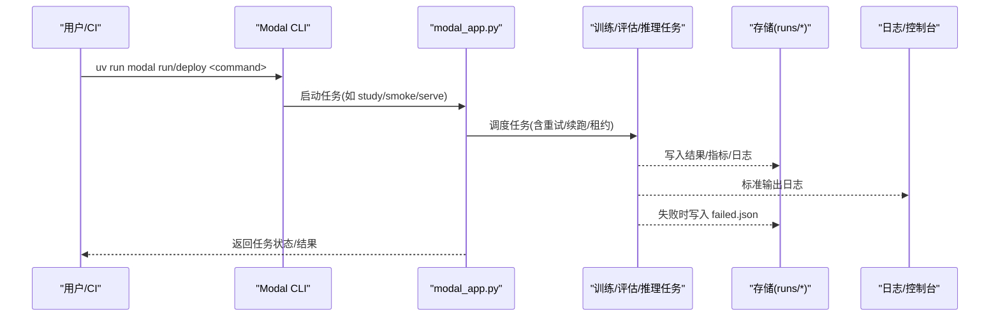
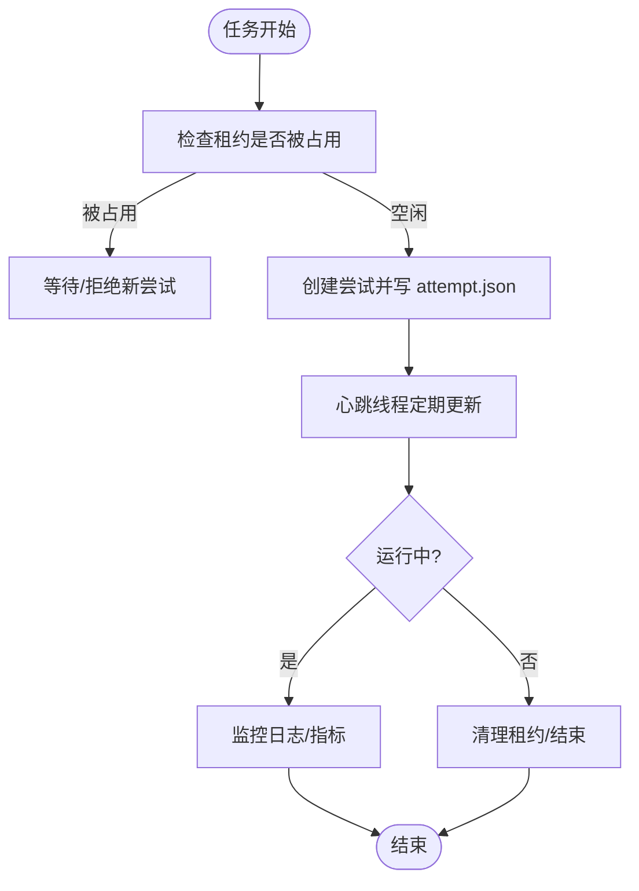
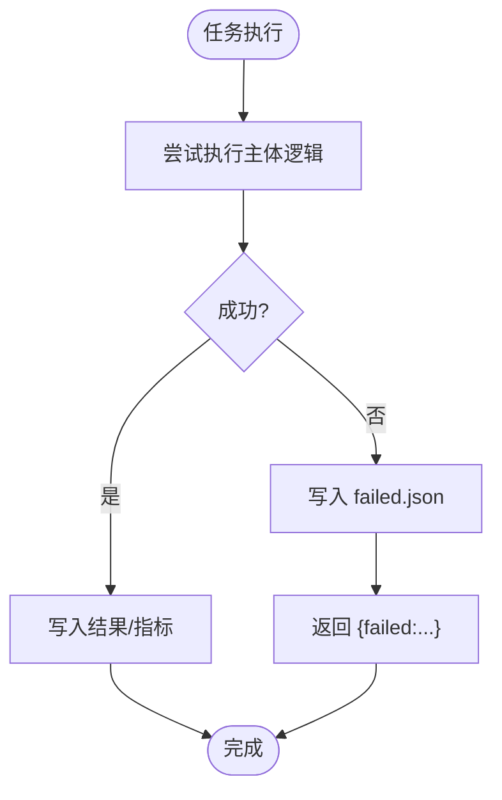
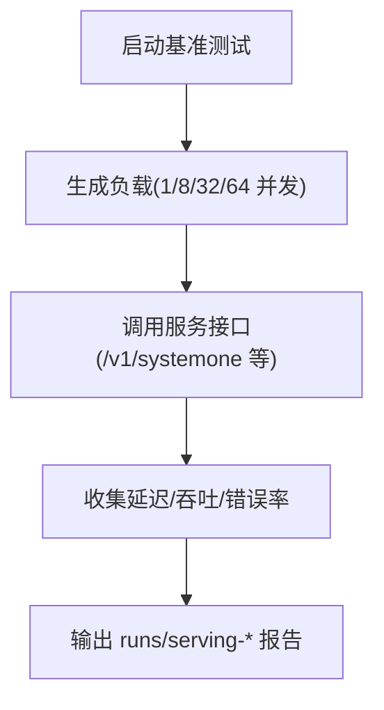
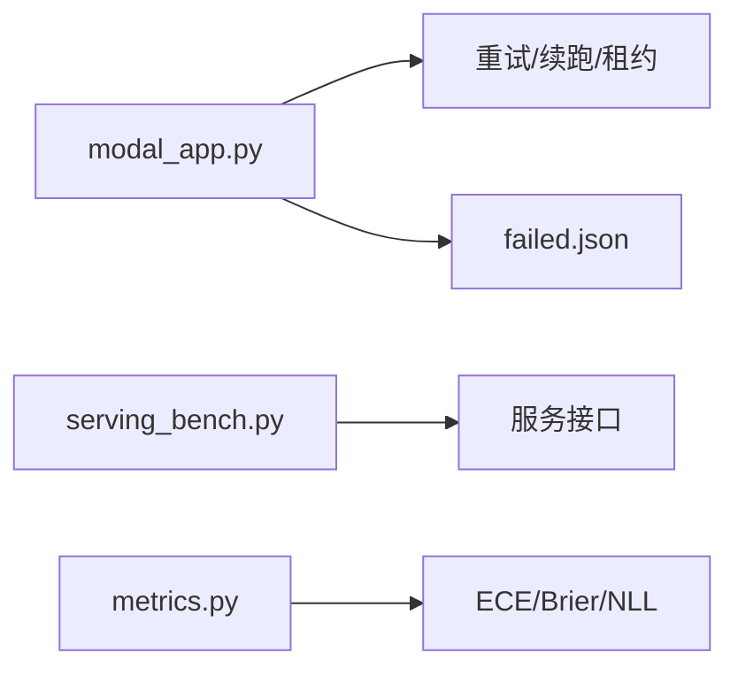

<cite>
**本文引用的文件**   
- [modal_app.py](file://modal_app.py)
- [AGENTS.md](file://AGENTS.md)
- [PLAN.md](file://PLAN.md)
- [README.md](file://README.md)
- [scripts/serving_bench.py](file://scripts/serving_bench.py)
- [kev/metrics.py](file://kev/metrics.py)
</cite>

## 目录
1. [简介](#简介)
2. [项目结构](#项目结构)
3. [核心组件](#核心组件)
4. [架构总览](#架构总览)
5. [详细组件分析](#详细组件分析)
6. [依赖关系分析](#依赖关系分析)
7. [性能考量](#性能考量)
8. [故障排查指南](#故障排查指南)
9. [结论](#结论)
10. [附录](#附录)

## 简介
本文件面向在 Modal 上运行 Kev 的运维与研发人员，系统化说明如何对任务执行、容器生命周期、错误诊断、性能指标与日志进行端到端监控。内容覆盖：
- 运行状态查看：Modal 控制台界面、任务状态跟踪、容器生命周期监控
- 错误追踪：异常捕获机制、failed.json 记录、调试信息收集
- 性能指标：GPU 利用率、内存使用量、推理延迟、吞吐量统计
- 日志配置：标准输出重定向、结构化日志格式、日志轮转策略
- 监控最佳实践：关键指标定义、告警规则、性能基线
- 监控脚本示例与仪表盘配置建议

## 项目结构
围绕 Modal 监控与日志的关键位置如下：
- modal_app.py：Modal 应用入口，承载 study/smoke/pull/resume/serve 等任务编排与重试、租约、失败落盘等逻辑
- scripts/serving_bench.py：服务性能基准（延迟、吞吐）
- kev/metrics.py：评测指标计算（ECE/Brier/NLL 等），用于校准与报告
- AGENTS.md / PLAN.md / README.md：工程上下文、运行方式、性能数据与约束

图示来源
- [modal_app.py](file://modal_app.py)
- [scripts/serving_bench.py](file://scripts/serving_bench.py)
- [kev/metrics.py](file://kev/metrics.py)

章节来源
- [AGENTS.md:94-122](file://AGENTS.md#L94-L122)
- [AGENTS.md:239-252](file://AGENTS.md#L239-L252)
- [README.md:183-193](file://README.md#L183-L193)

## 核心组件
- Modal 任务编排与重试
  - 通过 modal_app.py 暴露多个命令（smoke/study/pull/resume/serve 等），由 uv run modal run/deploy 触发
  - 支持重试、续跑、租约互斥、失败落盘（failed.json）、心跳保活等
- 服务性能基准
  - scripts/serving_bench.py 测量延迟、吞吐，并输出到 runs/serving-*
- 指标与校准
  - kev/metrics.py 提供 ECE/Brier/NLL 等纯 NumPy 指标计算，支撑校准与报告

章节来源
- [AGENTS.md:239-252](file://AGENTS.md#L239-L252)
- [AGENTS.md:328-334](file://AGENTS.md#L328-L334)
- [AGENTS.md:387](file://AGENTS.md#L387)

## 架构总览
下图展示从用户触发到产出指标与日志的端到端流程，以及 Modal 平台侧的状态与资源观测点。

图示来源
- [modal_app.py](file://modal_app.py)
- [AGENTS.md:94-122](file://AGENTS.md#L94-L122)

## 详细组件分析

### 运行状态查看（Modal 控制台、任务状态、容器生命周期）
- Modal 控制台
  - 通过 Modal 控制台查看函数调用、任务队列、容器实例、资源分配与退出码
  - 结合 modal_app.py 的命令名与参数定位具体 study/trial/call
- 任务状态跟踪
  - 使用 watch 或 resume 命令观察任务进度；失败的任务不会自动续跑，需人工介入
  - 通过 runs/<study>.watch.json 与 runs/<study>.spawn.json 维护任务状态与尝试记录
- 容器生命周期监控
  - 每个 full-weight 尝试持有租约文件 attempt.json，包含 nonce、attempt、call id、心跳间隔
  - 心跳线程周期性更新；清理退出时标记结束；若发现更新的旧租约则拒绝新尝试，直到旧租约结束或过期

图示来源
- [AGENTS.md:94-122](file://AGENTS.md#L94-L122)

章节来源
- [AGENTS.md:94-122](file://AGENTS.md#L94-L122)

### 错误追踪（异常捕获、failed.json、调试信息）
- 异常捕获机制
  - 失败路径不抛出异常，而是写入 failed.json 并返回 {"failed": ...}，避免被自动续跑
  - 超时与网络错误有专门处理（例如超时记为 "timeout"，DNS/连接错误可重试）
- failed.json 记录
  - 位于 runs 目录下，便于后续复盘与自动化巡检
- 调试信息收集
  - 标准输出日志包含框架与自定义日志；必要时开启远程模式以统一错误语义（如将 400/413/422 转为 ContextOverflow）

图示来源
- [AGENTS.md:112-122](file://AGENTS.md#L112-L122)

章节来源
- [AGENTS.md:112-122](file://AGENTS.md#L112-L122)

### 性能指标收集（GPU 利用率、内存、延迟、吞吐）
- GPU 利用率与内存
  - 通过 Modal 控制台与宿主系统工具（nvidia-smi、进程监控）采集
  - 长上下文推理存在显著显存增长，需关注峰值与驻留内存
- 推理延迟
  - 使用 serving_bench.py 测量单请求/并发下的延迟分布
  - 服务端接口返回 latency_ms 字段便于埋点
- 吞吐量统计
  - 多客户端并发压测，统计 QPS 与尾延迟（P95/P99）
  - 不同 batch size 下对比吞吐与延迟权衡

图示来源
- [scripts/serving_bench.py](file://scripts/serving_bench.py)
- [AGENTS.md:328-334](file://AGENTS.md#L328-L334)

章节来源
- [AGENTS.md:328-334](file://AGENTS.md#L328-L334)
- [README.md:183-193](file://README.md#L183-L193)

### 日志配置（标准输出、结构化日志、轮转）
- 标准输出重定向
  - 所有任务的标准输出由 Modal 平台聚合，可在控制台查看
  - 建议在关键路径打印结构化 JSON 行，便于下游解析
- 结构化日志格式
  - 推荐包含：时间戳、级别、模块、trace_id、task_id、step、耗时、指标键值对
  - 将 metrics.py 计算的指标（ECE/Brier/NLL）作为结构化字段输出
- 日志轮转策略
  - 按任务/天/大小切分，保留最近 N 份，归档至对象存储
  - 对 failed.json 与 runs/* 结果做独立保留策略

[本节为通用实践说明，不直接分析具体文件]

## 依赖关系分析
- modal_app.py 依赖：
  - 任务调度与重试逻辑
  - 租约与心跳机制
  - 失败落盘（failed.json）
- scripts/serving_bench.py 依赖：
  - 服务接口（延迟/吞吐）
- kev/metrics.py 依赖：
  - 指标计算（ECE/Brier/NLL 等）

图示来源
- [modal_app.py](file://modal_app.py)
- [scripts/serving_bench.py](file://scripts/serving_bench.py)
- [kev/metrics.py](file://kev/metrics.py)

章节来源
- [AGENTS.md:94-122](file://AGENTS.md#L94-L122)
- [AGENTS.md:328-334](file://AGENTS.md#L328-L334)
- [AGENTS.md:387](file://AGENTS.md#L387)

## 性能考量
- 长上下文推理显存与延迟
  - 长状态会显著增加显存占用与推理时间，需根据模型尺寸与上下文长度规划 GPU 规格
- 批大小与吞吐
  - 增大 batch 提升吞吐但可能增加延迟与显存压力，需平衡 P95/P99 延迟
- 温度与校准
  - 校准温度影响置信度排序，需在固定数据集上拟合并记录，避免漂移

[本节为通用指导，不直接分析具体文件]

## 故障排查指南
- 常见失败类型
  - 超时：记录为 "timeout"，检查任务时长与资源配额
  - 网络错误：DNS/连接错误可重试，检查外部依赖与网络策略
  - 资源不足：显存溢出或 CPU 过载，调整 batch 或 GPU 规格
- 快速定位
  - 查看 failed.json 获取失败详情
  - 查看 runs/<study>.watch.json 与 .spawn.json 了解任务状态与尝试历史
  - 核对租约文件 attempt.json 的心跳与结束标记
- 恢复步骤
  - 修正配置后使用 resume 续跑
  - 对于非致命错误，可启用重试策略

章节来源
- [AGENTS.md:112-122](file://AGENTS.md#L112-L122)

## 结论
通过 Modal 控制台、任务状态文件、failed.json 与结构化日志，可以构建完整的运行可见性。结合 serving_bench.py 与 metrics.py，能够持续度量延迟、吞吐与可靠性指标，形成稳定的性能基线与告警体系。建议在部署前明确关键指标阈值与告警规则，并在变更发布时回归基线。

[本节为总结性内容，不直接分析具体文件]

## 附录

### 监控脚本示例与仪表盘配置建议
- 监控脚本
  - 使用 scripts/serving_bench.py 定期执行压测，输出 runs/serving-* 报告
  - 在 CI 中集成，失败即阻断发布
- 仪表盘配置
  - 面板一：任务状态（成功/失败/超时/重试次数）
  - 面板二：GPU 利用率与显存峰值
  - 面板三：延迟分布（P50/P95/P99）与吞吐（QPS）
  - 面板四：指标趋势（ECE/Brier/NLL）
  - 告警规则：
    - 失败率 > 阈值（如 5%）
    - P95 延迟 > 阈值（如 200ms）
    - ECE/Brier 超基线（如 +0.01）
    - GPU 显存峰值接近上限（如 > 90%）

[本节为通用实践说明，不直接分析具体文件]