<cite>
**本文引用的文件**   
- [kev/publish.py](file://kev/publish.py)
- [scripts/build_release_assets.py](file://scripts/build_release_assets.py)
- [scripts/release_checkpoint.py](file://scripts/release_checkpoint.py)
- [scripts/release_confirm.py](file://scripts/release_confirm.py)
- [scripts/release_numbers.py](file://scripts/release_numbers.py)
- [scripts/publish_space.sh](file://scripts/publish_space.sh)
- [.github/workflows/ci.yml](file://.github/workflows/ci.yml)
- [deploy.sh](file://deploy.sh)
- [modal_app.py](file://modal_app.py)
- [docker-compose.yml](file://docker-compose.yml)
- [Dockerfile](file://Dockerfile)
</cite>

## 目录
1. [简介](#简介)
2. [项目结构](#项目结构)
3. [核心组件](#核心组件)
4. [架构总览](#架构总览)
5. [详细组件分析](#详细组件分析)
6. [依赖关系分析](#依赖关系分析)
7. [性能与可靠性考虑](#性能与可靠性考虑)
8. [故障排查指南](#故障排查指南)
9. [结论](#结论)

## 简介
本文件聚焦“发布基础设施”，梳理从模型检查点到可分发制品、从本地脚本到持续集成与容器化部署的完整链路。内容覆盖：
- 发布编排与制品构建
- 检查点发布与确认流程
- 指标与版本数字生成
- 空间/服务发布脚本
- CI 流水线与容器化部署入口

## 项目结构
围绕发布的基础设施主要分布在以下位置：
- Python 发布工具与接口：kev/publish.py
- 发布相关脚本：scripts/*（构建制品、检查点发布、确认、数字统计、空间发布）
- 持续集成：.github/workflows/ci.yml
- 部署与容器化：deploy.sh、modal_app.py、docker-compose.yml、Dockerfile

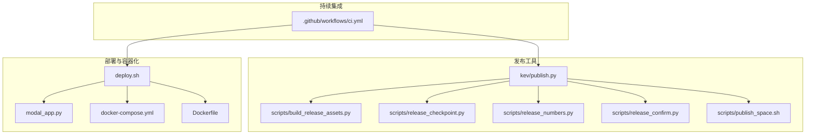

**图示来源**
- [kev/publish.py](file://kev/publish.py)
- [scripts/build_release_assets.py](file://scripts/build_release_assets.py)
- [scripts/release_checkpoint.py](file://scripts/release_checkpoint.py)
- [scripts/release_numbers.py](file://scripts/release_numbers.py)
- [scripts/release_confirm.py](file://scripts/release_confirm.py)
- [scripts/publish_space.sh](file://scripts/publish_space.sh)
- [.github/workflows/ci.yml](file://.github/workflows/ci.yml)
- [deploy.sh](file://deploy.sh)
- [modal_app.py](file://modal_app.py)
- [docker-compose.yml](file://docker-compose.yml)
- [Dockerfile](file://Dockerfile)

**章节来源**
- [kev/publish.py](file://kev/publish.py)
- [scripts/build_release_assets.py](file://scripts/build_release_assets.py)
- [scripts/release_checkpoint.py](file://scripts/release_checkpoint.py)
- [scripts/release_numbers.py](file://scripts/release_numbers.py)
- [scripts/release_confirm.py](file://scripts/release_confirm.py)
- [scripts/publish_space.sh](file://scripts/publish_space.sh)
- [.github/workflows/ci.yml](file://.github/workflows/ci.yml)
- [deploy.sh](file://deploy.sh)
- [modal_app.py](file://modal_app.py)
- [docker-compose.yml](file://docker-compose.yml)
- [Dockerfile](file://Dockerfile)

## 核心组件
- 发布编排器：负责串联制品构建、检查点发布、指标计算与空间发布等步骤，提供统一的 CLI 或 API 入口。
- 制品构建器：将训练产物、配置、评测结果打包为可分发的发布资产。
- 检查点发布器：将选定检查点上传至目标存储并生成元数据。
- 数字统计器：汇总关键指标与版本信息，输出供发布说明与看板使用。
- 发布确认器：在发布前进行一致性校验与人工确认。
- 空间发布脚本：将前端/文档/演示空间推送到托管平台。
- CI 流水线：触发构建、测试、发布任务，保证质量门禁。
- 部署与容器化：通过 Docker 与 Modal 提供服务化能力。

**章节来源**
- [kev/publish.py](file://kev/publish.py)
- [scripts/build_release_assets.py](file://scripts/build_release_assets.py)
- [scripts/release_checkpoint.py](file://scripts/release_checkpoint.py)
- [scripts/release_numbers.py](file://scripts/release_numbers.py)
- [scripts/release_confirm.py](file://scripts/release_confirm.py)
- [scripts/publish_space.sh](file://scripts/publish_space.sh)

## 架构总览
下图展示从代码提交到制品发布的端到端流程，以及各组件之间的调用关系。

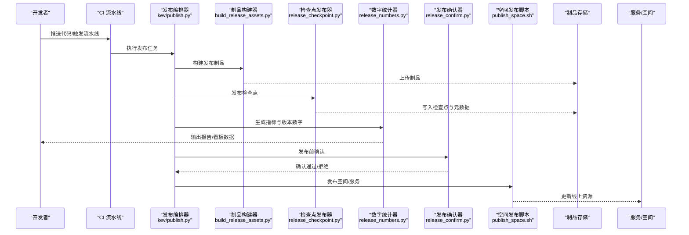

**图示来源**
- [.github/workflows/ci.yml](file://.github/workflows/ci.yml)
- [kev/publish.py](file://kev/publish.py)
- [scripts/build_release_assets.py](file://scripts/build_release_assets.py)
- [scripts/release_checkpoint.py](file://scripts/release_checkpoint.py)
- [scripts/release_numbers.py](file://scripts/release_numbers.py)
- [scripts/release_confirm.py](file://scripts/release_confirm.py)
- [scripts/publish_space.sh](file://scripts/publish_space.sh)

## 详细组件分析

### 发布编排器（kev/publish.py）
职责与要点：
- 统一入口：聚合制品构建、检查点发布、指标统计、空间发布等子任务。
- 参数解析：接收版本、分支、环境、存储路径、是否跳过确认等选项。
- 流程控制：按顺序执行各阶段，支持失败回滚与重试策略。
- 日志与审计：记录关键步骤与产出物位置，便于追踪与复盘。

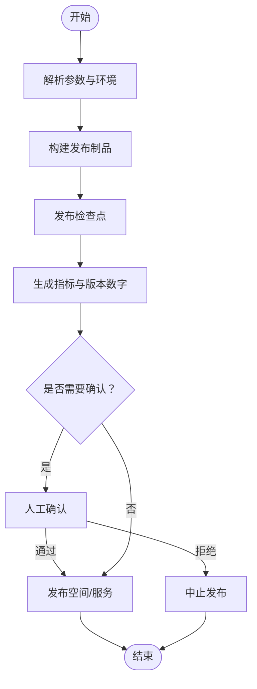

**图示来源**
- [kev/publish.py](file://kev/publish.py)

**章节来源**
- [kev/publish.py](file://kev/publish.py)

### 制品构建器（scripts/build_release_assets.py）
职责与要点：
- 收集训练产物、配置文件、评测结果与变更记录。
- 生成标准化目录结构与清单文件。
- 压缩与签名（可选），确保制品完整性与可追溯性。

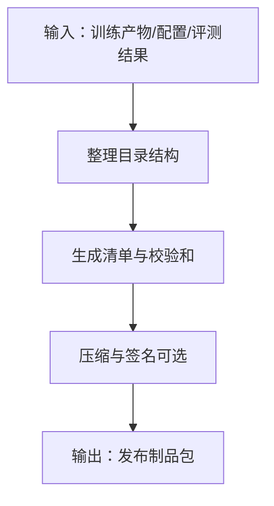

**图示来源**
- [scripts/build_release_assets.py](file://scripts/build_release_assets.py)

**章节来源**
- [scripts/build_release_assets.py](file://scripts/build_release_assets.py)

### 检查点发布器（scripts/release_checkpoint.py）
职责与要点：
- 选择目标检查点（按版本/轮次/指标阈值）。
- 上传至对象存储或模型仓库，生成索引与元数据。
- 校验上传完整性，记录发布快照。

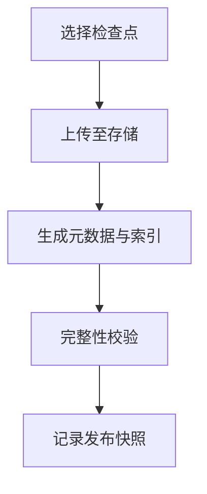

**图示来源**
- [scripts/release_checkpoint.py](file://scripts/release_checkpoint.py)

**章节来源**
- [scripts/release_checkpoint.py](file://scripts/release_checkpoint.py)

### 数字统计器（scripts/release_numbers.py）
职责与要点：
- 汇总关键指标（如准确率、延迟、吞吐等）。
- 对比基线/历史版本，生成差异报告。
- 输出结构化数据供看板与发布说明使用。

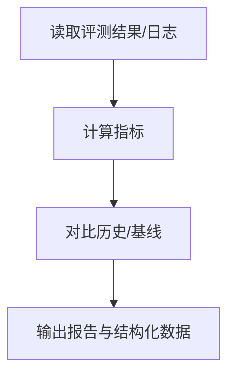

**图示来源**
- [scripts/release_numbers.py](file://scripts/release_numbers.py)

**章节来源**
- [scripts/release_numbers.py](file://scripts/release_numbers.py)

### 发布确认器（scripts/release_confirm.py）
职责与要点：
- 在发布前执行一致性检查（制品哈希、检查点索引、指标阈值）。
- 支持人工审批流，记录审批意见与时间戳。
- 若未通过，阻断后续发布动作。

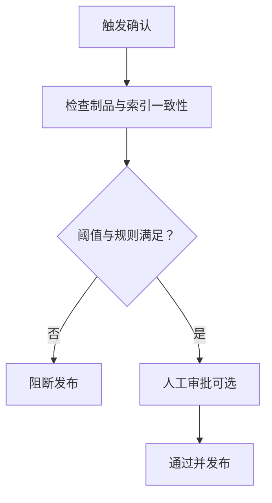

**图示来源**
- [scripts/release_confirm.py](file://scripts/release_confirm.py)

**章节来源**
- [scripts/release_confirm.py](file://scripts/release_confirm.py)

### 空间发布脚本（scripts/publish_space.sh）
职责与要点：
- 将前端/文档/演示空间推送到托管平台。
- 处理环境变量与凭据注入。
- 返回发布状态码与链接，便于 CI 集成。

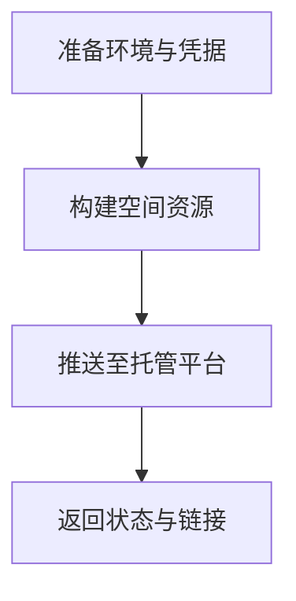

**图示来源**
- [scripts/publish_space.sh](file://scripts/publish_space.sh)

**章节来源**
- [scripts/publish_space.sh](file://scripts/publish_space.sh)

### 持续集成（.github/workflows/ci.yml）
职责与要点：
- 监听代码变更，触发构建、测试与发布任务。
- 并行执行多阶段任务，设置超时与缓存策略。
- 在成功阶段调用发布编排器与部署脚本。

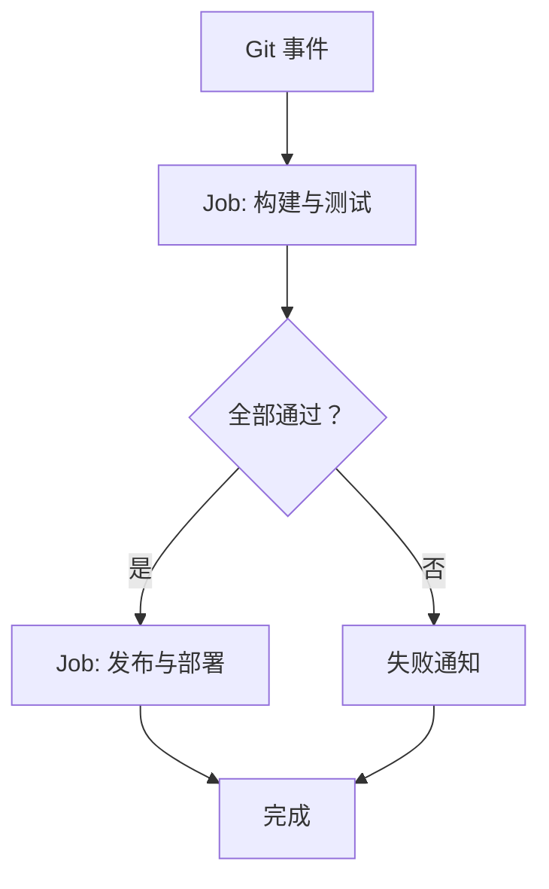

**图示来源**
- [.github/workflows/ci.yml](file://.github/workflows/ci.yml)

**章节来源**
- [.github/workflows/ci.yml](file://.github/workflows/ci.yml)

### 部署与容器化（deploy.sh / modal_app.py / docker-compose.yml / Dockerfile）
职责与要点：
- deploy.sh：封装一键部署命令，协调容器与服务启动。
- Dockerfile：定义镜像构建步骤与运行环境。
- docker-compose.yml：编排多服务依赖（如推理服务、监控、日志）。
- modal_app.py：面向云端函数/服务的部署入口。

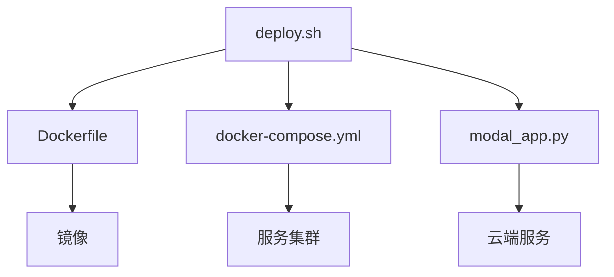

**图示来源**
- [deploy.sh](file://deploy.sh)
- [Dockerfile](file://Dockerfile)
- [docker-compose.yml](file://docker-compose.yml)
- [modal_app.py](file://modal_app.py)

**章节来源**
- [deploy.sh](file://deploy.sh)
- [modal_app.py](file://modal_app.py)
- [docker-compose.yml](file://docker-compose.yml)
- [Dockerfile](file://Dockerfile)

## 依赖关系分析
- 组件耦合：
  - 发布编排器依赖制品构建器、检查点发布器、数字统计器、发布确认器与空间发布脚本。
  - CI 流水线驱动发布编排器与部署脚本。
  - 部署脚本依赖容器镜像与服务编排文件。
- 外部依赖：
  - 对象存储/模型仓库（用于检查点与制品上传）。
  - 托管平台（用于空间/服务发布）。
  - 云平台 SDK（Modal 等）。

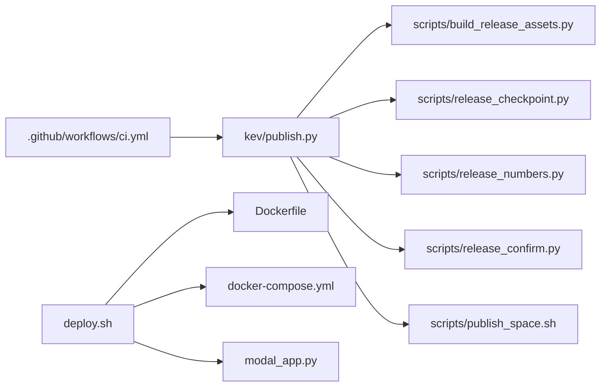

**图示来源**
- [.github/workflows/ci.yml](file://.github/workflows/ci.yml)
- [kev/publish.py](file://kev/publish.py)
- [scripts/build_release_assets.py](file://scripts/build_release_assets.py)
- [scripts/release_checkpoint.py](file://scripts/release_checkpoint.py)
- [scripts/release_numbers.py](file://scripts/release_numbers.py)
- [scripts/release_confirm.py](file://scripts/release_confirm.py)
- [scripts/publish_space.sh](file://scripts/publish_space.sh)
- [deploy.sh](file://deploy.sh)
- [Dockerfile](file://Dockerfile)
- [docker-compose.yml](file://docker-compose.yml)
- [modal_app.py](file://modal_app.py)

**章节来源**
- [kev/publish.py](file://kev/publish.py)
- [.github/workflows/ci.yml](file://.github/workflows/ci.yml)
- [deploy.sh](file://deploy.sh)

## 性能与可靠性考虑
- 并发与缓存：
  - CI 中并行执行构建与测试，减少整体耗时。
  - 制品与依赖缓存复用，提升重复构建效率。
- 幂等与回滚：
  - 发布过程具备幂等性，支持失败重试与部分回滚。
  - 检查点与制品均带校验和，确保一致性。
- 观测性与告警：
  - 关键步骤输出结构化日志，便于检索与告警。
  - 发布完成后自动上报状态与链接，纳入监控看板。

[本节为通用指导，不直接分析具体文件]

## 故障排查指南
常见问题与定位建议：
- 制品构建失败：
  - 检查输入产物是否存在且格式正确；查看构建日志中的错误堆栈。
  - 确认依赖安装与权限配置。
- 检查点上传失败：
  - 验证存储凭据与网络连通性；检查目标桶/仓库权限。
  - 核对检查点大小与超时配置。
- 指标统计异常：
  - 确认评测结果路径与字段命名一致；检查阈值配置。
- 发布确认被拒：
  - 查看一致性检查结果与阈值规则；必要时调整规则或补充材料。
- 空间发布失败：
  - 检查托管平台凭据与配额；确认构建产物完整性。
- 部署失败：
  - 检查 Docker 镜像构建日志与服务编排配置；确认端口与依赖服务可用。

**章节来源**
- [scripts/build_release_assets.py](file://scripts/build_release_assets.py)
- [scripts/release_checkpoint.py](file://scripts/release_checkpoint.py)
- [scripts/release_numbers.py](file://scripts/release_numbers.py)
- [scripts/release_confirm.py](file://scripts/release_confirm.py)
- [scripts/publish_space.sh](file://scripts/publish_space.sh)
- [Dockerfile](file://Dockerfile)
- [docker-compose.yml](file://docker-compose.yml)

## 结论
本发布基础设施以“发布编排器”为核心，串联制品构建、检查点发布、指标统计、发布确认与空间发布，并通过 CI 流水线与容器化部署实现自动化与可观测性。建议在以下方面持续优化：
- 增强发布过程的可视化与审计能力
- 完善失败恢复与灰度发布机制
- 扩展多平台/多云部署支持
- 强化安全与合规检查（签名、扫描、合规清单）

[本节为总结性内容，不直接分析具体文件]