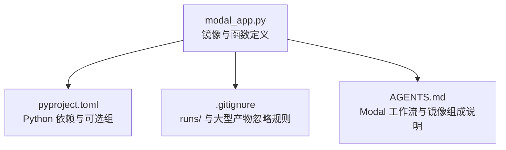
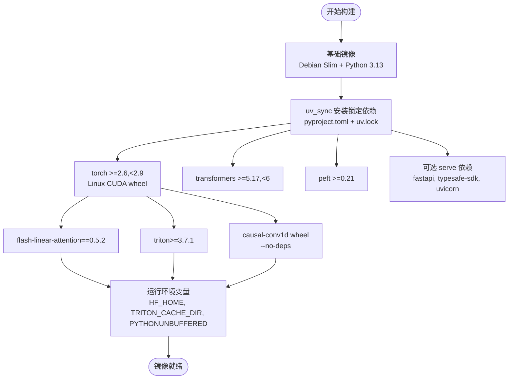
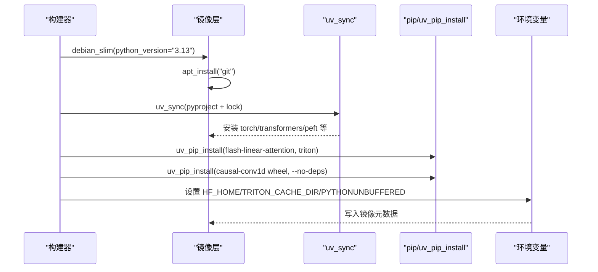
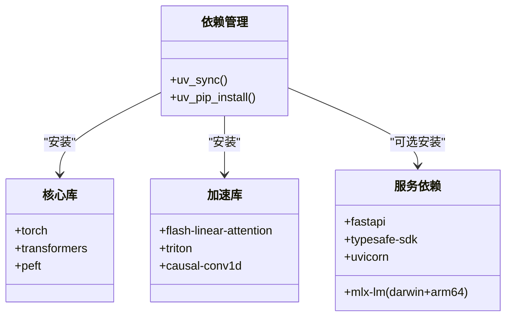
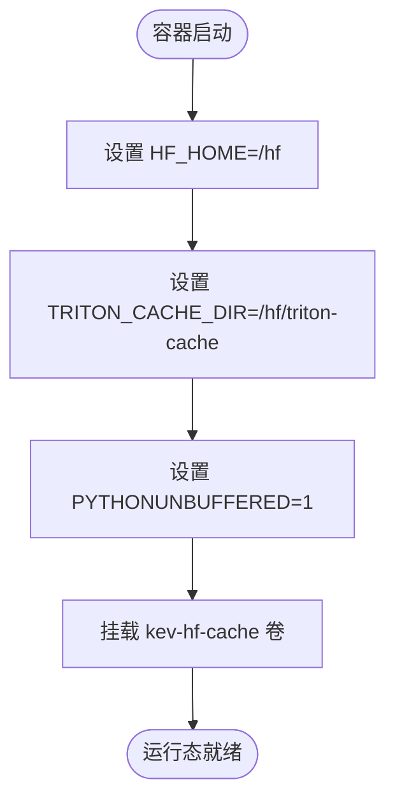
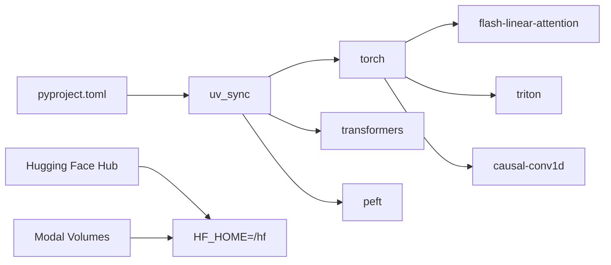

# Docker 镜像构建

<cite>
**本文引用的文件**   
- [modal_app.py](file://modal_app.py)
- [pyproject.toml](file://pyproject.toml)
- [.gitignore](file://.gitignore)
- [AGENTS.md](file://AGENTS.md)
</cite>

## 目录
1. [简介](#简介)
2. [项目结构](#项目结构)
3. [核心组件](#核心组件)
4. [架构总览](#架构总览)
5. [详细组件分析](#详细组件分析)
6. [依赖关系分析](#依赖关系分析)
7. [性能与体积优化](#性能与体积优化)
8. [故障排查指南](#故障排查指南)
9. [结论](#结论)
10. [附录：构建命令与环境变量](#附录构建命令与环境变量)

## 简介
本文面向使用 Modal 运行 Kev 训练、评测与服务的工作流，系统化说明其 Docker 镜像的构建策略与关键配置。内容涵盖基础镜像选择、多阶段依赖安装、CUDA/PyTorch/transformers 生态配置、锁定依赖管理、关键加速库（flash-linear-attention、triton、causal-conv1d）的安装策略，以及 HF_HOME、TRITON_CACHE_DIR、PYTHONUNBUFFERED 等环境变量对运行时行为的影响。同时给出缓存与分层构建优化建议，并汇总可直接复用的构建命令与环境设置。

## 项目结构
本仓库未提供独立 Dockerfile；镜像由 Modal 应用通过 Python API 声明式构建。核心定义位于 modal_app.py，依赖清单位于 pyproject.toml，运行产物与权重路径约定受 .gitignore 约束，整体工程背景与运行语义在 AGENTS.md 中补充。

**图示来源**
- [modal_app.py:53-75](file://modal_app.py#L53-L75)
- [pyproject.toml:1-62](file://pyproject.toml#L1-L62)
- [.gitignore:1-120](file://.gitignore#L1-L120)
- [AGENTS.md:242-253](file://AGENTS.md#L242-L253)

**章节来源**
- [modal_app.py:53-75](file://modal_app.py#L53-L75)
- [pyproject.toml:1-62](file://pyproject.toml#L1-L62)
- [.gitignore:1-120](file://.gitignore#L1-L120)
- [AGENTS.md:242-253](file://AGENTS.md#L242-L253)

## 核心组件
- 基础镜像与语言版本
  - 基于 Debian Slim 的 Python 3.13 环境，满足 torch 2.8 与 CUDA wheel 的兼容性需求。
- 依赖安装流程
  - 使用 uv_sync 从 pyproject.toml 与 uv.lock 精确安装依赖，Linux 下自动获取 CUDA 版 torch wheel。
  - 额外安装 flash-linear-attention==0.5.2 与 triton>=3.7.1，以启用 Qwen3.5 混合后端的 Gated DeltaNet 快速内核。
  - 预编译 causal-conv1d wheel（匹配 torch 2.8 / CUDA 12 / Python 3.13），并以 --no-deps 避免覆盖已锁定的 triton 版本。
- 运行期环境变量
  - HF_HOME=/hf：持久化 Hugging Face 模型与数据集缓存到挂载卷 kev-hf-cache。
  - TRITON_CACHE_DIR=/hf/triton-cache：缓存 Triton 编译后的 DeltaNet 内核与 autotuning 结果，缩短冷启动时间。
  - PYTHONUNBUFFERED=1：确保日志实时输出，便于远程调试与监控。
- 代码与数据注入
  - 将 kev 源码、evals、scripts、tests 与 experiments/sft-v1-lengths.json 复制到镜像根目录，保证容器内可执行脚本与评测集。

**章节来源**
- [modal_app.py:44-75](file://modal_app.py#L44-L75)
- [AGENTS.md:242-253](file://AGENTS.md#L242-L253)

## 架构总览
下图展示了镜像构建的关键阶段与运行时依赖关系。

**图示来源**
- [modal_app.py:53-75](file://modal_app.py#L53-L75)
- [pyproject.toml:21-46](file://pyproject.toml#L21-L46)

## 详细组件分析

### 基础镜像选择策略
- 选择 Debian Slim + Python 3.13 的原因
  - 与 torch 2.8 官方 wheel 的 CUDA 12 二进制兼容。
  - 与 triton>=3.7.1 及 flash-linear-attention 0.5.2 的 ABI 要求一致。
  - 更小的系统包体，减少镜像体积与攻击面。
- 与项目要求的对齐
  - pyproject.toml 允许 Python 3.12 至 3.13，但镜像固定 3.13 以获得稳定的 CUDA wheel 与 triton 支持。

**章节来源**
- [modal_app.py:53-66](file://modal_app.py#L53-L66)
- [pyproject.toml:13-13](file://pyproject.toml#L13-L13)

### 多阶段构建过程
- 阶段一：基础系统与 Git
  - 安装 git，用于后续可能的源码拉取或校验。
- 阶段二：依赖安装
  - uv_sync 精确安装 pyproject.toml 与 uv.lock 中的依赖，Linux 平台自动选择 CUDA 版 torch。
  - 安装 flash-linear-attention 与 triton，以启用 Qwen3.5 混合后端的高性能 DeltaNet 内核。
  - 安装 causal-conv1d 预编译 wheel，并使用 --no-deps 避免替换已锁定的 triton。
- 阶段三：运行环境与源码注入
  - 设置环境变量 HF_HOME、TRITON_CACHE_DIR、PYTHONUNBUFFERED 等。
  - 注入 kev 源码、evals、scripts、tests 与实验配置文件。

**图示来源**
- [modal_app.py:53-75](file://modal_app.py#L53-L75)

**章节来源**
- [modal_app.py:53-75](file://modal_app.py#L53-L75)

### 关键依赖管理与安装配置
- 锁定依赖
  - 通过 uv_sync 读取 pyproject.toml 与 uv.lock，确保每次构建获得一致的依赖树。
- PyTorch 与 transformers
  - torch>=2.6,<2.9；transformers>=5.17,<6；peft>=0.21。
- 加速与内核
  - flash-linear-attention==0.5.2：为 Qwen3.5 混合后端提供 Gated DeltaNet 的快速实现。
  - triton>=3.7.1：支撑 flash-linear-attention 的 Triton 内核。
  - causal-conv1d：短卷积 CUDA 内核，提升 DeltaNet 前向/反向效率。
- 可选服务依赖
  - serve 可选组包含 fastapi、typesafe-sdk、uvicorn；Apple Silicon 下可选 mlx-lm。

**图示来源**
- [modal_app.py:53-75](file://modal_app.py#L53-L75)
- [pyproject.toml:21-46](file://pyproject.toml#L21-L46)

**章节来源**
- [modal_app.py:53-75](file://modal_app.py#L53-L75)
- [pyproject.toml:21-46](file://pyproject.toml#L21-L46)

### 环境变量与运行配置
- HF_HOME=/hf
  - 将 Hugging Face 模型与数据集缓存到持久卷 kev-hf-cache，跨容器复用，显著降低重复下载成本。
- TRITON_CACHE_DIR=/hf/triton-cache
  - 缓存 Triton 编译后的 DeltaNet 内核与 autotuning 结果，避免每次冷启动重新编译，节省数秒级延迟。
- PYTHONUNBUFFERED=1
  - 关闭 Python 标准输出缓冲，使日志实时可见，便于远程调试与监控。
- TOKENIZERS_PARALLELISM=false
  - 禁用分词器并行，避免在多进程环境下出现资源竞争与不稳定行为。

**图示来源**
- [modal_app.py:44-50](file://modal_app.py#L44-L50)

**章节来源**
- [modal_app.py:44-50](file://modal_app.py#L44-L50)

## 依赖关系分析
- 直接依赖
  - torch、transformers、peft 为核心推理与微调依赖。
  - flash-linear-attention 与 triton 为高性能内核依赖。
  - causal-conv1d 为短卷积内核依赖。
- 间接依赖
  - uv_sync 解析 pyproject.toml 与 uv.lock，生成稳定依赖图。
  - serve 可选组引入 web 服务相关依赖。
- 外部集成点
  - Hugging Face Hub：模型与数据集下载，受 HF_HOME 控制。
  - Modal Volumes：kev-hf-cache 与 kev-runs 分别承载模型缓存与训练/评测产出。

**图示来源**
- [pyproject.toml:21-46](file://pyproject.toml#L21-L46)
- [modal_app.py:53-75](file://modal_app.py#L53-L75)

**章节来源**
- [pyproject.toml:21-46](file://pyproject.toml#L21-L46)
- [modal_app.py:53-75](file://modal_app.py#L53-L75)

## 性能与体积优化
- 缓存策略
  - 使用 Modal Volume kev-hf-cache 持久化 HF_HOME，避免重复下载模型与数据集。
  - TRITON_CACHE_DIR 缓存 Triton 编译内核，减少冷启动开销。
- 分层构建
  - 先安装系统工具（git），再安装依赖（uv_sync），最后注入源码与数据，最大化利用 Docker 层缓存。
- 镜像体积优化
  - 仅安装必要依赖，serve 与 mlx 作为可选组按需启用。
  - 使用 Debian Slim 基础镜像，减少系统包体积。
  - causal-conv1d 使用预编译 wheel 且 --no-deps，避免重复安装不必要的依赖。
- 构建稳定性
  - 通过 uv.lock 锁定所有依赖版本，确保不同环境构建一致性。
  - 明确指定 triton>=3.7.1 与 flash-linear-attention==0.5.2，规避已知内核兼容性问题。

[本节为通用优化建议，不直接分析具体文件]

## 故障排查指南
- 无法导入 causal-conv1d 或 DeltaNet 内核缓慢
  - 检查是否安装了 causal-conv1d wheel 且版本匹配 torch/CUDA/Python。
  - 确认 TRITON_CACHE_DIR 已正确设置并可写。
- 模型加载慢或重复下载
  - 确认 HF_HOME 指向持久卷 /hf，且 kev-hf-cache 已挂载。
- 日志缺失或不完整
  - 确认 PYTHONUNBUFFERED=1 已设置。
- 依赖冲突或 triton 版本被覆盖
  - 检查是否误装了其他 triton 版本；确保使用 --no-deps 安装 causal-conv1d。

**章节来源**
- [modal_app.py:53-75](file://modal_app.py#L53-L75)
- [AGENTS.md:426-438](file://AGENTS.md#L426-L438)

## 结论
该镜像通过 Debian Slim + Python 3.13 基础镜像与 uv_lock 锁定依赖，结合 flash-linear-attention、triton 与 causal-conv1d 的精准安装，构建了稳定且高性能的 Kev 运行环境。通过 HF_HOME 与 TRITON_CACHE_DIR 的环境变量设计，实现了模型与内核缓存的持久化，显著提升了冷启动与重复运行效率。分层构建与最小化依赖进一步控制了镜像体积，提升了构建与部署的可维护性。

[本节为总结性内容，不直接分析具体文件]

## 附录：构建命令与环境变量
- 构建命令（基于 Modal 镜像 API）
  - 使用 modal.Image.debian_slim(python_version="3.13") 创建基础镜像。
  - 使用 .apt_install("git") 安装系统工具。
  - 使用 .uv_sync(uv_project_dir=str(ROOT), groups=[], extras=["serve"]) 安装锁定依赖。
  - 使用 .uv_pip_install("flash-linear-attention==0.5.2", "triton>=3.7.1") 安装加速库。
  - 使用 .uv_pip_install(CAUSAL_CONV1D, extra_options="--no-deps") 安装 causal-conv1d wheel。
  - 使用 .env(worker_environment(APP_NAME, GPU, ...)) 设置环境变量。
  - 使用 .add_local_python_source("kev") 与 .add_local_file/dir 注入源码与数据。
- 环境变量
  - HF_HOME=/hf
  - TRITON_CACHE_DIR=/hf/triton-cache
  - PYTHONUNBUFFERED=1
  - TOKENIZERS_PARALLELISM=false

**章节来源**
- [modal_app.py:44-75](file://modal_app.py#L44-L75)