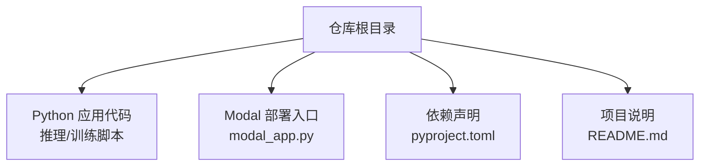
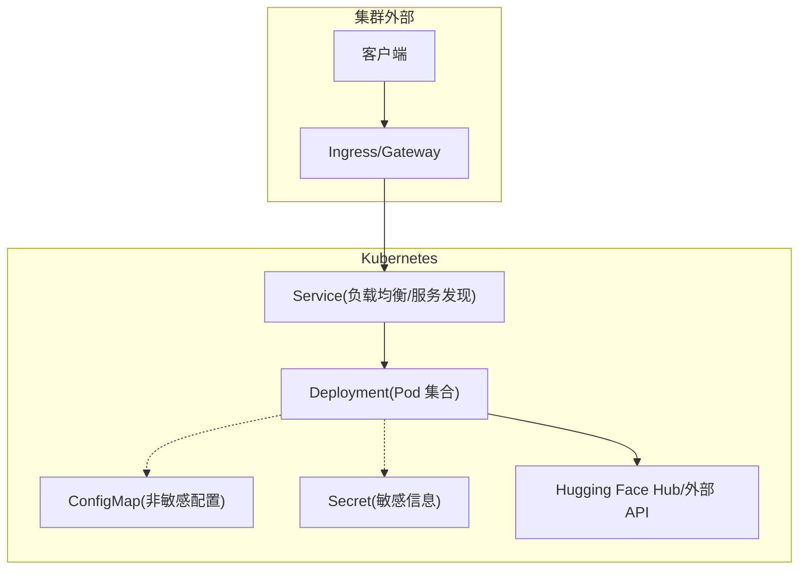
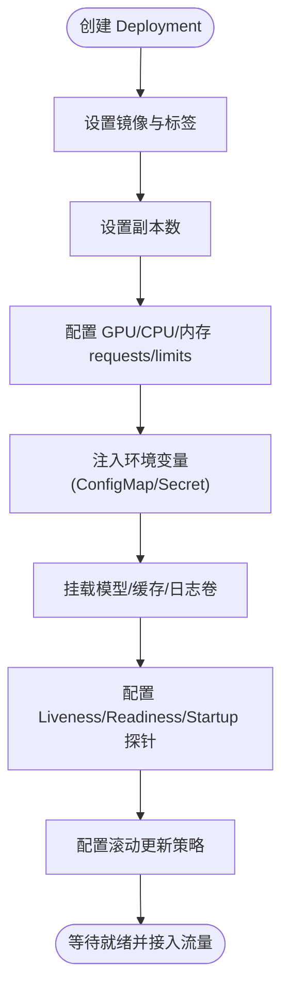
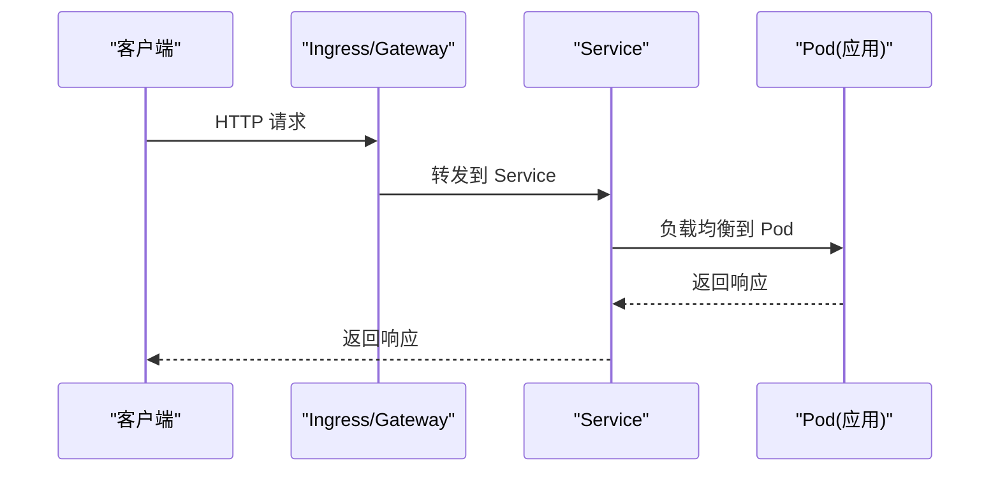
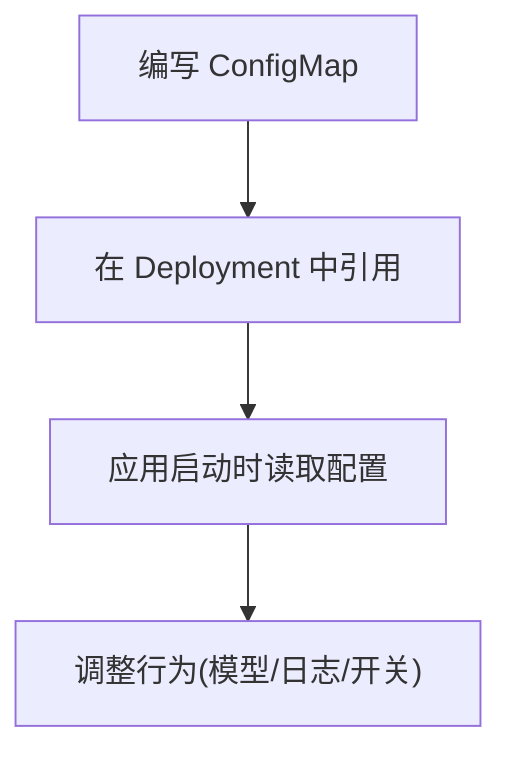
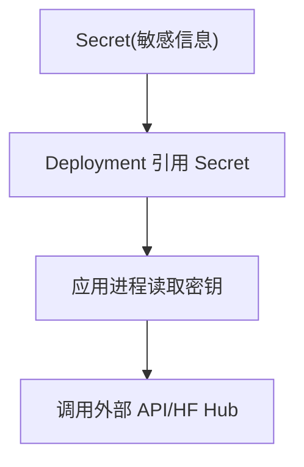
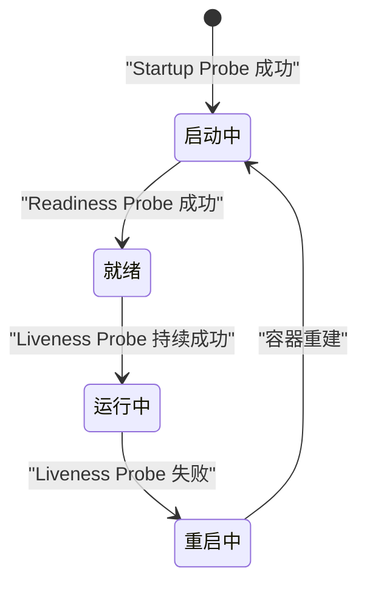
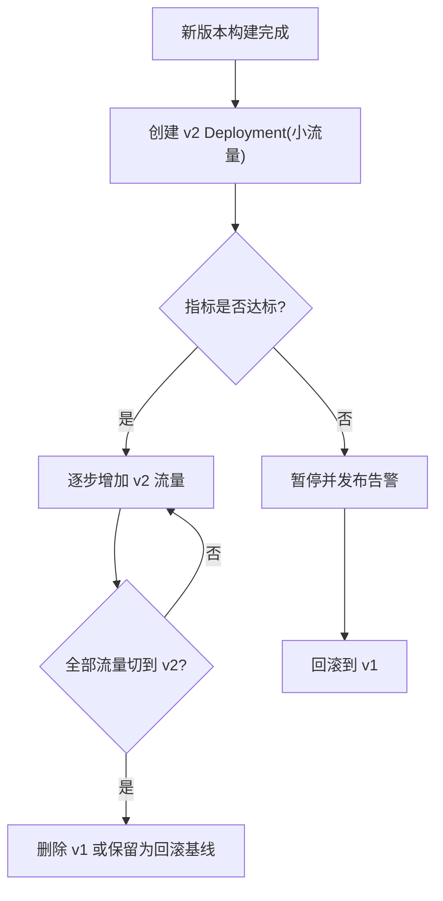
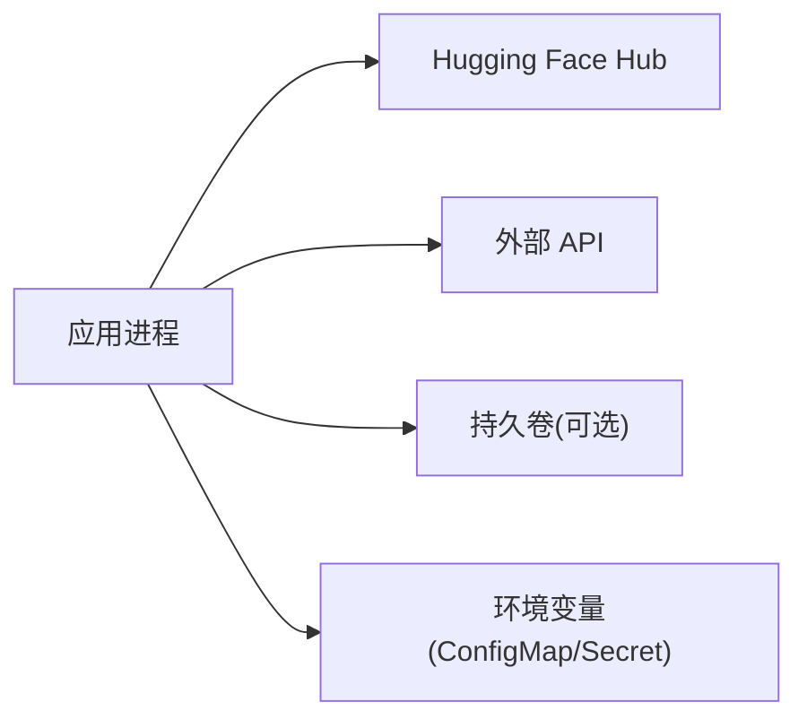

<cite>
**本文引用的文件**   
- [README.md](file://README.md)
- [modal_app.py](file://modal_app.py)
- [pyproject.toml](file://pyproject.toml)
</cite>

## 目录
1. [简介](#简介)
2. [项目结构](#项目结构)
3. [核心组件](#核心组件)
4. [架构总览](#架构总览)
5. [详细组件分析](#详细组件分析)
6. [依赖关系分析](#依赖关系分析)
7. [性能考量](#性能考量)
8. [故障排查指南](#故障排查指南)
9. [结论](#结论)
10. [附录](#附录)

## 简介
本文件面向在 Kubernetes 上编排与运行该项目的服务，提供一份可操作的编排文档。内容覆盖 Deployment、Service、ConfigMap、Secret、健康检查探针、滚动更新策略以及 kubectl 命令示例。由于仓库未包含现成的 Kubernetes YAML，本文基于项目代码与运行时特征给出“可直接套用”的配置模板与最佳实践，确保 GPU 资源请求、CPU/内存限制、副本数、负载均衡、端口与服务发现、环境变量与模型参数、敏感信息存储、健康检查与滚动更新等关键要素完备且可落地。

## 项目结构
仓库主体为 Python 应用（含推理/训练脚本），并通过 Modal 进行云端部署；Kubernetes 编排配置以外部 YAML 形式管理。因此，本文档聚焦于如何在 K8s 中编排该应用，而不改变仓库内部结构。

**图表来源**
- [README.md:1-50](file://README.md#L1-L50)
- [modal_app.py:1-50](file://modal_app.py#L1-L50)
- [pyproject.toml:1-50](file://pyproject.toml#L1-L50)

**章节来源**
- [README.md:1-50](file://README.md#L1-L50)
- [modal_app.py:1-50](file://modal_app.py#L1-L50)
- [pyproject.toml:1-50](file://pyproject.toml#L1-L50)

## 核心组件
- Deployment：承载应用 Pod，定义镜像、副本数、GPU/CPU/内存请求与限制、环境变量、卷挂载、探针与滚动更新策略。
- Service：对外暴露 HTTP API，实现负载均衡与服务发现。
- ConfigMap：注入非敏感配置（环境变量、模型参数、日志级别）。
- Secret：安全存储 Hugging Face Token、API Key 等敏感信息。
- Health Probes：Liveness、Readiness、Startup 探针保障服务可用性与启动顺序。
- Rolling Update：蓝绿/金丝雀/回滚策略通过 Deployment 的 rollout 控制与 Ingress/Service 组合实现。

**章节来源**
- [README.md:1-50](file://README.md#L1-L50)

## 架构总览
下图展示 K8s 层面对该应用的编排关系：Ingress/Gateway 将流量路由到 Service，Service 转发至 Deployment 下的 Pod；Pod 内应用从 ConfigMap 读取配置、从 Secret 获取密钥，并访问 Hugging Face Hub 或外部 API。

**图表来源**
- [README.md:1-50](file://README.md#L1-L50)
- [modal_app.py:1-50](file://modal_app.py#L1-L50)

## 详细组件分析

### Deployment 资源配置
- 镜像与标签：使用构建后的镜像地址与语义化版本标签。
- 副本数：根据 QPS 与 GPU 容量设置初始副本，结合 HPA 自动扩缩容。
- GPU 资源请求：按单卡显存与并发需求设定 nvidia.com/gpu 数量。
- CPU/内存限制：为每个 Pod 设置 requests/limits，避免争抢与 OOM。
- 环境变量：从 ConfigMap/Secret 引用，如 HF_TOKEN、LOG_LEVEL、MODEL_NAME。
- 卷挂载：模型权重、缓存目录、日志输出路径。
- 探针：
  - Liveness：HTTP GET /healthz 或 TCP 探测端口。
  - Readiness：HTTP GET /readyz 或自定义就绪端点。
  - Startup：针对大模型冷启动慢的场景，延长 initialDelaySeconds 与 periodSeconds。
- 滚动更新：
  - maxUnavailable/maxSurge 控制灰度节奏。
  - revisionHistoryLimit 保留历史版本以便快速回滚。
  - 配合 Ingress/Service 权重切换实现蓝绿/金丝雀。

**图表来源**
- [README.md:1-50](file://README.md#L1-L50)

**章节来源**
- [README.md:1-50](file://README.md#L1-L50)

### Service 定义
- 类型：ClusterIP（内部）或 LoadBalancer/NodePort（外部）。
- 端口映射：暴露 HTTP API 端口（例如 8080/8000）。
- 选择器：匹配 Deployment 的 Pod 标签。
- 会话亲和：如需会话保持，可开启 sessionAffinity。
- 负载均衡：由底层云厂商 LB 或 Ingress Controller 负责。

**图表来源**
- [README.md:1-50](file://README.md#L1-L50)

**章节来源**
- [README.md:1-50](file://README.md#L1-L50)

### ConfigMap 使用
- 环境变量配置：将 HF_TOKEN、LOG_LEVEL、MODEL_NAME 等非敏感项放入 ConfigMap，并在 Deployment 中以 envFrom 或 env 引用。
- 模型参数配置：将 JSON/YAML 配置文件作为数据键挂载为文件或通过环境变量注入。
- 日志级别设置：通过 LOG_LEVEL 控制应用日志输出粒度。

**图表来源**
- [README.md:1-50](file://README.md#L1-L50)

**章节来源**
- [README.md:1-50](file://README.md#L1-L50)

### Secret 管理
- 用途：存储 Hugging Face Token、第三方 API Key、数据库密码等。
- 创建方式：kubectl create secret 或通过 CI/CD 注入。
- 使用方式：在 Deployment 中以 envFrom.secretRef 或 volumeMount 挂载。
- 安全建议：启用 etcd 加密、RBAC 最小权限、审计日志。

**图表来源**
- [README.md:1-50](file://README.md#L1-L50)

**章节来源**
- [README.md:1-50](file://README.md#L1-L50)

### 健康检查配置
- Liveness Probe：失败则重启 Pod，用于检测死锁/崩溃。
- Readiness Probe：失败则从 Service 摘除，用于滚动更新与扩容时的流量隔离。
- Startup Probe：适用于大模型加载耗时场景，避免过早判定失败。
- 典型端点：/healthz、/readyz、/metrics。

**图表来源**
- [README.md:1-50](file://README.md#L1-L50)

**章节来源**
- [README.md:1-50](file://README.md#L1-L50)

### 滚动更新策略
- 蓝绿部署：通过两个 Deployment（v1/v2）+ Service 切换选择器实现零停机切换。
- 金丝雀发布：先放量少量新副本，观察指标后逐步扩大。
- 回滚策略：使用 kubectl rollout undo 或指定 revision 回滚。
- 控制参数：maxUnavailable、maxSurge、revisionHistoryLimit。

**图表来源**
- [README.md:1-50](file://README.md#L1-L50)

**章节来源**
- [README.md:1-50](file://README.md#L1-L50)

## 依赖关系分析
- 应用依赖：
  - Hugging Face Hub：通过 HF_TOKEN 鉴权拉取模型或调用 API。
  - 外部 API：通过 Secret 中的 API Key 鉴权。
- 运行时依赖：
  - NVIDIA GPU 驱动与 Device Plugin（nvidia.com/gpu）。
  - 持久卷（可选）：模型缓存、日志、检查点。
- 编排依赖：
  - Ingress/Gateway：对外暴露 HTTP 服务。
  - ConfigMap/Secret：配置与密钥注入。

**图表来源**
- [README.md:1-50](file://README.md#L1-L50)

**章节来源**
- [README.md:1-50](file://README.md#L1-L50)

## 性能考量
- GPU 资源规划：根据模型大小与并发量评估显存占用，合理设置 nvidia.com/gpu 与内存 limit。
- CPU/内存限制：防止邻居 Pod 抖动影响，设置合理的 requests/limits。
- 副本与水平扩展：结合 HPA/VPA 依据 CPU/GPU/Memory 与自定义指标（QPS、延迟）自动扩缩容。
- 启动优化：预热模型、预拉取镜像、使用本地缓存盘减少冷启动时间。
- 网络与 IO：使用高性能存储类、开启连接复用、合理设置超时与重试。

[本节为通用指导，不直接分析具体文件]

## 故障排查指南
- Pod 无法调度：
  - 检查节点是否具备 GPU 资源与 taint/tolerations。
  - 确认 nvidia-device-plugin 正常运行。
- 启动失败：
  - 查看事件与日志，确认 HF_TOKEN 是否正确、镜像拉取是否成功。
  - 校验 ConfigMap/Secret 名称与键名。
- 服务不可用：
  - 检查 Service 选择器与 Pod 标签是否匹配。
  - 验证 Readiness/Liveness 探针端点可达性。
- 滚动更新问题：
  - 检查 maxUnavailable/maxSurge 是否过小导致升级缓慢。
  - 使用 rollout status/history 诊断版本状态。

**章节来源**
- [README.md:1-50](file://README.md#L1-L50)

## 结论
通过上述 Deployment、Service、ConfigMap、Secret、探针与滚动更新的系统化编排，可在 Kubernetes 上稳定、安全地运行该项目。建议在 CI/CD 中统一生成与发布 YAML，并结合 GitOps 工具进行版本管理与回滚。

[本节为总结性内容，不直接分析具体文件]

## 附录

### 完整 YAML 配置示例（要点清单）
- Deployment
  - metadata.name、labels.app
  - spec.replicas
  - spec.selector.matchLabels
  - spec.template.metadata.labels
  - spec.template.spec.containers[].image
  - resources.requests.limits（cpu、memory、nvidia.com/gpu）
  - env/envFrom（ConfigMap/Secret）
  - volumeMounts（模型/缓存/日志）
  - livenessProbe/readinessProbe/startupProbe（httpGet/tcpSocket）
  - strategy.rollingUpdate（maxUnavailable、maxSurge）
  - revisionHistoryLimit
- Service
  - metadata.name、labels.app
  - spec.type（ClusterIP/LoadBalancer）
  - spec.selector.matchLabels
  - spec.ports[].port/targetPort
- ConfigMap
  - data.HF_TOKEN、data.LOG_LEVEL、data.MODEL_NAME
- Secret
  - type: Opaque
  - data.HF_TOKEN、data.API_KEY（base64）

[本节为模板要点，不直接分析具体文件]

### kubectl 常用命令
- 创建资源
  - kubectl apply -f deployment.yaml
  - kubectl apply -f service.yaml
  - kubectl apply -f configmap.yaml
  - kubectl apply -f secret.yaml
- 查看状态
  - kubectl get pods -l app=your-app
  - kubectl get svc -l app=your-app
  - kubectl describe pod <pod-name>
  - kubectl logs -f <pod-name>
- 滚动更新与回滚
  - kubectl rollout status deployment/<name>
  - kubectl rollout history deployment/<name>
  - kubectl rollout undo deployment/<name> --to-revision=<rev>
- 扩缩容
  - kubectl scale deployment/<name> --replicas=<N>
  - kubectl autoscale deployment/<name> --min=<m> --max=<M> --cpu-percent=

[本节为操作指引，不直接分析具体文件]