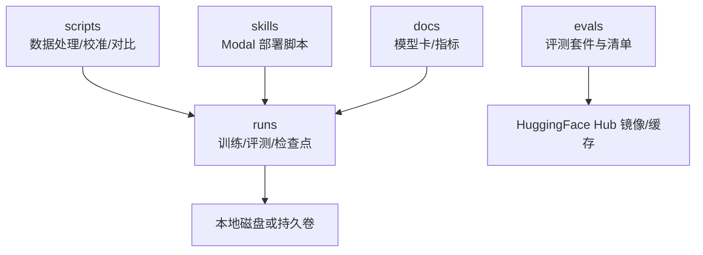
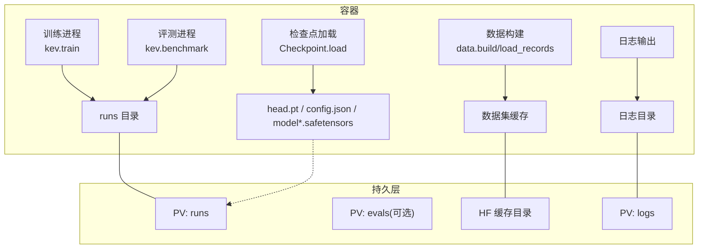
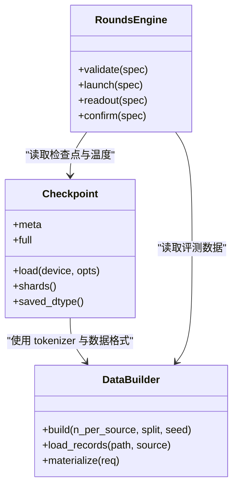

<cite>
**本文引用的文件**   
- [README.md](file://README.md)
- [checkpoint.py](file://kev/checkpoint.py)
- [data.py](file://kev/data.py)
- [rounds.py](file://kev/rounds.py)
</cite>

## 目录
1. [引言](#引言)
2. [项目结构](#项目结构)
3. [核心组件](#核心组件)
4. [架构总览](#架构总览)
5. [详细组件分析](#详细组件分析)
6. [依赖关系分析](#依赖关系分析)
7. [性能考虑](#性能考虑)
8. [故障排查指南](#故障排查指南)
9. [结论](#结论)
10. [附录](#附录)

## 引言
本文件面向在 Kubernetes 或容器环境中部署 Kev 训练与推理工作负载的工程师，系统化说明“存储卷挂载”的设计与实践。文档覆盖：
- 持久化策略：模型权重、训练数据、检查点与评测结果
- 存储卷类型选择与配置建议：HostPath、NFS、云存储（S3/GCS）
- 数据生命周期管理：备份、清理、版本控制
- 日志管理：结构化日志、轮转、集中式收集
- 存储性能优化：IOPS、缓存、读写分离
- 实际配置示例：PVC、StorageClass、动态卷供应

Kev 的代码库以本地路径和 Hugging Face Hub 为主要数据源；训练输出、评测结果与检查点默认写入本地 runs 目录，并通过脚本与 Modal 平台进行远程执行与拉取。因此，生产环境应通过持久卷将 runs、数据集缓存、Hub 缓存与日志落盘，确保可恢复、可观测与可迁移。

## 项目结构
从存储视角，关键目录与职责如下：
- runs：训练运行、评测结果、温度拟合与中间产物
- evals：评测套件与清单（manifest），用于冻结的数据集引用与校验
- scripts：数据处理、校准、对比等工具脚本
- skills：技能与部署脚本（含 Modal 部署相关）
- docs：模型卡与指标声明

图表来源
- [README.md:282-341](file://README.md#L282-L341)
- [README.md:303-322](file://README.md#L303-L322)

章节来源
- [README.md:282-341](file://README.md#L282-L341)
- [README.md:303-322](file://README.md#L303-L322)

## 核心组件
- 检查点加载器：统一 LoRA 适配器与全量权重的读取规则，支持本地路径与 Hub 仓库，负责 head.pt、tokenizer、config.json 与 safetensors 分片的一致性校验
- 数据构建器：将公开数据集转换为 TypeSafe 请求格式，生成内部记录并附带来源、哈希与版本信息
- 研究轮次编排：定义实验计划、读入路径、温度池与评估面板，驱动 Modal 上的训练与评测流程

章节来源
- [checkpoint.py:1-17](file://kev/checkpoint.py#L1-L17)
- [checkpoint.py:168-236](file://kev/checkpoint.py#L168-L236)
- [data.py:1-14](file://kev/data.py#L1-L14)
- [data.py:298-317](file://kev/data.py#L298-L317)
- [rounds.py:1-81](file://kev/rounds.py#L1-L81)

## 架构总览
下图展示 Kev 在容器中的典型数据流与存储挂载点：

图表来源
- [README.md:282-341](file://README.md#L282-L341)
- [README.md:303-322](file://README.md#L303-L322)
- [checkpoint.py:168-236](file://kev/checkpoint.py#L168-L236)
- [data.py:298-317](file://kev/data.py#L298-L317)

## 详细组件分析

### 持久化存储策略
- 模型权重存储
  - 检查点包含 head.pt、tokenizer、LoRA 适配器或全量 backbone 分片（model*.safetensors）。加载器会校验 weights_dtype、base/base_revision 与文件布局一致性
  - 建议将 runs 目录挂载为高可靠持久卷，避免 Pod 重启导致检查点丢失
- 训练数据持久化
  - data.build 使用 datasets 库加载公开数据集，并记录每个样本的来源、行哈希与文本哈希，便于复现与审计
  - 建议将 HF 数据集缓存目录挂载到持久卷，减少重复下载与网络抖动
- 检查结果保存
  - benchmark 与 rounds 流程将 rows.json、metrics、temperature 拟合结果写入 runs 子目录
  - 建议对 runs 启用快照与增量备份，保留每次试验的完整证据链

章节来源
- [checkpoint.py:1-17](file://kev/checkpoint.py#L1-L17)
- [checkpoint.py:190-211](file://kev/checkpoint.py#L190-L211)
- [data.py:298-317](file://kev/data.py#L298-L317)
- [README.md:303-322](file://README.md#L303-L322)

### 存储卷类型选择与配置
- HostPath
  - 适用场景：单节点调试、临时验证
  - 风险：不可跨节点迁移、无弹性扩容
  - 建议：仅用于开发机或 CI 节点，不用于生产
- NFS
  - 适用场景：多 Pod 共享只读数据集、历史 runs 归档
  - 注意：小文件密集写入时 IOPS 可能成为瓶颈；建议配合缓存与批量写入
- 云存储（S3/GCS）
  - 适用场景：大规模数据集、跨区域复制、长期归档
  - 建议：使用对象存储作为冷数据与备份目标；热数据仍建议使用块存储或高性能文件系统

### 数据生命周期管理
- 备份策略
  - runs：按试验标签与时间戳做快照；保留最近 N 个版本与关键里程碑
  - evals：清单 manifest 与 parquet 分支固定版本，定期校验 SHA256
  - 日志：滚动归档至对象存储，保留合规周期
- 清理策略
  - 删除失败试验的中间产物（如未完成的 rows.json、临时分片）
  - 清理过期的 HF 缓存与旧版 tokenizer，释放空间
- 版本控制
  - 所有 runs 与 evals 均通过哈希与清单锁定版本；检查点 meta 中记录 base、revision、weights_dtype 等元数据
  - 建议在 GitOps 中管理 StorageClass、PVC 与命名空间，确保环境一致

章节来源
- [checkpoint.py:190-211](file://kev/checkpoint.py#L190-L211)
- [data.py:298-317](file://kev/data.py#L298-L317)
- [README.md:324-341](file://README.md#L324-L341)

### 日志文件管理
- 结构化日志
  - 建议以 JSON 格式输出，包含 run_id、trial、suite、metric、latency_ms 等字段
- 日志轮转
  - 基于大小与时间双阈值轮转；保留最近 N 份与总容量上限
- 集中式日志收集
  - 将日志目录挂载到持久卷，由 sidecar 或 DaemonSet 采集至 ELK/Loki
  - 对敏感信息脱敏后再发送

### 存储性能优化
- IOPS 调优
  - 训练阶段优先选择高 IOPS 的块存储；评测阶段可复用只读数据集缓存
- 缓存策略
  - 将 HF 数据集与 tokenizer 缓存置于本地 SSD 或内存盘（tmpfs）以提升首读速度
- 读写分离
  - 训练写 runs，评测读 runs；只读数据集与模型权重通过只读 PVC 挂载

## 依赖关系分析
Kev 的核心依赖围绕“检查点—数据—编排”三要素：

图表来源
- [checkpoint.py:168-236](file://kev/checkpoint.py#L168-L236)
- [data.py:298-317](file://kev/data.py#L298-L317)
- [rounds.py:1-81](file://kev/rounds.py#L1-L81)

章节来源
- [checkpoint.py:168-236](file://kev/checkpoint.py#L168-L236)
- [data.py:298-317](file://kev/data.py#L298-L317)
- [rounds.py:1-81](file://kev/rounds.py#L1-L81)

## 性能考虑
- 训练与评测路径差异
  - 训练：大量小文件与频繁写入，需高 IOPS 与稳定吞吐
  - 评测：以读取为主，适合只读缓存与并行读取
- 后端与精度
  - 检查点加载支持 bf16/fp32 路径；服务默认 bf16 以降低延迟与显存占用
- 缓存命中
  - 同一文档多次提问可复用状态缓存，降低重复计算与 IO

章节来源
- [checkpoint.py:83-146](file://kev/checkpoint.py#L83-L146)
- [README.md:355-383](file://README.md#L355-L383)

## 故障排查指南
- 检查点不一致
  - 现象：加载时报错 weights_dtype 与 config.json 不一致
  - 处理：核对 head.pt 与 config.json 的 dtype 名称，重新导出或修正元数据
- 数据集缺失或版本漂移
  - 现象：datasets 加载失败或哈希校验不匹配
  - 处理：固定 revision 或 parquet 分支；校验 manifest 与 SHA256
- 温度拟合异常
  - 现象：温度值偏离预期或评测指标不稳定
  - 处理：检查 temperature pool 是否混入训练数据；使用 rounds.validate 校验

章节来源
- [checkpoint.py:267-278](file://kev/checkpoint.py#L267-L278)
- [data.py:298-317](file://kev/data.py#L298-L317)
- [rounds.py:507-578](file://kev/rounds.py#L507-L578)

## 结论
通过将 runs、数据集缓存与日志挂载到合适的持久卷，并结合版本化与备份策略，Kev 的训练与评测可在容器环境中实现高可用、可复现与可观测。生产部署推荐：
- 训练与评测使用高性能块存储
- 只读数据集与模型权重使用只读 PVC 或对象存储
- 日志集中采集与轮转归档
- 严格版本化与哈希校验，确保数据与检查点一致性

## 附录

### 实际配置示例（概念性）
- PVC 定义
  - 为 runs 创建独立 PVC，绑定高性能 StorageClass
  - 为 evals 与 HF 缓存创建只读 PVC，供多个 Pod 共享
- StorageClass 配置
  - 训练用：高 IOPS、低延迟
  - 归档用：低成本、高耐久
- 动态卷供应
  - 使用 CSI 驱动自动创建与扩容
  - 结合 Snapshot 与 Clone 快速恢复试验

[本节为概念性指导，不涉及具体代码文件]