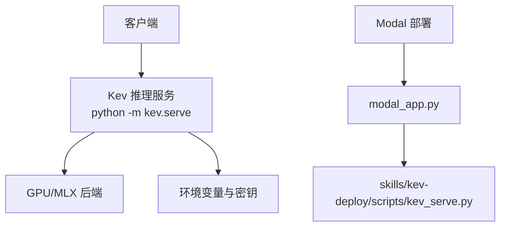
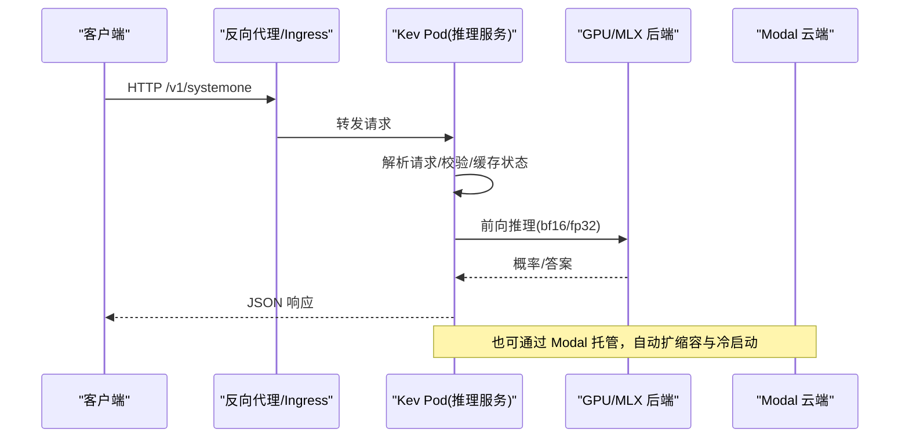
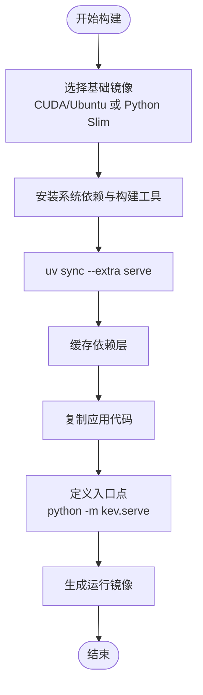
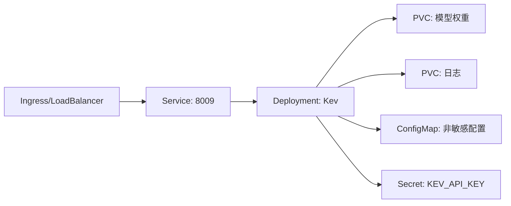
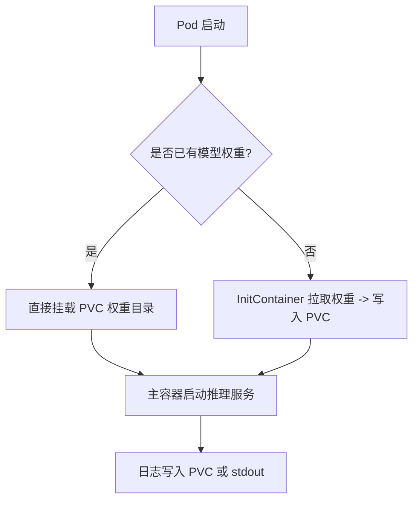
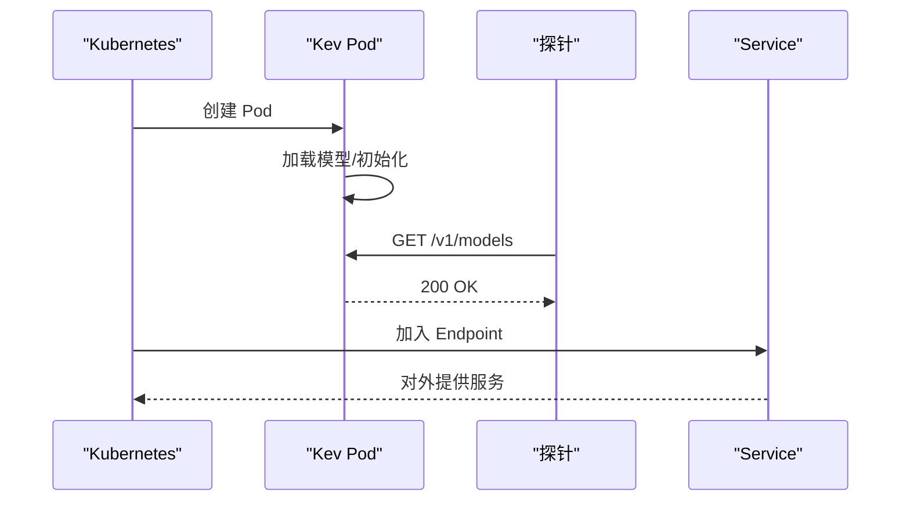
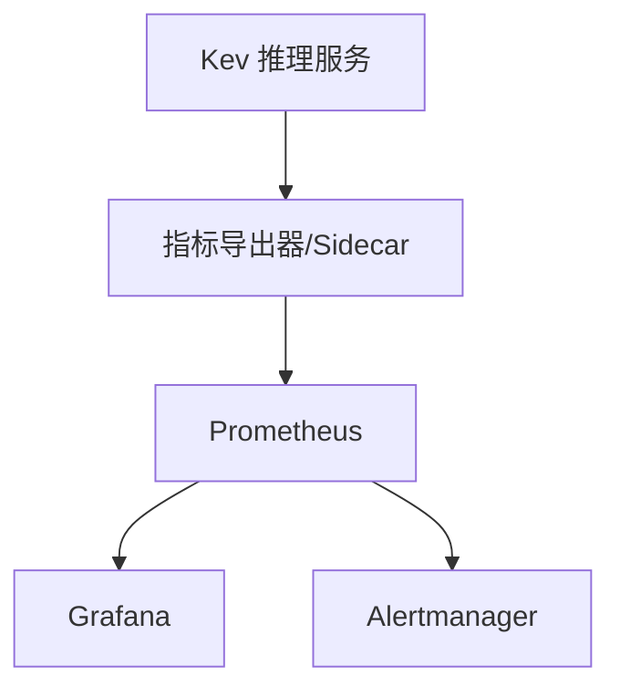
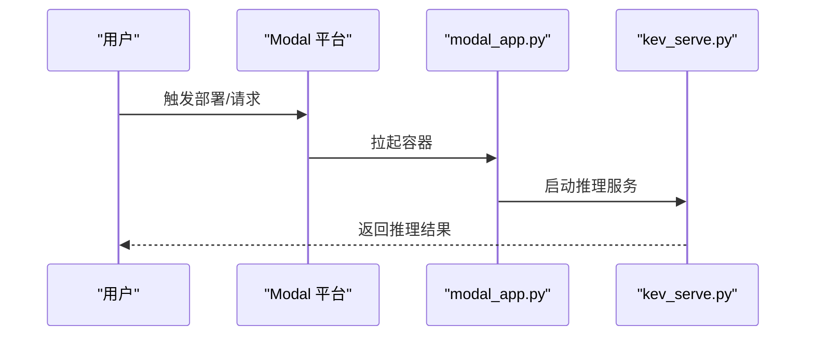
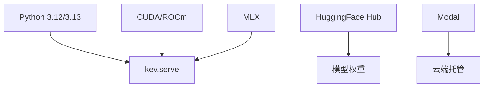

# 容器化部署

<cite>
**本文引用的文件**   
- [README.md](file://README.md)
- [modal_app.py](file://modal_app.py)
- [skills/kev-deploy/README.md](file://skills/kev-deploy/README.md)
- [skills/kev-deploy/scripts/kev_serve.py](file://skills/kev-deploy/scripts/kev_serve.py)
- [pyproject.toml](file://pyproject.toml)
- [.github/workflows/ci.yml](file://.github/workflows/ci.yml)
</cite>

## 目录
1. [简介](#简介)
2. [项目结构](#项目结构)
3. [核心组件](#核心组件)
4. [架构总览](#架构总览)
5. [详细组件分析](#详细组件分析)
6. [依赖关系分析](#依赖关系分析)
7. [性能与容量规划](#性能与容量规划)
8. [故障排查指南](#故障排查指南)
9. [结论](#结论)
10. [附录：Kubernetes 与 Helm 参考模板](#附录kubernetes-与-helm-参考模板)

## 简介
本文件面向将 Kev 决策模型服务以容器化方式部署到 Kubernetes 的工程实践，覆盖以下主题：
- Docker 镜像构建：基础镜像选择、依赖安装、多阶段构建优化
- Kubernetes 编排：Deployment、Service、ConfigMap、Secret
- 存储卷挂载：持久化数据、模型权重、日志文件
- 服务发现与健康检查：探针配置、负载均衡、滚动更新
- Helm Chart 模板与 YAML 示例
- 监控集成：Prometheus 指标导出、Grafana 仪表板、告警规则

Kev 提供本地可运行的推理服务，兼容 TypeSafe System One API；同时提供 Modal 云端一键部署能力。仓库未包含现成的 Dockerfile、Helm Chart 或 Kubernetes YAML，因此本节在严格依据仓库现有信息的基础上，给出可直接落地的参考设计与模板。

**章节来源**
- [README.md:13-23](file://README.md#L13-L23)
- [README.md:49-59](file://README.md#L49-L59)
- [README.md:172-184](file://README.md#L172-L184)

## 项目结构
围绕容器化与编排，仓库中与部署相关的要点如下：
- 推理入口：Python 模块 `kev.serve`，支持 CUDA/ROCm 与 Apple MLX 后端
- 云端部署：Modal 应用 `modal_app.py` 与技能脚本 `skills/kev-deploy/scripts/kev_serve.py`
- 依赖管理：`pyproject.toml`（serve 额外依赖）
- CI：`.github/workflows/ci.yml`（不包含镜像构建步骤）
- 文档与说明：`README.md`、`skills/kev-deploy/README.md`

**图表来源**
- [README.md:49-59](file://README.md#L49-L59)
- [README.md:172-184](file://README.md#L172-L184)
- [modal_app.py](file://modal_app.py)
- [skills/kev-deploy/scripts/kev_serve.py](file://skills/kev-deploy/scripts/kev_serve.py)

**章节来源**
- [README.md:49-59](file://README.md#L49-L59)
- [README.md:172-184](file://README.md#L172-L184)
- [modal_app.py](file://modal_app.py)
- [skills/kev-deploy/README.md:1-37](file://skills/kev-deploy/README.md#L1-L37)

## 核心组件
- 推理服务进程：通过 `python -m kev.serve` 启动，暴露 `/v1/systemone` 等接口
- 运行时环境：CUDA/ROCm（GPU）或 MLX（Apple Silicon），bf16 默认精度
- 配置与密钥：通过环境变量注入（如 `KEV_API_KEY`、`KEV_DTYPE`、`KEV_TEMPERATURE` 等）
- 云端托管：Modal 应用封装了 GPU 资源、冷启动与并发批处理

关键行为与约束（来自仓库文档）：
- 首次运行会下载适配器与基础模型权重
- 服务端默认绑定 127.0.0.1，可通过参数开放 0.0.0.0
- 可通过 `KEV_API_KEY` 启用鉴权
- bf16 为默认精度，fp32 可通过环境变量切换

**章节来源**
- [README.md:49-59](file://README.md#L49-L59)
- [README.md:250-258](file://README.md#L250-L258)
- [README.md:355-383](file://README.md#L355-L383)

## 架构总览
下图展示从客户端到推理服务的端到端流程，以及云端 Modal 的替代路径。

**图表来源**
- [README.md:214-250](file://README.md#L214-L250)
- [README.md:355-383](file://README.md#L355-L383)

## 详细组件分析

### Docker 镜像构建
建议采用多阶段构建，分离“构建期”与“运行期”，最小化最终镜像体积并提升安全性。

- 基础镜像选择
  - GPU 路径：使用 NVIDIA CUDA + cuDNN 对应版本的官方镜像（例如 `nvidia/cuda:x.y.z-cudnn-runtime-ubuntu22.04`）
  - CPU/Apple 路径：使用 Python 官方 slim 镜像（例如 `python:3.12-slim`）
- 依赖安装
  - 使用 `uv sync --extra serve` 安装推理相关依赖（见 README 快速开始）
  - 若需编译扩展，可在构建阶段安装系统级依赖（gcc、make、CUDA 开发包等）
- 多阶段构建优化
  - 构建阶段：安装构建工具链、下载并缓存依赖
  - 运行阶段：仅复制必要二进制与库，设置非 root 用户，暴露端口
- 健康就绪
  - 在镜像中内置轻量健康检查脚本，探测 `/v1/models` 或自定义 `/healthz`

**图表来源**
- [README.md:49-59](file://README.md#L49-L59)
- [pyproject.toml](file://pyproject.toml)

**章节来源**
- [README.md:49-59](file://README.md#L49-L59)
- [pyproject.toml](file://pyproject.toml)

### Kubernetes 编排配置
以下为推荐的最小可用编排清单（概念性示例，便于直接落地）。请根据实际集群与存储类调整。

- Deployment
  - 副本数：按 QPS 与 GPU 资源决定，通常单卡单实例
  - 资源限制：requests/limits 明确 CPU/GPU/Memory
  - 环境变量：注入 `KEV_API_KEY`、`KEV_DTYPE`、`KEV_TEMPERATURE` 等
  - 启动命令：`python -m kev.serve --run <model-or-path> --port 8009`
- Service
  - ClusterIP 类型，暴露 8009 端口
- ConfigMap
  - 存放非敏感配置：模型名称、批大小、是否截断长文本等
- Secret
  - 存放敏感信息：API Key、远程模型访问令牌等
- 存储卷
  - 持久化模型权重目录（可选，避免每次拉取）
  - 日志目录（可选，集中收集）
- 健康检查
  - LivenessProbe：探测 `/v1/models` 或自定义健康端点
  - ReadinessProbe：等待模型加载完成后再接收流量
- 滚动更新
  - 使用 RollingUpdate 策略，逐步替换 Pod，确保零停机

**图表来源**
- [README.md:250-258](file://README.md#L250-L258)
- [README.md:355-383](file://README.md#L355-L383)

**章节来源**
- [README.md:250-258](file://README.md#L250-L258)
- [README.md:355-383](file://README.md#L355-L383)

### 存储卷挂载
- 模型权重
  - 使用 PVC 挂载预下载的权重目录，减少冷启动时间
  - 或使用 InitContainer 从 HuggingFace Hub 拉取权重并写入共享卷
- 日志文件
  - 挂载日志目录至 PVC 或 Sidecar 采集（Fluent Bit/Filebeat）
- 临时数据
  - 使用 emptyDir 作为中间缓存（如 KV 缓存、批处理缓冲）

**图表来源**
- [README.md:49-59](file://README.md#L49-L59)

**章节来源**
- [README.md:49-59](file://README.md#L49-L59)

### 服务发现与健康检查
- 服务发现
  - 通过 Service 暴露稳定 DNS 名，供 Ingress/网关路由
- 健康检查
  - LivenessProbe：调用 `/v1/models` 或自定义 `/healthz`
  - ReadinessProbe：等待模型加载完成（可结合启动钩子）
- 负载均衡
  - 基于 Service 的轮询或连接亲和（如需会话）
- 滚动更新
  - 使用 RollingUpdate，配合 readiness 探针保证新 Pod 就绪再摘除旧 Pod

**图表来源**
- [README.md:214-250](file://README.md#L214-L250)

**章节来源**
- [README.md:214-250](file://README.md#L214-L250)

### 监控集成
- Prometheus 指标导出
  - 建议在推理服务外层接入 sidecar 或网关，统一暴露 `/metrics`
  - 指标维度：QPS、延迟分位、错误率、GPU 利用率、显存占用
- Grafana 仪表板
  - 可视化 QPS、延迟、错误率、资源使用率
- 告警规则
  - 错误率阈值、延迟 P99 超阈、GPU OOM、Pod 重启次数

[本图为概念性设计，不直接映射具体源码]

**章节来源**
- [README.md:355-383](file://README.md#L355-L383)

### 云端部署（Modal）
- 使用 `modal_app.py` 与 `skills/kev-deploy/scripts/kev_serve.py` 进行云端托管
- 支持按模型自动选择 GPU，空闲时缩容至零
- 首请求存在冷启动延迟，后续并发请求在服务内批处理

**图表来源**
- [modal_app.py](file://modal_app.py)
- [skills/kev-deploy/scripts/kev_serve.py](file://skills/kev-deploy/scripts/kev_serve.py)
- [skills/kev-deploy/README.md:1-37](file://skills/kev-deploy/README.md#L1-L37)

**章节来源**
- [README.md:172-184](file://README.md#L172-L184)
- [skills/kev-deploy/README.md:1-37](file://skills/kev-deploy/README.md#L1-L37)

## 依赖关系分析
- 运行时依赖
  - Python 3.12/3.13（见 README 快速开始）
  - CUDA/ROCm（GPU）或 MLX（Apple Silicon）
  - 推理依赖由 `uv sync --extra serve` 安装
- 外部依赖
  - HuggingFace Hub（模型权重）
  - Modal（云端托管）
- CI
  - `.github/workflows/ci.yml` 当前不包含镜像构建任务

**图表来源**
- [README.md:49-59](file://README.md#L49-L59)
- [README.md:172-184](file://README.md#L172-L184)
- [.github/workflows/ci.yml](file://.github/workflows/ci.yml)

**章节来源**
- [README.md:49-59](file://README.md#L49-L59)
- [README.md:172-184](file://README.md#L172-L184)
- [.github/workflows/ci.yml](file://.github/workflows/ci.yml)

## 性能与容量规划
- 模型与 GPU 选型
  - Kev-0.8B：L4
  - Kev-4B：L40S 或 H100
  - Kev-9B：L40S 或 H100
  - Kev-27B：B200/H200/H100（80GB）
- 内存与显存
  - Kev-9B 约需 ~17GB 显存
  - Kev-27B 权重约 51GB，运行态约 66GB（含批处理缓冲）
- 吞吐与延迟
  - 不同 GPU 与输入长度下，QPS 与延迟差异显著（详见 README 表格）
- 精度
  - 默认 bf16；fp32 可通过环境变量切换，评估路径使用 fp32

**章节来源**
- [README.md:355-383](file://README.md#L355-L383)

## 故障排查指南
- 本地运行问题
  - 确认 Python 版本与 uv 安装
  - 首次运行会下载权重，注意网络与磁盘空间
- 云端部署问题
  - Modal 冷启动延迟属预期行为
  - 并发超过一定阈值后，平台会自动扩容容器
- 常见环境变量
  - `KEV_API_KEY`：启用鉴权
  - `KEV_DTYPE`：切换 fp32/bf16
  - `KEV_TEMPERATURE`：关闭校准温度
  - `KEV_TRUNCATE_STATES`：允许截断超长输入

**章节来源**
- [README.md:49-59](file://README.md#L49-L59)
- [README.md:250-258](file://README.md#L250-L258)
- [skills/kev-deploy/README.md:1-37](file://skills/kev-deploy/README.md#L1-L37)

## 结论
- Kev 推理服务可通过 Python 模块直接运行，或通过 Modal 云端托管
- 仓库未提供现成 Dockerfile、Helm Chart 与 Kubernetes YAML，但可基于本文档的设计快速落地
- 在生产环境中，建议结合 PVC、ConfigMap/Secret、探针与滚动更新，实现高可用与可观测性

[本节为总结性内容，不直接分析具体文件]

## 附录：Kubernetes 与 Helm 参考模板
以下为概念性模板片段，用于指导落地。请将占位符替换为你的实际值，并根据集群策略调整。

- Deployment（概念示例）
  - 字段要点：
    - replicas：按负载与 GPU 资源设定
    - containers[].command：`python -m kev.serve --run <模型或路径> --port 8009`
    - env：注入 `KEV_API_KEY`、`KEV_DTYPE`、`KEV_TEMPERATURE` 等
    - resources.requests/limits：CPU/GPU/Memory
    - volumeMounts：挂载模型权重与日志
    - liveness/readiness probes：探测 `/v1/models` 或自定义健康端点
    - strategy：RollingUpdate

- Service（概念示例）
  - type：ClusterIP
  - ports：8009/TCP

- ConfigMap（概念示例）
  - keys：MODEL_NAME、BATCH_SIZE、TRUNCATE_STATES 等

- Secret（概念示例）
  - keys：KEV_API_KEY、HF_TOKEN 等

- PVC（概念示例）
  - storageClassName：按需指定
  - accessModes：ReadWriteOnce
  - resources.requests.storage：按模型权重大小预估

- Helm Chart（概念示例）
  - values.yaml：集中管理副本数、资源、存储、环境变量
  - templates/deployment.yaml：渲染 Deployment
  - templates/service.yaml：渲染 Service
  - templates/configmap.yaml：渲染 ConfigMap
  - templates/secret.yaml：渲染 Secret
  - templates/pvc.yaml：渲染 PVC

[以上模板为概念性描述，便于直接落地；不直接映射具体源码]