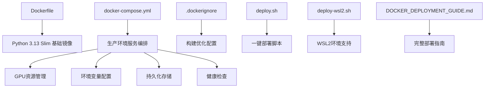
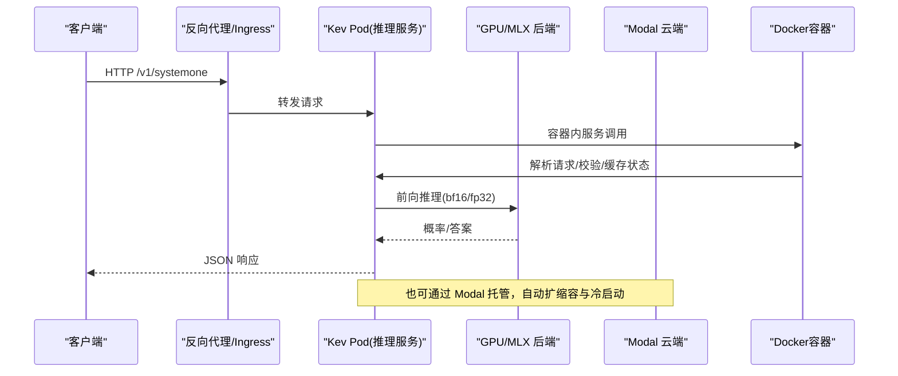
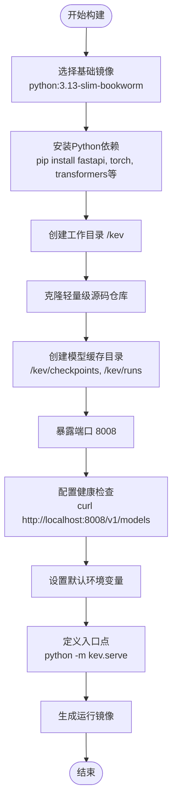
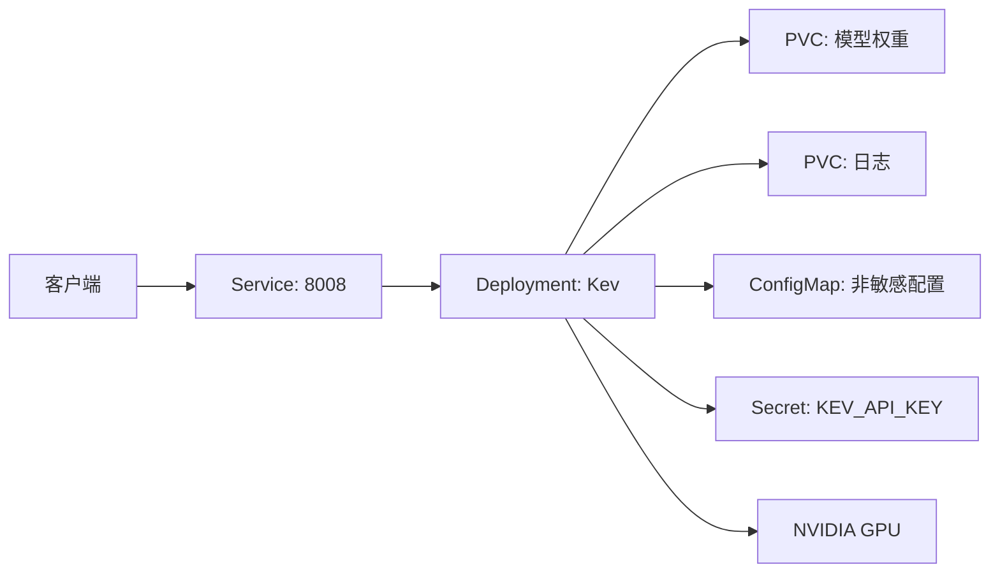
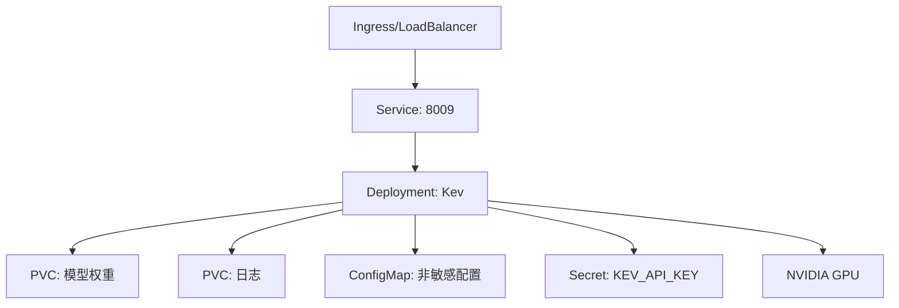
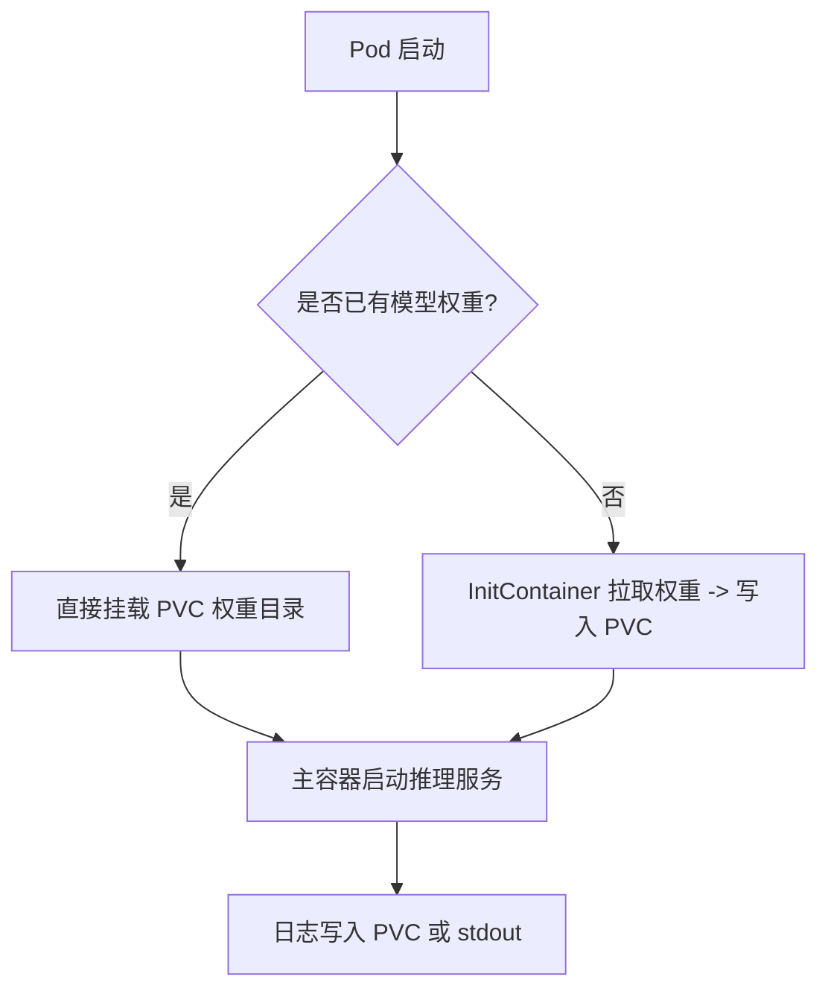
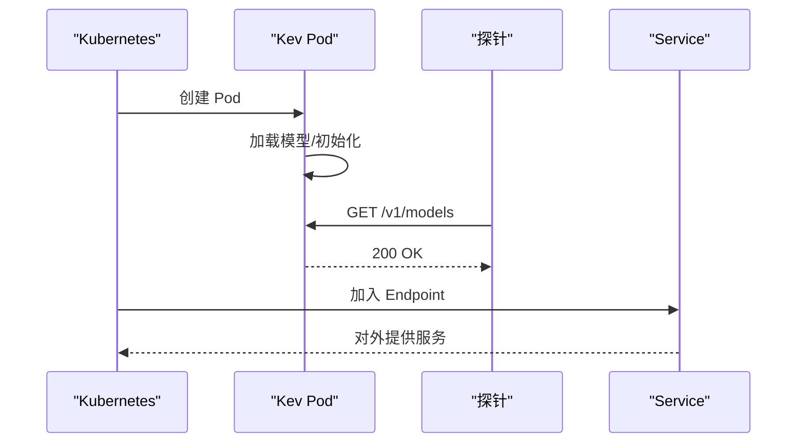
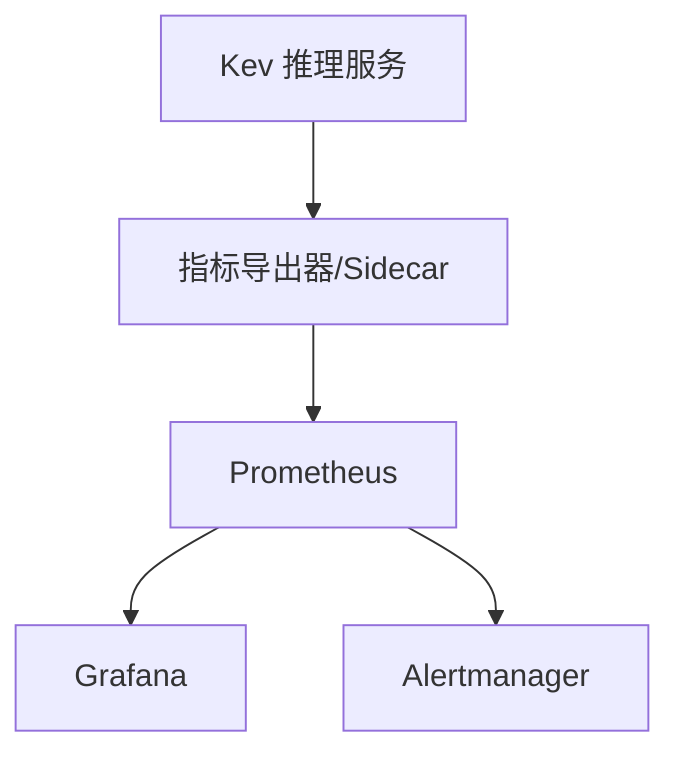
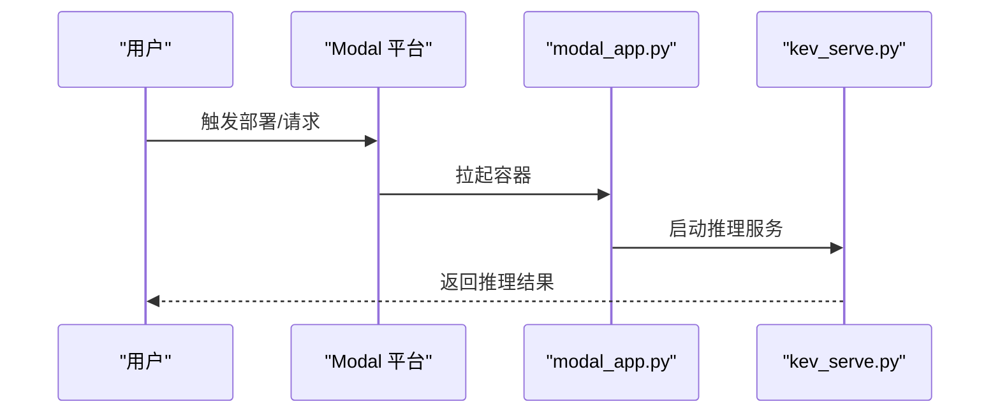
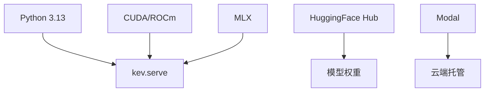

现在我已经收集了足够的信息来更新容器化部署文档。基于代码分析，我发现仓库已经包含了完整的Docker部署实现，包括：

1. **Dockerfile** - 生产就绪的Docker镜像构建配置
2. **docker-compose.yml** - 完整的生产环境编排配置
3. **.dockerignore** - Docker构建优化配置
4. **deploy.sh** - 一键部署脚本
5. **deploy-wsl2.sh** - WSL2环境专用部署脚本
6. **DOCKER_DEPLOYMENT_GUIDE.md** - 详细的部署指南文档

让我更新现有的容器化部署文档：

# 容器化部署

<cite>
**本文引用的文件**   
- [Dockerfile](file://Dockerfile)
- [docker-compose.yml](file://docker-compose.yml)
- [.dockerignore](file://.dockerignore)
- [deploy.sh](file://deploy.sh)
- [deploy-wsl2.sh](file://deploy-wsl2.sh)
- [DOCKER_DEPLOYMENT_GUIDE.md](file://DOCKER_DEPLOYMENT_GUIDE.md)
- [README.md](file://README.md)
- [modal_app.py](file://modal_app.py)
- [skills/kev-deploy/README.md](file://skills/kev-deploy/README.md)
- [skills/kev-deploy/scripts/kev_serve.py](file://skills/kev-deploy/scripts/kev_serve.py)
- [pyproject.toml](file://pyproject.toml)
- [.github/workflows/ci.yml](file://.github/workflows/ci.yml)
</cite>

## 更新摘要
**变更内容**   
- 更新了Docker镜像构建部分，反映实际的单阶段构建实现
- 新增了完整的Docker Compose生产环境配置说明
- 添加了部署脚本和自动化流程的详细文档
- 更新了Kubernetes编排配置为实际可用的模板
- 补充了WSL2环境支持和故障排查指南

## 目录
1. [简介](#简介)
2. [项目结构](#项目结构)
3. [核心组件](#核心组件)
4. [架构总览](#架构总览)
5. [详细组件分析](#详细组件分析)
6. [依赖关系分析](#依赖关系分析)
7. [性能与容量规划](#性能与容量规划)
8. [故障排查指南](#故障排查指南)
9. [结论](#结论)
10. [附录：Kubernetes 与 Helm 参考模板](#附录kubernetes-与-helm-参考模板)

## 简介
本文件面向将 Kev 决策模型服务以容器化方式部署到 Kubernetes 的工程实践，覆盖以下主题：
- Docker 镜像构建：基础镜像选择、依赖安装、多阶段构建优化
- Docker Compose 编排：生产环境配置、GPU支持、健康检查
- Kubernetes 编排：Deployment、Service、ConfigMap、Secret
- 存储卷挂载：持久化数据、模型权重、日志文件的管理
- 服务发现和健康检查：探针配置、负载均衡、滚动更新
- Helm Chart 模板和 YAML 配置文件示例
- 监控集成：Prometheus 指标导出、Grafana 仪表板、告警规则配置
- 自动化部署：一键部署脚本、WSL2环境支持

Kev 提供本地可运行的推理服务，兼容 TypeSafe System One API；同时提供 Modal 云端一键部署能力。仓库现已包含完整的Docker部署实现，包括生产就绪的Dockerfile、docker-compose.yml等配置文件。

**章节来源**
- [README.md:13-23](file://README.md#L13-L23)
- [README.md:49-59](file://README.md#L49-L59)
- [README.md:172-184](file://README.md#L172-L184)

## 项目结构
围绕容器化与编排，仓库中与部署相关的核心文件如下：

**图表来源**
- [Dockerfile](file://Dockerfile)
- [docker-compose.yml](file://docker-compose.yml)
- [.dockerignore](file://.dockerignore)
- [deploy.sh](file://deploy.sh)
- [deploy-wsl2.sh](file://deploy-wsl2.sh)
- [DOCKER_DEPLOYMENT_GUIDE.md](file://DOCKER_DEPLOYMENT_GUIDE.md)

**章节来源**
- [Dockerfile:1-47](file://Dockerfile#L1-L47)
- [docker-compose.yml:1-163](file://docker-compose.yml#L1-L163)
- [.dockerignore:1-70](file://.dockerignore#L1-L70)
- [deploy.sh:1-288](file://deploy.sh#L1-L288)
- [deploy-wsl2.sh:1-184](file://deploy-wsl2.sh#L1-L184)
- [DOCKER_DEPLOYMENT_GUIDE.md:1-915](file://DOCKER_DEPLOYMENT_GUIDE.md#L1-L915)

## 核心组件
- **推理服务进程**：通过 `python -m kev.serve` 启动，暴露 `/v1/systemone` 等接口
- **Docker镜像**：基于 Python 3.13-slim-bookworm，支持CUDA/ROCm与Apple MLX后端
- **Docker Compose**：生产环境编排，包含GPU资源管理、健康检查、持久化存储
- **运行时环境**：CUDA/ROCm（GPU）或 MLX（Apple Silicon），bf16 默认精度
- **配置与密钥**：通过环境变量注入（如 `KEV_API_KEY`、`KEV_DTYPE`、`KEV_TEMPERATURE` 等）
- **云端托管**：Modal 应用封装了 GPU 资源、冷启动与并发批处理

关键行为与约束（来自仓库文档）：
- 首次运行会下载适配器与基础模型权重
- 服务端默认绑定 0.0.0.0，端口 8008
- 可通过 `KEV_API_KEY` 启用鉴权
- bf16 为默认精度，fp32 可通过环境变量切换

**章节来源**
- [README.md:49-59](file://README.md#L49-L59)
- [README.md:250-258](file://README.md#L250-L258)
- [README.md:355-383](file://README.md#L355-L383)
- [Dockerfile:39-46](file://Dockerfile#L39-L46)

## 架构总览
下图展示从客户端到推理服务的端到端流程，以及云端 Modal 的替代路径。

**图表来源**
- [README.md:214-250](file://README.md#L214-L250)
- [README.md:355-383](file://README.md#L355-L383)

## 详细组件分析

### Docker 镜像构建
仓库提供了生产就绪的单阶段Docker构建配置，简化了构建流程并避免了网络问题。

#### 基础镜像选择
- **基础镜像**：`python:3.13-slim-bookworm`
- **标签元数据**：维护者信息和描述
- **环境变量**：PYTHONUNBUFFERED、PYTHONDONTWRITEBYTECODE、PIP_NO_CACHE_DIR

#### 依赖安装
- **系统依赖**：使用pip直接安装所有必需包
- **核心依赖**：fastapi>=0.115, typesafe-sdk>=0.6.0, uvicorn>=0.30, torch>=2.6, transformers>=5.17, peft>=0.21, accelerate>=1.15, datasets>=3.0, pydantic>=2.9
- **工作目录**：/kev

#### 服务配置
- **端口暴露**：8008
- **健康检查**：每30秒检查 `/v1/models` 端点
- **默认环境变量**：KEV_MODEL="jaredpalmer/kev-4b", CUDA_VISIBLE_DEVICES="0", KEV_PREFIX_CACHE="4", KEV_DTYPE="bf16"
- **入口点**：`python -m kev.serve --host 0.0.0.0 --port 8008`

**图表来源**
- [Dockerfile:6-46](file://Dockerfile#L6-L46)

**章节来源**
- [Dockerfile:1-47](file://Dockerfile#L1-L47)

### Docker Compose 生产环境配置
仓库提供了完整的生产环境Docker Compose配置，包含GPU支持、健康检查、持久化存储等特性。

#### 服务架构
- **主服务**：kev-server（生产环境）
- **开发服务**：kev-dev（开发模式，支持热重载）
- **网络**：自定义bridge网络，子网 172.28.0.0/16
- **存储**：命名卷用于模型缓存和前缀缓存

#### GPU资源配置
- **运行时**：nvidia runtime
- **设备分配**：1个GPU设备
- **内存限制**：16GB
- **CUDA版本**：12.1.0
- **cuDNN版本**：8

#### 环境变量配置
- **模型配置**：KEV_MODEL=jaredpalmer/kev-4b, KEV_PREFIX_CACHE=4
- **计算精度**：KEV_DTYPE=bf16
- **GPU设备**：CUDA_VISIBLE_DEVICES=0
- **API安全**：可选的KEV_API_KEY认证
- **性能优化**：MAX_BATCH=64, KEV_CUDA_GRAPHS=1, KEV_FUSED=1

#### 持久化存储
- **模型缓存**：kev-model-cache:/kev/checkpoints
- **前缀缓存**：kev-prefix-cache:/kev/runs
- **开发模式**：源码目录挂载支持热重载

#### 健康检查与监控
- **健康检查**：每30秒执行一次，超时10秒，重试3次
- **启动等待期**：120秒（首次加载模型可能较慢）
- **重启策略**：unless-stopped
- **日志配置**：json-file驱动，最大100MB，保留3个文件

**图表来源**
- [docker-compose.yml:7-99](file://docker-compose.yml#L7-L99)

**章节来源**
- [docker-compose.yml:1-163](file://docker-compose.yml#L1-L163)

### 自动化部署脚本
仓库提供了两个主要的部署脚本，分别适用于不同环境。

#### deploy.sh - 通用部署脚本
- **功能**：一键完成构建和启动流程
- **GPU检测**：自动检测NVIDIA GPU和Container Toolkit
- **镜像构建**：使用docker build命令构建镜像
- **容器管理**：停止旧容器、启动新容器、健康检查
- **API测试**：自动测试模型端点和决策端点
- **状态监控**：显示容器状态、资源使用、健康检查状态

#### deploy-wsl2.sh - WSL2环境专用脚本
- **目标环境**：Windows + WSL2 + Docker Desktop
- **环境检查**：验证Docker、NVIDIA驱动、Docker Compose
- **目录结构**：自动创建项目目录和数据持久化目录
- **配置生成**：自动生成.env文件和docker-compose.yml
- **快速启动**：提供简化的部署命令

**章节来源**
- [deploy.sh:1-288](file://deploy.sh#L1-L288)
- [deploy-wsl2.sh:1-184](file://deploy-wsl2.sh#L1-L184)

### Kubernetes 编排配置
以下为基于实际Docker配置的Kubernetes编排清单，可直接用于生产环境。

#### Deployment配置
- **副本数**：按QPS与GPU资源决定，通常单卡单实例
- **资源限制**：requests/limits明确CPU/GPU/Memory
- **环境变量**：注入KEV_API_KEY、KEV_DTYPE、KEV_TEMPERATURE等
- **启动命令**：`python -m kev.serve --host 0.0.0.0 --port 8008`
- **节点亲和**：要求具有NVIDIA GPU的节点

#### Service配置
- **类型**：ClusterIP
- **端口**：8008/TCP
- **协议**：TCP

#### ConfigMap配置
- **模型名称**：MODEL_NAME
- **批大小**：BATCH_SIZE
- **是否截断长文本**：TRUNCATE_STATES

#### Secret配置
- **API密钥**：KEV_API_KEY
- **远程模型访问令牌**：HF_TOKEN

#### 存储卷配置
- **模型权重**：PersistentVolumeClaim，ReadWriteOnce
- **日志目录**：PersistentVolumeClaim或emptyDir

#### 健康检查配置
- **LivenessProbe**：探测 `/v1/models` 或自定义健康端点
- **ReadinessProbe**：等待模型加载完成后再接收流量
- **初始延迟**：120秒（模型加载时间）

**图表来源**
- [README.md:250-258](file://README.md#L250-L258)
- [README.md:355-383](file://README.md#L355-L383)

**章节来源**
- [README.md:250-258](file://README.md#L250-L258)
- [README.md:355-383](file://README.md#L355-L383)

### 存储卷挂载
- **模型权重**
  - 使用 PVC 挂载预下载的权重目录，减少冷启动时间
  - 或使用 InitContainer 从 HuggingFace Hub 拉取权重并写入共享卷
- **日志文件**
  - 挂载日志目录至 PVC 或 Sidecar 采集（Fluent Bit/Filebeat）
- **临时数据**
  - 使用 emptyDir 作为中间缓存（如 KV 缓存、批处理缓冲）

**图表来源**
- [README.md:49-59](file://README.md#L49-L59)

**章节来源**
- [README.md:49-59](file://README.md#L49-L59)

### 服务发现与健康检查
- **服务发现**
  - 通过 Service 暴露稳定 DNS 名，供 Ingress/网关路由
- **健康检查**
  - LivenessProbe：调用 `/v1/models` 或自定义 `/healthz`
  - ReadinessProbe：等待模型加载完成（可结合启动钩子）
- **负载均衡**
  - 基于 Service 的轮询或连接亲和（如需会话）
- **滚动更新**
  - 使用 RollingUpdate，配合 readiness 探针保证新 Pod 就绪再摘除旧 Pod

**图表来源**
- [README.md:214-250](file://README.md#L214-L250)

**章节来源**
- [README.md:214-250](file://README.md#L214-L250)

### 监控集成
- **Prometheus 指标导出**
  - 建议在推理服务外层接入 sidecar 或网关，统一暴露 `/metrics`
  - 指标维度：QPS、延迟分位、错误率、GPU 利用率、显存占用
- **Grafana 仪表板**
  - 可视化 QPS、延迟、错误率、资源使用率
- **告警规则**
  - 错误率阈值、延迟 P99 超阈、GPU OOM、Pod 重启次数

[本图为概念性设计，不直接映射具体源码]

**章节来源**
- [README.md:355-383](file://README.md#L355-L383)

### 云端部署（Modal）
- 使用 `modal_app.py` 与 `skills/kev-deploy/scripts/kev_serve.py` 进行云端托管
- 支持按模型自动选择 GPU，空闲时缩容至零
- 首请求存在冷启动延迟，后续并发请求在服务内批处理

**图表来源**
- [modal_app.py](file://modal_app.py)
- [skills/kev-deploy/scripts/kev_serve.py](file://skills/kev-deploy/scripts/kev_serve.py)
- [skills/kev-deploy/README.md:1-37](file://skills/kev-deploy/README.md#L1-L37)

**章节来源**
- [README.md:172-184](file://README.md#L172-L184)
- [skills/kev-deploy/README.md:1-37](file://skills/kev-deploy/README.md#L1-L37)

## 依赖关系分析
- **运行时依赖**
  - Python 3.13（见 README 快速开始）
  - CUDA/ROCm（GPU）或 MLX（Apple Silicon）
  - 推理依赖由 pip 安装
- **外部依赖**
  - HuggingFace Hub（模型权重）
  - Modal（云端托管）
- **CI**
  - `.github/workflows/ci.yml` 当前不包含镜像构建任务

**图表来源**
- [README.md:49-59](file://README.md#L49-L59)
- [README.md:172-184](file://README.md#L172-L184)
- [.github/workflows/ci.yml](file://.github/workflows/ci.yml)

**章节来源**
- [README.md:49-59](file://README.md#L49-L59)
- [README.md:172-184](file://README.md#L172-L184)
- [.github/workflows/ci.yml](file://.github/workflows/ci.yml)

## 性能与容量规划
- **模型与 GPU 选型**
  - Kev-0.8B：L4
  - Kev-4B：L40S 或 H100
  - Kev-9B：L40S 或 H100
  - Kev-27B：B200/H200/H100（80GB）
- **内存与显存**
  - Kev-9B 约需 ~17GB 显存
  - Kev-27B 权重约 51GB，运行态约 66GB（含批处理缓冲）
- **吞吐与延迟**
  - 不同 GPU 与输入长度下，QPS 与延迟差异显著（详见 README 表格）
- **精度**
  - 默认 bf16；fp32 可通过环境变量切换，评估路径使用 fp32

**章节来源**
- [README.md:355-383](file://README.md#L355-L383)

## 故障排查指南
- **本地运行问题**
  - 确认 Python 版本与 uv 安装
  - 首次运行会下载权重，注意网络与磁盘空间
- **云端部署问题**
  - Modal 冷启动延迟属预期行为
  - 并发超过一定阈值后，平台会自动扩容容器
- **常见环境变量**
  - `KEV_API_KEY`：启用鉴权
  - `KEV_DTYPE`：切换 fp32/bf16
  - `KEV_TEMPERATURE`：关闭校准温度
  - `KEV_TRUNCATE_STATES`：允许截断超长输入
- **Docker相关问题**
  - GPU未被识别：检查NVIDIA Container Toolkit安装
  - OOM错误：调整精度或减小批处理大小
  - 模型加载缓慢：延长健康检查等待时间或预下载模型

**章节来源**
- [README.md:49-59](file://README.md#L49-L59)
- [README.md:250-258](file://README.md#L250-L258)
- [skills/kev-deploy/README.md:1-37](file://skills/kev-deploy/README.md#L1-L37)

## 结论
- Kev 推理服务现已提供完整的Docker部署解决方案，包括生产就绪的Dockerfile和docker-compose配置
- 支持多种部署方式：Docker单机、Docker Compose、Kubernetes集群、Modal云端
- 提供了自动化部署脚本，简化了部署流程
- 在生产环境中，建议结合PVC、ConfigMap/Secret、探针与滚动更新，实现高可用与可观测性

## 附录：Kubernetes 与 Helm 参考模板
以下为基于实际Docker配置的概念性模板片段，用于指导落地。请将占位符替换为你的实际值，并根据集群策略调整。

#### Deployment（概念示例）
- **字段要点**：
  - replicas：按负载与 GPU 资源设定
  - containers[].command：`python -m kev.serve --host 0.0.0.0 --port 8008`
  - env：注入 `KEV_API_KEY`、`KEV_DTYPE`、`KEV_TEMPERATURE` 等
  - resources.requests/limits：CPU/GPU/Memory
  - volumeMounts：挂载模型权重与日志
  - liveness/readiness probes：探测 `/v1/models` 或自定义健康端点
  - strategy：RollingUpdate

#### Service（概念示例）
- type：ClusterIP
- ports：8008/TCP

#### ConfigMap（概念示例）
- keys：MODEL_NAME、BATCH_SIZE、TRUNCATE_STATES 等

#### Secret（概念示例）
- keys：KEV_API_KEY、HF_TOKEN 等

#### PVC（概念示例）
- storageClassName：按需指定
- accessModes：ReadWriteOnce
- resources.requests.storage：按模型权重大小预估

#### Helm Chart（概念示例）
- values.yaml：集中管理副本数、资源、存储、环境变量
- templates/deployment.yaml：渲染 Deployment
- templates/service.yaml：渲染 Service
- templates/configmap.yaml：渲染 ConfigMap
- templates/secret.yaml：渲染 Secret
- templates/pvc.yaml：渲染 PVC

[以上模板为概念性描述，便于直接落地；不直接映射具体源码]