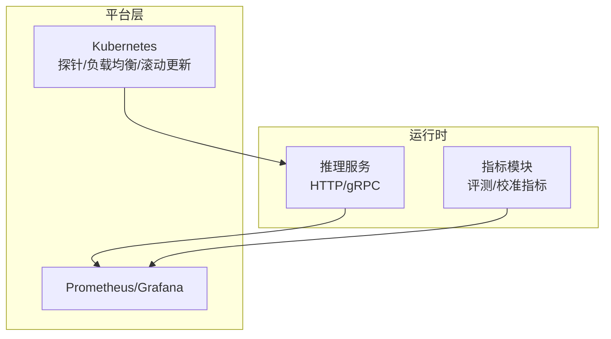
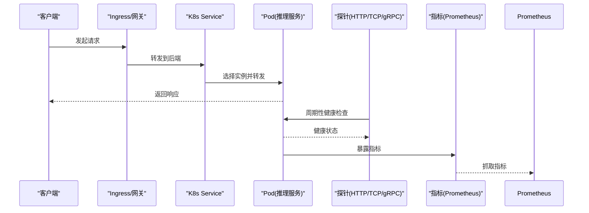
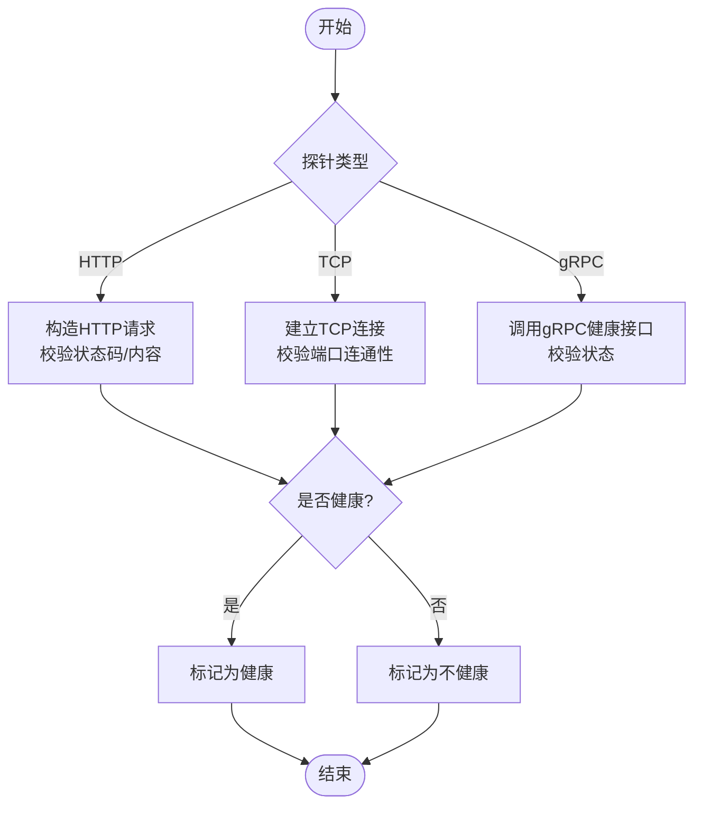
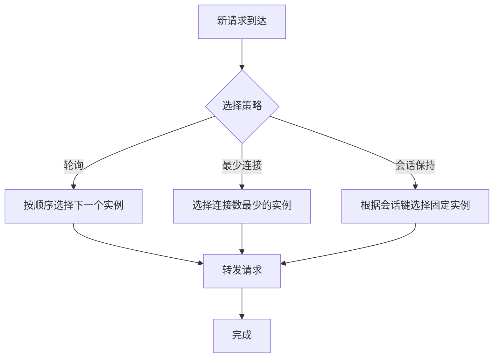
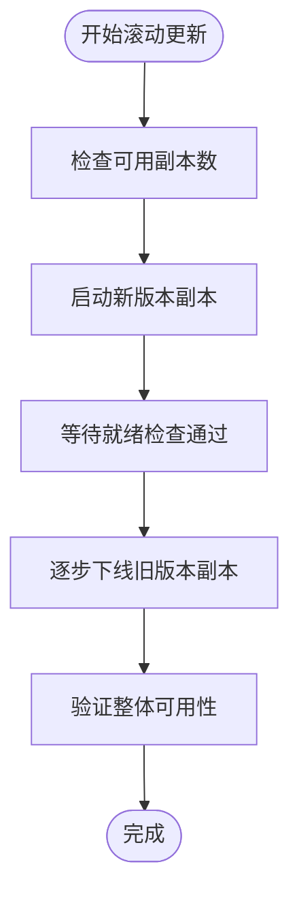
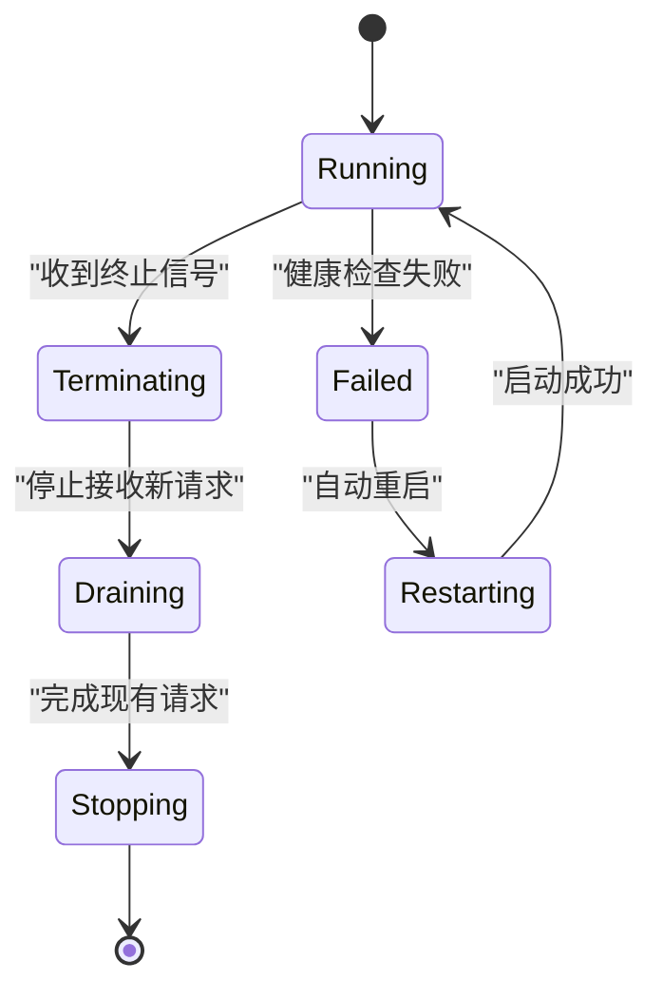
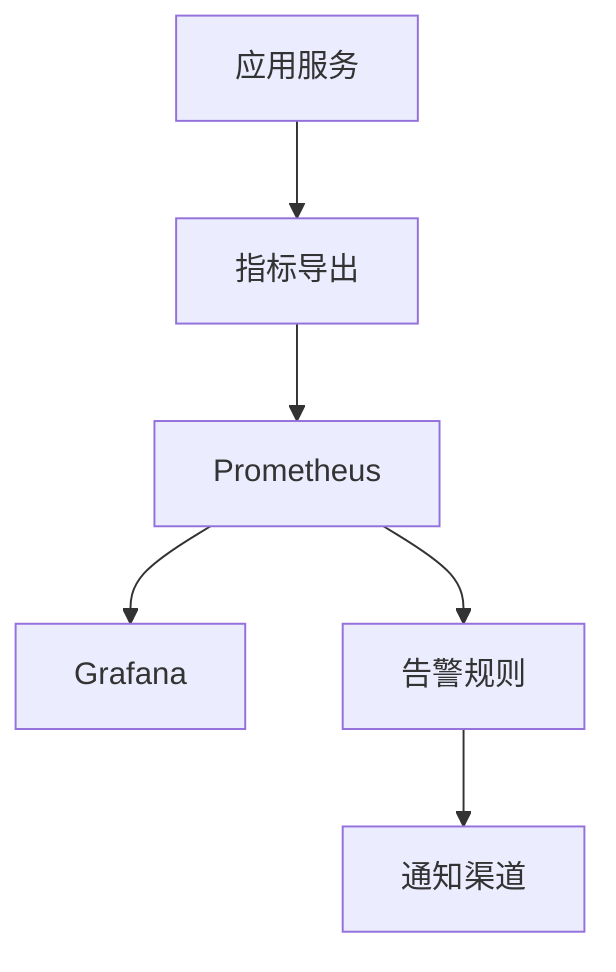
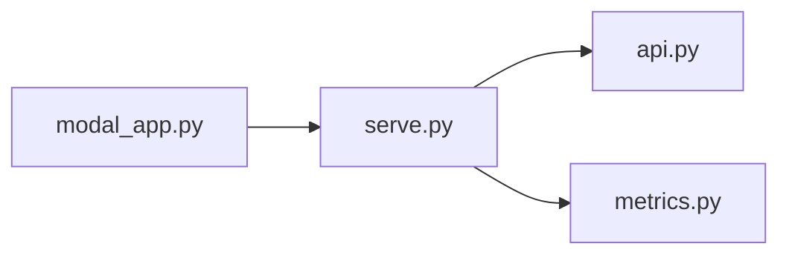

<cite>
**本文引用的文件**   
- [modal_app.py](file://modal_app.py)
- [serve.py](file://kev/serve.py)
- [api.py](file://kev/api.py)
- [metrics.py](file://kev/metrics.py)
- [PLAN.md](file://PLAN.md)
- [AGENTS.md](file://AGENTS.md)
</cite>

## 目录
1. [简介](#简介)
2. [项目结构](#项目结构)
3. [核心组件](#核心组件)
4. [架构总览](#架构总览)
5. [详细组件分析](#详细组件分析)
6. [依赖关系分析](#依赖关系分析)
7. [性能考量](#性能考量)
8. [故障排查指南](#故障排查指南)
9. [结论](#结论)
10. [附录](#附录)

## 简介
本文件围绕“服务发现与健康检查”主题，结合仓库中推理服务与观测相关代码，系统梳理以下能力：
- 探针配置：HTTP、TCP、gRPC 探针在 Kubernetes 中的使用方式与最佳实践（概念性说明）。
- 负载均衡策略：轮询、最少连接、会话保持的配置思路。
- 滚动更新机制：最大不可用数、最大 surge、就绪延迟等关键参数。
- 故障恢复策略：自动重启、优雅终止、状态恢复。
- 监控集成：Prometheus 指标导出、Grafana 仪表板、告警规则。
- 实际配置示例：Ingress、Service Mesh、分布式追踪的落地建议。

需要特别说明的是：该仓库主要聚焦模型训练、评估与服务化入口，并未内置自定义健康检查端点或负载均衡实现；因此，关于探针、负载均衡与滚动更新的细节以通用云原生实践为主，并结合仓库内服务入口与指标模块进行对照说明。

## 项目结构
从服务化与可观测性角度，仓库中与运行期相关的核心位置包括：
- 推理服务入口：用于暴露 HTTP/gRPC 接口，承载请求处理。
- 指标模块：提供评测与校准相关的指标计算逻辑，可作为扩展 Prometheus 指标的参考。
- 部署与运行脚本：负责启动、调度与观测任务。

[本图为概念图，不直接映射具体源码文件]

## 核心组件
- 推理服务入口
  - serve.py：定义推理服务的启动与运行流程，是对外暴露能力的入口。
  - api.py：定义 API 路由与请求处理逻辑，通常对应 HTTP 接口。
- 指标与观测
  - metrics.py：包含评测与校准相关的指标计算逻辑，可作为扩展 Prometheus 指标的基础。
- 部署与运行
  - modal_app.py：封装 Modal 平台的运行入口，负责试验、探测与基准测试等任务的编排。

**章节来源**
- [serve.py](file://kev/serve.py)
- [api.py](file://kev/api.py)
- [metrics.py:387-387](file://kev/metrics.py#L387-L387)
- [modal_app.py](file://modal_app.py)

## 架构总览
下图展示服务发现与健康检查在典型云原生环境中的交互关系，以及本仓库中服务与指标模块如何接入平台能力。

[本图为概念图，不直接映射具体源码文件]

## 详细组件分析

### 探针配置（HTTP / TCP / gRPC）
- HTTP 探针
  - 适用场景：Web 服务、REST API、健康页。
  - 关键点：路径、端口、超时、间隔、成功阈值、失败阈值。
  - 建议：将健康检查与业务负载解耦，避免影响主链路。
- TCP 探针
  - 适用场景：仅校验端口可达性，适用于非 HTTP 服务或快速失败检测。
  - 关键点：端口、超时、间隔。
- gRPC 探针
  - 适用场景：基于 gRPC 的服务，可使用 grpc_health_probe 或自定义 Health 服务。
  - 关键点：服务名、方法、超时、重试策略。

[本图为概念图，不直接映射具体源码文件]

### 负载均衡策略（轮询 / 最少连接 / 会话保持）
- 轮询（Round Robin）
  - 特点：均匀分发，简单可靠。
  - 适用：无状态服务、请求耗时相近的场景。
- 最少连接（Least Connections）
  - 特点：优先选择当前连接数最少的实例。
  - 适用：长连接、请求耗时差异大的场景。
- 会话保持（Sticky Session）
  - 特点：同一客户端的请求尽量落到同一实例。
  - 适用：有状态服务、本地缓存或会话绑定场景。

[本图为概念图，不直接映射具体源码文件]

### 滚动更新机制（最大不可用数 / 最大 surge / 就绪延迟）
- 最大不可用数（MaxUnavailable）
  - 作用：控制滚动过程中允许同时不可用的副本数量。
  - 建议：结合资源容量与流量峰值设置，避免雪崩。
- 最大 surge（MaxSurge）
  - 作用：控制滚动过程中允许临时超出的副本数量。
  - 建议：预留扩容空间，确保新版本先上线再下线旧版本。
- 就绪延迟（Readiness Delay）
  - 作用：在 Pod 启动后等待一段时间再进行就绪检查，避免误判。
  - 建议：根据冷启动时间、模型加载时间合理设置。

[本图为概念图，不直接映射具体源码文件]

### 故障恢复策略（自动重启 / 优雅终止 / 状态恢复）
- 自动重启
  - 触发条件：健康检查失败、进程崩溃、OOM 等。
  - 注意：避免频繁重启导致抖动，需配合退避与熔断。
- 优雅终止
  - 目标：在收到终止信号后，停止接收新请求，完成已有请求后再退出。
  - 建议：结合队列消费、连接池关闭、缓存刷新等步骤。
- 状态恢复
  - 目标：从持久化存储恢复上下文、会话、检查点等。
  - 建议：幂等初始化、断点续跑、一致性校验。

[本图为概念图，不直接映射具体源码文件]

### 监控集成（Prometheus / Grafana / 告警）
- Prometheus 指标导出
  - 建议暴露：请求量、延迟分布、错误率、资源使用、业务关键指标。
  - 指标命名：遵循统一前缀与维度规范，便于聚合与查询。
- Grafana 仪表板
  - 建议视图：概览、SLO/SLI、错误热点、慢请求、资源水位。
  - 联动：与告警规则联动，支持多环境对比。
- 告警规则
  - 建议阈值：错误率突增、延迟 P95/P99 升高、资源利用率过高、健康检查失败。
  - 通知渠道：邮件、IM、电话等多通道。

[本图为概念图，不直接映射具体源码文件]

### 实际配置示例（Ingress / Service Mesh / 分布式追踪）
- Ingress 配置
  - 要点：TLS 终止、路径路由、超时、限流、灰度发布。
  - 建议：结合健康检查与蓝绿/金丝雀发布。
- Service Mesh 集成
  - 要点：mTLS、流量镜像、熔断、重试、超时、链路追踪注入。
  - 建议：统一治理策略，集中式可观测。
- 分布式追踪
  - 要点：TraceID 透传、Span 粒度、采样策略、可视化。
  - 建议：与日志、指标关联，形成全链路可观测。

[本节为概念性说明，不直接引用具体源码文件]

## 依赖关系分析
- 服务入口与指标模块的耦合
  - serve.py 作为服务启动入口，通常会注册 api.py 定义的 API 路由。
  - metrics.py 提供指标计算逻辑，可在服务启动时注册为 Prometheus 指标。
- 运行脚本与平台
  - modal_app.py 负责在 Modal 平台上编排任务，可能间接调用服务入口与指标模块。

**图表来源**
- [serve.py](file://kev/serve.py)
- [api.py](file://kev/api.py)
- [metrics.py:387-387](file://kev/metrics.py#L387-L387)
- [modal_app.py](file://modal_app.py)

**章节来源**
- [serve.py](file://kev/serve.py)
- [api.py](file://kev/api.py)
- [metrics.py:387-387](file://kev/metrics.py#L387-L387)
- [modal_app.py](file://modal_app.py)

## 性能考量
- 健康检查频率与开销
  - 高频检查可降低故障检测延迟，但会增加额外负载；需平衡检测灵敏度与资源消耗。
- 滚动更新对吞吐的影响
  - MaxSurge 与 MaxUnavailable 的组合会影响瞬时吞吐与延迟；建议在低峰期执行滚动更新。
- 指标采集对性能的影响
  - 高基数指标与高频采集会加重 Prometheus 压力；建议降采样、去重与聚合。

[本节为通用指导，不直接分析具体文件]

## 故障排查指南
- 健康检查失败
  - 检查探针路径、端口、协议是否与 API 一致。
  - 查看服务日志与指标，定位异常根因。
- 滚动更新卡住
  - 检查就绪检查逻辑与延迟设置，确认新版本是否真正就绪。
  - 观察副本状态与事件，排查资源不足或依赖问题。
- 指标缺失或异常
  - 确认指标导出端点可达，Prometheus 抓取正常。
  - 检查指标命名与维度是否符合预期。

**章节来源**
- [AGENTS.md](file://AGENTS.md)
- [PLAN.md](file://PLAN.md)

## 结论
本仓库以服务化入口与指标模块为核心，结合云原生平台的能力，可实现完善的服务发现与健康检查体系。通过合理的探针配置、负载均衡策略、滚动更新参数与故障恢复机制，并配合 Prometheus/Grafana 监控与告警，能够保障服务的高可用与可观测性。对于 Ingress、Service Mesh 与分布式追踪，建议采用业界成熟方案并与平台治理能力对齐，形成统一的运维与观测体系。

## 附录
- 术语表
  - 探针：用于检测服务健康状态的机制。
  - 滚动更新：逐步替换服务实例的发布方式。
  - 就绪检查：判断服务是否准备好接收流量的检查。
  - 优雅终止：在服务退出前完成现有请求的处理。
  - 指标导出：将服务运行数据暴露给监控系统。

[本节为补充说明，不直接分析具体文件]