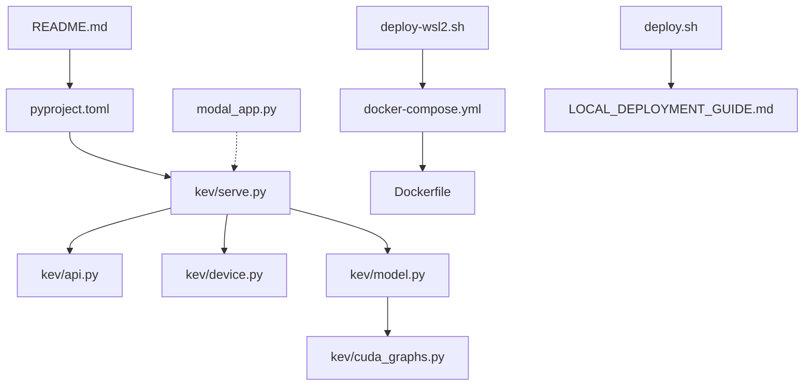
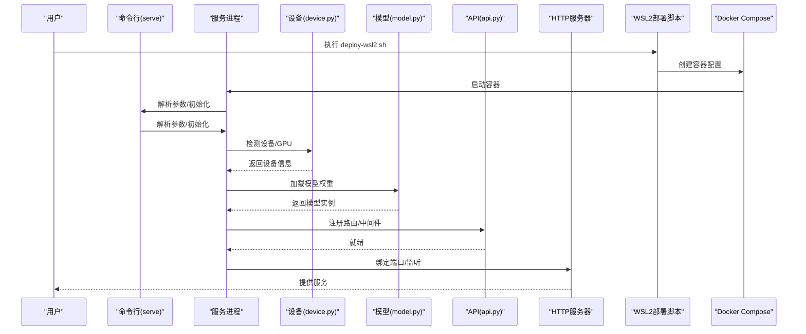
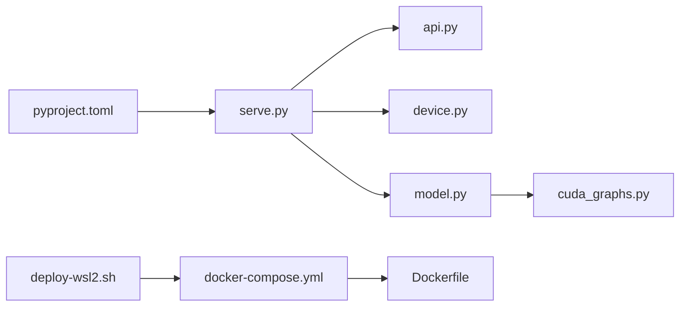

<cite>
**本文引用的文件**   
- [README.md](file://README.md)
- [pyproject.toml](file://pyproject.toml)
- [serve.py](file://kev/serve.py)
- [api.py](file://kev/api.py)
- [device.py](file://kev/device.py)
- [model.py](file://kev/model.py)
- [cuda_graphs.py](file://kev/cuda_graphs.py)
- [modal_app.py](file://modal_app.py)
- [deploy-wsl2.sh](file://deploy-wsl2.sh)
- [docker-compose.yml](file://docker-compose.yml)
- [Dockerfile](file://Dockerfile)
- [deploy.sh](file://deploy.sh)
- [LOCAL_DEPLOYMENT_GUIDE.md](file://LOCAL_DEPLOYMENT_GUIDE.md)
</cite>

## 更新摘要
**变更内容**   
- 新增 WSL2 自动化部署脚本支持
- 增强 Docker Compose 配置以支持 GPU 直通
- 简化 Dockerfile 构建流程
- 完善部署脚本和环境验证机制

## 目录
1. [简介](#简介)
2. [项目结构](#项目结构)
3. [核心组件](#核心组件)
4. [架构总览](#架构总览)
5. [详细组件分析](#详细组件分析)
6. [依赖关系分析](#依赖关系分析)
7. [性能考虑](#性能考虑)
8. [故障排除指南](#故障排除指南)
9. [结论](#结论)

## 简介
本指南面向希望在本地环境部署 Kev 服务的用户，涵盖环境准备、依赖安装、服务启动、网络与安全配置、常见问题与性能调优。Kev 提供 Python 包与命令行入口，支持通过 serve 子命令启动推理服务；同时包含 API 路由、设备与 CUDA 图优化等关键模块。**新增 WSL2 自动化部署脚本**为 Windows 用户提供了一键式部署体验。

## 项目结构
- 顶层 README 提供项目概述与使用说明。
- pyproject.toml 定义 Python 版本约束与依赖项，是本地环境准备的关键依据。
- kev/serve.py 提供服务启动逻辑（命令行参数、端口、模型加载等）。
- kev/api.py 暴露 HTTP API 路由与请求处理。
- kev/device.py 负责设备选择与 GPU/CPU 检测。
- kev/model.py 封装模型加载与推理流程。
- kev/cuda_graphs.py 提供 CUDA Graph 相关优化能力。
- modal_app.py 为云端 Modal 部署入口，非本地部署必需。
- **deploy-wsl2.sh** 新增的 WSL2 自动化部署脚本。
- **docker-compose.yml** 增强的容器编排配置。
- **Dockerfile** 简化的单阶段构建配置。



图表来源
- [README.md:1-50](file://README.md#L1-L50)
- [pyproject.toml:1-80](file://pyproject.toml#L1-L80)
- [serve.py:1-120](file://kev/serve.py#L1-L120)
- [api.py:1-120](file://kev/api.py#L1-L120)
- [device.py:1-80](file://kev/device.py#L1-L80)
- [model.py:1-120](file://kev/model.py#L1-L120)
- [cuda_graphs.py:1-80](file://kev/cuda_graphs.py#L1-L80)
- [modal_app.py:1-60](file://modal_app.py#L1-L60)
- [deploy-wsl2.sh:1-184](file://deploy-wsl2.sh#L1-L184)
- [docker-compose.yml:1-163](file://docker-compose.yml#L1-L163)
- [Dockerfile:1-47](file://Dockerfile#L1-L47)
- [deploy.sh:1-288](file://deploy.sh#L1-L288)
- [LOCAL_DEPLOYMENT_GUIDE.md:1-364](file://LOCAL_DEPLOYMENT_GUIDE.md#L1-L364)

章节来源
- [README.md:1-50](file://README.md#L1-L50)
- [pyproject.toml:1-80](file://pyproject.toml#L1-L80)

## 核心组件
- 服务启动器：serve.py 解析命令行参数、初始化日志、加载模型并启动 HTTP 服务。
- API 路由：api.py 定义接口路径、请求校验与响应格式。
- 设备管理：device.py 检测可用 GPU/CPU，设置环境变量与设备上下文。
- 模型封装：model.py 统一模型加载、缓存与推理调用。
- CUDA 图优化：cuda_graphs.py 在支持的硬件上启用 CUDA Graph 以提升吞吐。
- 依赖与环境：pyproject.toml 声明 Python 版本与第三方库依赖。
- **WSL2 部署脚本**：deploy-wsl2.sh 提供 Windows + WSL2 + Docker Desktop 的一键部署体验。
- **容器编排**：docker-compose.yml 定义生产与开发环境的容器配置。
- **镜像构建**：Dockerfile 提供优化的单阶段构建配置。

章节来源
- [serve.py:1-120](file://kev/serve.py#L1-L120)
- [api.py:1-120](file://kev/api.py#L1-L120)
- [device.py:1-80](file://kev/device.py#L1-L80)
- [model.py:1-120](file://kev/model.py#L1-L120)
- [cuda_graphs.py:1-80](file://kev/cuda_graphs.py#L1-L80)
- [pyproject.toml:1-80](file://pyproject.toml#L1-L80)
- [deploy-wsl2.sh:1-184](file://deploy-wsl2.sh#L1-L184)
- [docker-compose.yml:1-163](file://docker-compose.yml#L1-L163)
- [Dockerfile:1-47](file://Dockerfile#L1-L47)

## 架构总览
本地部署采用"命令行入口 + HTTP 服务"的架构：用户通过命令行启动服务，服务内部加载模型并对外暴露 API。设备层负责 GPU/CPU 选择，CUDA 图优化用于提升推理性能。**新增的 WSL2 部署脚本**为 Windows 用户提供了自动化的环境准备和容器编排。



图表来源
- [serve.py:1-120](file://kev/serve.py#L1-L120)
- [device.py:1-80](file://kev/device.py#L1-L80)
- [model.py:1-120](file://kev/model.py#L1-L120)
- [api.py:1-120](file://kev/api.py#L1-L120)
- [deploy-wsl2.sh:1-184](file://deploy-wsl2.sh#L1-L184)
- [docker-compose.yml:1-163](file://docker-compose.yml#L1-L163)

## 详细组件分析

### 环境与依赖准备
- Python 版本：以 pyproject.toml 中定义的最低版本为准（>=3.12,<3.14）。
- CUDA 驱动与 GPU：需安装与 PyTorch 匹配的 CUDA 驱动；若使用 CUDA 图优化，需确保 GPU 架构与驱动版本满足要求。
- 依赖安装：推荐使用 uv 或 pip 安装项目依赖；uv 可加速依赖解析与安装。
- 环境变量：根据 device.py 与 model.py 的行为，可能需要设置 CUDA_VISIBLE_DEVICES、PYTORCH_CUDA_ALLOC_CONF 等变量以控制显存分配与可见设备。

**新增 WSL2 部署方式**
- 前置条件检查：自动检测 Docker、NVIDIA 驱动、Docker Compose 等依赖。
- 环境验证：验证系统环境并显示详细的检查结果。
- 目录结构：自动创建 ~/kev-deploy 项目目录和必要的子目录。
- 配置文件生成：自动生成 .env 环境变量文件和 docker-compose.yml 配置。

建议步骤
- 确认 Python 版本满足 pyproject.toml 要求。
- 安装 CUDA 驱动与 cuDNN，验证 nvidia-smi 与 torch.cuda.is_available()。
- 在项目根目录执行依赖安装：
  - 使用 uv：uv sync 或 uv pip install -e .
  - 使用 pip：pip install -e .
- 如需限制可见 GPU，设置环境变量后重启服务。

**章节来源**
- [pyproject.toml:1-80](file://pyproject.toml#L1-L80)
- [device.py:1-80](file://kev/device.py#L1-L80)
- [model.py:1-120](file://kev/model.py#L1-L120)
- [deploy-wsl2.sh:13-35](file://deploy-wsl2.sh#L13-L35)

### WSL2 自动化部署流程

**新增功能**：deploy-wsl2.sh 脚本提供完整的 WSL2 环境部署体验

#### 环境验证与准备
脚本首先进行系统环境检查：
- Docker 安装验证
- NVIDIA GPU 检测（nvidia-smi）
- Docker Compose 可用性检查
- 显示详细的系统信息和检测结果

#### 项目目录结构创建
自动创建以下目录结构：
- ~/kev-deploy：主项目目录
- ~/kev-deploy/model-cache：模型权重缓存目录
- ~/kev-deploy/runs：运行日志和状态目录
- 克隆 kev 仓库到项目目录

#### 配置文件自动生成
生成两个关键配置文件：

**.env 环境变量文件**：
```bash
KEV_MODEL=jaredpalmer/kev-4b
KEV_DTYPE=bf16
KEV_PREFIX_CACHE=4
CUDA_VISIBLE_DEVICES=0
MAX_BATCH=64
KEV_CUDA_GRAPHS=1
KEV_FUSED=1
HOST=0.0.0.0
PORT=8008
```

**docker-compose.yml 容器编排配置**：
- 定义 kev-server 服务
- 配置 NVIDIA GPU 运行时支持
- 设置端口映射 8008:8008
- 挂载持久化卷（model-cache, runs）
- 配置健康检查和自动重启策略

#### 部署启动流程
```bash
# 在 PowerShell 或 CMD 中执行
cd 
wsl bash deploy-wsl2.sh

# 进入部署目录
cd ~/kev-deploy

# 启动服务
docker compose up -d --build

# 查看日志
docker compose logs -f kev-server
```

**章节来源**
- [deploy-wsl2.sh:1-184](file://deploy-wsl2.sh#L1-L184)
- [docker-compose.yml:1-163](file://docker-compose.yml#L1-L163)

### 服务启动流程
- 命令行入口：通过 serve 子命令启动服务，支持指定端口、模型路径、设备选择等参数。
- 配置文件：如存在 YAML/JSON 配置，可通过命令行参数传入路径；否则使用默认配置。
- 端口设置：默认端口可在命令行覆盖；未占用时服务将成功绑定。
- 启动顺序：解析参数 → 初始化日志 → 检测设备 → 加载模型 → 注册 API → 启动 HTTP 服务器。

常见参数（示例）
- --port 或 -p：指定监听端口
- --model-path 或 -m：模型权重目录或仓库标识
- --device 或 -d：选择 cpu/gpu 或具体 GPU ID
- --config：配置文件路径（如存在）

**章节来源**
- [serve.py:1-120](file://kev/serve.py#L1-L120)
- [api.py:1-120](file://kev/api.py#L1-L120)

### 网络配置
- 本地访问地址：默认监听 127.0.0.1；如需局域网访问，需在反向代理或防火墙层面开放端口。
- 防火墙设置：放行服务端口（例如 8000），仅允许受信任 IP 访问。
- HTTPS 证书：服务本身可能不内置 TLS；建议使用 Nginx/Traefik 等反向代理提供 HTTPS 与证书管理。

**WSL2 特定配置**
- 端口映射：Docker Compose 配置中将容器 8008 端口映射到宿主机 8008 端口
- 网络模式：使用 bridge 网络模式，便于容器间通信
- 跨平台访问：支持从 Windows 宿主直接访问 WSL2 中的服务

**章节来源**
- [serve.py:1-120](file://kev/serve.py#L1-L120)
- [docker-compose.yml:120-122](file://docker-compose.yml#L120-L122)

### 安全设置
- API 密钥管理：建议在反向代理层实现鉴权（如 Token 校验、OAuth），或在 API 层增加认证中间件。
- 访问控制：结合防火墙白名单与反向代理的 IP 白名单策略。
- 请求限制：通过反向代理或网关进行速率限制与连接数限制，防止滥用。

**WSL2 安全配置**
- 环境变量保护：通过 .env 文件管理敏感配置，避免硬编码
- 容器隔离：Docker 容器提供额外的安全隔离层
- 权限最小化：容器内运行最小权限的服务账户

**章节来源**
- [api.py:1-120](file://kev/api.py#L1-L120)
- [deploy-wsl2.sh:84-86](file://deploy-wsl2.sh#L84-L86)

### 性能调优
- CUDA 图优化：在支持的 GPU 上启用 cuda_graphs.py 提供的优化，减少内核启动开销，提升吞吐。
- 显存优化：调整 PYTORCH_CUDA_ALLOC_CONF 参数，避免碎片化；合理设置批大小与序列长度。
- 并发与线程：根据 CPU/GPU 资源调整工作进程与线程数，避免争用。
- I/O 与缓存：预热模型、复用会话，减少重复加载与初始化开销。

**WSL2 性能优化**
- GPU 直通：通过 NVIDIA Container Runtime 实现 GPU 直通，获得接近原生性能
- 内存管理：Docker Compose 配置中设置合理的内存限制（16G）
- 缓存优化：持久化模型缓存目录，避免重复下载
- 批处理调优：MAX_BATCH=64 适合大多数场景，可根据硬件调整

**章节来源**
- [cuda_graphs.py:1-80](file://kev/cuda_graphs.py#L1-L80)
- [model.py:1-120](file://kev/model.py#L1-L120)
- [deploy-wsl2.sh:76-78](file://deploy-wsl2.sh#L76-L78)
- [docker-compose.yml:34-36](file://docker-compose.yml#L34-L36)

## 依赖关系分析
- serve.py 依赖 api.py、device.py、model.py 完成服务装配。
- model.py 依赖 cuda_graphs.py 以启用 GPU 优化。
- pyproject.toml 统一管理 Python 版本与第三方依赖，确保环境一致性。
- **deploy-wsl2.sh 依赖 docker-compose.yml 和 Dockerfile 完成容器编排**。
- **docker-compose.yml 依赖 Dockerfile 定义容器构建过程**。



图表来源
- [serve.py:1-120](file://kev/serve.py#L1-L120)
- [api.py:1-120](file://kev/api.py#L1-L120)
- [device.py:1-80](file://kev/device.py#L1-L80)
- [model.py:1-120](file://kev/model.py#L1-L120)
- [cuda_graphs.py:1-80](file://kev/cuda_graphs.py#L1-L80)
- [pyproject.toml:1-80](file://pyproject.toml#L1-L80)
- [deploy-wsl2.sh:1-184](file://deploy-wsl2.sh#L1-L184)
- [docker-compose.yml:1-163](file://docker-compose.yml#L1-L163)
- [Dockerfile:1-47](file://Dockerfile#L1-L47)

章节来源
- [serve.py:1-120](file://kev/serve.py#L1-L120)
- [pyproject.toml:1-80](file://pyproject.toml#L1-L80)

## 性能考虑
- 硬件要求：不同模型规模对显存需求不同；小模型（如 0.8B/4B）通常可在较低显存设备上运行，大模型（如 9B/27B）需要更高显存与带宽。
- 推理优化：优先启用 CUDA 图优化；合理设置批大小、最大序列长度与温度等采样参数。
- 监控与指标：记录延迟、吞吐、显容占用与错误率，持续调优。

**WSL2 性能基准参考**
- L40S GPU：Kev-4B 短文本推理约 41.5ms，并发 64 客户端可达 51.4 req/s
- H100 GPU：Kev-4B 短文本推理约 18.1ms，并发 64 客户端可达 100.8 req/s
- CPU 模式：Kev-4B 短文本推理约 500ms，并发约 5 req/s

**章节来源**
- [LOCAL_DEPLOYMENT_GUIDE.md:300-308](file://LOCAL_DEPLOYMENT_GUIDE.md#L300-L308)

## 故障排除指南
- 无法检测到 GPU：检查 CUDA 驱动与 PyTorch 版本匹配；确认 nvidia-smi 正常；必要时设置 CUDA_VISIBLE_DEVICES。
- 显存不足：降低批大小、序列长度；启用内存优化选项；使用更小的模型或量化版本。
- 端口被占用：更换端口或关闭占用进程；检查系统防火墙规则。
- 模型加载失败：确认模型路径正确、权限充足；检查网络下载源是否可达。
- 服务启动后立即退出：查看日志输出，定位异常堆栈；逐步禁用优化功能（如 CUDA 图）以定位问题。

**WSL2 特定故障排除**
- Docker 未安装：安装 Docker Desktop for Windows 并确保 WSL2 后端已启用
- NVIDIA GPU 未识别：检查 NVIDIA 驱动安装，确认 nvidia-smi 在 WSL2 中可用
- 容器启动失败：查看 docker compose logs -f kev-server 获取详细错误信息
- 端口冲突：修改 docker-compose.yml 中的端口映射或使用 netstat 查找占用进程
- 模型下载缓慢：预下载模型到本地缓存目录，或通过代理加速下载

**章节来源**
- [device.py:1-80](file://kev/device.py#L1-L80)
- [model.py:1-120](file://kev/model.py#L1-L120)
- [serve.py:1-120](file://kev/serve.py#L1-L120)
- [LOCAL_DEPLOYMENT_GUIDE.md:236-297](file://LOCAL_DEPLOYMENT_GUIDE.md#L236-L297)

## 结论
通过遵循本指南，您可以在本地环境中快速搭建 Kev 服务：准备 Python 与 CUDA 环境，安装依赖，启动服务并进行网络与安全配置。**新增的 WSL2 自动化部署脚本**为 Windows 用户提供了开箱即用的部署体验，支持一键环境准备、容器编排和 GPU 直通。结合 CUDA 图优化与合理的参数调优，可获得稳定且高效的推理体验。如遇问题，请参考故障排除部分逐步排查。

**推荐部署流程**：
1. **首次部署**：使用 `deploy-wsl2.sh` 脚本一键初始化 WSL2 环境
2. **启动服务**：`docker compose up -d --build`
3. **验证功能**：测试 API 端点和服务健康状态
4. **日常运维**：查看日志、监控健康状态、定期更新镜像

**维护者**: Kev Team  
**最后更新**: 2026-10-02  
**License**: Apache-2.0