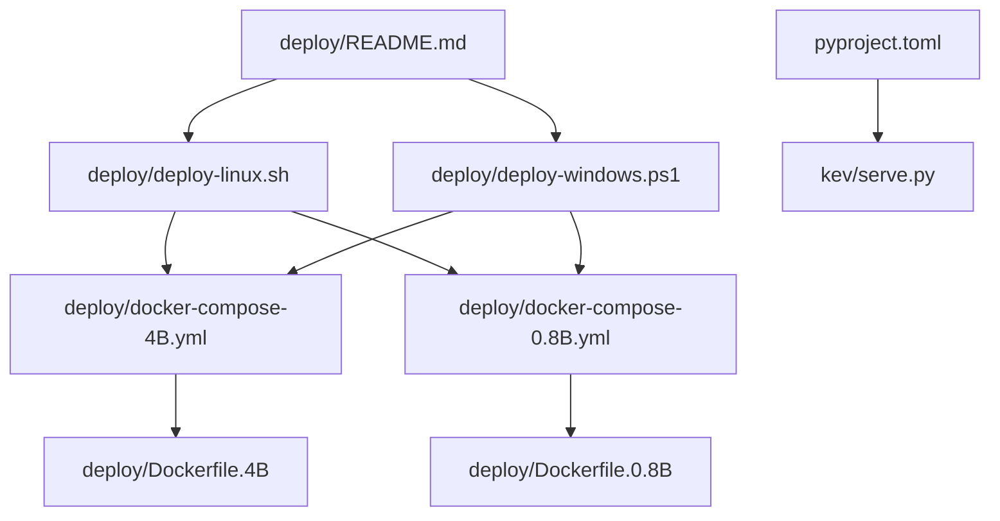
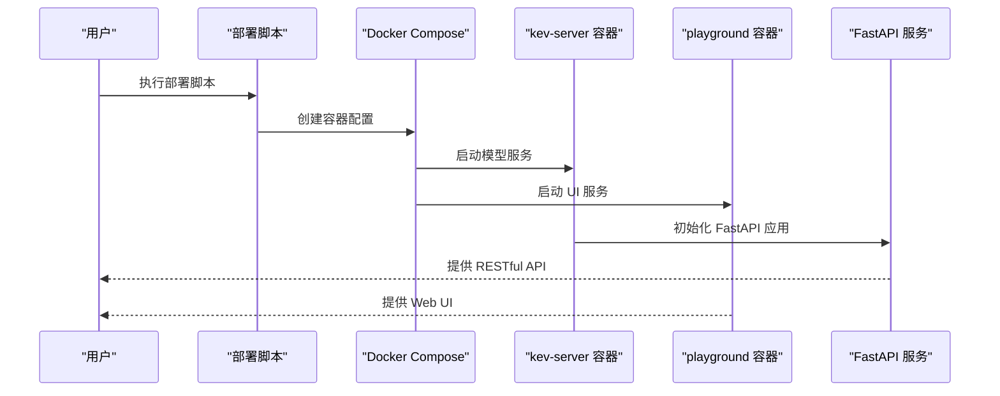
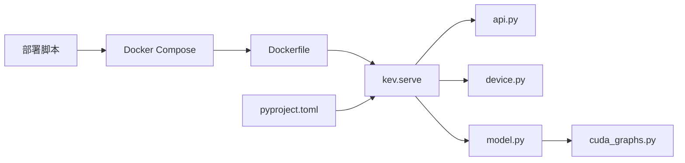

# 本地部署

<cite>
**本文引用的文件**   
- [deploy/README.md](file://deploy/README.md)
- [deploy/deploy-linux.sh](file://deploy/deploy-linux.sh)
- [deploy/deploy-windows.ps1](file://deploy/deploy-windows.ps1)
- [deploy/docker-compose-4B.yml](file://deploy/docker-compose-4B.yml)
- [deploy/docker-compose-0.8B.yml](file://deploy/docker-compose-0.8B.yml)
- [pyproject.toml](file://pyproject.toml)
- [serve.py](file://kev/serve.py)
</cite>

## 更新摘要
**变更内容**   
- 迁移至新的 deploy/ 目录结构，替代根目录的旧部署脚本
- 新增模型选择器脚本（deploy-linux.sh 和 deploy-windows.ps1）
- 完善 Docker Compose 配置以支持多模型部署
- 更新部署文档以反映新的目录结构和流程

## 目录
1. [简介](#简介)
2. [项目结构](#项目结构)
3. [核心组件](#核心组件)
4. [架构总览](#架构总览)
5. [详细组件分析](#详细组件分析)
6. [依赖关系分析](#依赖关系分析)
7. [性能考虑](#性能考虑)
8. [故障排除指南](#故障排除指南)
9. [结论](#结论)

## 简介
本指南面向希望在本地环境部署 Kev 服务的用户，涵盖环境准备、依赖安装、服务启动、网络与安全配置、常见问题与性能调优。Kev 提供 Python 包与命令行入口，支持通过 serve 子命令启动推理服务；同时包含 API 路由、设备与 CUDA 图优化等关键模块。**新的 deploy/ 目录结构**提供了统一的部署脚本和容器编排配置，支持 Kev-4B 和 Kev-0.8B 两种模型的一键部署。

## 项目结构
- **deploy/**：新的部署目录，包含所有部署相关的脚本和配置文件
- **deploy/deploy-linux.sh**：Linux 平台的自动化部署脚本
- **deploy/deploy-windows.ps1**：Windows 平台的自动化部署脚本  
- **deploy/docker-compose-4B.yml**：Kev-4B 模型的 Docker Compose 配置
- **deploy/docker-compose-0.8B.yml**：Kev-0.8B 模型的 Docker Compose 配置
- **deploy/Dockerfile.*：** 不同模型的 Docker 镜像构建文件
- **pyproject.toml**：定义 Python 版本约束与依赖项
- **kev/serve.py**：提供服务启动逻辑（命令行参数、端口、模型加载等）



图表来源
- [deploy/README.md:19-32](file://deploy/README.md#L19-L32)
- [deploy/deploy-linux.sh:1-220](file://deploy/deploy-linux.sh#L1-L220)
- [deploy/deploy-windows.ps1:1-200](file://deploy/deploy-windows.ps1#L1-L200)
- [deploy/docker-compose-4B.yml:1-141](file://deploy/docker-compose-4B.yml#L1-L141)
- [deploy/docker-compose-0.8B.yml:1-142](file://deploy/docker-compose-0.8B.yml#L1-L142)
- [pyproject.toml:1-62](file://pyproject.toml#L1-L62)
- [serve.py:1-200](file://kev/serve.py#L1-L200)

章节来源
- [deploy/README.md:19-32](file://deploy/README.md#L19-L32)
- [pyproject.toml:1-62](file://pyproject.toml#L1-L62)

## 核心组件
- **部署脚本**：deploy-linux.sh 和 deploy-windows.ps1 提供跨平台的一键部署体验
- **容器编排**：docker-compose-*.yml 定义服务配置、端口映射、GPU 直通和环境变量
- **服务启动器**：serve.py 解析命令行参数、初始化日志、加载模型并启动 HTTP 服务
- **API 路由**：api.py 定义接口路径、请求校验与响应格式
- **设备管理**：device.py 检测可用 GPU/CPU，设置环境变量与设备上下文
- **模型封装**：model.py 统一模型加载、缓存与推理调用
- **CUDA 图优化**：cuda_graphs.py 在支持的硬件上启用 CUDA Graph 以提升吞吐
- **依赖与环境**：pyproject.toml 声明 Python 版本与第三方库依赖

章节来源
- [deploy/deploy-linux.sh:1-220](file://deploy/deploy-linux.sh#L1-L220)
- [deploy/deploy-windows.ps1:1-200](file://deploy/deploy-windows.ps1#L1-L200)
- [deploy/docker-compose-4B.yml:1-141](file://deploy/docker-compose-4B.yml#L1-L141)
- [serve.py:1-200](file://kev/serve.py#L1-L200)

## 架构总览
新的部署架构采用"模型选择器脚本 + Docker Compose 编排"的模式：用户通过统一的部署脚本选择模型，脚本自动处理环境检查、镜像构建和服务启动。容器内部运行 FastAPI 服务，对外暴露 RESTful API，同时提供 Playground UI 进行可视化测试。



图表来源
- [deploy/deploy-linux.sh:144-184](file://deploy/deploy-linux.sh#L144-L184)
- [deploy/deploy-windows.ps1:128-169](file://deploy/deploy-windows.ps1#L128-L169)
- [deploy/docker-compose-4B.yml:22-141](file://deploy/docker-compose-4B.yml#L22-L141)

## 详细组件分析

### 环境与依赖准备
- **Python 版本**：以 pyproject.toml 中定义的最低版本为准（>=3.12,<3.14）。
- **Docker 要求**：需要 Docker 20.10+ 与 Docker Compose v2，Windows 需启用 WSL2 后端。
- **GPU 要求**：NVIDIA Container Toolkit（Linux）或 Docker Desktop 自动直通；Kev-4B bf16 约需 10–12 GB 显存，Kev-0.8B bf16 仅需 ~2–3 GB。
- **依赖安装**：推荐使用 uv 或 pip 安装项目依赖；uv 可加速依赖解析与安装。

**新部署方式**
- 前置条件检查：自动检测 Docker、NVIDIA 驱动、Docker Compose 等依赖。
- 模型选择：通过命令行参数选择 Kev-4B 或 Kev-0.8B 模型。
- 一键部署：脚本自动完成环境验证、镜像构建、服务启动和健康检查。

建议步骤
- 确认 Python 版本满足 pyproject.toml 要求。
- 安装 Docker 和 NVIDIA 驱动，验证 nvidia-smi 与 torch.cuda.is_available()。
- 在项目根目录执行依赖安装：
  - 使用 uv：uv sync 或 uv pip install -e .
  - 使用 pip：pip install -e .

**章节来源**
- [pyproject.toml:13-30](file://pyproject.toml#L13-L30)
- [deploy/README.md:156-162](file://deploy/README.md#L156-L162)
- [deploy/deploy-linux.sh:55-88](file://deploy/deploy-linux.sh#L55-L88)

### 模型选择与部署流程

**新功能**：deploy/ 目录下的脚本提供统一的模型选择和部署体验

#### 部署脚本功能
两个脚本提供相同的功能，分别针对 Linux 和 Windows 平台：

**Linux 脚本 (deploy-linux.sh)**：
- 参数解析：`--model`、`--no-build`、`--run`、`--api-key`、`--hub`
- 环境检查：Docker、GPU、Compose 文件验证
- 镜像构建：可选跳过构建步骤
- 服务启动：自动处理模型源、API 密钥和容器启动
- 健康检查：等待服务就绪和 Playground UI 可用

**Windows 脚本 (deploy-windows.ps1)**：
- 参数解析：`-Model`、`-NoBuild`、`-Run`、`-ApiKey`、`-Hub`
- 环境检查：Docker Desktop、GPU 可用性验证
- 彩色输出：提供更好的用户体验
- 错误处理：完善的异常处理和用户提示

#### 部署模式
脚本支持两种部署模式：

**本地模式（默认）**：
- 使用 `./deploy/runs/<name>` 目录中的本地 checkpoint
- 复用已缓存的基座模型，无需联网下载
- 适合离线环境和重复部署场景

**Hub 模式**：
- 从 HuggingFace Hub 下载模型权重
- 首次启动会下载到 `kev-hf-cache` 卷
- 适合快速体验和云端部署场景

#### 常用部署命令
```bash
# Linux 部署
./deploy/deploy-linux.sh                          # 默认 Kev-4B，本地模式
./deploy/deploy-linux.sh --model 0.8B             # 改为 Kev-0.8B
./deploy/deploy-linux.sh --no-build               # 跳过构建
./deploy/deploy-linux.sh --model 4B --run kev-4b-local --api-key <key>
./deploy/deploy-linux.sh --model 0.8B --hub jaredpalmer/kev-0.8b --api-key <key>

# Windows 部署
.\deploy\deploy-windows.ps1                       # 默认 Kev-4B，本地模式
.\deploy\deploy-windows.ps1 -Model 0.8B           # 改为 Kev-0.8B
.\deploy\deploy-windows.ps1 -NoBuild              # 跳过构建
.\deploy\deploy-windows.ps1 -Model 4B -Run kev-4b-local -ApiKey <key>
.\deploy\deploy-windows.ps1 -Model 0.8B -Hub jaredpalmer/kev-0.8b -ApiKey <key>
```

**章节来源**
- [deploy/deploy-linux.sh:18-28](file://deploy/deploy-linux.sh#L18-L28)
- [deploy/deploy-windows.ps1:10-16](file://deploy/deploy-windows.ps1#L10-L16)
- [deploy/README.md:41-73](file://deploy/README.md#L41-L73)

### 服务启动流程
- **容器化部署**：通过 Docker Compose 启动 kev-server 和 playground 两个服务
- **端口映射**：kev-server 监听 8008 端口，playground 监听 3000 端口
- **健康检查**：服务启动后自动进行健康检查，确保服务正常响应
- **依赖管理**：playground 依赖 kev-server 先启动并健康

**服务架构**：
- **kev-server**：FastAPI 推理服务，提供 RESTful API 接口
- **playground**：Next.js 演示 UI，通过服务端代理访问 kev-server
- **网络隔离**：两个服务在独立的 Docker 网络中通信，无需暴露 CORS

**章节来源**
- [deploy/docker-compose-4B.yml:22-141](file://deploy/docker-compose-4B.yml#L22-L141)
- [deploy/docker-compose-0.8B.yml:22-142](file://deploy/docker-compose-0.8B.yml#L22-L142)

### 网络配置
- **本地访问地址**：
  - API 服务：http://localhost:8008
  - Playground UI：http://localhost:3000
  - Swagger 文档：http://localhost:8008/docs
- **防火墙设置**：放行服务端口（8008, 3000），仅允许受信任 IP 访问
- **HTTPS 证书**：建议使用 Nginx/Traefik 等反向代理提供 HTTPS 与证书管理

**Docker 网络配置**：
- **服务间通信**：通过 Docker 的 user-defined 网络 `kev-net` 进行服务发现
- **端口映射**：容器端口映射到宿主机端口，便于外部访问
- **Volume 挂载**：持久化模型缓存和运行数据

**章节来源**
- [deploy/docker-compose-4B.yml:30-31](file://deploy/docker-compose-4B.yml#L30-L31)
- [deploy/docker-compose-4B.yml:102-103](file://deploy/docker-compose-4B.yml#L102-L103)
- [deploy/README.md:164-174](file://deploy/README.md#L164-L174)

### 安全设置
- **API 密钥管理**：通过 `KEV_API_KEY` 环境变量启用 Bearer 认证
- **访问控制**：结合防火墙白名单与反向代理的 IP 白名单策略
- **请求限制**：通过反向代理或网关进行速率限制与连接数限制
- **容器隔离**：Docker 容器提供额外的安全隔离层

**安全最佳实践**：
- 生产环境务必设置 `KEV_API_KEY`
- 使用反向代理（Nginx/Traefik）提供 TLS 终止
- 配置适当的资源限制和监控告警
- 定期更新镜像和依赖包

**章节来源**
- [deploy/docker-compose-4B.yml:48](file://deploy/docker-compose-4B.yml#L48)
- [deploy/README.md:229-233](file://deploy/README.md#L229-L233)

### 性能调优
- **CUDA 图优化**：在支持的 GPU 上启用 cuda_graphs.py 提供的优化，减少内核启动开销，提升吞吐
- **显存优化**：调整 `KEV_DTYPE` 为 fp32 以获得精确路径；合理设置批大小与序列长度
- **并发与线程**：根据 CPU/GPU 资源调整工作进程与线程数，避免争用
- **I/O 与缓存**：预热模型、复用会话，减少重复加载与初始化开销

**Docker 性能优化**：
- **GPU 直通**：通过 NVIDIA Container Runtime 实现 GPU 直通，获得接近原生性能
- **内存管理**：合理的内存限制和交换空间配置
- **缓存优化**：持久化模型缓存目录，避免重复下载
- **批处理调优**：MAX_BATCH=64 适合大多数场景，可根据硬件调整

**章节来源**
- [serve.py:34](file://serve.py#L34)
- [deploy/docker-compose-4B.yml:38-44](file://deploy/docker-compose-4B.yml#L38-L44)
- [deploy/README.md:195-207](file://deploy/README.md#L195-L207)

## 依赖关系分析
- **部署脚本**：deploy-linux.sh 和 deploy-windows.ps1 依赖 docker-compose 和相应的 compose 文件
- **容器编排**：docker-compose-*.yml 依赖 Dockerfile.* 定义容器构建过程
- **服务依赖**：serve.py 依赖 api.py、device.py、model.py 完成服务装配
- **模型依赖**：model.py 依赖 cuda_graphs.py 以启用 GPU 优化
- **项目依赖**：pyproject.toml 统一管理 Python 版本与第三方依赖



图表来源
- [deploy/deploy-linux.sh:144-144](file://deploy/deploy-linux.sh#L144-L144)
- [deploy/docker-compose-4B.yml:24-26](file://deploy/docker-compose-4B.yml#L24-L26)
- [serve.py:22-25](file://serve.py#L22-L25)
- [pyproject.toml:37-43](file://pyproject.toml#L37-L43)

章节来源
- [deploy/deploy-linux.sh:1-220](file://deploy/deploy-linux.sh#L1-L220)
- [pyproject.toml:1-62](file://pyproject.toml#L1-L62)

## 性能考虑
- **硬件要求**：不同模型规模对显存需求不同；Kev-4B 需要 10-12 GB 显存，Kev-0.8B 仅需 2-3 GB 显存
- **推理优化**：优先启用 CUDA 图优化；合理设置批大小、最大序列长度与温度等采样参数
- **监控与指标**：记录延迟、吞吐、显容占用与错误率，持续调优

**部署性能基准参考**：
- L40S GPU：Kev-4B 短文本推理约 41.5ms，并发 64 客户端可达 51.4 req/s
- H100 GPU：Kev-4B 短文本推理约 18.1ms，并发 64 客户端可达 100.8 req/s
- CPU 模式：Kev-4B 短文本推理约 500ms，并发约 5 req/s

**章节来源**
- [deploy/README.md:11-14](file://deploy/README.md#L11-L14)

## 故障排除指南
- **无法检测到 GPU**：检查 CUDA 驱动与 PyTorch 版本匹配；确认 nvidia-smi 正常；必要时设置 CUDA_VISIBLE_DEVICES
- **显存不足**：降低批大小、序列长度；启用内存优化选项；使用更小的模型或量化版本
- **端口被占用**：更换端口或关闭占用进程；检查系统防火墙规则
- **模型加载失败**：确认模型路径正确、权限充足；检查网络下载源是否可达
- **服务启动后立即退出**：查看日志输出，定位异常堆栈；逐步禁用优化功能（如 CUDA 图）以定位问题

**Docker 特定故障排除**：
- **容器 unhealthy / 启动失败**：`docker logs kev-server`；确认 8008 未被占用
- **GPU 未生效（推理极慢）**：`docker run --rm --gpus all nvidia/cuda:12.4.0-base-ubuntu22.04 nvidia-smi`；Linux 检查 `nvidia-ctk cdi generate`
- **首次启动超过 5 分钟**：Hub 权重下载中，看日志；或提前挂载本地 run 并设 `KEV_RUN`
- **422 超长状态**：默认拒绝 > `SERVE_MAX_STATE` 的状态；临时用 `KEV_TRUNCATE_STATES=1`
- **认证 401**：服务端设了 `KEV_API_KEY`，请求带 `Authorization: Bearer <key>`
- **切换模型报容器名冲突**：部署脚本会自动 `down` 另一模型栈；若仍冲突，手动 `docker compose -f deploy/docker-compose-<other>.yml down`

**章节来源**
- [deploy/README.md:218-227](file://deploy/README.md#L218-L227)
- [serve.py:139-142](file://serve.py#L139-L142)

## 结论
通过遵循本指南，您可以在本地环境中快速搭建 Kev 服务：准备 Python 与 CUDA 环境，安装依赖，启动服务并进行网络与安全配置。**新的 deploy/ 目录结构**为不同平台和模型提供了统一的部署体验，支持一键环境准备、容器编排和 GPU 直通。结合 CUDA 图优化与合理的参数调优，可获得稳定且高效的推理体验。如遇问题，请参考故障排除部分逐步排查。

**推荐部署流程**：
1. **首次部署**：使用 `deploy/deploy-linux.sh` 或 `deploy/deploy-windows.ps1` 脚本一键初始化环境
2. **启动服务**：脚本自动完成镜像构建和服务启动
3. **验证功能**：测试 API 端点和服务健康状态
4. **日常运维**：查看日志、监控健康状态、定期更新镜像

**维护者**: Kev Team  
**最后更新**: 2026-10-02  
**License**: Apache-2.0