<cite>
**本文引用的文件**   
- [README.md](file://README.md)
- [pyproject.toml](file://pyproject.toml)
- [serve.py](file://kev/serve.py)
- [api.py](file://kev/api.py)
- [metrics.py](file://kev/metrics.py)
- [benchmark.py](file://kev/benchmark.py)
- [device.py](file://kev/device.py)
- [modal_app.py](file://modal_app.py)
</cite>

## 目录
1. [简介](#简介)
2. [项目结构](#项目结构)
3. [核心组件](#核心组件)
4. [架构总览](#架构总览)
5. [详细组件分析](#详细组件分析)
6. [依赖关系分析](#依赖关系分析)
7. [性能与容量规划](#性能与容量规划)
8. [监控与告警](#监控与告警)
9. [日志收集与管理](#日志收集与管理)
10. [负载均衡与自动扩缩容](#负载均衡与自动扩缩容)
11. [安全加固](#安全加固)
12. [故障排查指南](#故障排查指南)
13. [结论](#结论)

## 简介
本指南面向在生产环境中部署和运行该项目的工程团队，围绕以下目标提供可操作的配置与实践：
- 负载均衡与反向代理、会话保持与健康检查
- 基于 CPU/GPU 使用率的自动扩缩容策略
- 监控指标定义、阈值与通知渠道
- 结构化日志格式、日志轮转与集中式存储
- 性能基准测试方法与容量规划建议
- 网络安全策略、访问控制与审计日志

本项目为模型推理与服务相关代码集合，包含服务入口、API 路由、指标采集、基准测试工具以及设备管理模块。生产部署通常以容器化方式运行，并通过反向代理暴露对外接口。

## 项目结构
仓库根目录包含核心 Python 包、示例与实验数据、评测脚本与工具等。与生产部署直接相关的代码主要位于 kev 子包中，包括服务启动、API 路由、指标与基准工具等。

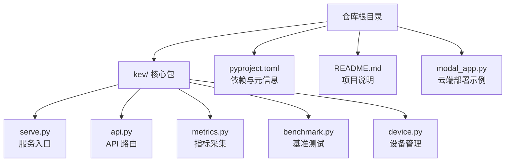

**图表来源**
- [serve.py:1-200](file://kev/serve.py#L1-L200)
- [api.py:1-200](file://kev/api.py#L1-L200)
- [metrics.py:1-200](file://kev/metrics.py#L1-L200)
- [benchmark.py:1-200](file://kev/benchmark.py#L1-L200)
- [device.py:1-200](file://kev/device.py#L1-L200)
- [pyproject.toml:1-200](file://pyproject.toml#L1-L200)
- [README.md:1-200](file://README.md#L1-L200)
- [modal_app.py:1-200](file://modal_app.py#L1-L200)

**章节来源**
- [README.md:1-200](file://README.md#L1-L200)
- [pyproject.toml:1-200](file://pyproject.toml#L1-L200)

## 核心组件
- 服务入口（serve.py）：负责进程启动、端口绑定、中间件注册与生命周期管理。
- API 路由（api.py）：定义对外 HTTP 接口、请求校验、响应结构与错误码。
- 指标采集（metrics.py）：暴露系统与应用关键指标，供监控系统抓取。
- 基准测试（benchmark.py）：提供吞吐、延迟与资源利用率评估方法。
- 设备管理（device.py）：封装 GPU/CPU 检测、显存管理与多卡调度逻辑。
- 依赖与打包（pyproject.toml）：声明运行时依赖、版本约束与构建配置。
- 云端部署示例（modal_app.py）：展示在云平台的容器化部署方式。

**章节来源**
- [serve.py:1-200](file://kev/serve.py#L1-L200)
- [api.py:1-200](file://kev/api.py#L1-L200)
- [metrics.py:1-200](file://kev/metrics.py#L1-L200)
- [benchmark.py:1-200](file://kev/benchmark.py#L1-L200)
- [device.py:1-200](file://kev/device.py#L1-L200)
- [pyproject.toml:1-200](file://pyproject.toml#L1-L200)
- [modal_app.py:1-200](file://modal_app.py#L1-L200)

## 架构总览
下图展示了生产环境中的典型部署拓扑：客户端通过反向代理进入服务集群，服务实例内部调用 API 路由，指标由监控系统拉取，日志经本地轮转后汇聚到集中式日志平台。

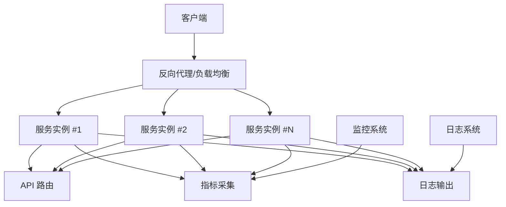

**图表来源**
- [serve.py:1-200](file://kev/serve.py#L1-L200)
- [api.py:1-200](file://kev/api.py#L1-L200)
- [metrics.py:1-200](file://kev/metrics.py#L1-L200)

## 详细组件分析

### 服务入口（serve.py）
- 职责：初始化应用、加载配置、注册中间件、启动 HTTP 服务器、优雅关闭。
- 关键点：
  - 端口与环境变量注入
  - 健康检查端点挂载
  - 并发与超时参数
  - 与指标与日志系统的集成

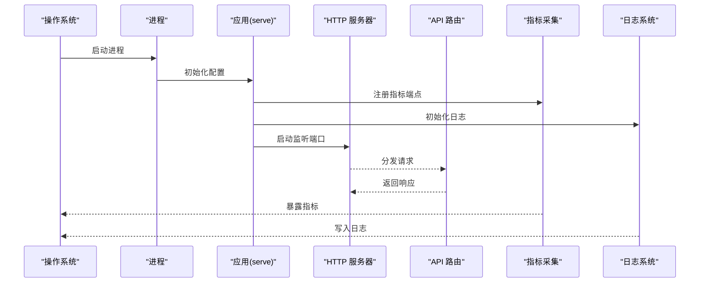

**图表来源**
- [serve.py:1-200](file://kev/serve.py#L1-L200)
- [api.py:1-200](file://kev/api.py#L1-L200)
- [metrics.py:1-200](file://kev/metrics.py#L1-L200)

**章节来源**
- [serve.py:1-200](file://kev/serve.py#L1-L200)

### API 路由（api.py）
- 职责：定义 REST/JSON 接口、参数校验、业务处理、错误码与重试策略。
- 关键点：
  - 输入校验与限流
  - 幂等性与缓存策略
  - 统一错误响应格式
  - 与指标与日志的埋点

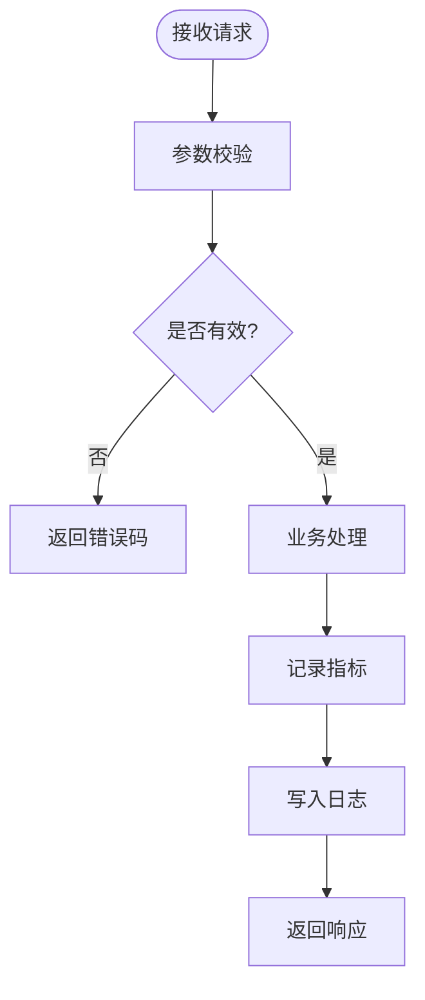

**图表来源**
- [api.py:1-200](file://kev/api.py#L1-L200)
- [metrics.py:1-200](file://kev/metrics.py#L1-L200)

**章节来源**
- [api.py:1-200](file://kev/api.py#L1-L200)

### 指标采集（metrics.py）
- 职责：暴露系统与应用指标，如 QPS、延迟分位、错误率、GPU 利用率、显存占用等。
- 关键点：
  - 指标命名规范与标签维度
  - 采样频率与聚合窗口
  - 与 Prometheus/Grafana 等监控栈对接

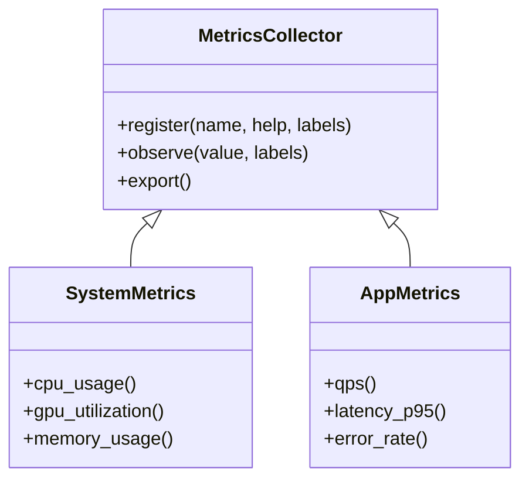

**图表来源**
- [metrics.py:1-200](file://kev/metrics.py#L1-L200)

**章节来源**
- [metrics.py:1-200](file://kev/metrics.py#L1-L200)

### 基准测试（benchmark.py）
- 职责：提供端到端压测脚本，测量吞吐、延迟与资源消耗，辅助容量规划。
- 关键点：
  - 并发度与负载曲线
  - 指标导出与结果汇总
  - 与设备管理模块联动

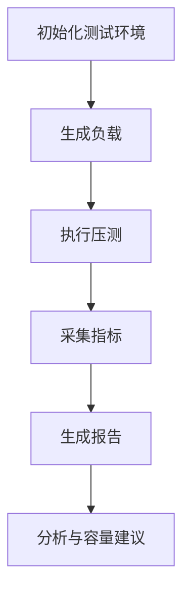

**图表来源**
- [benchmark.py:1-200](file://kev/benchmark.py#L1-L200)
- [device.py:1-200](file://kev/device.py#L1-L200)

**章节来源**
- [benchmark.py:1-200](file://kev/benchmark.py#L1-L200)

### 设备管理（device.py）
- 职责：检测可用 GPU/CPU、显存分配、多卡并行与资源隔离。
- 关键点：
  - 设备枚举与亲和性设置
  - 显存碎片整理与预热
  - 异常恢复与降级策略

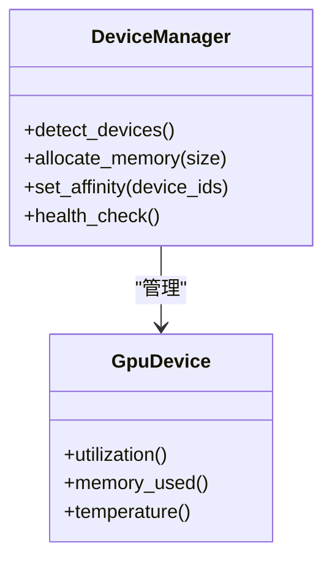

**图表来源**
- [device.py:1-200](file://kev/device.py#L1-L200)

**章节来源**
- [device.py:1-200](file://kev/device.py#L1-L200)

### 依赖与打包（pyproject.toml）
- 职责：声明运行时依赖、版本约束、构建命令与元信息。
- 关键点：
  - 依赖最小化与安全更新策略
  - 构建产物与镜像层优化
  - 环境变量与配置注入

**章节来源**
- [pyproject.toml:1-200](file://pyproject.toml#L1-L200)

### 云端部署示例（modal_app.py）
- 职责：展示在云平台上的容器化部署方式，包括资源限制、扩缩容与网络暴露。
- 关键点：
  - 容器镜像与启动命令
  - 资源配额与弹性伸缩
  - 外部访问与域名绑定

**章节来源**
- [modal_app.py:1-200](file://modal_app.py#L1-L200)

## 依赖关系分析
- 服务入口依赖 API 路由、指标采集与日志系统。
- API 路由依赖业务逻辑与指标埋点。
- 指标采集依赖系统与应用程序状态。
- 基准测试依赖设备管理与指标导出。
- 设备管理依赖底层驱动与系统库。

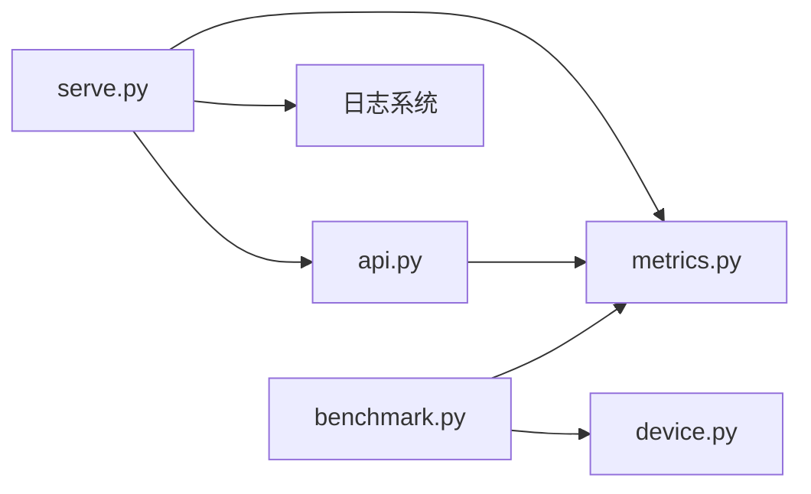

**图表来源**
- [serve.py:1-200](file://kev/serve.py#L1-L200)
- [api.py:1-200](file://kev/api.py#L1-L200)
- [metrics.py:1-200](file://kev/metrics.py#L1-L200)
- [benchmark.py:1-200](file://kev/benchmark.py#L1-L200)
- [device.py:1-200](file://kev/device.py#L1-L200)

**章节来源**
- [serve.py:1-200](file://kev/serve.py#L1-L200)
- [api.py:1-200](file://kev/api.py#L1-L200)
- [metrics.py:1-200](file://kev/metrics.py#L1-L200)
- [benchmark.py:1-200](file://kev/benchmark.py#L1-L200)
- [device.py:1-200](file://kev/device.py#L1-L200)

## 性能与容量规划
- 基准测试方法：
  - 使用基准测试模块构造不同并发与负载曲线，测量 QPS、P95/P99 延迟与错误率。
  - 结合设备管理模块观察 GPU 利用率、显存占用与温度，识别瓶颈。
  - 将指标导出至监控系统，形成趋势图与容量基线。
- 容量规划建议：
  - 根据峰值 QPS 与 P95 延迟目标确定单实例能力，再按冗余与灰度需求计算实例数。
  - 预留 20%-30% 资源缓冲以应对突发流量与抖动。
  - 定期复测并更新容量模型，纳入变更评审流程。

[本节为通用指导，不直接分析具体文件]

## 监控与告警
- 关键指标定义：
  - 系统级：CPU 使用率、内存使用率、磁盘 I/O、网络吞吐。
  - 应用级：QPS、延迟分位、错误率、队列长度、缓存命中率。
  - 设备级：GPU 利用率、显存占用、温度、功耗。
- 阈值设置：
  - 基于历史基线与 SLI/SLO 设定多级阈值（警告、严重）。
  - 对突发与长尾延迟采用滑动窗口与百分位统计。
- 通知渠道：
  - 邮件、IM、电话与工单系统集成。
  - 告警收敛与去重，避免告警风暴。

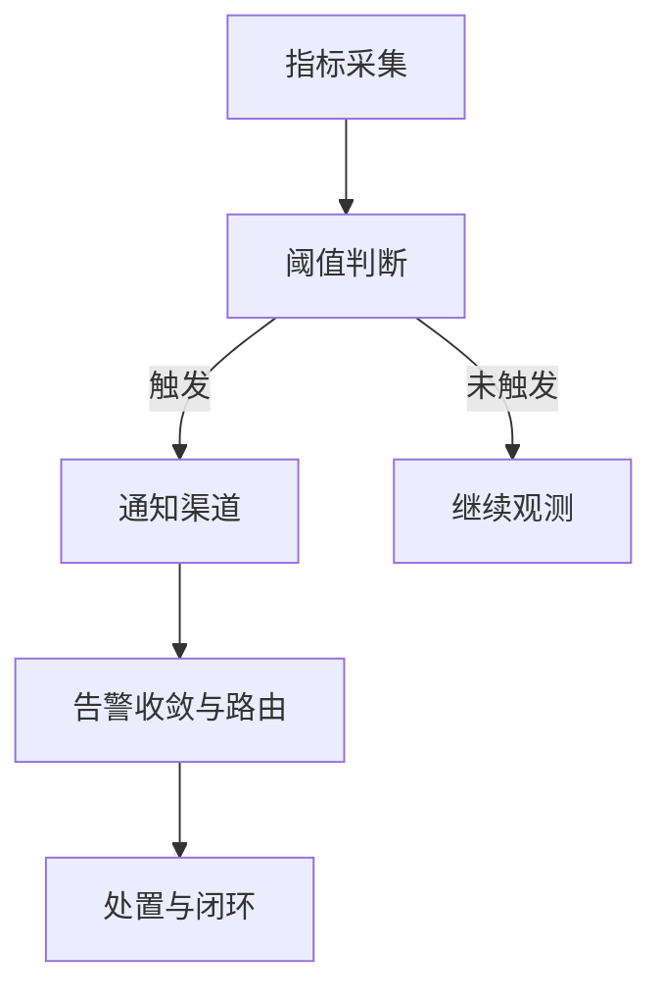

**图表来源**
- [metrics.py:1-200](file://kev/metrics.py#L1-L200)

**章节来源**
- [metrics.py:1-200](file://kev/metrics.py#L1-L200)

## 日志收集与管理
- 结构化日志格式：
  - 统一字段：时间戳、级别、服务名、实例 ID、请求 ID、用户标识、操作、结果、耗时、错误码。
  - JSON 或键值对格式，便于解析与检索。
- 日志轮转：
  - 按大小与时间双维度轮转，保留周期与压缩策略。
  - 异步写入与背压控制，避免阻塞主流程。
- 集中式存储：
  - 通过日志采集器转发至集中式平台，建立索引与查询视图。
  - 敏感信息脱敏与访问权限控制。

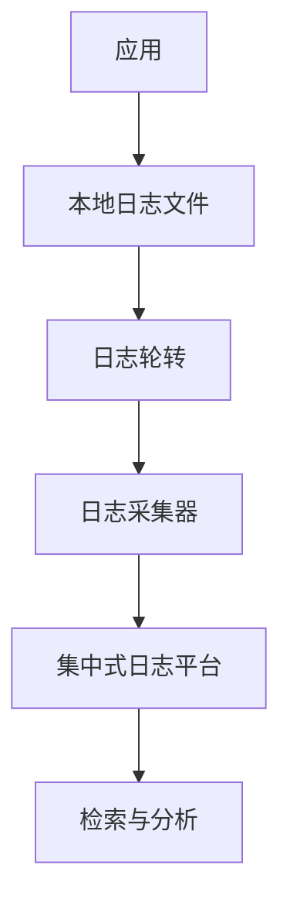

[本节为通用指导，不直接分析具体文件]

## 负载均衡与自动扩缩容
- 反向代理设置：
  - 启用 HTTPS 终止、TLS 证书管理、请求头重写与路径映射。
  - 连接池与超时配置，确保高并发下的稳定性。
- 会话保持：
  - 基于 Cookie 或 IP 哈希的粘性会话，保证状态一致性。
  - 无状态服务优先设计，必要时使用外部会话存储。
- 健康检查：
  - 存活探针与就绪探针，结合业务语义进行深度检查。
  - 失败阈值与恢复阈值分离，避免频繁上下线。
- 自动扩缩容策略：
  - 基于 CPU/GPU 使用率与队列长度的 HPA/VPA 规则。
  - 最小/最大实例数、冷却时间与步进缩放。
  - 滚动更新与蓝绿/金丝雀发布，降低风险。

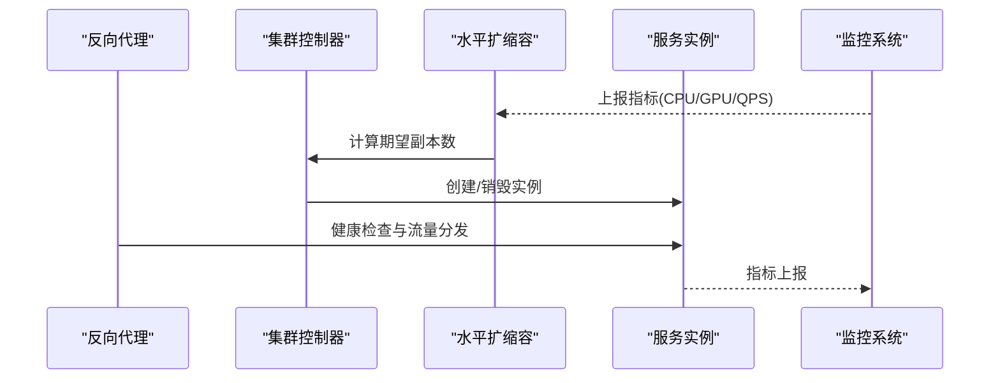

**图表来源**
- [serve.py:1-200](file://kev/serve.py#L1-L200)
- [metrics.py:1-200](file://kev/metrics.py#L1-L200)

**章节来源**
- [serve.py:1-200](file://kev/serve.py#L1-L200)
- [metrics.py:1-200](file://kev/metrics.py#L1-L200)

## 安全加固
- 网络安全策略：
  - 仅开放必要端口，使用最小权限原则。
  - 内网通信加密与双向认证。
- 访问控制列表：
  - 基于角色与资源的细粒度授权。
  - API 网关层的鉴权与限流。
- 审计日志：
  - 记录所有管理面操作与敏感数据访问。
  - 防篡改与合规留存。

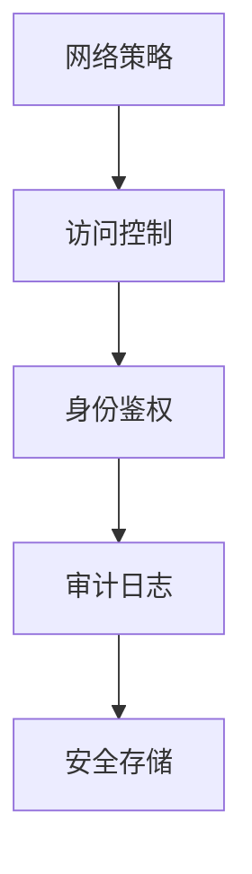

[本节为通用指导，不直接分析具体文件]

## 故障排查指南
- 常见问题定位：
  - 服务无法启动：检查端口占用、依赖缺失与配置错误。
  - 高延迟与低吞吐：查看指标分位、GPU 利用率与显存占用。
  - 健康检查失败：确认业务就绪条件与依赖服务状态。
- 诊断步骤：
  - 从反向代理日志入手，定位请求链路。
  - 结合指标与日志交叉验证，缩小问题范围。
  - 使用基准测试复现问题，验证修复效果。

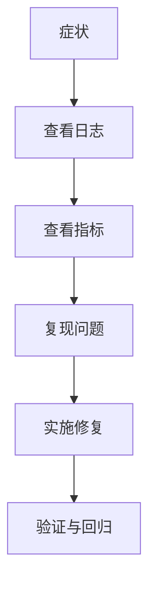

[本节为通用指导，不直接分析具体文件]

## 结论
通过将服务入口、API 路由、指标采集、基准测试与设备管理模块纳入统一的运维体系，并结合反向代理、健康检查、自动扩缩容与集中式日志，可实现稳定、可观测且可扩展的生产环境。建议在上线前完成容量规划与压测，持续迭代监控阈值与告警策略，确保安全与合规。