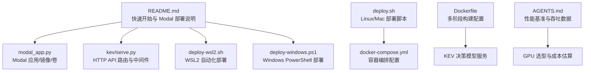
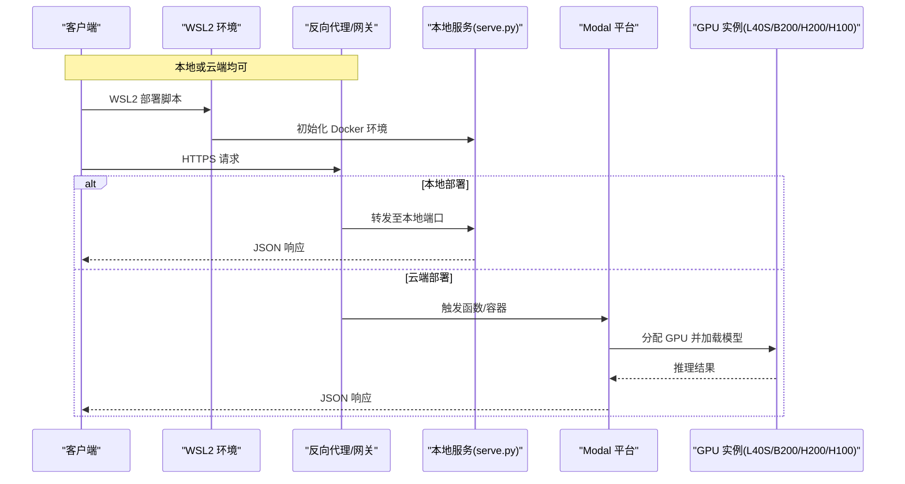
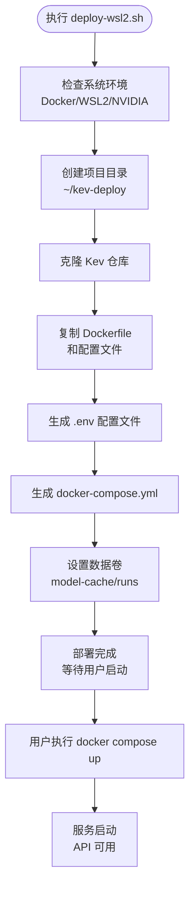
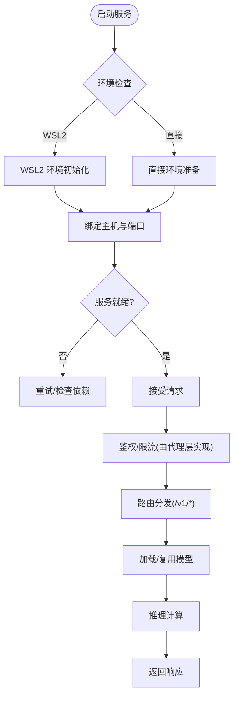
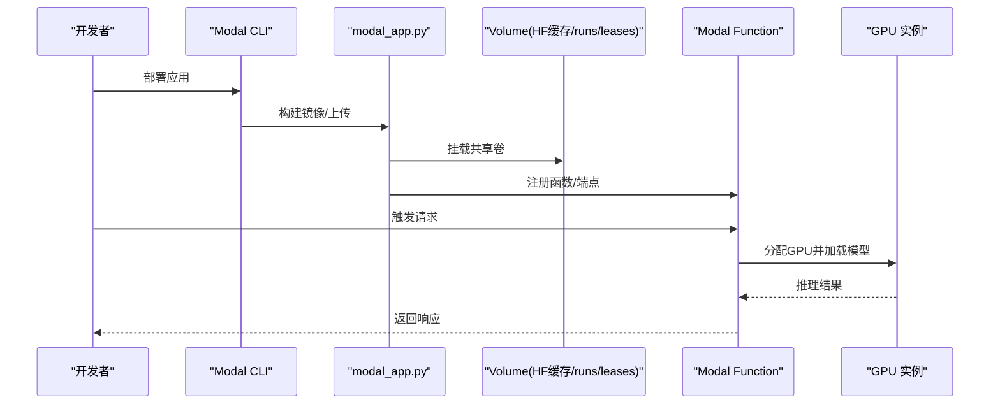
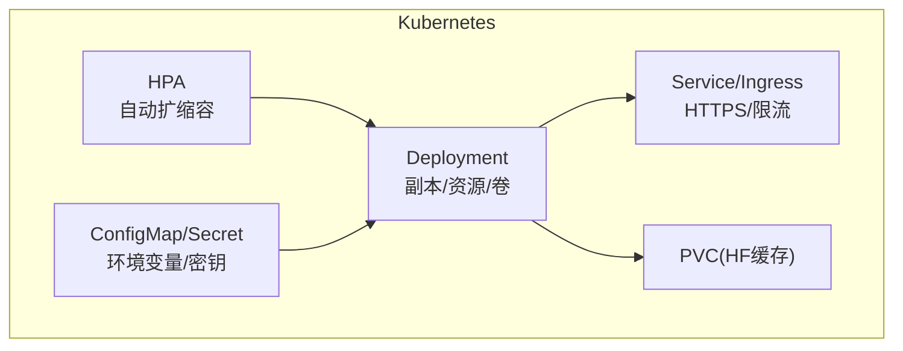
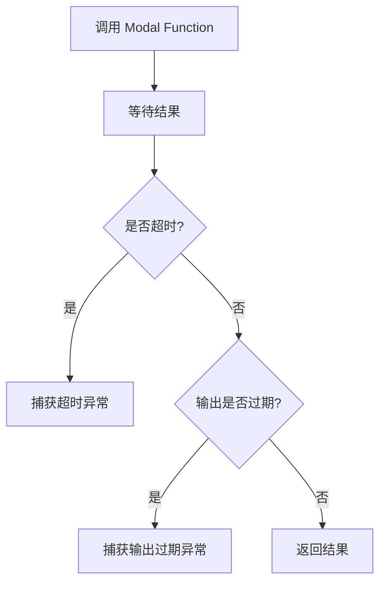
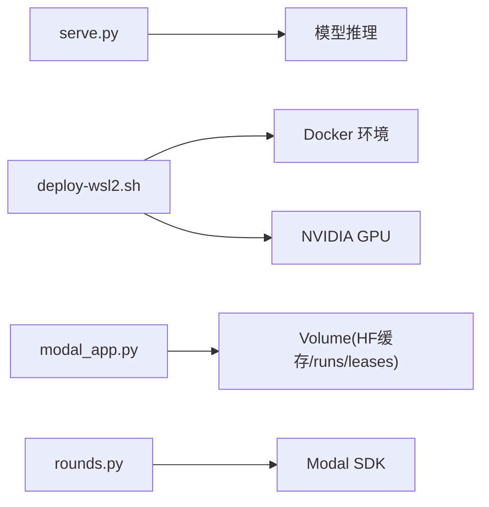

# 部署指南

<cite>
**本文引用的文件**   
- [README.md](file://README.md)
- [modal_app.py](file://modal_app.py)
- [serve.py](file://kev/serve.py)
- [rounds.py](file://kev/rounds.py)
- [AGENTS.md](file://AGENTS.md)
- [deploy-wsl2.sh](file://deploy-wsl2.sh)
- [deploy-windows.ps1](file://deploy-windows.ps1)
- [deploy.sh](file://deploy.sh)
- [docker-compose.yml](file://docker-compose.yml)
- [Dockerfile](file://Dockerfile)
- [LOCAL_DEPLOYMENT_GUIDE.md](file://LOCAL_DEPLOYMENT_GUIDE.md)
- [DOCKER_DEPLOYMENT_GUIDE.md](file://DOCKER_DEPLOYMENT_GUIDE.md)
- [DEPLOYMENT_README.md](file://DEPLOYMENT_README.md)
</cite>

## 更新摘要
**所做更改**
- 新增 WSL2 特定自动化部署解决方案章节
- 更新本地部署部分以包含 Windows 用户的一键部署选项
- 添加 Docker Desktop 集成和 GPU 加速支持说明
- 扩展生产就绪配置选项
- 更新故障排除指南以涵盖新的部署方式

## 目录
1. [简介](#简介)
2. [项目结构](#项目结构)
3. [核心组件](#核心组件)
4. [架构总览](#架构总览)
5. [详细组件分析](#详细组件分析)
6. [依赖关系分析](#依赖关系分析)
7. [性能与成本](#性能与成本)
8. [生产环境配置](#生产环境配置)
9. [故障排除](#故障排除)
10. [结论](#结论)

## 简介
本指南面向希望将 Kev 服务化并投入生产的团队，覆盖本地部署、云端（Modal）部署、容器化与编排、生产高可用与安全、监控日志、模型规模与硬件选型、HTTPS 与访问控制、以及故障排除与性能调优。文档以仓库内现有实现为依据，重点围绕以下入口：
- **WSL2 一键部署**：专为 Windows 用户优化的自动化部署脚本
- **本地推理服务**：通过 Python 包内的 serve 模块启动 HTTP API
- **云端推理服务**：通过 Modal 应用一键部署 HTTPS 端点，支持按模型自动选择 GPU 资源
- **训练/实验流程中的 Modal 调用**：在 rounds 流程中异步调用 Modal Function

## 项目结构
Kev 的部署相关代码主要分布在以下位置：
- 根级 README 提供快速上手与 Modal 部署说明
- **新增** deploy-wsl2.sh 提供 WSL2 环境的自动化部署体验
- **新增** deploy-windows.ps1 提供 Windows PowerShell 兼容部署
- modal_app.py 定义 Modal 应用、镜像、卷挂载与运行参数
- kev/serve.py 提供 HTTP API 路由与中间件
- kev/rounds.py 在实验流程中调用 Modal Function
- AGENTS.md 记录性能基准与 Modal 服务端吞吐数据

**图示来源** 
- [README.md:173-183](file://README.md#L173-L183)
- [deploy-wsl2.sh:1-184](file://deploy-wsl2.sh#L1-L184)
- [deploy-windows.ps1:1-134](file://deploy-windows.ps1#L1-L134)
- [deploy.sh:1-288](file://deploy.sh#L1-L288)
- [modal_app.py:52-79](file://modal_app.py#L52-L79)
- [serve.py:231-297](file://kev/serve.py#L231-L297)
- [rounds.py:1130-1159](file://kev/rounds.py#L1130-L1159)
- [AGENTS.md:331-366](file://AGENTS.md#L331-L366)

**章节来源**
- [README.md:173-183](file://README.md#L173-L183)
- [deploy-wsl2.sh:1-184](file://deploy-wsl2.sh#L1-L184)
- [deploy-windows.ps1:1-134](file://deploy-windows.ps1#L1-L134)
- [deploy.sh:1-288](file://deploy.sh#L1-L288)
- [modal_app.py:52-79](file://modal_app.py#L52-L79)
- [serve.py:231-297](file://kev/serve.py#L231-L297)
- [rounds.py:1130-1159](file://kev/rounds.py#L1130-L1159)
- [AGENTS.md:331-366](file://AGENTS.md#L331-L366)

## 核心组件
- **WSL2 自动化部署**
  - 一键初始化 WSL2 环境，自动检查 Docker 和 NVIDIA 驱动
  - 生成环境变量配置文件和 Docker Compose 配置
  - 支持 GPU 加速和 CPU 模式自动检测
- **本地推理服务（HTTP API）**
  - 暴露 /v1/systemone、/v1/systemone/permute、/v1/systemone/separate 等接口
  - 提供 /v1/models 查询可用模型信息
  - 使用 HTTP 中间件进行请求处理
- Modal 云端服务
  - 基于 Debian Slim + Python 3.13 的镜像
  - 挂载 HuggingFace 缓存卷与 runs/leases 卷
  - 根据环境变量选择模型与 GPU（如 KEV_MODEL），不同模型自动匹配 L40S/B200/H200/H100
- 实验流程中的 Modal 调用
  - 在 rounds 流程中异步调用 Modal Function，处理超时与结果过期等异常

**章节来源**
- [deploy-wsl2.sh:13-35](file://deploy-wsl2.sh#L13-L35)
- [deploy-wsl2.sh:62-92](file://deploy-wsl2.sh#L62-L92)
- [serve.py:231-297](file://kev/serve.py#L231-L297)
- [modal_app.py:52-79](file://modal_app.py#L52-L79)
- [rounds.py:1130-1159](file://kev/rounds.py#L1130-L1159)

## 架构总览
下图展示从客户端到后端服务的端到端路径，包括本地与云端两种部署方式，特别突出了 WSL2 部署流程。

**图示来源**
- [deploy-wsl2.sh:1-184](file://deploy-wsl2.sh#L1-L184)
- [README.md:173-183](file://README.md#L173-L183)
- [modal_app.py:52-79](file://modal_app.py#L52-L79)
- [serve.py:231-297](file://kev/serve.py#L231-L297)

## 详细组件分析

### WSL2 自动化部署（新增）
**更新** 新增专为 Windows 用户设计的 WSL2 部署解决方案

- **环境准备**
  - 自动检查 Docker Desktop 和 WSL2 环境
  - 检测 NVIDIA 驱动和 GPU 可用性
  - 验证 Docker Compose 功能
- **一键部署流程**
  - 创建项目目录结构 (`~/kev-deploy`)
  - 克隆 Kev 仓库并复制必要文件
  - 生成 `.env` 环境变量配置文件
  - 创建 `docker-compose.yml` 编排配置
  - 设置数据持久化卷 (`model-cache`, `runs`)
- **GPU 支持**
  - 自动检测 NVIDIA GPU 并配置 CUDA 设备
  - 支持 GPU 加速和 CPU 模式自动切换
  - 集成 Docker Desktop GPU 直通功能
- **生产就绪配置**
  - 预配置性能优化参数（批处理大小、CUDA Graphs、融合内核）
  - 网络配置和安全选项
  - 健康检查和自动重启策略

**图示来源**
- [deploy-wsl2.sh:13-92](file://deploy-wsl2.sh#L13-L92)
- [deploy-wsl2.sh:94-162](file://deploy-wsl2.sh#L94-L162)

**章节来源**
- [deploy-wsl2.sh:1-184](file://deploy-wsl2.sh#L1-L184)

### Windows PowerShell 部署（新增）
**更新** 新增 Windows PowerShell 原生部署脚本

- **兼容性支持**
  - 完全兼容 Windows PowerShell 环境
  - 支持 Git Bash 和原生 PowerShell 两种方式
  - 自动检测 Docker 和 GPU 环境
- **自动化流程**
  - 构建 Docker 镜像并优化内存使用
  - 自动清理旧容器并启动新实例
  - 内置服务就绪检测和 API 测试
- **交互式体验**
  - 彩色输出和进度反馈
  - 自动测试 API 端点
  - 显示资源使用情况统计

**章节来源**
- [deploy-windows.ps1:1-134](file://deploy-windows.ps1#L1-L134)

### 本地部署（HTTP 服务）
- **环境准备**
  - 安装 Python 环境与依赖（参考 pyproject.toml 与 README）
  - 准备 GPU 驱动与 CUDA（如需 GPU 加速）
  - **新增** 推荐使用 WSL2 + Docker 方案获得最佳体验
- **启动服务**
  - 通过 Python 包入口启动 serve 模块，监听指定主机与端口
  - **新增** 使用 `./deploy.sh deploy` 进行一键部署
  - 建议在生产环境中置于反向代理之后（Nginx/Traefik/Cloud LB）
- **网络与安全**
  - 仅在内网或受信任网络暴露服务
  - 使用反向代理启用 TLS（HTTPS）、限流、鉴权（API Key/Token）
- **验证接口**
  - 调用 /v1/models 获取模型列表
  - 调用 /v1/systemone 系列接口进行推理

**图示来源**
- [deploy-wsl2.sh:13-35](file://deploy-wsl2.sh#L13-L35)
- [serve.py:231-297](file://kev/serve.py#L231-L297)

**章节来源**
- [deploy-wsl2.sh:13-35](file://deploy-wsl2.sh#L13-L35)
- [serve.py:231-297](file://kev/serve.py#L231-L297)

### 云端部署（Modal 平台）
- 账户与权限
  - 注册 Modal 账号，完成认证与配额申请
- 应用部署
  - 使用 modal_app.py 作为应用入口，构建镜像并部署
  - 挂载共享卷：HuggingFace 缓存、runs、leases
- GPU 资源选择
  - 通过环境变量选择模型（如 KEV_MODEL），平台自动匹配合适 GPU（L40S/B200/H200/H100）
- 成本优化
  - 利用"空闲缩容到零"特性减少闲置成本
  - 合理设置并发与批大小，避免冷启动频繁

**图示来源**
- [modal_app.py:52-79](file://modal_app.py#L52-L79)
- [README.md:173-183](file://README.md#L173-L183)

**章节来源**
- [modal_app.py:52-79](file://modal_app.py#L52-L79)
- [README.md:173-183](file://README.md#L173-L183)

### 容器化与 Kubernetes 编排
- **Docker 镜像**
  - 基于 Debian Slim + Python 3.13，按需安装依赖
  - 将 serve 模块作为进程入口，暴露 HTTP 端口
  - **新增** 多阶段构建优化镜像大小和性能
- **Kubernetes 编排**
  - Deployment：副本数、资源限制（CPU/GPU）、卷挂载（HF缓存）
  - Service/Ingress：对外暴露 HTTPS，配置证书与限流
  - HorizontalPodAutoscaler：基于 CPU/GPU 利用率或自定义指标扩缩容
  - ConfigMap/Secret：注入环境变量（模型名、密钥等）

[本节为概念性编排说明，不直接映射具体源码文件]

### 实验流程中的 Modal 调用
- 在 rounds 流程中调用 Modal Function，处理以下异常：
  - 超时（TimeoutError）
  - 函数超时（FunctionTimeoutError）
  - 输出过期（OutputExpiredError）

**图示来源**
- [rounds.py:1130-1159](file://kev/rounds.py#L1130-L1159)

**章节来源**
- [rounds.py:1130-1159](file://kev/rounds.py#L1130-L1159)

## 依赖关系分析
- **本地服务依赖**
  - HTTP 框架与路由（serve.py）
  - 模型加载与推理逻辑（由 serve 模块内部实现）
- **WSL2 部署依赖**
  - Docker Desktop 和 WSL2 环境
  - NVIDIA Container Toolkit（GPU 支持）
  - Docker Compose 编排工具
- **Modal 服务依赖**
  - Modal SDK（镜像构建、卷挂载、函数部署）
  - HuggingFace 缓存卷（加速模型下载）
- **实验流程依赖**
  - Modal Function 调用与异常处理（rounds.py）

**图示来源**
- [serve.py:231-297](file://kev/serve.py#L231-L297)
- [deploy-wsl2.sh:13-35](file://deploy-wsl2.sh#L13-L35)
- [modal_app.py:52-79](file://modal_app.py#L52-L79)
- [rounds.py:1130-1159](file://kev/rounds.py#L1130-L1159)

**章节来源**
- [serve.py:231-297](file://kev/serve.py#L231-L297)
- [deploy-wsl2.sh:13-35](file://deploy-wsl2.sh#L13-L35)
- [modal_app.py:52-79](file://modal_app.py#L52-L79)
- [rounds.py:1130-1159](file://kev/rounds.py#L1130-L1159)

## 性能与成本
- **性能基准**
  - 本地与云端吞吐对比：参考 AGENTS.md 中的基准数据
  - Modal 服务端在高并发下的吞吐表现
  - **新增** WSL2 环境下 GPU 加速性能提升显著
- **GPU 选型与成本**
  - 小模型（如 Kev-4B）适合 L40S/L4
  - 中等模型（如 Kev-9B）适合 H100/H200
  - 大模型（如 Kev-27B）适合 B200/H200/H100
- **成本优化策略**
  - 使用 Modal 的"缩容到零"能力，降低闲置成本
  - 合理设置批大小与并发度，平衡延迟与吞吐
  - 预热常用模型，减少冷启动开销
  - **新增** WSL2 部署支持 CPU 模式用于开发测试，降低成本

**章节来源**
- [AGENTS.md:331-366](file://AGENTS.md#L331-L366)
- [README.md:173-183](file://README.md#L173-L183)
- [deploy-wsl2.sh:24-29](file://deploy-wsl2.sh#L24-L29)

## 生产环境配置
- **负载均衡**
  - 使用云厂商 LB 或 Ingress 控制器进行流量分发
  - 健康检查与优雅停机
- **自动扩缩容**
  - 基于 CPU/GPU 利用率或自定义指标（QPS/延迟）
  - 设置最小/最大副本数，避免抖动
- **监控告警**
  - 采集 QPS、延迟、错误率、GPU 利用率
  - 设置阈值告警（如 P99 延迟、错误率突增）
- **日志收集**
  - 结构化日志输出，集中采集（ELK/ Loki）
  - 关联请求 ID，便于追踪
- **安全加固**
  - **新增** WSL2 部署支持 API Key 认证
  - 网络隔离和防火墙配置
  - 定期安全更新和漏洞扫描

[本节为通用生产实践，不直接映射具体源码文件]

## 故障排除
- **常见问题**
  - 模型加载失败：检查 HF 缓存卷挂载与网络连通性
  - GPU 不可用：确认驱动版本与容器 GPU 支持
  - 冷启动慢：预热模型或调整 Modal 的最小实例数
  - **新增** WSL2 环境问题：检查 Docker Desktop 配置和 WSL2 状态
- **WSL2 特定问题**
  - **新增** Docker 未检测到：确保 Docker Desktop 已启动且 WSL2 后端启用
  - **新增** GPU 无法识别：检查 NVIDIA 驱动版本和 Docker GPU 直通配置
  - **新增** 端口冲突：修改默认端口或使用不同的端口映射
- **调试步骤**
  - 查看服务日志与 Modal 函数日志
  - 逐步缩小问题范围（网络/依赖/模型/硬件）
  - **新增** 使用 `docker compose logs -f kev-server` 查看 WSL2 部署日志
- **恢复策略**
  - 重启 Pod/容器，回滚到稳定版本
  - 切换备用 GPU 类型或模型
  - **新增** 重新运行 `deploy-wsl2.sh` 重置部署环境

**章节来源**
- [modal_app.py:52-79](file://modal_app.py#L52-L79)
- [serve.py:231-297](file://kev/serve.py#L231-L297)
- [deploy-wsl2.sh:17-35](file://deploy-wsl2.sh#L17-L35)

## 结论
Kev 提供了灵活的部署选项：**新增的 WSL2 自动化部署**为 Windows 用户提供了开箱即用的体验，结合本地快速验证与 Modal 云端弹性扩展。通过合理的 GPU 选型、容器化编排与生产级安全与监控配置，可在保证性能的同时控制成本。建议在灰度发布阶段结合监控与告警，逐步扩大流量，确保稳定性与用户体验。

**推荐部署流程**：
1. **Windows 用户**：使用 `deploy-wsl2.sh` 进行一键初始化
2. **Linux/Mac 用户**：使用 `deploy.sh` 进行快速部署
3. **生产环境**：结合 Kubernetes 编排和监控体系
4. **云端扩展**：使用 Modal 进行弹性部署和成本优化