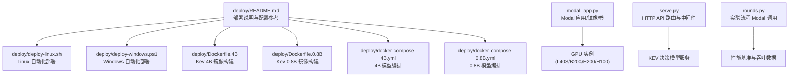
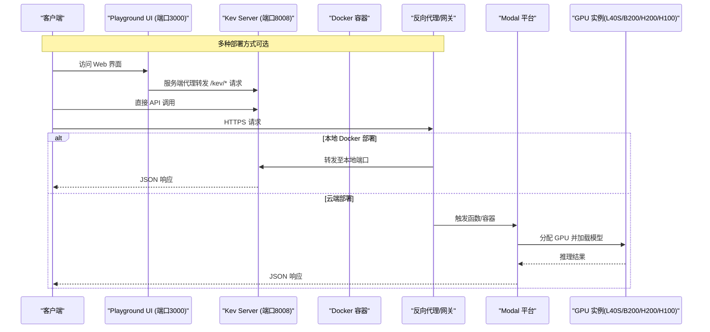
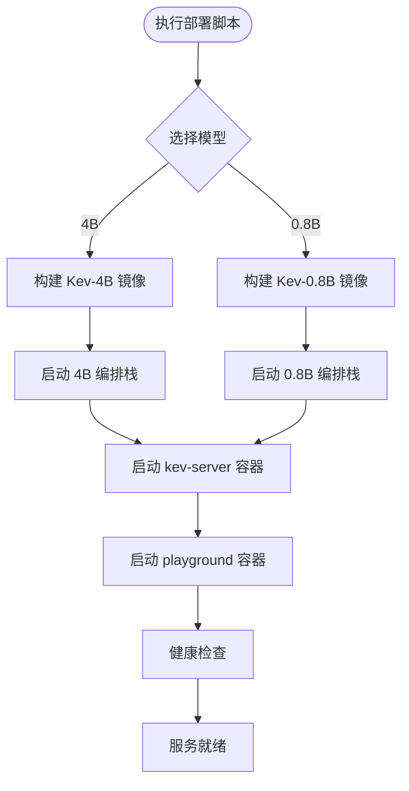
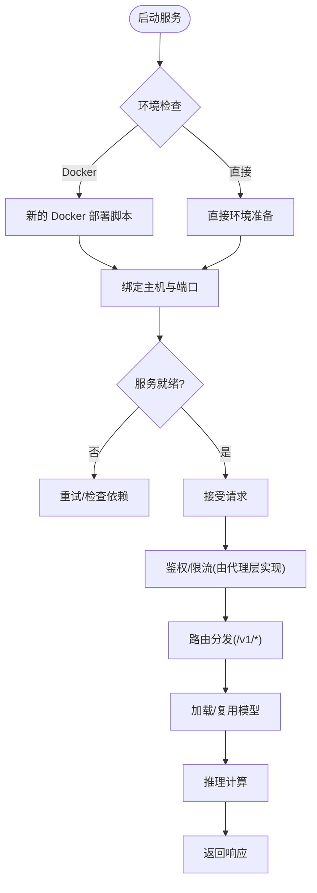
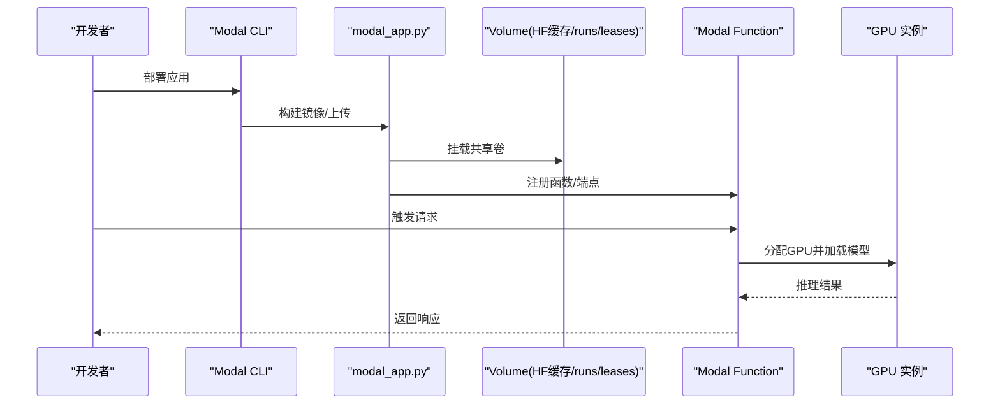
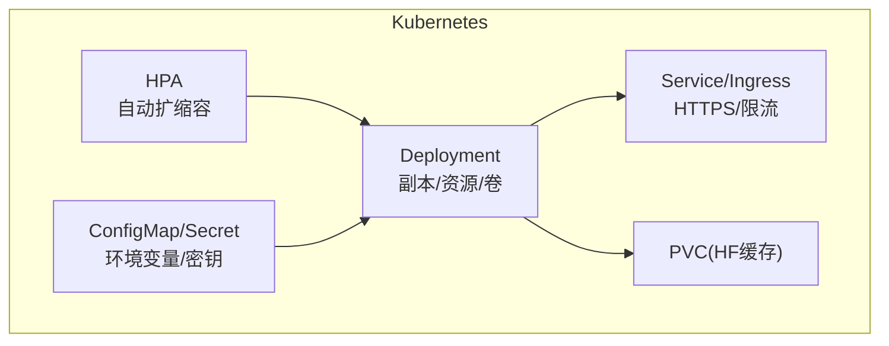
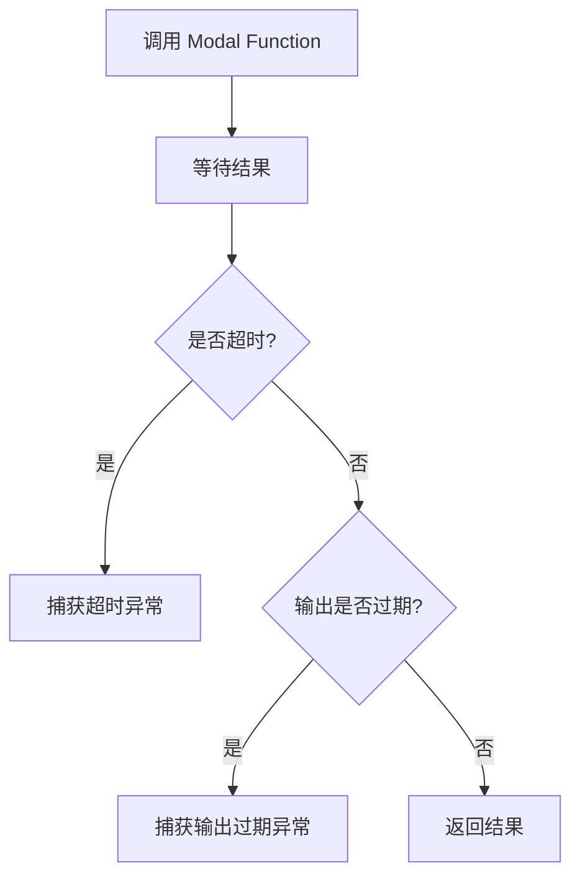
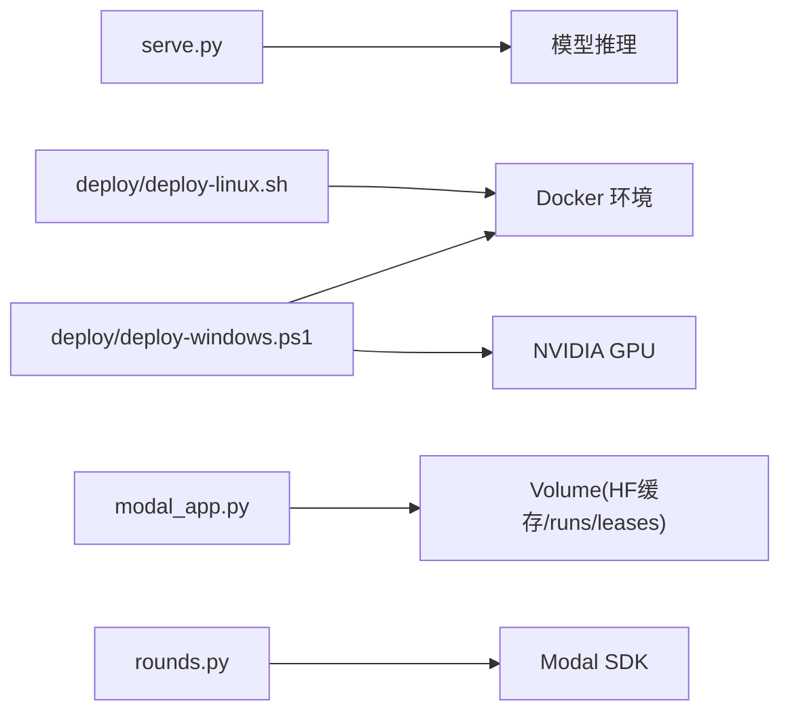

# 部署指南

<cite>
**本文引用的文件**   
- [deploy/README.md](file://deploy/README.md)
- [deploy/deploy-linux.sh](file://deploy/deploy-linux.sh)
- [deploy/deploy-windows.ps1](file://deploy/deploy-windows.ps1)
- [deploy/Dockerfile.4B](file://deploy/Dockerfile.4B)
- [deploy/Dockerfile.0.8B](file://deploy/Dockerfile.0.8B)
- [deploy/docker-compose-4B.yml](file://deploy/docker-compose-4B.yml)
- [deploy/docker-compose-0.8B.yml](file://deploy/docker-compose-0.8B.yml)
- [modal_app.py](file://modal_app.py)
- [serve.py](file://kev/serve.py)
- [rounds.py](file://kev/rounds.py)
- [AGENTS.md](file://AGENTS.md)
</cite>

## 更新摘要
**所做更改**
- 完全重构部署系统：从根级脚本迁移到新的 `deploy/` 目录结构
- 新增按模型大小分离的专用 Dockerfile（Dockerfile.4B、Dockerfile.0.8B）
- 更新部署脚本以支持模型选择功能（4B 与 0.8B）
- 重新组织 Docker Compose 配置，为不同模型提供独立编排文件
- 移除旧的根级部署脚本，统一使用新的模块化架构

## 目录
1. [简介](#简介)
2. [项目结构](#项目结构)
3. [核心组件](#核心组件)
4. [架构总览](#架构总览)
5. [详细组件分析](#详细组件分析)
6. [依赖关系分析](#依赖关系分析)
7. [性能与成本](#性能与成本)
8. [生产环境配置](#生产环境配置)
9. [故障排除](#故障排除)
10. [结论](#结论)

## 简介
本指南面向希望将 Kev 服务化并投入生产的团队，覆盖本地部署（Linux、Windows）、云端（Modal）部署、容器化与编排、生产高可用与安全、监控日志、模型规模与硬件选型、HTTPS 与访问控制、以及故障排除与性能调优。文档以仓库内现有实现为依据，重点围绕以下入口：
- **新的模块化部署架构**：通过 `deploy/` 目录下的专用脚本和配置文件进行部署
- **模型选择部署**：支持在 Kev-4B 与 Kev-0.8B 之间灵活切换
- **Playground 演示界面**：内置 Next.js 前端界面，提供可视化交互体验
- **本地推理服务**：通过 Python 包内的 serve 模块启动 HTTP API
- **云端推理服务**：通过 Modal 应用一键部署 HTTPS 端点，支持按模型自动选择 GPU 资源
- **训练/实验流程中的 Modal 调用**：在 rounds 流程中异步调用 Modal Function

## 项目结构
Kev 的部署相关代码已完全重组到新的 `deploy/` 目录结构中：
- **deploy/README.md** 提供完整的部署说明和配置参考
- **deploy/deploy-linux.sh** Linux 平台的自动化部署脚本
- **deploy/deploy-windows.ps1** Windows PowerShell 的自动化部署脚本
- **deploy/Dockerfile.4B** 专为 Kev-4B 优化的 Docker 镜像构建配置
- **deploy/Dockerfile.0.8B** 专为 Kev-0.8B 优化的 Docker 镜像构建配置
- **deploy/docker-compose-4B.yml** Kev-4B 模型的完整编排配置
- **deploy/docker-compose-0.8B.yml** Kev-0.8B 模型的完整编排配置
- modal_app.py 定义 Modal 应用、镜像、卷挂载与运行参数
- kev/serve.py 提供 HTTP API 路由与中间件
- kev/rounds.py 在实验流程中调用 Modal Function
- AGENTS.md 记录性能基准与 Modal 服务端吞吐数据

**图示来源** 
- [deploy/README.md:1-233](file://deploy/README.md#L1-L233)
- [deploy/deploy-linux.sh:1-220](file://deploy/deploy-linux.sh#L1-L220)
- [deploy/deploy-windows.ps1:1-200](file://deploy/deploy-windows.ps1#L1-L200)
- [deploy/Dockerfile.4B:1-43](file://deploy/Dockerfile.4B#L1-L43)
- [deploy/Dockerfile.0.8B:1-49](file://deploy/Dockerfile.0.8B#L1-L49)
- [deploy/docker-compose-4B.yml:1-141](file://deploy/docker-compose-4B.yml#L1-L141)
- [deploy/docker-compose-0.8B.yml:1-142](file://deploy/docker-compose-0.8B.yml#L1-L142)
- [modal_app.py:52-79](file://modal_app.py#L52-L79)
- [serve.py:231-297](file://kev/serve.py#L231-L297)
- [rounds.py:1130-1159](file://kev/rounds.py#L1130-L1159)
- [AGENTS.md:331-366](file://AGENTS.md#L331-L366)

**章节来源**
- [deploy/README.md:1-233](file://deploy/README.md#L1-L233)
- [deploy/deploy-linux.sh:1-220](file://deploy/deploy-linux.sh#L1-L220)
- [deploy/deploy-windows.ps1:1-200](file://deploy/deploy-windows.ps1#L1-L200)
- [deploy/Dockerfile.4B:1-43](file://deploy/Dockerfile.4B#L1-L43)
- [deploy/Dockerfile.0.8B:1-49](file://deploy/Dockerfile.0.8B#L1-L49)
- [deploy/docker-compose-4B.yml:1-141](file://deploy/docker-compose-4B.yml#L1-L141)
- [deploy/docker-compose-0.8B.yml:1-142](file://deploy/docker-compose-0.8B.yml#L1-L142)
- [modal_app.py:52-79](file://modal_app.py#L52-L79)
- [serve.py:231-297](file://kev/serve.py#L231-L297)
- [rounds.py:1130-1159](file://kev/rounds.py#L1130-L1159)
- [AGENTS.md:331-366](file://AGENTS.md#L331-L366)

## 核心组件
- **模块化部署架构**
  - 基于 `deploy/` 目录的集中式管理，每个模型有独立的 Dockerfile 和 compose 配置
  - 支持通过命令行参数在 Kev-4B 与 Kev-0.8B 之间动态切换
  - 统一的部署脚本接口，简化跨平台部署体验
- **模型专用 Docker 镜像**
  - Dockerfile.4B：针对 Kev-4B 优化，默认 bf16 精度，需要 10-12 GB 显存
  - Dockerfile.0.8B：针对 Kev-0.8B 优化，bf16 精度仅需 2-3 GB 显存，CPU 模式也可用
  - 共享 playground 镜像，Next.js 前端界面
- **自动化部署脚本**
  - deploy-linux.sh：Linux 平台的 Bash 脚本，支持 --model、--run、--hub、--api-key 参数
  - deploy-windows.ps1：Windows PowerShell 脚本，支持 -Model、-Run、-Hub、-ApiKey 参数
  - 自动环境检查、镜像构建、服务启动和健康验证
- **Playground 演示界面**
  - 内置 Next.js 前端应用，提供 kev 和 chess 两个标签页
  - 通过 Next.js 服务端代理转发请求到后端服务
  - 端口 3000 暴露 Web 界面，端口 8008 暴露 API 接口
- **本地推理服务（HTTP API）**
  - 暴露 /v1/systemone、/v1/systemone/permute、/v1/systemone/separate 等接口
  - 提供 /v1/models 查询可用模型信息
  - 支持 Bearer Token 认证机制
- Modal 云端服务
  - 基于 Debian Slim + Python 3.13 的镜像
  - 挂载 HuggingFace 缓存卷与 runs/leases 卷
  - 根据环境变量选择模型与 GPU（如 KEV_MODEL），不同模型自动匹配 L40S/B200/H200/H100
- 实验流程中的 Modal 调用
  - 在 rounds 流程中异步调用 Modal Function，处理超时与结果过期等异常

**章节来源**
- [deploy/README.md:1-233](file://deploy/README.md#L1-L233)
- [deploy/Dockerfile.4B:1-43](file://deploy/Dockerfile.4B#L1-L43)
- [deploy/Dockerfile.0.8B:1-49](file://deploy/Dockerfile.0.8B#L1-L49)
- [deploy/deploy-linux.sh:1-220](file://deploy/deploy-linux.sh#L1-L220)
- [deploy/deploy-windows.ps1:1-200](file://deploy/deploy-windows.ps1#L1-L200)
- [serve.py:231-297](file://kev/serve.py#L231-L297)
- [modal_app.py:52-79](file://modal_app.py#L52-L79)
- [rounds.py:1130-1159](file://kev/rounds.py#L1130-L1159)

## 架构总览
下图展示从客户端到后端服务的端到端路径，包括新的模块化部署架构、Playground 界面和云端 Modal 部署等多种方式。

**图示来源**
- [deploy/README.md:84-101](file://deploy/README.md#L84-L101)
- [deploy/docker-compose-4B.yml:92-131](file://deploy/docker-compose-4B.yml#L92-L131)
- [deploy/docker-compose-0.8B.yml:92-132](file://deploy/docker-compose-0.8B.yml#L92-L132)
- [modal_app.py:52-79](file://modal_app.py#L52-L79)
- [serve.py:231-297](file://kev/serve.py#L231-L297)

## 详细组件分析

### 新的模块化部署架构（重大更新）
**更新** 部署系统已完全重构为模块化的 `deploy/` 目录结构

- **目录结构**
  - `deploy/` 目录包含所有部署相关文件
  - 每个模型版本有独立的 Dockerfile 和 docker-compose 配置
  - 统一的部署脚本支持模型选择功能
- **模型选择机制**
  - 通过命令行参数 `-Model` (Windows) 或 `--model` (Linux) 选择模型
  - 自动切换到对应的 compose 文件和 Dockerfile
  - 支持本地 checkpoint 目录和 HuggingFace Hub ID 两种模式
- **Playground 集成**
  - 每个 compose 文件都包含 playground 服务
  - Next.js 前端通过服务端代理与后端通信
  - 无需 CORS 配置，通过 Docker 网络解析服务名

**图示来源**
- [deploy/deploy-linux.sh:18-35](file://deploy/deploy-linux.sh#L18-L35)
- [deploy/deploy-windows.ps1:20-25](file://deploy/deploy-windows.ps1#L20-L25)
- [deploy/README.md:39-82](file://deploy/README.md#L39-L82)

**章节来源**
- [deploy/README.md:1-233](file://deploy/README.md#L1-L233)
- [deploy/deploy-linux.sh:1-220](file://deploy/deploy-linux.sh#L1-L220)
- [deploy/deploy-windows.ps1:1-200](file://deploy/deploy-windows.ps1#L1-L200)

### Linux 部署脚本（更新）
**更新** 全新的 Linux 部署脚本，支持模型选择和完整的环境管理

- **参数支持**
  - `--model`：选择模型（4B 或 0.8B）
  - `--no-build`：跳过镜像构建
  - `--run`：指定本地 checkpoint 目录名称
  - `--api-key`：设置 API 密钥
  - `--hub`：指定 HuggingFace Hub ID
- **环境检查**
  - 自动检测 Docker 和 NVIDIA GPU
  - 检查 NVIDIA Container Toolkit
  - 验证 compose 文件存在性
- **部署流程**
  - 构建镜像（可选择跳过）
  - 解析模型源（本地目录或 Hub ID）
  - 启动服务并等待就绪
  - 验证 Playground UI 可用性

**章节来源**
- [deploy/deploy-linux.sh:1-220](file://deploy/deploy-linux.sh#L1-L220)

### Windows 部署脚本（更新）
**更新** 全新的 Windows PowerShell 部署脚本，提供原生 PowerShell 体验

- **参数支持**
  - `-Model`：选择模型（4B 或 0.8B）
  - `-NoBuild`：跳过镜像构建
  - `-Run`：指定本地 checkpoint 目录名称
  - `-ApiKey`：设置 API 密钥
  - `-Hub`：指定 HuggingFace Hub ID
- **交互式体验**
  - 彩色输出和进度反馈
  - 自动检测 Docker Desktop 状态
  - 内置服务就绪检测和 API 测试
- **错误处理**
  - 完善的错误检查和用户提示
  - 自动清理冲突的容器
  - 详细的日志输出

**章节来源**
- [deploy/deploy-windows.ps1:1-200](file://deploy/deploy-windows.ps1#L1-L200)

### Docker 镜像构建（更新）
**更新** 按模型大小分离的专用 Dockerfile

- **Dockerfile.4B**
  - 专为 Kev-4B 优化，默认 bf16 精度
  - 需要 10-12 GB 显存
  - 默认从 HuggingFace Hub 下载 jaredpalmer/kev-4b
- **Dockerfile.0.8B**
  - 专为 Kev-0.8B 优化，bf16 精度仅需 2-3 GB 显存
  - CPU 模式也可用，适合开发测试
  - 默认从 HuggingFace Hub 下载 jaredpalmer/kev-0.8b
- **共享特性**
  - 基于 python:3.13-slim-bookworm 基础镜像
  - 安装 kev.serve 所需的 FastAPI、PyTorch、Transformers 等依赖
  - 内置健康检查和自动重启策略
  - 暴露 8008 端口

**章节来源**
- [deploy/Dockerfile.4B:1-43](file://deploy/Dockerfile.4B#L1-L43)
- [deploy/Dockerfile.0.8B:1-49](file://deploy/Dockerfile.0.8B#L1-L49)

### Docker Compose 编排（更新）
**更新** 为不同模型提供独立的编排配置

- **docker-compose-4B.yml**
  - 定义 kev-server 和 playground 两个服务
  - 配置 GPU 资源预留和网络设置
  - 设置数据卷持久化和日志轮转
  - 默认使用 bf16 精度和 4B 模型
- **docker-compose-0.8B.yml**
  - 相同的架构但针对 0.8B 模型优化
  - 支持离线模式（HF_HUB_OFFLINE=1）
  - 更低的资源需求和更快的启动时间
- **共享配置**
  - 共用网络名称 `kev-net`
  - 共用容器名称 `kev-server` 和 `playground`
  - 共用 HuggingFace 缓存卷 `kev-hf-cache`

**章节来源**
- [deploy/docker-compose-4B.yml:1-141](file://deploy/docker-compose-4B.yml#L1-L141)
- [deploy/docker-compose-0.8B.yml:1-142](file://deploy/docker-compose-0.8B.yml#L1-L142)

### Playground 演示界面（新增）
**更新** 新增完整的 Playground 演示界面

- **功能特性**
  - Next.js 前端应用，提供直观的 Web 界面
  - 包含 kev 和 chess 两个主要标签页
  - 通过服务端代理与后端 API 通信
  - 支持实时对话和棋局分析
- **技术架构**
  - 端口 3000 暴露 Web 界面
  - 通过 Next.js rewrite 规则转发 `/kev/*` 请求到后端
  - 使用 Docker 网络解析服务名，无需 CORS 配置
- **安全考虑**
  - 支持 Bearer Token 认证
  - 可通过环境变量配置 API Key
  - 建议在生产环境中前置反向代理

**章节来源**
- [deploy/README.md:84-101](file://deploy/README.md#L84-L101)
- [deploy/docker-compose-4B.yml:92-131](file://deploy/docker-compose-4B.yml#L92-L131)
- [deploy/docker-compose-0.8B.yml:92-132](file://deploy/docker-compose-0.8B.yml#L92-L132)

### 本地部署（HTTP 服务）
- **环境准备**
  - 安装 Python 环境与依赖（参考 pyproject.toml 与 README）
  - 准备 GPU 驱动与 CUDA（如需 GPU 加速）
  - **更新** 推荐使用新的 `deploy/` 目录下的脚本进行部署
- **启动服务**
  - 通过 Python 包入口启动 serve 模块，监听指定主机与端口
  - **更新** 使用 `./deploy/deploy-linux.sh` 或 `.\deploy\deploy-windows.ps1` 进行一键部署
  - 建议在生产环境中置于反向代理之后（Nginx/Traefik/Cloud LB）
- **网络与安全**
  - 仅在内网或受信任网络暴露服务
  - 使用反向代理启用 TLS（HTTPS）、限流、鉴权（API Key/Token）
- **验证接口**
  - 调用 /v1/models 获取模型列表
  - 调用 /v1/systemone 系列接口进行推理

**图示来源**
- [deploy/deploy-linux.sh:90-144](file://deploy/deploy-linux.sh#L90-L144)
- [deploy/deploy-windows.ps1:68-128](file://deploy/deploy-windows.ps1#L68-L128)
- [serve.py:231-297](file://kev/serve.py#L231-L297)

**章节来源**
- [deploy/deploy-linux.sh:90-144](file://deploy/deploy-linux.sh#L90-L144)
- [deploy/deploy-windows.ps1:68-128](file://deploy/deploy-windows.ps1#L68-L128)
- [serve.py:231-297](file://kev/serve.py#L231-L297)

### 云端部署（Modal 平台）
- 账户与权限
  - 注册 Modal 账号，完成认证与配额申请
- 应用部署
  - 使用 modal_app.py 作为应用入口，构建镜像并部署
  - 挂载共享卷：HuggingFace 缓存、runs、leases
- GPU 资源选择
  - 通过环境变量选择模型（如 KEV_MODEL），平台自动匹配合适 GPU（L40S/B200/H200/H100）
- 成本优化
  - 利用"空闲缩容到零"特性减少闲置成本
  - 合理设置并发与批大小，避免冷启动频繁

**图示来源**
- [modal_app.py:52-79](file://modal_app.py#L52-L79)

**章节来源**
- [modal_app.py:52-79](file://modal_app.py#L52-L79)

### 容器化与 Kubernetes 编排
- **Docker 镜像**
  - 基于 Debian Slim + Python 3.13，按需安装依赖
  - 将 serve 模块作为进程入口，暴露 HTTP 端口
  - **更新** 按模型大小分离的专用 Dockerfile
- **Docker Compose 编排**
  - 生产环境服务配置（GPU 支持、资源限制、健康检查）
  - 开发环境服务配置（源码热重载、调试支持）
  - 网络配置和数据卷管理
- **Kubernetes 编排**
  - Deployment：副本数、资源限制（CPU/GPU）、卷挂载（HF缓存）
  - Service/Ingress：对外暴露 HTTPS，配置证书与限流
  - HorizontalPodAutoscaler：基于 CPU/GPU 利用率或自定义指标扩缩容
  - ConfigMap/Secret：注入环境变量（模型名、密钥等）

[本节为概念性编排说明，不直接映射具体源码文件]

### 实验流程中的 Modal 调用
- 在 rounds 流程中调用 Modal Function，处理以下异常：
  - 超时（TimeoutError）
  - 函数超时（FunctionTimeoutError）
  - 输出过期（OutputExpiredError）

**图示来源**
- [rounds.py:1130-1159](file://kev/rounds.py#L1130-L1159)

**章节来源**
- [rounds.py:1130-1159](file://kev/rounds.py#L1130-L1159)

## 依赖关系分析
- **本地服务依赖**
  - HTTP 框架与路由（serve.py）
  - 模型加载与推理逻辑（由 serve 模块内部实现）
- **新的 Docker 部署依赖**
  - Docker Engine 和 Container Runtime
  - NVIDIA Container Toolkit（GPU 支持）
  - Docker Compose 编排工具
- **Linux 部署脚本依赖**
  - Bash 环境和必要的系统命令
  - Docker 和 Docker Compose
  - NVIDIA 驱动（GPU 支持）
- **Windows 部署脚本依赖**
  - PowerShell 5.1+ 或 PowerShell Core
  - Docker Desktop for Windows
  - NVIDIA 驱动（GPU 支持）
- **Modal 服务依赖**
  - Modal SDK（镜像构建、卷挂载、函数部署）
  - HuggingFace 缓存卷（加速模型下载）
- **实验流程依赖**
  - Modal Function 调用与异常处理（rounds.py）

**图示来源**
- [serve.py:231-297](file://kev/serve.py#L231-L297)
- [deploy/deploy-linux.sh:55-88](file://deploy/deploy-linux.sh#L55-L88)
- [deploy/deploy-windows.ps1:36-66](file://deploy/deploy-windows.ps1#L36-L66)
- [modal_app.py:52-79](file://modal_app.py#L52-L79)
- [rounds.py:1130-1159](file://kev/rounds.py#L1130-L1159)

**章节来源**
- [serve.py:231-297](file://kev/serve.py#L231-L297)
- [deploy/deploy-linux.sh:55-88](file://deploy/deploy-linux.sh#L55-L88)
- [deploy/deploy-windows.ps1:36-66](file://deploy/deploy-windows.ps1#L36-L66)
- [modal_app.py:52-79](file://modal_app.py#L52-L79)
- [rounds.py:1130-1159](file://kev/rounds.py#L1130-L1159)

## 性能与成本
- **性能基准**
  - 本地与云端吞吐对比：参考 AGENTS.md 中的基准数据
  - Modal 服务端在高并发下的吞吐表现
  - **更新** Kev-4B 需要 10-12 GB 显存，Kev-0.8B 仅需 2-3 GB 显存
- **GPU 选型与成本**
  - 小模型（Kev-0.8B）适合 L40S/L4 甚至 CPU 模式
  - 中等模型（Kev-4B）适合 H100/H200
  - 大模型（如 Kev-27B）适合 B200/H200/H100
- **成本优化策略**
  - 使用 Modal 的"缩容到零"能力，降低闲置成本
  - 合理设置批大小与并发度，平衡延迟与吞吐
  - 预热常用模型，减少冷启动开销
  - **更新** 使用新的模块化部署架构，按模型大小选择合适的资源配置
  - **更新** 利用 Docker 卷缓存模型权重，避免重复下载

**章节来源**
- [AGENTS.md:331-366](file://AGENTS.md#L331-L366)
- [deploy/README.md:11-18](file://deploy/README.md#L11-L18)
- [deploy/Dockerfile.4B:36-39](file://deploy/Dockerfile.4B#L36-L39)
- [deploy/Dockerfile.0.8B:36-45](file://deploy/Dockerfile.0.8B#L36-L45)

## 生产环境配置
- **负载均衡**
  - 使用云厂商 LB 或 Ingress 控制器进行流量分发
  - 健康检查与优雅停机
- **自动扩缩容**
  - 基于 CPU/GPU 利用率或自定义指标（QPS/延迟）
  - 设置最小/最大副本数，避免抖动
- **监控告警**
  - 采集 QPS、延迟、错误率、GPU 利用率
  - 设置阈值告警（如 P99 延迟、错误率突增）
- **日志收集**
  - 结构化日志输出，集中采集（ELK/ Loki）
  - 关联请求 ID，便于追踪
- **安全加固**
  - **更新** 新的部署脚本支持 API Key 认证
  - 网络隔离和防火墙配置
  - 定期安全更新和漏洞扫描
- **容器化最佳实践**
  - **更新** 使用按模型大小分离的 Dockerfile
  - **更新** 配置资源限制和内存约束
  - **更新** 启用健康检查和自动重启
  - **更新** 使用只读文件系统提高安全性

[本节为通用生产实践，不直接映射具体源码文件]

## 故障排除
- **常见问题**
  - 模型加载失败：检查 HF 缓存卷挂载与网络连通性
  - GPU 不可用：确认驱动版本与容器 GPU 支持
  - 冷启动慢：预热模型或调整 Modal 的最小实例数
  - **更新** Docker 环境问题：检查 Docker Engine 状态和 NVIDIA Container Toolkit
- **新的部署脚本问题**
  - **更新** Linux 脚本执行失败：检查 bash 环境和 Docker 权限
  - **更新** Windows 脚本语法错误：确保使用正确的 PowerShell 语法
  - **更新** 模型选择失败：检查 --model 或 -Model 参数值
  - **更新** 本地 checkpoint 目录不存在：创建相应的 runs 目录结构
- **Docker 特定问题**
  - **更新** 镜像构建失败：检查网络连接和依赖安装
  - **更新** GPU 无法识别：检查 NVIDIA 驱动和 Docker GPU 直通配置
  - **更新** 端口冲突：修改默认端口或使用不同的端口映射
  - **更新** 内存不足：调整 KEV_DTYPE 和 KEV_PREFIX_CACHE 参数
- **Playground 问题**
  - **更新** Web 界面无法访问：检查端口 3000 是否被占用
  - **更新** API 调用失败：检查后端服务状态和网络连通性
  - **更新** 认证失败：确认 KEV_API_KEY 配置正确
- **调试步骤**
  - 查看服务日志与 Modal 函数日志
  - 逐步缩小问题范围（网络/依赖/模型/硬件）
  - **更新** 使用 `docker logs -f kev-server` 查看服务日志
  - **更新** 使用 `docker logs -f kev-playground` 查看前端日志
  - **更新** 使用 `docker compose ps` 查看服务状态
- **恢复策略**
  - 重启 Pod/容器，回滚到稳定版本
  - 切换备用 GPU 类型或模型
  - **更新** 重新运行部署脚本重置环境
  - **更新** 使用 `docker compose down` 清理容器和卷

**章节来源**
- [modal_app.py:52-79](file://modal_app.py#L52-L79)
- [serve.py:231-297](file://kev/serve.py#L231-L297)
- [deploy/README.md:218-233](file://deploy/README.md#L218-L233)
- [deploy/deploy-linux.sh:146-169](file://deploy/deploy-linux.sh#L146-L169)
- [deploy/deploy-windows.ps1:131-152](file://deploy/deploy-windows.ps1#L131-L152)

## 结论
Kev 的部署系统已完全重构为模块化的 `deploy/` 目录结构，提供了更加清晰和可维护的架构。**新的模块化部署架构**支持在 Kev-4B 与 Kev-0.8B 之间灵活切换，每个模型都有专用的 Dockerfile 和编排配置。结合 Play ground 演示界面、自动化部署脚本和 Modal 云端弹性扩展，为用户提供了开箱即用的部署体验。通过合理的 GPU 选型、容器化编排与生产级安全与监控配置，可在保证性能的同时控制成本。建议在灰度发布阶段结合监控与告警，逐步扩大流量，确保稳定性与用户体验。

**推荐部署流程**：
1. **首次部署**：使用 `./deploy/deploy-linux.sh` 或 `.\deploy\deploy-windows.ps1` 进行快速部署
2. **模型选择**：通过命令行参数在 Kev-4B 与 Kev-0.8B 之间切换
3. **Playground 界面**：访问 http://localhost:3000 体验可视化界面
4. **生产环境**：结合 Kubernetes 编排和监控体系
5. **云端扩展**：使用 Modal 进行弹性部署和成本优化