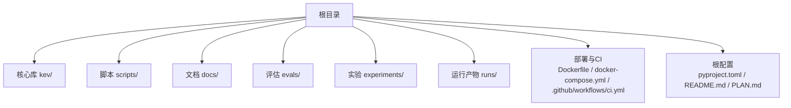
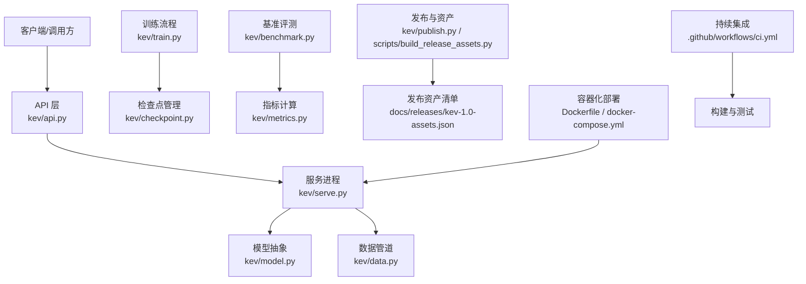
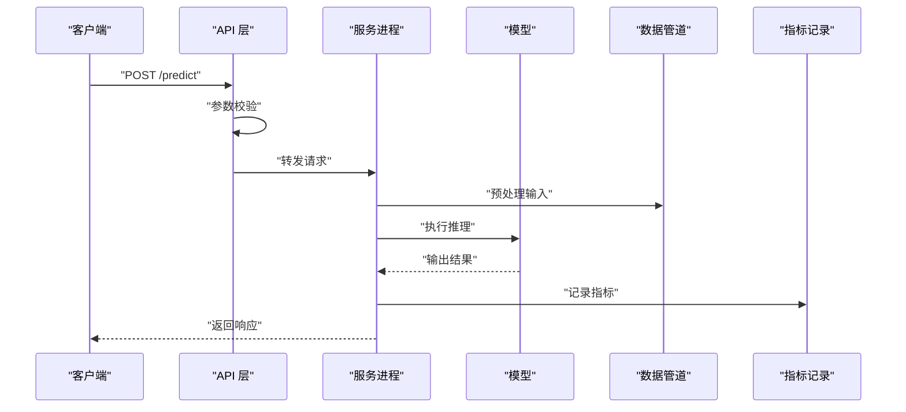
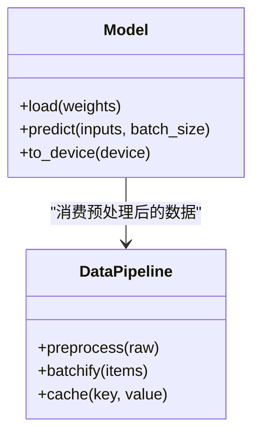
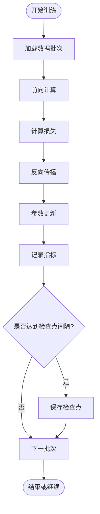
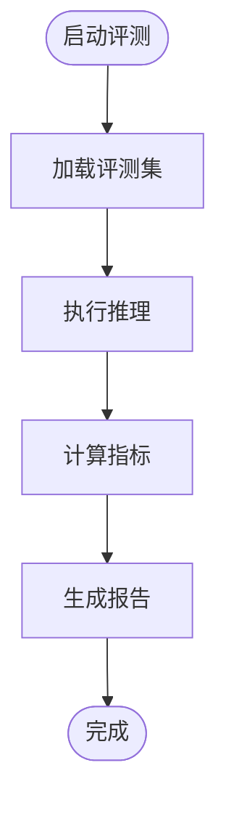
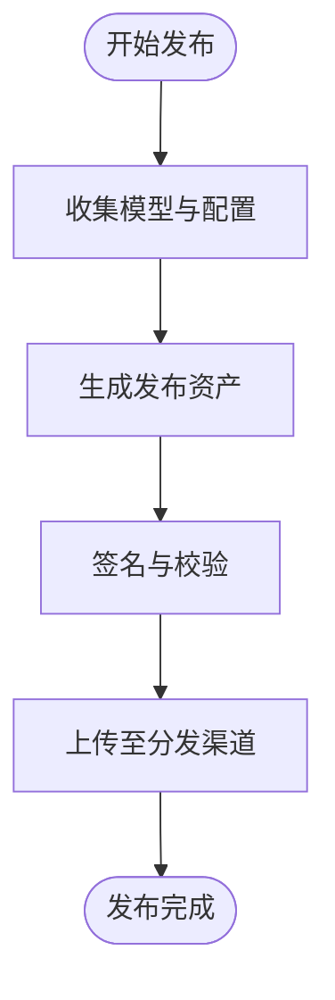
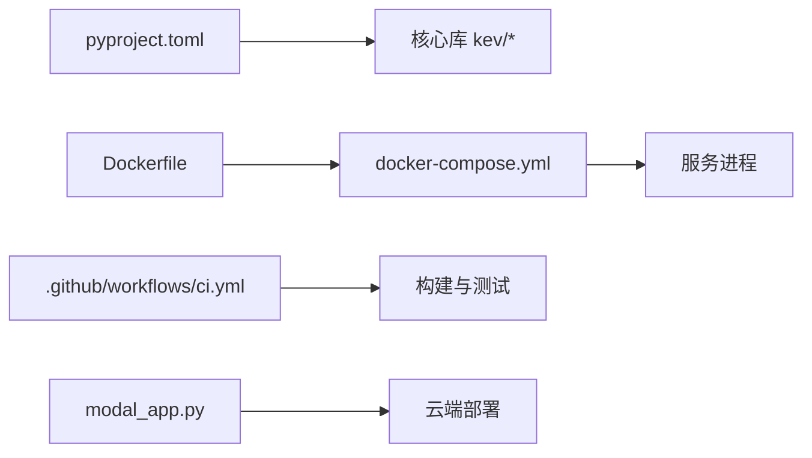

<cite>
**本文引用的文件**   
- [README.md](file://README.md)
- [PLAN.md](file://PLAN.md)
- [pyproject.toml](file://pyproject.toml)
- [Dockerfile](file://Dockerfile)
- [docker-compose.yml](file://docker-compose.yml)
- [modal_app.py](file://modal_app.py)
- [deploy.sh](file://deploy.sh)
- [deploy-windows.ps1](file://deploy-windows.ps1)
- [.github/workflows/ci.yml](file://.github/workflows/ci.yml)
- [kev/api.py](file://kev/api.py)
- [kev/serve.py](file://kev/serve.py)
- [kev/model.py](file://kev/model.py)
- [kev/data.py](file://kev/data.py)
- [kev/train.py](file://kev/train.py)
- [kev/benchmark.py](file://kev/benchmark.py)
- [kev/metrics.py](file://kev/metrics.py)
- [kev/checkpoint.py](file://kev/checkpoint.py)
- [kev/publish.py](file://kev/publish.py)
- [scripts/build_release_assets.py](file://scripts/build_release_assets.py)
- [docs/releases/kev-1.0.md](file://docs/releases/kev-1.0.md)
- [docs/releases/kev-1.0-assets.json](file://docs/releases/kev-1.0-assets.json)
</cite>

## 目录
1. [简介](#简介)
2. [项目结构](#项目结构)
3. [核心组件](#核心组件)
4. [架构总览](#架构总览)
5. [详细组件分析](#详细组件分析)
6. [依赖关系分析](#依赖关系分析)
7. [性能与部署考量](#性能与部署考量)
8. [故障排查指南](#故障排查指南)
9. [结论](#结论)
10. [附录](#附录)

## 简介
本文件为 Kev 1.0 的官方发布说明，面向开发者、研究者与运维人员，提供版本概览、安装与部署指引、API 与服务使用方式、训练与评测流程、模型资产清单以及常见问题排查建议。Kev 1.0 在推理服务、训练管线、基准评测与发布流程方面进行了系统化完善，支持容器化部署与云端快速上线，并提供标准化的发布资产清单与校验机制。

## 项目结构
仓库采用“核心库 + 脚本工具 + 文档与评估 + 部署配置”的分层组织方式：
- 核心库（kev/）：包含 API、服务、模型、数据、训练、评测等模块
- 脚本工具（scripts/）：构建发布资产、数据处理、校准与评测脚本
- 文档与评估（docs/、evals/、experiments/、runs/）：模型卡、发布说明、实验与运行产物
- 部署与 CI（Dockerfile、docker-compose.yml、.github/workflows/ci.yml、deploy*.sh/.ps1）：容器化与持续集成
- 根级配置（pyproject.toml、README.md、PLAN.md）：包元信息、计划与使用说明

图表来源
- [README.md:1-50](file://README.md#L1-L50)
- [pyproject.toml:1-40](file://pyproject.toml#L1-L40)

章节来源
- [README.md:1-50](file://README.md#L1-L50)
- [pyproject.toml:1-40](file://pyproject.toml#L1-L40)

## 核心组件
- 推理与服务
  - API 接口：对外暴露统一的推理调用入口
  - 服务进程：HTTP 服务封装，负责请求解析、路由与响应
- 模型与数据
  - 模型加载与推理：统一模型抽象，适配不同后端
  - 数据管道：输入预处理、批处理与缓存策略
- 训练与检查点
  - 训练主循环：数据加载、优化器、日志与检查点保存
  - 检查点管理：加载、合并与导出
- 评测与指标
  - 基准评测：标准化评测流程与结果汇总
  - 指标计算：准确率、召回率、延迟等关键指标
- 发布与资产
  - 发布脚本：打包模型、文档与校验清单
  - 资产清单：版本化资源索引与签名信息

章节来源
- [kev/api.py:1-120](file://kev/api.py#L1-L120)
- [kev/serve.py:1-120](file://kev/serve.py#L1-L120)
- [kev/model.py:1-120](file://kev/model.py#L1-L120)
- [kev/data.py:1-120](file://kev/data.py#L1-L120)
- [kev/train.py:1-120](file://kev/train.py#L1-L120)
- [kev/checkpoint.py:1-120](file://kev/checkpoint.py#L1-L120)
- [kev/benchmark.py:1-120](file://kev/benchmark.py#L1-L120)
- [kev/metrics.py:1-120](file://kev/metrics.py#L1-L120)
- [kev/publish.py:1-120](file://kev/publish.py#L1-L120)
- [scripts/build_release_assets.py:1-120](file://scripts/build_release_assets.py#L1-L120)

## 架构总览
Kev 1.0 的整体架构围绕“服务—模型—数据—训练—评测—发布”闭环展开，支持本地与云端两种部署形态。

图表来源
- [kev/api.py:1-120](file://kev/api.py#L1-L120)
- [kev/serve.py:1-120](file://kev/serve.py#L1-L120)
- [kev/model.py:1-120](file://kev/model.py#L1-L120)
- [kev/data.py:1-120](file://kev/data.py#L1-L120)
- [kev/train.py:1-120](file://kev/train.py#L1-L120)
- [kev/checkpoint.py:1-120](file://kev/checkpoint.py#L1-L120)
- [kev/benchmark.py:1-120](file://kev/benchmark.py#L1-L120)
- [kev/metrics.py:1-120](file://kev/metrics.py#L1-L120)
- [kev/publish.py:1-120](file://kev/publish.py#L1-L120)
- [scripts/build_release_assets.py:1-120](file://scripts/build_release_assets.py#L1-L120)
- [Dockerfile:1-60](file://Dockerfile#L1-L60)
- [docker-compose.yml:1-60](file://docker-compose.yml#L1-L60)
- [.github/workflows/ci.yml:1-60](file://.github/workflows/ci.yml#L1-L60)

## 详细组件分析

### 推理与服务（API + Serve）
- API 层定义统一的推理接口，包括输入校验、参数映射与错误码规范
- 服务进程封装 HTTP 生命周期，负责并发控制、超时与重试策略
- 典型调用链：客户端请求 → API 校验 → 服务路由 → 模型推理 → 指标记录 → 响应返回

图表来源
- [kev/api.py:1-120](file://kev/api.py#L1-L120)
- [kev/serve.py:1-120](file://kev/serve.py#L1-L120)
- [kev/model.py:1-120](file://kev/model.py#L1-L120)
- [kev/data.py:1-120](file://kev/data.py#L1-L120)
- [kev/metrics.py:1-120](file://kev/metrics.py#L1-L120)

章节来源
- [kev/api.py:1-120](file://kev/api.py#L1-L120)
- [kev/serve.py:1-120](file://kev/serve.py#L1-L120)

### 模型与数据（Model + Data）
- 模型抽象统一了不同后端的加载与推理接口，支持权重加载、设备分配与批量推理
- 数据管道实现输入清洗、分词/编码、批处理与缓存，提升吞吐与稳定性

图表来源
- [kev/model.py:1-120](file://kev/model.py#L1-L120)
- [kev/data.py:1-120](file://kev/data.py#L1-L120)

章节来源
- [kev/model.py:1-120](file://kev/model.py#L1-L120)
- [kev/data.py:1-120](file://kev/data.py#L1-L120)

### 训练与检查点（Train + Checkpoint）
- 训练主循环负责数据迭代、损失计算、梯度更新与日志记录
- 检查点管理支持断点续训、权重导出与多版本归档

图表来源
- [kev/train.py:1-120](file://kev/train.py#L1-L120)
- [kev/checkpoint.py:1-120](file://kev/checkpoint.py#L1-L120)

章节来源
- [kev/train.py:1-120](file://kev/train.py#L1-L120)
- [kev/checkpoint.py:1-120](file://kev/checkpoint.py#L1-L120)

### 评测与指标（Benchmark + Metrics）
- 基准评测提供标准数据集与评测脚本，输出可复现的结果
- 指标模块计算准确率、F1、延迟、吞吐等关键指标，并生成报告

图表来源
- [kev/benchmark.py:1-120](file://kev/benchmark.py#L1-L120)
- [kev/metrics.py:1-120](file://kev/metrics.py#L1-L120)

章节来源
- [kev/benchmark.py:1-120](file://kev/benchmark.py#L1-L120)
- [kev/metrics.py:1-120](file://kev/metrics.py#L1-L120)

### 发布与资产（Publish + Build Release Assets）
- 发布脚本将模型权重、配置文件、文档与校验清单打包为发布资产
- 资产清单以 JSON 形式描述版本、哈希、大小与依赖关系，便于分发与验证

图表来源
- [kev/publish.py:1-120](file://kev/publish.py#L1-L120)
- [scripts/build_release_assets.py:1-120](file://scripts/build_release_assets.py#L1-L120)
- [docs/releases/kev-1.0-assets.json:1-120](file://docs/releases/kev-1.0-assets.json#L1-L120)

章节来源
- [kev/publish.py:1-120](file://kev/publish.py#L1-L120)
- [scripts/build_release_assets.py:1-120](file://scripts/build_release_assets.py#L1-L120)
- [docs/releases/kev-1.0-assets.json:1-120](file://docs/releases/kev-1.0-assets.json#L1-L120)

## 依赖关系分析
- 包管理与元信息：通过 pyproject.toml 声明依赖、入口点与构建配置
- 容器化：Dockerfile 定义镜像构建步骤，docker-compose.yml 编排服务与数据库等依赖
- 持续集成：GitHub Actions 流水线执行构建、测试与发布任务
- 云端部署：Modal 应用脚本用于快速云端上线

图表来源
- [pyproject.toml:1-40](file://pyproject.toml#L1-L40)
- [Dockerfile:1-60](file://Dockerfile#L1-L60)
- [docker-compose.yml:1-60](file://docker-compose.yml#L1-L60)
- [.github/workflows/ci.yml:1-60](file://.github/workflows/ci.yml#L1-L60)
- [modal_app.py:1-60](file://modal_app.py#L1-L60)

章节来源
- [pyproject.toml:1-40](file://pyproject.toml#L1-L40)
- [Dockerfile:1-60](file://Dockerfile#L1-L60)
- [docker-compose.yml:1-60](file://docker-compose.yml#L1-L60)
- [.github/workflows/ci.yml:1-60](file://.github/workflows/ci.yml#L1-L60)
- [modal_app.py:1-60](file://modal_app.py#L1-L60)

## 性能与部署考量
- 推理性能
  - 批处理与缓存：合理设置 batch_size 与缓存键，减少重复计算
  - 设备选择：根据显存与模型规模选择 CPU/GPU/MPS 后端
- 服务稳定性
  - 超时与重试：为长耗时推理设置超时阈值与重试策略
  - 并发控制：限制最大并发请求数，避免资源争用
- 容器化部署
  - 镜像分层：将依赖与代码分离，提升构建与拉取效率
  - 健康检查：在服务就绪后暴露健康端点，供编排系统探测
- 云端上线
  - Modal 应用：简化云端环境配置与自动扩缩容
  - 环境变量：通过环境变量注入密钥与配置，避免硬编码

章节来源
- [kev/serve.py:1-120](file://kev/serve.py#L1-L120)
- [Dockerfile:1-60](file://Dockerfile#L1-L60)
- [docker-compose.yml:1-60](file://docker-compose.yml#L1-L60)
- [modal_app.py:1-60](file://modal_app.py#L1-L60)

## 故障排查指南
- 服务无法启动
  - 检查端口占用与权限；确认容器网络与端口映射正确
  - 查看服务日志定位初始化失败原因
- 推理报错
  - 校验输入格式与字段类型；确认模型权重路径与版本匹配
  - 检查内存与显存是否充足，必要时降低 batch_size
- 训练中断
  - 检查检查点是否完整；确认磁盘空间与写入权限
  - 调整学习率与步数，避免数值不稳定
- 发布失败
  - 校验资产清单完整性与哈希值；确认签名有效
  - 检查分发渠道的网络与认证配置

章节来源
- [kev/serve.py:1-120](file://kev/serve.py#L1-L120)
- [kev/checkpoint.py:1-120](file://kev/checkpoint.py#L1-L120)
- [scripts/build_release_assets.py:1-120](file://scripts/build_release_assets.py#L1-L120)

## 结论
Kev 1.0 在推理服务、训练管线、评测体系与发布流程上提供了完整且可复现的工程实践。通过容器化与云端部署能力，用户可在本地与云端快速搭建稳定高效的 AI 服务。建议在生产环境中结合监控与告警，持续优化性能与可靠性。

## 附录
- 安装与运行
  - 克隆仓库并安装依赖；参考根级说明文档获取命令与环境要求
- 快速上手
  - 启动服务并调用推理接口；查看示例请求与响应格式
- 模型资产
  - 下载发布资产清单与对应权重；按清单进行完整性校验

章节来源
- [README.md:1-50](file://README.md#L1-L50)
- [docs/releases/kev-1.0.md:1-120](file://docs/releases/kev-1.0.md#L1-L120)
- [docs/releases/kev-1.0-assets.json:1-120](file://docs/releases/kev-1.0-assets.json#L1-L120)