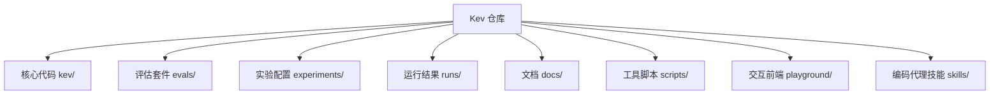
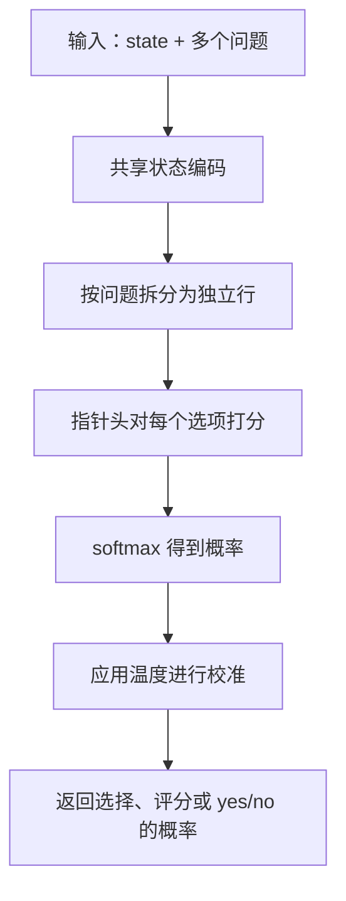
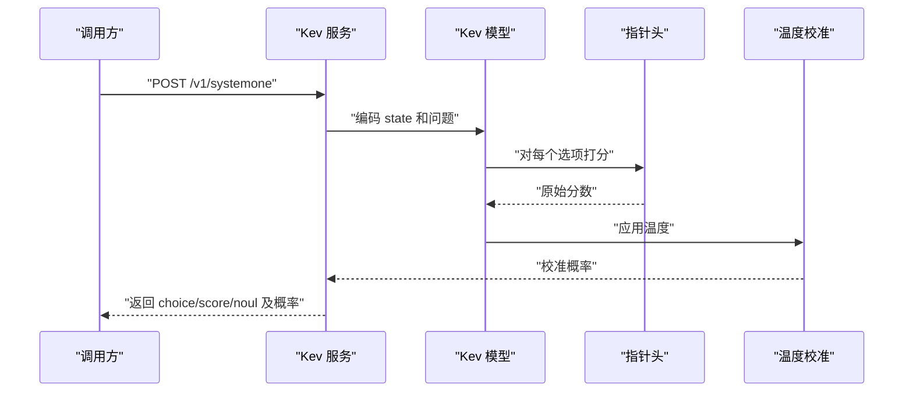
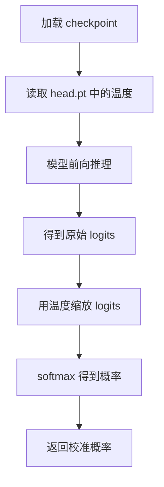
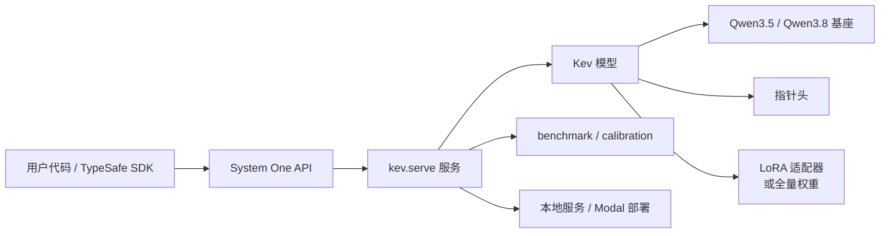

# 项目概述

<cite>
**本文引用的文件**   
- [README.md](file://README.md)
- [kev-family-summary.json](file://docs/kev-family-summary.json)
- [kev-0.8b.md](file://docs/model-cards/kev-0.8b.md)
- [kev-4b.md](file://docs/model-cards/kev-4b.md)
- [kev-9b.md](file://docs/model-cards/kev-9b.md)
- [kev-27b.md](file://docs/model-cards/kev-27b.md)
</cite>

## 目录
1. [引言](#引言)
2. [项目结构](#项目结构)
3. [核心组件](#核心组件)
4. [架构总览](#架构总览)
5. [详细组件分析](#详细组件分析)
6. [依赖关系分析](#依赖关系分析)
7. [性能与硬件要求](#性能与硬件要求)
8. [故障排查指南](#故障排查指南)
9. [结论](#结论)
10. [附录：模型规模与适用场景](#附录模型规模与适用场景)

## 引言
Kev 是一个小型决策模型家族，目标是让开发者在本地训练和部署“基于文本的决策分类器”。它支持三类问题：
- yes/no（noul）
- 多选（choice）
- 评分（score）

这些问题的输入共享同一段文档（state），但彼此之间不能互相读取。Kev 默认输出校准后的概率，而不是单一标签；这使系统可以把高置信度的请求自动化，把低置信度的请求交给人工复核。

Kev 基于 Qwen3.5 和 Qwen3.8 架构构建，提供四种规模：
- Kev-0.8B
- Kev-4B
- Kev-9B
- Kev-27B

Kev 的 API 与 TypeSafe 的 System One 兼容，因此可以直接替换 Jev 的后端，而不需要修改调用方代码。相比 Jev，Kev 的主要优势是：
- 可本地部署、可微调
- 公开权重和评估流程
- 提供从笔记本到数据中心 GPU 的多种规模
- 内置温度校准，便于设置阈值

**章节来源**
- [README.md:1-23](file://README.md#L1-L23)
- [README.md:13-23](file://README.md#L13-L23)

## 项目结构
仓库围绕“模型实现、训练、评估、服务、实验记录、模型卡”组织：
- `kev/`：模型加载、推理、训练、校准、评测、服务等核心 Python 模块
- `evals/`：冻结的评估数据集和任务套件
- `experiments/`：训练计划、实验配置、发布候选
- `runs/`：大量运行结果、基准报告、部署配置
- `docs/`：模型卡、研究摘要、声明清单
- `scripts/`：数据构建、校准、对比、报告脚本
- `playground/`：浏览器前端，用于交互式测试
- `skills/`：编码代理技能，覆盖微调、部署等端到端流程



**图表来源**
- [README.md:282-341](file://README.md#L282-L341)
- [README.md:395-404](file://README.md#L395-L404)

**章节来源**
- [README.md:282-341](file://README.md#L282-L341)
- [README.md:395-404](file://README.md#L395-L404)

## 核心组件
Kev 的核心能力可以归纳为以下方面：

| 维度 | 说明 |
|---|---|
| 问题类型 | noul、choice、score 三种问题在一个请求中同时处理 |
| 概率输出 | 每个选项都有概率；choice 返回最可能选项和置信度；score 返回期望等级索引和置信度 |
| 校准 | 每个 checkpoint 携带一个温度参数，默认返回校准后的概率 |
| API 兼容 | 实现 TypeSafe System One 的 `/v1/systemone` 接口 |
| 模型规模 | 0.8B、4B、9B、27B，分别面向不同硬件和精度需求 |
| 微调框架 | 提供 LoRA 适配器路径和全量微调路径，并配套数据格式、训练命令、评估命令 |
| 部署方式 | 本地 HTTP 服务、Modal HTTPS 端点、浏览器 Playground |

**章节来源**
- [README.md:15-23](file://README.md#L15-L23)
- [README.md:214-259](file://README.md#L214-L259)
- [README.md:129-184](file://README.md#L129-L184)

## 架构总览
Kev 不是生成式对话模型，而是“预填充-only”的分类模型。它的输入是一段 state 和若干 typed questions，输出是每个问题的选项概率分布。



**图表来源**
- [README.md:260-280](file://README.md#L260-L280)
- [kev-27b.md:102-110](file://docs/model-cards/kev-27b.md#L102-L110)

### 与 Jev 的关系
- Kev 的目标之一是成为 Jev 的可本地化替代方案。
- Kev 直接实现 TypeSafe System One 协议，因此现有 Jev 客户端可以指向 Kev 服务。
- README 明确说明 Kev 是“Jev-like decision models”，并强调“drop-in for Jev”。

不过，README 也指出这不是受控架构对比：Jev 的训练数据未知，而 Kev 的评估包含“新来源”和“已训练来源”两类指标。

**章节来源**
- [README.md:13-23](file://README.md#L13-L23)
- [README.md:37-41](file://README.md#L37-L41)

## 详细组件分析

### 模型家族与基座
Kev 使用 Qwen3.5 和 Qwen3.8 作为基座：
- Kev-0.8B、Kev-4B、Kev-9B：基于 Qwen3.5 Base，采用 LoRA 适配器加指针头。
- Kev-27B：基于 Qwen3.8 post-trained release，进行全量微调，并以 bf16 全量权重发布。

```mermaid
classDiagram
class KevFamily {
"决策模型家族"
"TypeSafe System One 兼容"
"校准概率输出"
}
class Kev0_8B {
"Qwen3.5-0.8B-Base"
"LoRA 适配器"
"适合小内存设备"
}
class Kev4B {
"Qwen3.5-4B-Base"
"LoRA 适配器"
"平衡精度与体积"
}
class Kev9B {
"Qwen3.5-9B-Base"
"LoRA 适配器"
"更高准确率"
}
class Kev27B {
"Qwen3.8-27B"
"全量微调"
"数据中心 GPU"
}
KevFamily --> Kev0_8B : "包含"
KevFamily --> Kev4B : "包含"
KevFamily --> Kev9B : "包含"
KevFamily --> Kev27B : "包含"
```

**图表来源**
- [README.md:25-41](file://README.md#L25-L41)
- [kev-0.8b.md:65-68](file://docs/model-cards/kev-0.8b.md#L65-L68)
- [kev-4b.md:60-63](file://docs/model-cards/kev-4b.md#L60-L63)
- [kev-9b.md:54-67](file://docs/model-cards/kev-9b.md#L54-L67)
- [kev-27b.md:81-99](file://docs/model-cards/kev-27b.md#L81-L99)

**章节来源**
- [README.md:25-41](file://README.md#L25-L41)
- [kev-0.8b.md:65-68](file://docs/model-cards/kev-0.8b.md#L65-L68)
- [kev-4b.md:60-63](file://docs/model-cards/kev-4b.md#L60-L63)
- [kev-9b.md:54-67](file://docs/model-cards/kev-9b.md#L54-L67)
- [kev-27b.md:81-99](file://docs/model-cards/kev-27b.md#L81-L99)

### 推理流程
Kev 的推理流程包括：
1. 将 state 和多个问题序列化为统一文本格式。
2. 对共享 state 做一次编码。
3. 对每个问题单独计算，避免问题之间互相影响。
4. 使用指针头对每个选项的隐藏表示打分。
5. softmax 得到概率。
6. 应用温度参数得到校准概率。



**图表来源**
- [README.md:260-280](file://README.md#L260-L280)
- [README.md:214-259](file://README.md#L214-L259)

**章节来源**
- [README.md:260-280](file://README.md#L260-L280)
- [README.md:214-259](file://README.md#L214-L259)

### 校准机制
Kev 在每个 checkpoint 中保存一个温度参数：
- 温度不会改变 argmax，因此准确率不变。
- 温度会调整概率分布，从而改善 Brier 分数和校准误差。
- 不同模型的 fitted temperature 不同，例如 README 提到 Kev-4B、Kev-0.8B、Kev-9B、Kev-27B 的温度拟合方式和来源有所差异。



**图表来源**
- [README.md:343-345](file://README.md#L343-L345)
- [kev-4b.md:171-173](file://docs/model-cards/kev-4b.md#L171-L173)
- [kev-9b.md:140-148](file://docs/model-cards/kev-9b.md#L140-L148)
- [kev-27b.md:177-181](file://docs/model-cards/kev-27b.md#L177-L181)

**章节来源**
- [README.md:343-345](file://README.md#L343-L345)
- [kev-4b.md:171-173](file://docs/model-cards/kev-4b.md#L171-L173)
- [kev-9b.md:140-148](file://docs/model-cards/kev-9b.md#L140-L148)
- [kev-27b.md:177-181](file://docs/model-cards/kev-27b.md#L177-L181)

### 与 Jev 的性能对比
README 提供了 Kev 与 Jev 在新来源和已训练来源上的准确率与 Brier 分数对比。`docs/kev-family-summary.json` 进一步给出 transfer_acc 和 transfer_brier 的汇总值。

| 模型 | 新来源准确率 | 已训练来源准确率 | 新来源 Brier |
|---|---:|---:|---:|
| Kev-0.8B | 0.648 / 0.697 | 0.827 / 0.838 | 0.481 / 0.416 |
| Kev-4B | 0.817 / 0.838 | 0.873 / 0.865 | 0.269 / 0.242 |
| Kev-9B | 0.820 / 0.852 | 0.874 / 0.873 | 0.289 / 0.217 |
| Kev-27B | **0.851 / 0.889** | 0.865 / 0.866 | **0.225 / 0.156** |
| Jev | 0.857 / – | 0.845 / – | 0.211 / – |

其中，“development / test”表示开发集与测试集的结果；Brier 越低越好。

**章节来源**
- [README.md:29-41](file://README.md#L29-L41)
- [kev-family-summary.json:1-95](file://docs/kev-family-summary.json#L1-L95)

## 依赖关系分析
Kev 的依赖可以分为三层：



**图表来源**
- [README.md:43-127](file://README.md#L43-L127)
- [README.md:172-184](file://README.md#L172-L184)
- [README.md:260-280](file://README.md#L260-L280)

关键依赖关系：
- 调用方通过 TypeSafe SDK 或 curl 调用 `/v1/systemone`。
- 服务层负责解析请求、缓存 state、并行处理多个问题。
- 模型层根据基座是否包含 Gated DeltaNet 决定推理路径。
- 校准层在加载时应用温度。
- 部署层支持本地 GPU、Apple Silicon MLX、以及云端 Modal。

**章节来源**
- [README.md:43-127](file://README.md#L43-L127)
- [README.md:172-184](file://README.md#L172-L184)
- [README.md:260-280](file://README.md#L260-L280)

## 性能与硬件要求
README 提供了不同模型在不同 GPU 上的延迟、吞吐量和显存相关建议。

| 模型 | 推荐硬件 | 典型用途 |
|---|---|---|
| Kev-0.8B | Apple Silicon Mac、L4 | 体积小、资源受限场景 |
| Kev-4B | 32 GB Mac、L40S、H100 | 通用决策分类、路由 |
| Kev-9B | 32 GB Mac、L40S、H100 | 更高准确率、更稳定概率 |
| Kev-27B | B200、H200、H100 80 GB；预期 96–128 GB Mac | 最高精度、长文档、生产级部署 |

README 还给出了具体 benchmark 表，包括短文本和多轮重复文本的延迟，以及并发请求下的每秒请求数。

**章节来源**
- [README.md:25-35](file://README.md#L25-L35)
- [README.md:355-383](file://README.md#L355-L383)

## 故障排查指南
README 的“Troubleshooting”部分提到几个常见问题：
- Apple Silicon 上 MPS 显存不足：确保只运行一个训练任务。
- Playground 按钮不工作：使用 `localhost:3001`，Next.js 开发主机名检查会影响其他域名。
- dataset 脚本不再支持：使用 `legacy-datasets/banking77`。

此外，长期实践中还需注意：
- 如果概率不可信，先在自己的标注数据上验证阈值和温度。
- 如果长文档效果下降，考虑使用 Kev-27B 或在自身数据上重新校准。
- 如果知识类问题表现差，应意识到这是基座模型决定的，Kev 主要优化决策分类而非通用知识问答。

**章节来源**
- [README.md:421-428](file://README.md#L421-L428)
- [README.md:385-394](file://README.md#L385-L394)

## 结论
Kev 是一个面向“文档决策分类”的小型模型家族。它通过：
- 统一的 System One API
- 校准概率输出
- 多规模模型
- 本地训练与部署能力

为 Jev 提供了一个可自托管、可微调、可审计的替代方案。对于初学者，Kev 的价值在于“把复杂决策任务变成一组可解释、可阈值化的概率问题”；对于有经验的开发者，Kev 的价值在于“公开权重、公开评估、可复现的微调和服务流程”。

需要注意的是：
- Kev 不是聊天模型或生成模型。
- 校准概率不等于真实准确率。
- 不同规模模型适用于不同硬件和精度需求。
- 与 Jev 的比较不是完全受控的实验，但 Kev 在可部署性和可控性上有明显优势。

[本节不直接分析具体源码文件，因此不添加章节来源]

## 附录：模型规模与适用场景

### 模型定位
| 模型 | 基座 | 训练方式 | 适用场景 | 硬件门槛 |
|---|---|---|---|---|
| Kev-0.8B | Qwen3.5-0.8B-Base | LoRA 适配器 | 小内存设备、快速原型、边缘部署 | Apple Silicon Mac、L4 |
| Kev-4B | Qwen3.5-4B-Base | LoRA 适配器 | 通用决策、客服路由、中等精度需求 | 32 GB Mac、L40S、H100 |
| Kev-9B | Qwen3.5-9B-Base | LoRA 适配器 | 更高准确率、更稳定概率 | 32 GB Mac、L40S、H100 |
| Kev-27B | Qwen3.8-27B | 全量微调 + 权重平均 | 高精度、长文档、生产级部署 | B200/H200/H100 80 GB；预期 96–128 GB Mac |

**章节来源**
- [README.md:25-41](file://README.md#L25-L41)
- [kev-0.8b.md:65-68](file://docs/model-cards/kev-0.8b.md#L65-L68)
- [kev-4b.md:60-63](file://docs/model-cards/kev-4b.md#L60-L63)
- [kev-9b.md:54-67](file://docs/model-cards/kev-9b.md#L54-L67)
- [kev-27b.md:81-99](file://docs/model-cards/kev-27b.md#L81-L99)

### 何时选择 Kev
- 如果你已经在使用 Jev 或 TypeSafe System One，并希望把服务迁移到本地或私有云，优先尝试 Kev。
- 如果你的任务主要是分类、路由、工单分派、政策判断，Kev 比通用大语言模型更专注、更可解释。
- 如果你需要概率阈值来区分“自动通过”和“人工复核”，Kev 的校准概率很有价值。
- 如果你的数据分布与公开数据差异很大，应该用少量标注数据做微调，并在自己的数据上重新校准温度。

[本节为概念性总结，不直接分析具体源码文件，因此不添加章节来源]