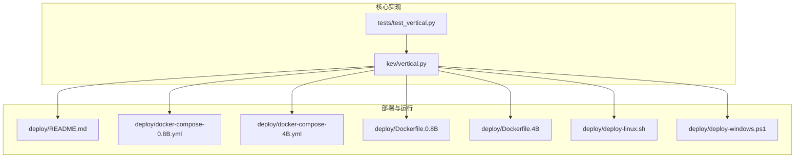
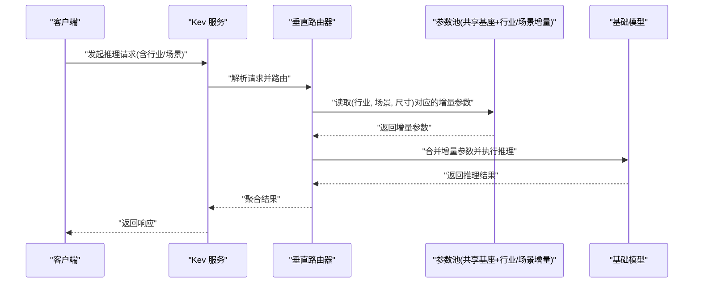
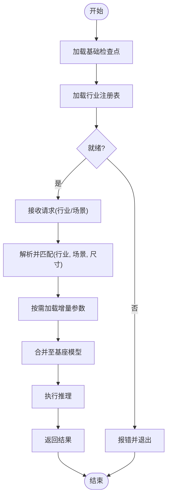
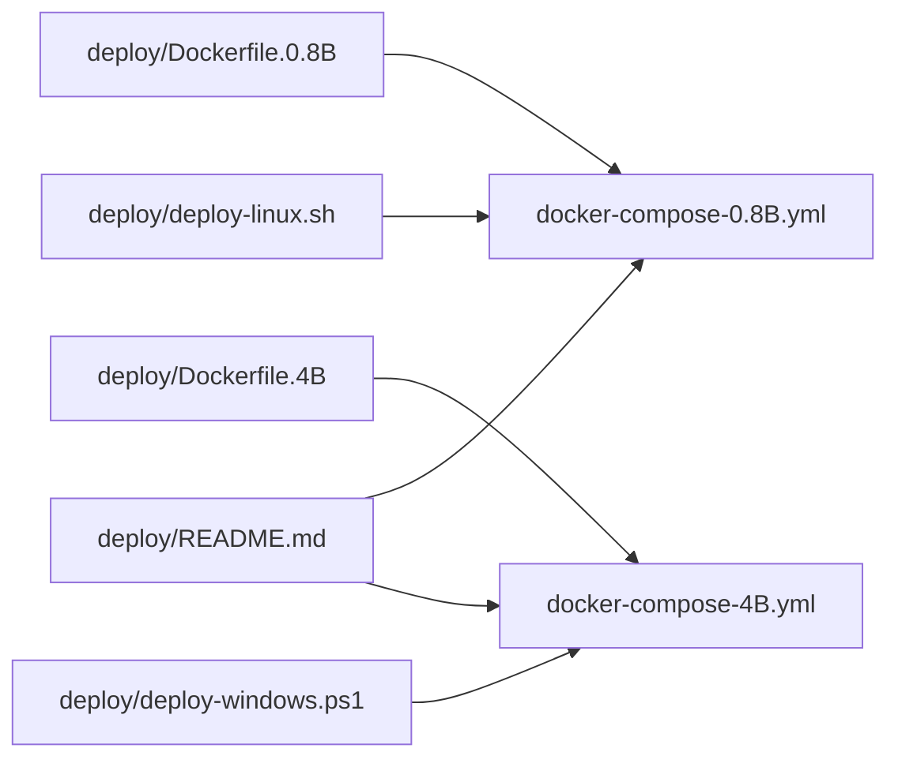
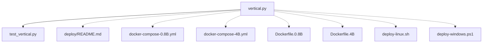

# 垂直部署系统

<cite>
**本文引用的文件**   
- [vertical.py](file://kev/vertical.py)
- [test_vertical.py](file://tests/test_vertical.py)
- [deploy/README.md](file://deploy/README.md)
- [deploy/docker-compose-0.8B.yml](file://deploy/docker-compose-0.8B.yml)
- [deploy/docker-compose-4B.yml](file://deploy/docker-compose-4B.yml)
- [deploy/Dockerfile.0.8B](file://deploy/Dockerfile.0.8B)
- [deploy/Dockerfile.4B](file://deploy/Dockerfile.4B)
- [deploy/deploy-linux.sh](file://deploy/deploy-linux.sh)
- [deploy/deploy-windows.ps1](file://deploy/deploy-windows.ps1)
</cite>

## 目录
1. [简介](#简介)
2. [项目结构](#项目结构)
3. [核心组件](#核心组件)
4. [架构总览](#架构总览)
5. [详细组件分析](#详细组件分析)
6. [依赖关系分析](#依赖关系分析)
7. [性能考虑](#性能考虑)
8. [故障排查指南](#故障排查指南)
9. [结论](#结论)
10. [附录](#附录)

## 简介
本文件面向“垂直部署系统”，聚焦于在 Kev 项目中以“行业/场景”为维度的轻量级部署方案。其核心思想是：不训练新模型，而是基于已发布的检查点（如 kev-0.8b、kev-4b），通过路由与参数池化机制，将不同行业/场景的增量适配参数进行复用与共享，从而显著降低多行业部署的资源成本与运维复杂度。

## 项目结构
围绕垂直部署的相关代码与部署脚本主要分布在以下位置：
- 核心逻辑：kev/vertical.py
- 测试用例：tests/test_vertical.py
- 容器化与编排：deploy/*（Dockerfile、docker-compose、部署脚本）

**图表来源**
- [vertical.py:1-20](file://kev/vertical.py#L1-L20)
- [deploy/README.md:1-50](file://deploy/README.md#L1-L50)
- [deploy/docker-compose-0.8B.yml:1-40](file://deploy/docker-compose-0.8B.yml#L1-L40)
- [deploy/docker-compose-4B.yml:1-40](file://deploy/docker-compose-4B.yml#L1-L40)
- [deploy/Dockerfile.0.8B:1-40](file://deploy/Dockerfile.0.8B#L1-L40)
- [deploy/Dockerfile.4B:1-40](file://deploy/Dockerfile.4B#L1-L40)
- [deploy/deploy-linux.sh:1-40](file://deploy/deploy-linux.sh#L1-L40)
- [deploy/deploy-windows.ps1:1-40](file://deploy/deploy-windows.ps1#L1-L40)

**章节来源**
- [vertical.py:1-20](file://kev/vertical.py#L1-L20)
- [deploy/README.md:1-50](file://deploy/README.md#L1-L50)

## 核心组件
- 垂直部署入口与配置：负责加载行业注册表、选择并组合参数池、对外暴露推理接口。
- 行业注册表：按（行业、场景、尺寸）维度组织可路由的增量参数。
- 参数池化机制：共享基础模型权重，仅按需加载行业/场景相关的小参数集，实现低成本多租户部署。
- 部署脚本与容器镜像：提供跨平台一键部署能力，封装服务启动、端口映射与环境准备。

**章节来源**
- [vertical.py:433-446](file://kev/vertical.py#L433-L446)
- [vertical.py:617-625](file://kev/vertical.py#L617-L625)
- [vertical.py:746-755](file://kev/vertical.py#L746-L755)

## 架构总览
下图展示了垂直部署的系统组成与数据流：客户端请求进入服务后，由路由器根据行业/场景选择对应参数子集，再与共享的基础模型权重合并后进行推理；结果返回客户端。

**图表来源**
- [vertical.py:433-446](file://kev/vertical.py#L433-L446)
- [vertical.py:617-625](file://kev/vertical.py#L617-L625)
- [vertical.py:746-755](file://kev/vertical.py#L746-L755)

## 详细组件分析

### 垂直部署模块（kev/vertical.py）
- 职责边界
  - 定义垂直部署的运行方式与约束：不是新模型，而是对已发布检查点的复用与扩展。
  - 维护行业注册表与路由策略，支持外部替换或扩展注册表。
  - 实现参数池化与按需加载，使多行业/场景部署具备低成本特性。
  - 提供测量与统计口径：以（行业、场景、尺寸）为单位度量资源占用与调用路径。

- 关键流程
  - 初始化阶段：加载基础检查点与行业注册表，构建路由索引。
  - 请求处理阶段：解析请求中的行业/场景信息，定位对应增量参数，合并到基座模型并推理。
  - 资源管理阶段：按需加载/释放增量参数，避免常驻内存造成浪费。

**图表来源**
- [vertical.py:1-20](file://kev/vertical.py#L1-L20)
- [vertical.py:433-446](file://kev/vertical.py#L433-L446)
- [vertical.py:617-625](file://kev/vertical.py#L617-L625)
- [vertical.py:746-755](file://kev/vertical.py#L746-L755)

**章节来源**
- [vertical.py:1-20](file://kev/vertical.py#L1-L20)
- [vertical.py:433-446](file://kev/vertical.py#L433-L446)
- [vertical.py:617-625](file://kev/vertical.py#L617-L625)
- [vertical.py:746-755](file://kev/vertical.py#L746-L755)

### 测试与验证（tests/test_vertical.py）
- 关注点
  - 验证参数池化的正确性与经济性：确认仅在需要时加载增量参数，且不会重复加载。
  - 覆盖路由与注册表的常见路径与边界情况。

**章节来源**
- [test_vertical.py:351-360](file://tests/test_vertical.py#L351-L360)

### 部署与运行（deploy/*）
- 容器镜像
  - Dockerfile.0.8B、Dockerfile.4B：分别针对 0.8B 与 4B 模型的运行环境打包。
- 编排文件
  - docker-compose-0.8B.yml、docker-compose-4B.yml：定义服务端口、卷挂载、环境变量等。
- 部署脚本
  - deploy-linux.sh、deploy-windows.ps1：封装跨平台的一键部署流程。
- 文档
  - deploy/README.md：说明部署步骤、端口、环境变量与常见问题。

**图表来源**
- [deploy/Dockerfile.0.8B:1-40](file://deploy/Dockerfile.0.8B#L1-L40)
- [deploy/Dockerfile.4B:1-40](file://deploy/Dockerfile.4B#L1-L40)
- [deploy/docker-compose-0.8B.yml:1-40](file://deploy/docker-compose-0.8B.yml#L1-L40)
- [deploy/docker-compose-4B.yml:1-40](file://deploy/docker-compose-4B.yml#L1-L40)
- [deploy/deploy-linux.sh:1-40](file://deploy/deploy-linux.sh#L1-L40)
- [deploy/deploy-windows.ps1:1-40](file://deploy/deploy-windows.ps1#L1-L40)
- [deploy/README.md:1-50](file://deploy/README.md#L1-L50)

**章节来源**
- [deploy/README.md:1-50](file://deploy/README.md#L1-L50)
- [deploy/docker-compose-0.8B.yml:1-40](file://deploy/docker-compose-0.8B.yml#L1-L40)
- [deploy/docker-compose-4B.yml:1-40](file://deploy/docker-compose-4B.yml#L1-L40)
- [deploy/Dockerfile.0.8B:1-40](file://deploy/Dockerfile.0.8B#L1-L40)
- [deploy/Dockerfile.4B:1-40](file://deploy/Dockerfile.4B#L1-L40)
- [deploy/deploy-linux.sh:1-40](file://deploy/deploy-linux.sh#L1-L40)
- [deploy/deploy-windows.ps1:1-40](file://deploy/deploy-windows.ps1#L1-L40)

## 依赖关系分析
- 模块内聚与耦合
  - vertical.py 作为核心模块，集中了路由、注册表与参数池化逻辑，内聚度高。
  - 测试模块 test_vertical.py 依赖 vertical.py 的行为契约，用于回归与稳定性保障。
  - 部署脚本与镜像文件与 vertical.py 无直接代码耦合，但与其运行假设（端口、环境变量、模型尺寸）保持一致。

**图表来源**
- [vertical.py:433-446](file://kev/vertical.py#L433-L446)
- [deploy/README.md:1-50](file://deploy/README.md#L1-L50)

**章节来源**
- [vertical.py:433-446](file://kev/vertical.py#L433-L446)
- [deploy/README.md:1-50](file://deploy/README.md#L1-L50)

## 性能考虑
- 参数池化带来的收益
  - 共享基础模型权重，仅按需加载行业/场景增量参数，显著降低显存与磁盘占用。
  - 减少冷启动开销，提升多行业/场景并发下的吞吐能力。
- 路由与合并的开销
  - 路由查找应使用高效索引结构，避免线性扫描。
  - 增量参数的合并应尽量就地更新，减少中间对象创建。
- 缓存与预热
  - 对高频（行业、场景）组合进行参数预热，降低首次请求延迟。
- 资源隔离
  - 针对不同尺寸的模型（如 0.8B、4B）采用独立进程或容器，避免相互干扰。

[本节为通用指导，无需特定文件引用]

## 故障排查指南
- 现象：服务启动失败或端口冲突
  - 检查 docker-compose 中端口映射是否与宿主冲突。
  - 核对环境变量是否包含必要的模型路径与尺寸标识。
- 现象：推理延迟高或显存不足
  - 确认是否频繁切换不同（行业、场景）导致增量参数反复加载。
  - 评估是否需要开启参数预热或调整批大小。
- 现象：路由错误导致结果异常
  - 校验行业注册表是否完整，是否存在缺失的（行业、场景、尺寸）条目。
  - 检查请求中行业/场景字段是否符合注册表约定。

**章节来源**
- [deploy/README.md:1-50](file://deploy/README.md#L1-L50)
- [test_vertical.py:351-360](file://tests/test_vertical.py#L351-L360)

## 结论
垂直部署系统通过“共享基座 + 按需增量参数”的设计，实现了低成本、可扩展的多行业/场景推理服务。配合容器化与跨平台部署脚本，能够快速落地生产环境。建议在上线前完成参数预热、路由索引优化与容量规划，以获得更稳定的性能表现。

[本节为总结性内容，无需特定文件引用]

## 附录
- 术语
  - 基座模型：已发布的通用检查点（如 kev-0.8b、kev-4b）。
  - 增量参数：针对特定行业/场景训练的轻量级适配参数。
  - 参数池化：将增量参数集中管理并按需加载的技术手段。
  - 路由：根据请求上下文（行业、场景）选择对应增量参数的过程。

[本节为概念性内容，无需特定文件引用]