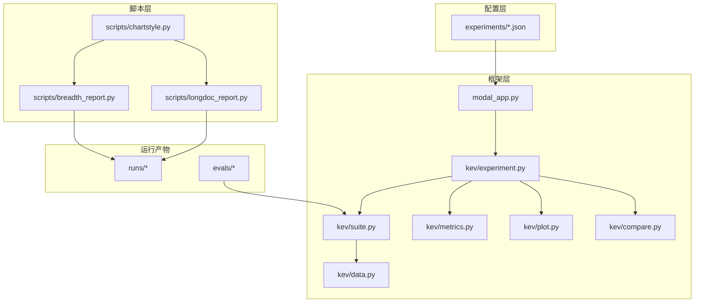
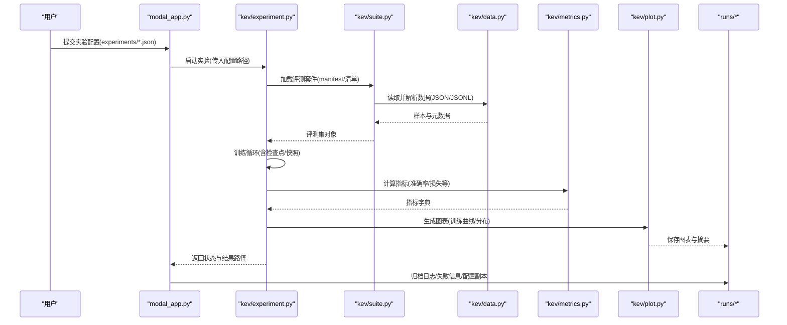
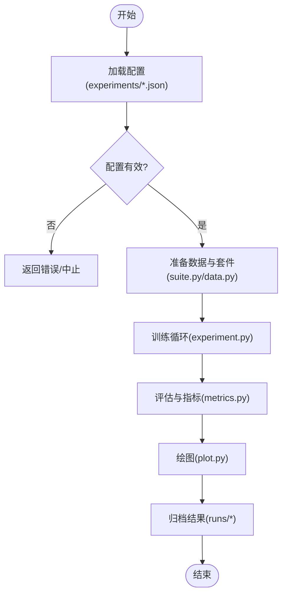
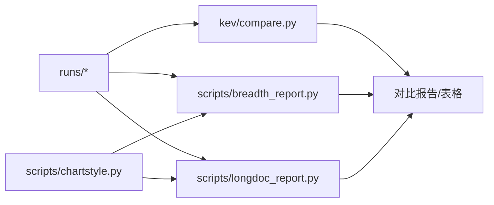
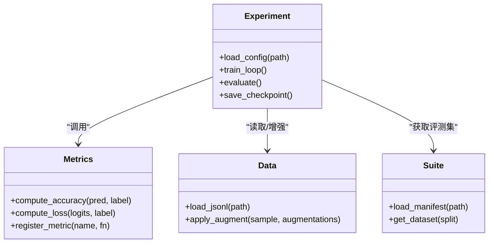
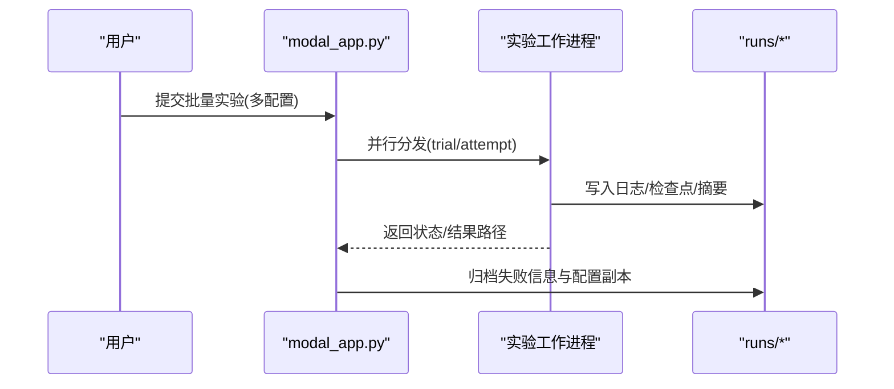
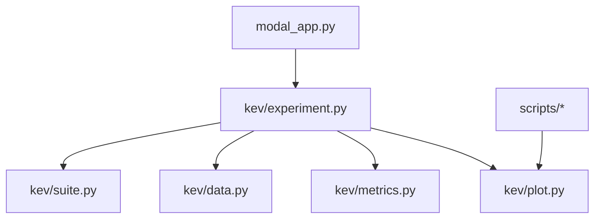

# 实验框架

<cite>
**本文引用的文件**   
- [README.md](file://README.md)
- [PLAN.md](file://PLAN.md)
- [modal_app.py](file://modal_app.py)
- [kev/experiment.py](file://kev/experiment.py)
- [kev/suite.py](file://kev/suite.py)
- [kev/data.py](file://kev/data.py)
- [kev/metrics.py](file://kev/metrics.py)
- [kev/plot.py](file://kev/plot.py)
- [kev/compare.py](file://kev/compare.py)
- [experiments/smoke.json](file://experiments/smoke.json)
- [experiments/v7-final.json](file://experiments/v7-final.json)
- [experiments/rounds/r10.json](file://experiments/rounds/r10.json)
- [scripts/breadth_report.py](file://scripts/breadth_report.py)
- [scripts/longdoc_report.py](file://scripts/longdoc_report.py)
- [scripts/chartstyle.py](file://scripts/chartstyle.py)
</cite>

## 目录
1. [简介](#简介)
2. [项目结构](#项目结构)
3. [核心组件](#核心组件)
4. [架构总览](#架构总览)
5. [详细组件分析](#详细组件分析)
6. [依赖关系分析](#依赖关系分析)
7. [性能与可扩展性](#性能与可扩展性)
8. [故障排查指南](#故障排查指南)
9. [结论](#结论)
10. [附录](#附录)

## 简介
本文件为 Kev 实验框架的综合文档，面向实验设计者、训练工程师与结果分析师。内容覆盖：
- 实验配置格式（JSON）：字段定义、参数说明、超参数搜索空间组织方式
- 实验执行流程：从配置加载到训练、评估、结果归档的端到端过程
- 结果分析工具：对比、可视化、统计分析脚本的使用方法与输出规范
- 实验管理最佳实践：命名约定、版本控制、结果归档策略
- 自定义扩展：新增评估指标、训练策略、数据增强方法的集成路径
- 分布式实验：在 Modal 环境下的配置与执行要点

## 项目结构
Kev 仓库围绕“实验配置 + 运行编排 + 评估与分析”的组织方式展开：
- experiments：存放所有 JSON 实验配置，按轮次、模型规模、任务类型等维度分类
- kev：框架核心代码，包含实验生命周期、数据加载、指标计算、绘图与对比
- scripts：结果分析与可视化脚本集合
- runs：每次实验的运行产物（日志、检查点、摘要、失败记录等）
- evals：评测数据集与清单（manifest）
- modal_app.py：基于 Modal 的实验调度与远程执行入口

图表来源
- [modal_app.py:700-900](file://modal_app.py#L700-L900)
- [kev/experiment.py:1-200](file://kev/experiment.py#L1-L200)
- [kev/suite.py:120-170](file://kev/suite.py#L120-L170)
- [kev/data.py:350-390](file://kev/data.py#L350-L390)
- [scripts/breadth_report.py:1-120](file://scripts/breadth_report.py#L1-L120)
- [scripts/longdoc_report.py:1-120](file://scripts/longdoc_report.py#L1-L120)
- [scripts/chartstyle.py:1-120](file://scripts/chartstyle.py#L1-L120)

章节来源
- [README.md:1-120](file://README.md#L1-L120)
- [PLAN.md:350-370](file://PLAN.md#L350-L370)

## 核心组件
- 实验配置（JSON）：描述训练目标、数据源、优化器、学习率调度、评估套件、保存策略、资源限制等
- 实验引擎（experiment.py）：解析配置、构建训练循环、触发评估、写入结果与检查点
- 套件与数据（suite.py, data.py）：统一评测集加载、样本解析、标签处理
- 指标与绘图（metrics.py, plot.py）：标准化指标计算、图表生成
- 对比工具（compare.py）：跨实验结果聚合与差异分析
- 调度与执行（modal_app.py）：在云端集群上并行化执行实验，管理超时、重试、日志与失败信息

章节来源
- [kev/experiment.py:1-200](file://kev/experiment.py#L1-L200)
- [kev/suite.py:120-170](file://kev/suite.py#L120-L170)
- [kev/data.py:350-390](file://kev/data.py#L350-L390)
- [kev/metrics.py:1-120](file://kev/metrics.py#L1-L120)
- [kev/plot.py:1-120](file://kev/plot.py#L1-L120)
- [kev/compare.py:1-120](file://kev/compare.py#L1-L120)
- [modal_app.py:700-900](file://modal_app.py#L700-L900)

## 架构总览
下图展示从配置到结果的完整链路：用户提交 JSON 配置 → Modal 调度 → 实验引擎加载配置 → 数据与套件准备 → 训练与评估 → 指标与绘图 → 结果归档与对比。

图表来源
- [modal_app.py:700-900](file://modal_app.py#L700-L900)
- [kev/experiment.py:1-200](file://kev/experiment.py#L1-L200)
- [kev/suite.py:120-170](file://kev/suite.py#L120-L170)
- [kev/data.py:350-390](file://kev/data.py#L350-L390)
- [kev/metrics.py:1-120](file://kev/metrics.py#L1-L120)
- [kev/plot.py:1-120](file://kev/plot.py#L1-L120)

## 详细组件分析

### 实验配置格式（JSON）
- 位置与组织
  - 根级示例：experiments/smoke.json、experiments/v7-final.json
  - 轮次模板：experiments/rounds/r10.json 等
  - 自动探索：experiments/auto/*.json
- 典型字段（概念性说明）
  - 模型与初始化：模型名称/权重路径、是否微调、LoRA/全量等
  - 数据与套件：评测集清单路径、数据预处理选项、采样比例
  - 训练超参：学习率、批次大小、步数、优化器、调度器
  - 评估与指标：评估套件、指标列表、阈值/判定规则
  - 存储与快照：检查点频率、快照分数点、结果输出目录
  - 资源与调度：设备/GPU、并发度、超时、重试次数
- 超参数搜索空间
  - 通过 experiments/auto/*.json 或 rounds 模板组合不同超参进行网格/随机搜索
  - 建议将可变参数以占位符形式置于模板中，由调度器实例化具体配置

章节来源
- [experiments/smoke.json:1-120](file://experiments/smoke.json#L1-L120)
- [experiments/v7-final.json:1-120](file://experiments/v7-final.json#L1-L120)
- [experiments/rounds/r10.json:1-120](file://experiments/rounds/r10.json#L1-L120)

### 实验执行流程
- 配置加载
  - 由 modal_app.py 接收配置路径，调用实验引擎
  - experiment.py 解析 JSON，校验必填字段，合并默认值
- 数据与套件准备
  - suite.py 加载 manifest/清单，data.py 解析 JSON/JSONL 样本
- 训练与评估
  - experiment.py 驱动训练循环，周期性保存检查点与快照
  - metrics.py 计算指标；plot.py 生成图表
- 结果归档
  - modal_app.py 收集日志、失败信息与配置副本，写入 runs/*

图表来源
- [modal_app.py:700-900](file://modal_app.py#L700-L900)
- [kev/experiment.py:1-200](file://kev/experiment.py#L1-L200)
- [kev/suite.py:120-170](file://kev/suite.py#L120-L170)
- [kev/data.py:350-390](file://kev/data.py#L350-L390)
- [kev/metrics.py:1-120](file://kev/metrics.py#L1-L120)
- [kev/plot.py:1-120](file://kev/plot.py#L1-L120)

章节来源
- [modal_app.py:700-900](file://modal_app.py#L700-L900)
- [kev/experiment.py:1-200](file://kev/experiment.py#L1-L200)

### 结果分析工具
- 对比脚本
  - compare.py：聚合多个 runs/* 的结果，生成横向对比表与显著性差异提示
- 报告脚本
  - breadth_report.py：针对广度评测的任务报告，汇总关键指标与趋势
  - longdoc_report.py：长文档评测的报告生成，包含上下文长度与性能关系图
- 图表风格
  - chartstyle.py：统一的配色、字体与布局样式，确保报告一致性

图表来源
- [kev/compare.py:1-120](file://kev/compare.py#L1-L120)
- [scripts/breadth_report.py:1-120](file://scripts/breadth_report.py#L1-L120)
- [scripts/longdoc_report.py:1-120](file://scripts/longdoc_report.py#L1-L120)
- [scripts/chartstyle.py:1-120](file://scripts/chartstyle.py#L1-L120)

章节来源
- [kev/compare.py:1-120](file://kev/compare.py#L1-L120)
- [scripts/breadth_report.py:1-120](file://scripts/breadth_report.py#L1-L120)
- [scripts/longdoc_report.py:1-120](file://scripts/longdoc_report.py#L1-L120)
- [scripts/chartstyle.py:1-120](file://scripts/chartstyle.py#L1-L120)

### 实验管理最佳实践
- 命名约定
  - 配置：experiments/{task}-{model}-{version}.json
  - 轮次：experiments/rounds/r{N}.json
  - 运行：runs/{run-id}/trial-{T}/attempt-{A}/
- 版本控制
  - 将 experiments/*.json 纳入 Git，配合 commit 消息记录变更原因与影响范围
  - 使用分支隔离大改动（如架构/数据管线），主分支仅保留稳定配置
- 结果归档
  - 每个 trial/attempt 独立目录，包含日志、检查点、摘要、失败记录
  - 定期将重要 runs/* 归档至长期存储，并保留 provenance（配置副本、Git 提交哈希）

章节来源
- [modal_app.py:700-900](file://modal_app.py#L700-L900)
- [PLAN.md:350-370](file://PLAN.md#L350-L370)

### 自定义实验类型开发指南
- 新增评估指标
  - 在 metrics.py 中实现新指标函数，遵循统一输入输出接口
  - 在实验配置中注册该指标，并在评估阶段调用
- 新增训练策略
  - 在 experiment.py 中扩展训练循环，支持新的优化策略或调度器
  - 通过配置字段启用/切换策略
- 新增数据增强
  - 在 data.py 中增加增强管道，提供可配置的增强方法列表
  - 在 suite.py 的数据加载流程中注入增强步骤

图表来源
- [kev/experiment.py:1-200](file://kev/experiment.py#L1-L200)
- [kev/metrics.py:1-120](file://kev/metrics.py#L1-L120)
- [kev/data.py:350-390](file://kev/data.py#L350-L390)
- [kev/suite.py:120-170](file://kev/suite.py#L120-L170)

章节来源
- [kev/experiment.py:1-200](file://kev/experiment.py#L1-L200)
- [kev/metrics.py:1-120](file://kev/metrics.py#L1-L120)
- [kev/data.py:350-390](file://kev/data.py#L350-L390)
- [kev/suite.py:120-170](file://kev/suite.py#L120-L170)

### 分布式实验配置与执行
- 使用 Modal 进行分布式执行
  - modal_app.py 负责创建任务、分配资源、设置超时与重试
  - 支持多 GPU/多节点并行，按 trial/attempt 粒度调度
- 配置要点
  - 在 JSON 中指定设备与并发度
  - 设置超时与重试策略，避免长时间阻塞
  - 使用 runs/* 中的日志与失败信息进行监控与诊断

图表来源
- [modal_app.py:700-900](file://modal_app.py#L700-L900)

章节来源
- [modal_app.py:700-900](file://modal_app.py#L700-L900)

## 依赖关系分析
- 模块耦合
  - experiment.py 为核心协调者，依赖 suite.py、data.py、metrics.py、plot.py
  - modal_app.py 作为外部调度器，与 experiment.py 解耦，通过配置路径通信
- 外部依赖
  - JSON/JSONL 数据格式（suite.py、data.py）
  - 图表库（plot.py、scripts/chartstyle.py）
  - 云端运行时（modal_app.py）

图表来源
- [kev/experiment.py:1-200](file://kev/experiment.py#L1-L200)
- [kev/suite.py:120-170](file://kev/suite.py#L120-L170)
- [kev/data.py:350-390](file://kev/data.py#L350-L390)
- [kev/metrics.py:1-120](file://kev/metrics.py#L1-L120)
- [kev/plot.py:1-120](file://kev/plot.py#L1-L120)
- [modal_app.py:700-900](file://modal_app.py#L700-L900)
- [scripts/chartstyle.py:1-120](file://scripts/chartstyle.py#L1-L120)

章节来源
- [kev/experiment.py:1-200](file://kev/experiment.py#L1-L200)
- [modal_app.py:700-900](file://modal_app.py#L700-L900)

## 性能与可扩展性
- 训练效率
  - 合理设置批次大小与微批次平衡策略，结合共享前缀与 FSDP 提升吞吐
  - 使用快照分数点减少不必要的全量保存
- 评估开销
  - 对大规模评测集采用分批评估与缓存机制
- 可扩展性
  - 指标与数据增强的插件化设计便于扩展
  - 通过 Modal 弹性扩缩容应对峰值负载

[本节为通用指导，不直接分析具体文件]

## 故障排查指南
- 常见错误
  - 配置缺失或字段类型错误：检查 experiments/*.json 必填项与类型
  - 数据解析异常：确认 evals 清单与 JSON/JSONL 格式一致
  - 训练中断：查看 runs/* 日志与失败记录，调整超时与重试
- 定位方法
  - 使用 compare.py 对比相邻试验的差异，定位回归
  - 使用 breadth_report.py/longdoc_report.py 快速发现指标异常
- 恢复策略
  - 从最近检查点恢复训练（resume）
  - 清理失败 attempt 后重新调度

章节来源
- [modal_app.py:700-900](file://modal_app.py#L700-L900)
- [PLAN.md:350-370](file://PLAN.md#L350-L370)

## 结论
Kev 实验框架以 JSON 配置为中心，结合 Modal 分布式调度与模块化核心代码，提供了从训练到评估、归档与分析的完整闭环。通过规范的命名与版本控制、完善的脚本工具链以及可扩展的指标/数据增强接口，团队可以高效开展大规模实验并持续迭代模型能力。

[本节为总结性内容，不直接分析具体文件]

## 附录
- 常用命令与路径
  - 运行实验：通过 modal_app.py 提交 experiments/*.json
  - 查看结果：runs/{run-id}/trial-{T}/attempt-{A}/
  - 生成报告：scripts/breadth_report.py、scripts/longdoc_report.py
- 参考样例
  - experiments/smoke.json、experiments/v7-final.json、experiments/rounds/r10.json

[本节为补充信息，不直接分析具体文件]