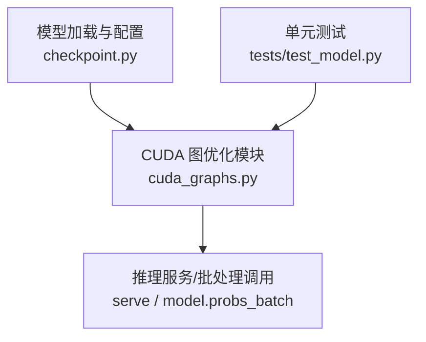
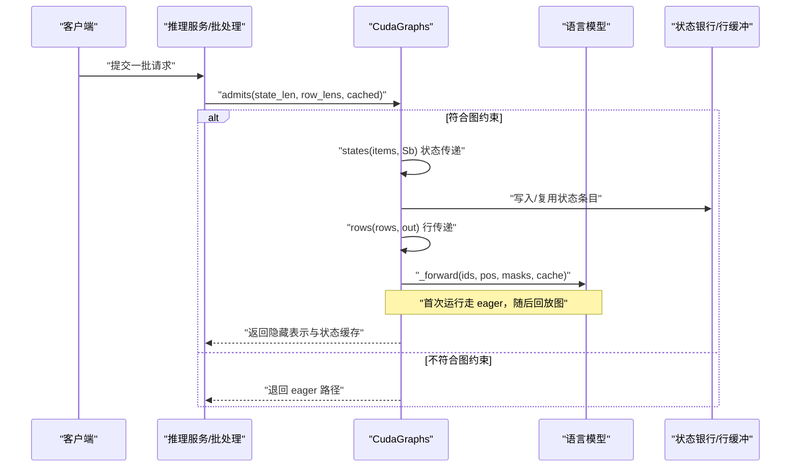
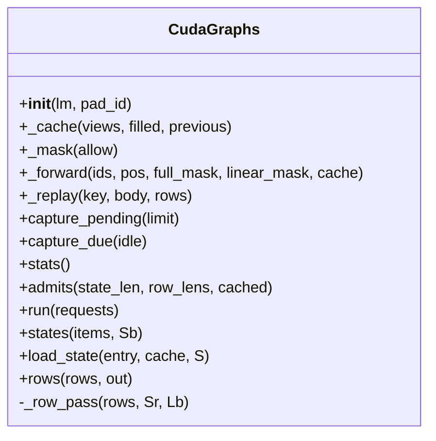
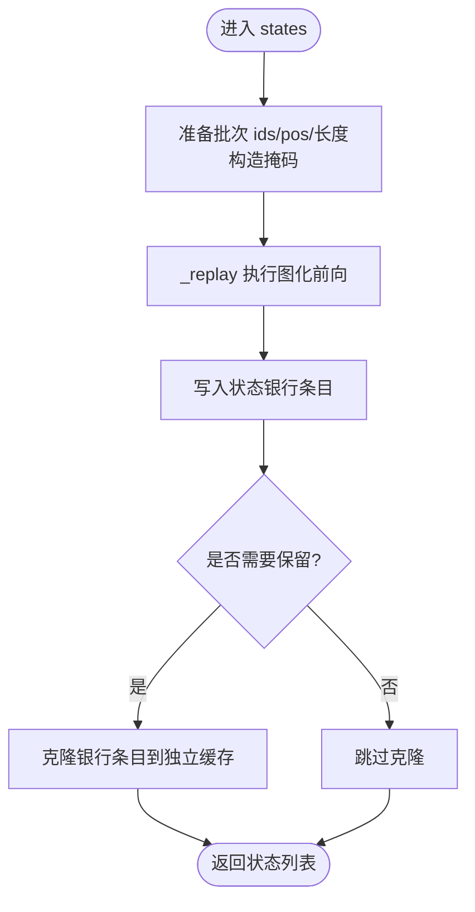
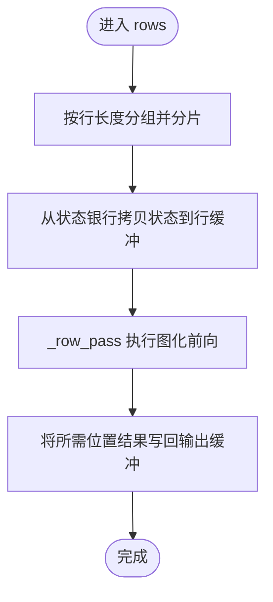
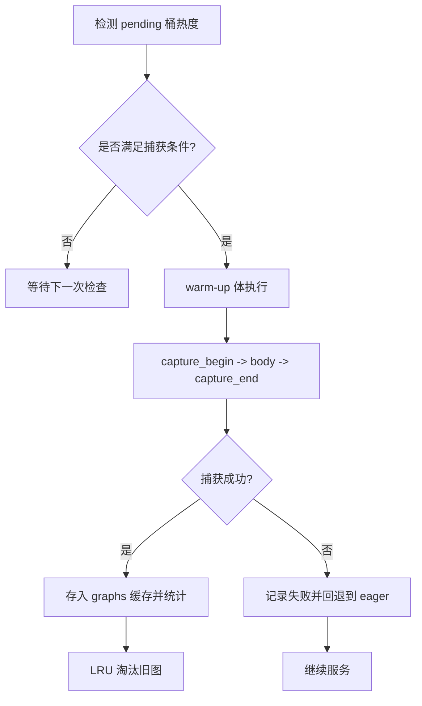
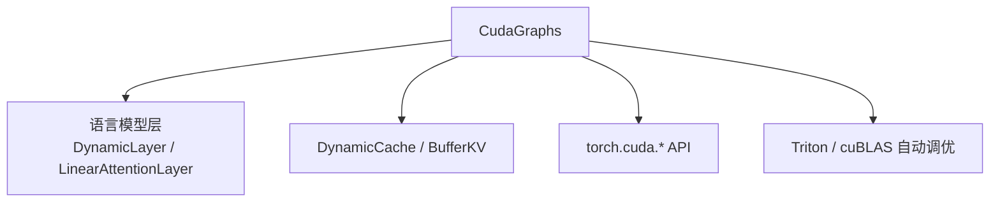

<cite>
**本文引用的文件**   
- [cuda_graphs.py](file://kev/cuda_graphs.py)
- [test_model.py](file://tests/test_model.py)
</cite>

## 目录
1. [简介](#简介)
2. [项目结构](#项目结构)
3. [核心组件](#核心组件)
4. [架构总览](#架构总览)
5. [详细组件分析](#详细组件分析)
6. [依赖关系分析](#依赖关系分析)
7. [性能考量](#性能考量)
8. [故障排除指南](#故障排除指南)
9. [结论](#结论)
10. [附录](#附录)

## 简介
本技术文档聚焦 Kev 推理路径中的 CUDA Graph 优化实现，围绕 torch.cuda.CUDAGraph 的捕获与回放机制，解释如何通过“状态传递（state pass）”和“行传递（row pass）”两种模式将大量内核启动合并为单次执行，从而显著降低 Python/CUDA 调度开销。文档还详细说明缓冲区管理策略：状态银行（state bank）与行缓冲区的内存布局、预分配固定大小缓冲以避免动态分配；以及热桶检测、异步捕获、失败回退等关键流程。最后给出性能基准测试要点、调优参数说明（如 GRAPH_TOKENS、GRAPH_STATE、GRAPH_ROW 等）、使用示例与常见问题排查建议。

## 项目结构
Kev 中与 CUDA 图优化直接相关的代码集中在 kev/cuda_graphs.py，单元测试位于 tests/test_model.py。整体组织方式以功能模块划分：CUDA 图优化逻辑独立成模块，便于在推理服务中按需启用。

图表来源
- [cuda_graphs.py:165-375](file://kev/cuda_graphs.py#L165-L375)
- [test_model.py:321-351](file://tests/test_model.py#L321-L351)

章节来源
- [cuda_graphs.py:165-375](file://kev/cuda_graphs.py#L165-L375)
- [test_model.py:321-351](file://tests/test_model.py#L321-L351)

## 核心组件
- CudaGraphs：封装 CUDA Graph 的捕获、回放、缓存与统计；提供状态传递与行传递两个关键方法；维护状态银行与行缓冲区；负责热桶检测与异步捕获。
- Buffers：底层缓冲抽象，用于按层类型生成视图并复用固定大小的 GPU 内存。
- DynamicCache/BufferKV/LinearAttentionLayer/DynamicLayer：模型侧缓存与注意力层接口，要求仅支持注意力层与单态 DeltaNet 层的原地更新语义，以保证图捕获期间缓冲区一致性。

章节来源
- [cuda_graphs.py:165-375](file://kev/cuda_graphs.py#L165-L375)

## 架构总览
下图展示从请求进入、到状态传递与行传递、再到图回放的整体数据流与控制流。

图表来源
- [cuda_graphs.py:267-375](file://kev/cuda_graphs.py#L267-L375)

## 详细组件分析

### CudaGraphs 类与关键方法
- 初始化与校验
  - 创建 CUDA 图池与捕获流；建立图缓存、待捕获队列、失败记录与统计。
  - 通过一次 eager 前向探测缓存布局，校验仅允许注意力层与单态 DeltaNet 层，否则抛出异常。
  - 预分配状态银行与行缓冲区，构造共享视图。
- 回放与捕获
  - _replay：若已有图则回放；否则走 eager 并在 pending 中排队等待捕获。
  - capture_pending：按热度优先顺序对 pending 桶进行预热与捕获；失败时保留 eager 路径并记录失败原因。
  - capture_due：根据空闲或热桶阈值决定是否触发一次捕获。
- 推理调度
  - admits：判断请求是否可被图化路径处理（基于行长度与状态长度）。
  - run：分组状态传递与行传递，输出拼接结果与状态缓存。
  - states：批量新状态的图化前向，产出状态银行条目与可选的独立缓存副本。
  - load_state：将外部缓存拷贝进状态银行指定条目。
  - rows/_row_pass：批量问题行的图化前向，将所需位置的结果写回输出缓冲。

图表来源
- [cuda_graphs.py:165-375](file://kev/cuda_graphs.py#L165-L375)

章节来源
- [cuda_graphs.py:165-375](file://kev/cuda_graphs.py#L165-L375)

### 状态传递（state pass）
- 目标：为一批新状态（尚未存在于状态银行）执行一次图化前向，产出每个状态对应的银行条目。
- 输入：items = [(ids, pos, keep)]，每个状态长度不超过 GRAPH_STATE。
- 过程：
  - 构造左填充的 ids/pos/真实长度行，构建注意力掩码与线性注意力掩码。
  - 通过 _forward 执行一次图化前向，将结果写入状态银行的右对齐区域。
  - 对需要保留的状态，复制银行条目到独立的 DynamicCache 供后续使用。
- 复杂度与收益：将多个短状态合并为一次图化前向，减少内核启动与调度开销。

图表来源
- [cuda_graphs.py:301-330](file://kev/cuda_graphs.py#L301-L330)

章节来源
- [cuda_graphs.py:301-330](file://kev/cuda_graphs.py#L301-L330)

### 行传递（row pass）
- 目标：对一批问题行（question rows）执行图化前向，读取状态银行中的对应状态，计算并写出所需的隐藏表示。
- 输入：_Row 列表，包含 ids、position、状态长度、银行条目索引、输出偏移等。
- 过程：
  - 按行长度分组，分批适配行缓冲区容量（受 GRAPH_TOKENS 限制）。
  - 从状态银行拷贝每行的最近 Sr 个状态到行缓冲，构造掩码后执行 _forward。
  - 将所需位置的隐藏表示 index_copy 到最终输出缓冲。
- 复杂度与收益：将多行合并为一次图化前向，避免逐行内核启动。

图表来源
- [cuda_graphs.py:340-375](file://kev/cuda_graphs.py#L340-L375)

章节来源
- [cuda_graphs.py:340-375](file://kev/cuda_graphs.py#L340-L375)

### 缓冲区管理与内存布局
- 状态银行（state bank）
  - 形状：[GRAPH_STATES, heads, BANK_WIDTH, dim]（注意力层），DeltaNet 层为 [GRAPH_STATES, *state]。
  - 状态右对齐于 BANK_WIDTH 末尾，便于不同长度的状态共用同一布局。
  - 通过 bank.views(GRAPH_STATES, BANK_WIDTH) 生成每层的视图，保证状态与行图共享一致布局。
- 行缓冲区（rowbuf）
  - 形状：[GRAPH_TOKENS, GRAPH_ROWS]，用于承载 ids/pos/长度等控制信息。
  - hidden 缓冲：[GRAPH_ROWS * GRAPH_ROW * hidden_size]，存放行前向中间结果。
- 预分配策略
  - 所有缓冲在初始化阶段一次性分配，避免运行时动态分配导致的碎片与延迟。
  - 通过 views 与 index_select 等操作复用固定内存，提升吞吐与稳定性。

章节来源
- [cuda_graphs.py:182-188](file://kev/cuda_graphs.py#L182-L188)
- [cuda_graphs.py:308-318](file://kev/cuda_graphs.py#L308-L318)
- [cuda_graphs.py:355-374](file://kev/cuda_graphs.py#L355-L374)

### 图捕获流程：热桶检测、异步捕获、失败回退
- 热桶检测
  - 通过 pending 与 eager_runs 统计各桶的 eager 运行次数，按热度选择捕获顺序。
  - capture_due 在空闲或某桶达到 HOT_BUCKET 阈值时触发一次捕获，避免请求阻塞。
- 异步捕获
  - 使用独立 stream 与 graph_pool_handle，避免影响当前线程的活跃请求。
  - 先进行一次 warm-up 体（触发 Triton/cuBLAS 自动调优与惰性初始化），再开始 capture_begin/capture_end。
- 失败回退
  - 捕获失败时，清理可能残留的图池路由，记录失败原因，并将该桶标记为 failed，继续以 eager 路径服务。
  - 保持服务器可用性，不因个别形状失败而中断服务。

图表来源
- [cuda_graphs.py:223-263](file://kev/cuda_graphs.py#L223-L263)

章节来源
- [cuda_graphs.py:223-263](file://kev/cuda_graphs.py#L223-L263)

### 使用示例与集成点
- 在模型加载时启用 cuda_graphs=True，并通过 Checkpoint.load 传入。
- 推理入口 probs_batch 会调用 admits/run，结合状态传递与行传递完成批处理。
- 单元测试验证图化路径与 eager 路径数值一致性，覆盖超长状态与超长行场景。

章节来源
- [test_model.py:321-351](file://tests/test_model.py#L321-L351)

## 依赖关系分析
- 内部依赖
  - CudaGraphs 依赖模型配置与层类型（DynamicLayer、LinearAttentionLayer），并要求仅支持注意力层与单态 DeltaNet 层。
  - 依赖 DynamicCache/BufferKV 作为缓存视图抽象，确保图捕获期间的缓冲区一致性。
- 外部依赖
  - torch.cuda.graph_pool_handle、torch.cuda.Stream、torch.cuda.CUDAGraph 等 CUDA API。
  - Triton/cuBLAS 的自动调优与惰性初始化需在捕获外预热。

图表来源
- [cuda_graphs.py:165-375](file://kev/cuda_graphs.py#L165-L375)

章节来源
- [cuda_graphs.py:165-375](file://kev/cuda_graphs.py#L165-L375)

## 性能考量
- 内核启动合并
  - 通过 state pass 与 row pass 将数千次内核调用合并为少量图回放，显著降低调度与同步开销。
- 预分配缓冲
  - 状态银行与行缓冲一次性分配，避免运行时动态分配带来的抖动与碎片。
- 分组与分片
  - 按状态长度与行长度分组，并按 GRAPH_TOKENS 限制分片，最大化批内并行度同时避免溢出。
- 捕获时机
  - 空闲或热桶阈值触发捕获，平衡延迟与吞吐；失败回退保障服务稳定性。
- 精度与数值一致性
  - 单元测试验证图化路径与 eager 路径在 bf16/fp32 下的数值误差上限，确保优化不引入偏差。

章节来源
- [cuda_graphs.py:267-375](file://kev/cuda_graphs.py#L267-L375)
- [test_model.py:321-351](file://tests/test_model.py#L321-L351)

## 故障排除指南
- 捕获失败
  - 现象：打印“capturing ... failed, it runs eagerly”，该桶继续以 eager 路径运行。
  - 原因：形状超出图能力或显存不足；需调整 GRAPH_TOKENS/GRAPH_STATE/GRAPH_ROW 或降低并发。
  - 处理：检查日志中的错误类型与消息；必要时增大缓冲或减少批大小。
- 不支持的层类型
  - 现象：初始化时报错“CUDA graphs support attention and single-state DeltaNet cache layers only”。
  - 原因：存在非注意力或非单态 DeltaNet 层，或使用了 record_past 语义。
  - 处理：替换为支持的层类型，或关闭 cuda_graphs。
- 数值不一致
  - 现象：图化路径与 eager 路径输出差异超过阈值。
  - 原因：掩码或状态布局不一致；请检查状态右对齐与掩码构造。
  - 处理：回归单元测试用例，确认批次与长度边界情况。

章节来源
- [cuda_graphs.py:175-182](file://kev/cuda_graphs.py#L175-L182)
- [cuda_graphs.py:243-250](file://kev/cuda_graphs.py#L243-L250)
- [test_model.py:321-351](file://tests/test_model.py#L321-L351)

## 结论
Kev 的 CUDA 图优化通过状态传递与行传递两种模式，配合状态银行与行缓冲区的固定布局与预分配策略，将大量内核启动合并为少量图回放，显著提升推理吞吐与稳定性。热桶检测与异步捕获机制在保证低延迟的同时，提供失败回退以维持服务可用性。合理设置 GRAPH_TOKENS、GRAPH_STATE、GRAPH_ROW 等参数，并结合业务负载特征进行分组与分片，可在不同硬件与模型规模下取得良好性能。

## 附录

### 关键配置项与作用
- GRAPH_TOKENS：行传递中一个 pass 能容纳的 tokens 总量（约 1 GB 级别，取决于模型规模），决定行缓冲大小与分片策略。
- GRAPH_STATE：状态传递中单个状态的最大桶长度；更长状态走 eager 状态 pass 后再批行。
- GRAPH_ROW：行传递中单个问题的最大桶长度；超长问题走 eager 行路径。
- GRAPH_ROWS：每个图化 pass 处理的行数；更多行拆分为多次回放。
- GRAPH_STATES：状态传递中每次处理的条目数（状态银行条目数量）。

章节来源
- [cuda_graphs.py:44-50](file://kev/cuda_graphs.py#L44-L50)
- [cuda_graphs.py:182-188](file://kev/cuda_graphs.py#L182-L188)
- [cuda_graphs.py:267-375](file://kev/cuda_graphs.py#L267-L375)