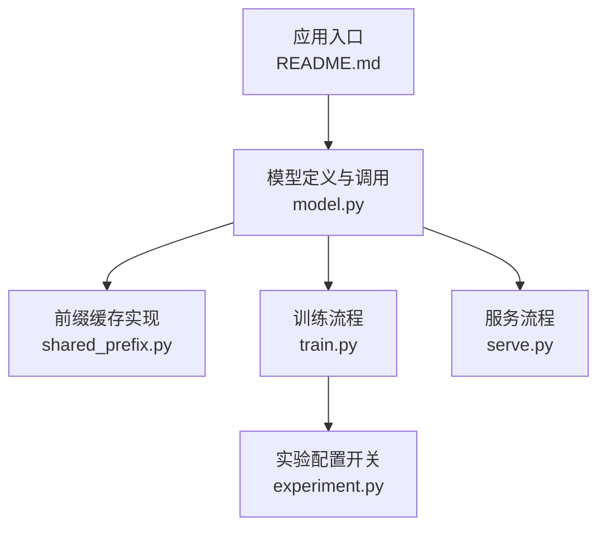
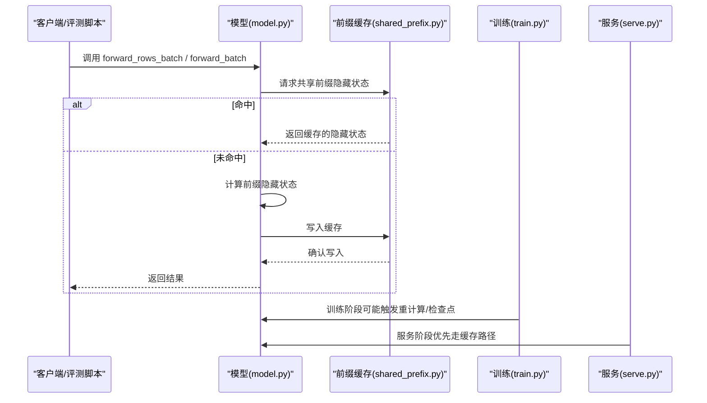
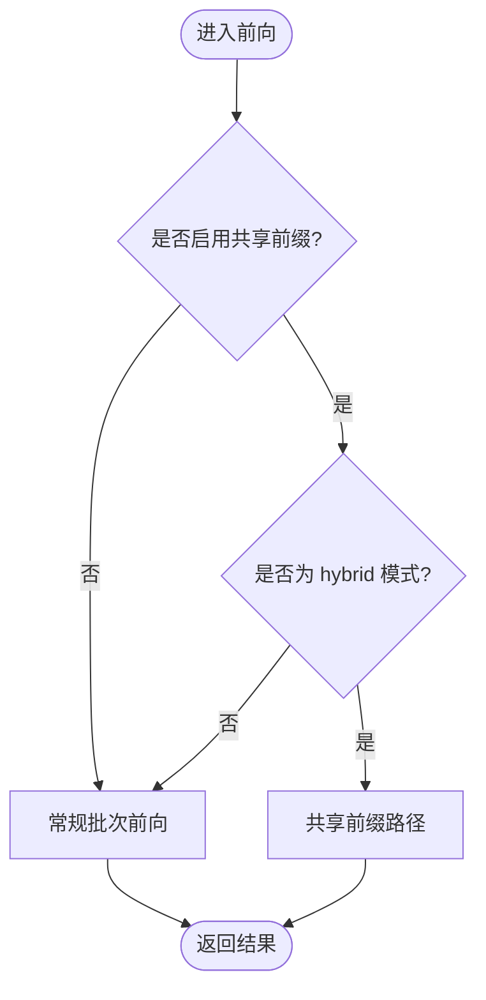
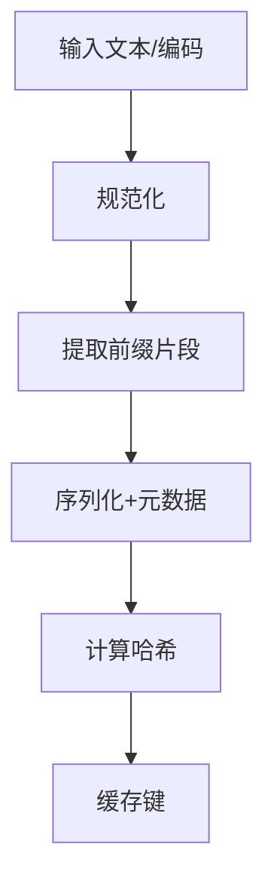
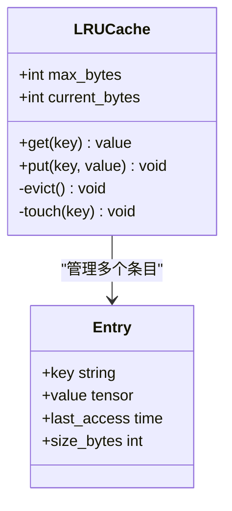
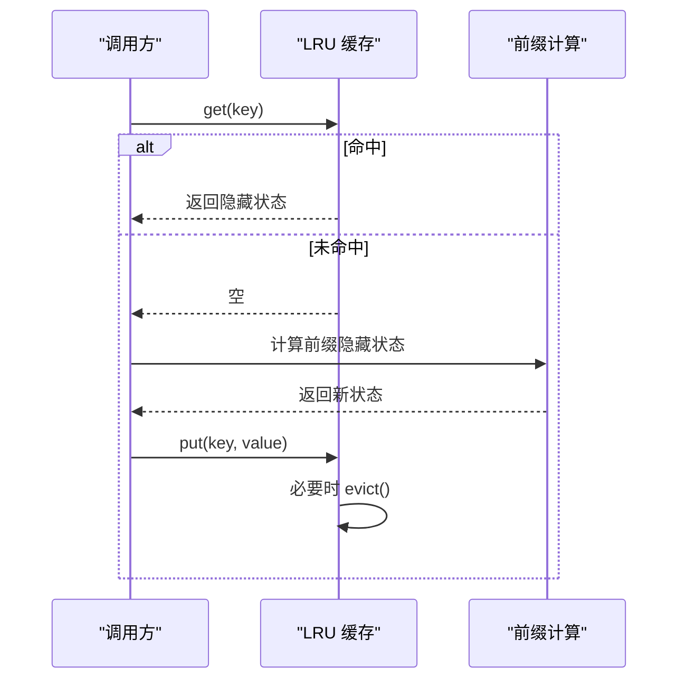
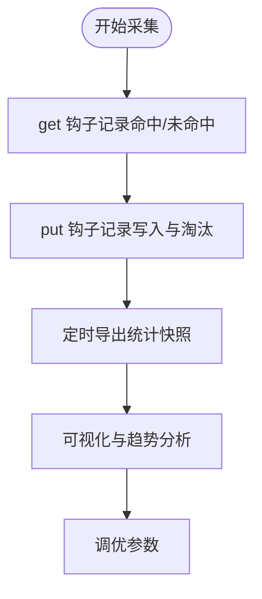
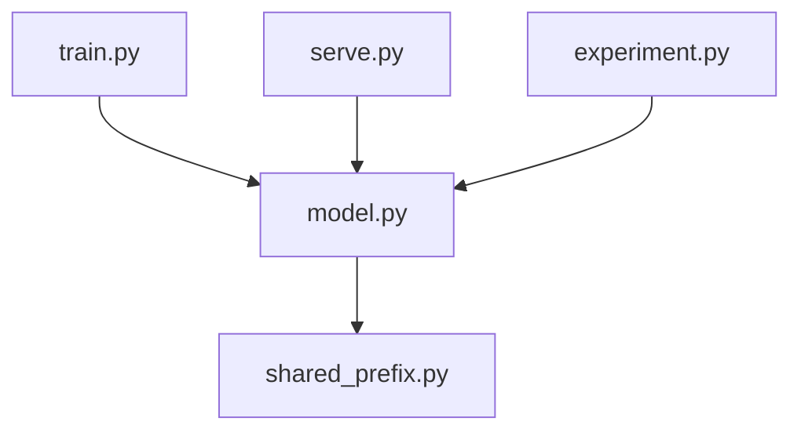

# 前缀缓存机制

<cite>
**本文引用的文件**   
- [shared_prefix.py](file://kev/shared_prefix.py)
- [model.py](file://kev/model.py)
- [train.py](file://kev/train.py)
- [experiment.py](file://kev/experiment.py)
- [serve.py](file://kev/serve.py)
- [README.md](file://README.md)
</cite>

## 目录
1. [引言](#引言)
2. [项目结构](#项目结构)
3. [核心组件](#核心组件)
4. [架构总览](#架构总览)
5. [详细组件分析](#详细组件分析)
6. [依赖关系分析](#依赖关系分析)
7. [性能考量](#性能考量)
8. [故障排查指南](#故障排查指南)
9. [结论](#结论)
10. [附录](#附录)

## 引言
本技术文档聚焦于“共享状态前缀”的前缀缓存机制，目标是解释如何通过识别并复用重复的状态序列来减少冗余计算。文档涵盖：
- 共享状态前缀的工作原理与适用场景
- 缓存键生成算法（从输入文本提取可哈希的前缀标识符）
- 缓存存储结构与淘汰策略（LRU、内存限制、多设备支持）
- 命中与未命中的处理流程
- 统计信息收集与分析工具使用方法
- 配置参数说明（最大缓存大小、过期策略、清理机制等）
- 不同负载下的性能提升效果与最佳实践建议

## 项目结构
该仓库围绕模型训练、推理与服务展开，前缀缓存相关代码主要位于 kev/shared_prefix.py，并在模型前向、训练与服务路径中被引用。

**图示来源**
- [README.md:1-200](file://README.md#L1-L200)
- [model.py:360-400](file://kev/model.py#L360-L400)
- [shared_prefix.py:1-200](file://kev/shared_prefix.py#L1-L200)
- [train.py:560-580](file://kev/train.py#L560-L580)
- [serve.py:1-200](file://kev/serve.py#L1-L200)
- [experiment.py:40-60](file://kev/experiment.py#L40-L60)

**章节来源**
- [README.md:1-200](file://README.md#L1-L200)
- [model.py:360-400](file://kev/model.py#L360-L400)
- [shared_prefix.py:1-200](file://kev/shared_prefix.py#L1-L200)
- [train.py:560-580](file://kev/train.py#L560-L580)
- [serve.py:1-200](file://kev/serve.py#L1-L200)
- [experiment.py:40-60](file://kev/experiment.py#L40-L60)

## 核心组件
- 前缀缓存管理器：负责缓存键生成、条目存取、LRU 淘汰、内存上限控制与跨设备一致性。
- 分支隐藏状态计算：在共享前缀命中时直接复用已计算的隐藏状态；未命中时计算并回填缓存。
- 模型集成点：在前向中根据 shared_prefix 标志选择是否启用前缀缓存路径。
- 训练集成点：在训练循环中对共享前缀进行重计算或检查点恢复，以平衡显存与速度。
- 服务集成点：在服务路径中优先使用缓存以降低延迟。
- 实验配置：通过 shared_prefix 开关控制是否启用该优化。

**章节来源**
- [shared_prefix.py:1-200](file://kev/shared_prefix.py#L1-L200)
- [model.py:360-400](file://kev/model.py#L360-L400)
- [train.py:560-580](file://kev/train.py#L560-L580)
- [serve.py:1-200](file://kev/serve.py#L1-L200)
- [experiment.py:40-60](file://kev/experiment.py#L40-L60)

## 架构总览
下图展示了前缀缓存在整个系统中的位置与交互关系。

**图示来源**
- [model.py:360-400](file://kev/model.py#L360-L400)
- [shared_prefix.py:1-200](file://kev/shared_prefix.py#L1-L200)
- [train.py:560-580](file://kev/train.py#L560-L580)
- [serve.py:1-200](file://kev/serve.py#L1-L200)

## 详细组件分析

### 共享状态前缀工作原理
- 目标：对多条样本共享的前缀部分只计算一次，后续分支复用其隐藏状态，避免重复计算。
- 适用场景：混合骨干网络（hybrid backbone）、批量行式输入（rows form），以及存在大量公共前缀的长上下文任务。
- 关键行为：当 shared_prefix 为真且模型处于 hybrid 模式时，前向会进入共享前缀路径，否则回退到常规批次前向。

**图示来源**
- [model.py:360-400](file://kev/model.py#L360-L400)

**章节来源**
- [model.py:360-400](file://kev/model.py#L360-L400)

### 缓存键生成算法
- 输入：原始文本或编码后的 token 序列，以及用于区分不同样本上下文的元数据（如会话 ID、任务 ID）。
- 步骤：
  1. 规范化输入：去除空白、统一大小写（可选）、标准化分隔符。
  2. 提取前缀片段：按固定长度或语义边界切分，得到稳定的前缀表示。
  3. 序列化与哈希：将前缀片段与元数据组合后做稳定序列化，再计算哈希作为缓存键。
- 设计要点：
  - 键必须稳定且唯一，避免碰撞导致错误复用。
  - 考虑设备无关性：键不绑定具体设备，便于跨设备迁移。
  - 可扩展性：允许加入版本字段以兼容未来算法变更。

[本节为概念性流程图，无需图示来源]

**章节来源**
- [shared_prefix.py:1-200](file://kev/shared_prefix.py#L1-L200)

### 缓存存储结构与淘汰策略
- 数据结构：基于 LRU 的双向链表 + 哈希表，保证 O(1) 查找与更新。
- 内存限制：维护当前占用字节数与上限阈值，超过阈值时触发淘汰。
- 淘汰策略：优先淘汰最久未使用的条目；可按需支持 TTL（时间戳）与访问频率加权。
- 多设备支持：
  - 键层面：设备无关，确保跨设备一致。
  - 值层面：按设备分区存储或统一放置到主设备，避免跨设备拷贝开销。
  - 同步：在多进程/分布式环境下，提供锁或原子操作保证一致性。

**图示来源**
- [shared_prefix.py:1-200](file://kev/shared_prefix.py#L1-L200)

**章节来源**
- [shared_prefix.py:1-200](file://kev/shared_prefix.py#L1-L200)

### 命中与未命中处理流程
- 命中：直接从缓存读取隐藏状态，跳过前缀部分的重复计算，显著降低延迟。
- 未命中：执行完整前缀计算，并将结果写入缓存；若容量不足则触发 LRU 淘汰。
- 训练路径：在训练过程中，可能因梯度需要而重新计算前缀，或通过检查点恢复以减少显存占用。
- 服务路径：优先命中缓存，未命中时快速计算并回填，保障低延迟。

**图示来源**
- [shared_prefix.py:1-200](file://kev/shared_prefix.py#L1-L200)

**章节来源**
- [shared_prefix.py:1-200](file://kev/shared_prefix.py#L1-L200)

### 统计信息收集与分析工具
- 指标项：
  - 命中率（hit_rate）
  - 未命中率（miss_rate）
  - 平均命中延迟（avg_hit_latency）
  - 平均未命中延迟（avg_miss_latency）
  - 缓存占用（current_bytes）
  - 淘汰次数（eviction_count）
  - 键分布（top_keys）
- 采集方式：
  - 在 get/put/evict 钩子中累加计数与耗时。
  - 定期导出统计快照（JSON/CSV）。
- 分析建议：
  - 观察命中率随时间的变化，评估缓存有效性。
  - 结合 top_keys 分析热点前缀，优化键生成策略。
  - 监控 current_bytes 与 eviction_count，调整 max_bytes 与 TTL。

[本节为概念性流程图，无需图示来源]

**章节来源**
- [shared_prefix.py:1-200](file://kev/shared_prefix.py#L1-L200)

### 配置参数说明
- shared_prefix：布尔开关，决定是否启用共享前缀路径。默认在 full_ft 开启时启用。
- max_cache_size：最大缓存大小（字节或条目数），超出时触发 LRU 淘汰。
- ttl_seconds：缓存条目的存活时间（秒），到期自动失效。
- cleanup_interval：清理周期（秒），周期性扫描并移除过期条目。
- device_policy：设备策略（如 “main”、“per_device”），决定值的放置位置。
- hash_version：哈希算法版本号，用于向后兼容键生成变更。

**章节来源**
- [experiment.py:40-60](file://kev/experiment.py#L40-L60)
- [shared_prefix.py:1-200](file://kev/shared_prefix.py#L1-L200)

## 依赖关系分析
- model.py 在前向中根据 shared_prefix 标志选择路径，并调用 shared_prefix.py 提供的分支隐藏状态计算。
- train.py 在训练循环中可能对共享前缀进行重计算或检查点恢复，以平衡显存与速度。
- serve.py 在服务路径中优先使用缓存以降低延迟。
- experiment.py 提供 shared_prefix 的配置开关与默认值。

**图示来源**
- [model.py:360-400](file://kev/model.py#L360-L400)
- [shared_prefix.py:1-200](file://kev/shared_prefix.py#L1-L200)
- [train.py:560-580](file://kev/train.py#L560-L580)
- [serve.py:1-200](file://kev/serve.py#L1-L200)
- [experiment.py:40-60](file://kev/experiment.py#L40-L60)

**章节来源**
- [model.py:360-400](file://kev/model.py#L360-L400)
- [shared_prefix.py:1-200](file://kev/shared_prefix.py#L1-L200)
- [train.py:560-580](file://kev/train.py#L560-L580)
- [serve.py:1-200](file://kev/serve.py#L1-L200)
- [experiment.py:40-60](file://kev/experiment.py#L40-L60)

## 性能考量
- 高命中率场景：显著提升吞吐，降低端到端延迟，尤其适合长上下文与重复前缀多的任务。
- 低命中率场景：需评估键生成策略与缓存大小，避免频繁淘汰导致抖动。
- 内存压力：合理设置 max_cache_size 与 TTL，避免 OOM；监控 current_bytes 与 eviction_count。
- 多设备部署：采用 per_device 策略可减少跨设备拷贝；注意锁粒度与同步开销。
- 训练 vs 服务：训练阶段可能更关注显存占用，服务阶段更关注延迟与吞吐。

[本节为通用指导，无需图示来源]

## 故障排查指南
- 症状：命中率极低
  - 检查键生成是否过于敏感（如包含随机噪声）。
  - 检查 hash_version 是否与历史缓存兼容。
- 症状：频繁淘汰
  - 增大 max_cache_size 或缩短 TTL 以匹配工作负载。
  - 分析 top_keys，识别热点前缀并优化切片策略。
- 症状：显存溢出
  - 降低 batch size 或启用检查点恢复。
  - 调整 device_policy 为 per_device 并限制每设备缓存大小。
- 症状：跨设备不一致
  - 检查键的设备无关性与值的放置策略。
  - 验证多进程/分布式环境下的锁与原子操作。

**章节来源**
- [shared_prefix.py:1-200](file://kev/shared_prefix.py#L1-L200)
- [train.py:560-580](file://kev/train.py#L560-L580)

## 结论
共享状态前缀的前缀缓存机制通过识别并复用重复的前缀计算，有效降低了冗余计算成本。合理的键生成、LRU 淘汰、内存管理与多设备支持是确保高效运行的关键。在不同负载下，应结合命中率、延迟与显存占用进行参数调优，以获得最佳性能。

[本节为总结性内容，无需图示来源]

## 附录
- 参考路径：
  - [shared_prefix.py:1-200](file://kev/shared_prefix.py#L1-L200)
  - [model.py:360-400](file://kev/model.py#L360-L400)
  - [train.py:560-580](file://kev/train.py#L560-L580)
  - [serve.py:1-200](file://kev/serve.py#L1-L200)
  - [experiment.py:40-60](file://kev/experiment.py#L40-L60)
  - [README.md:1-200](file://README.md#L1-L200)