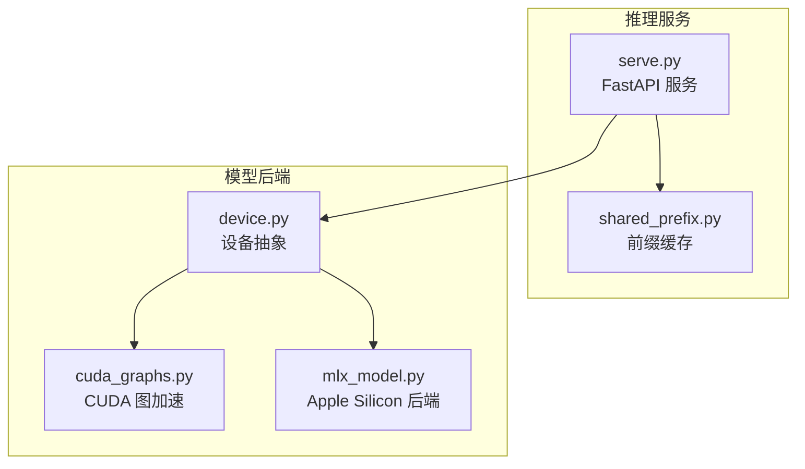
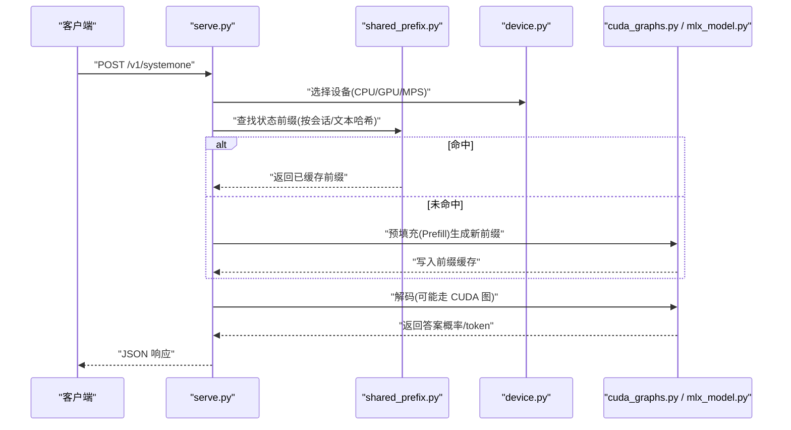
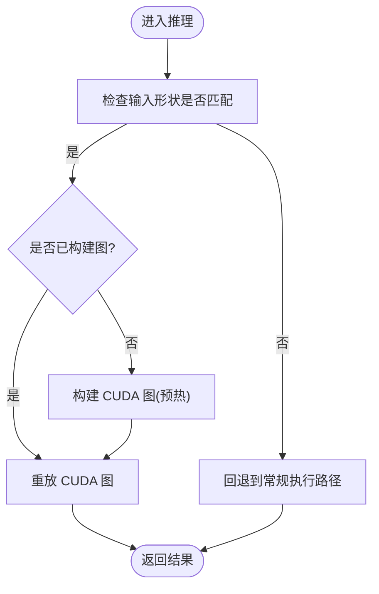
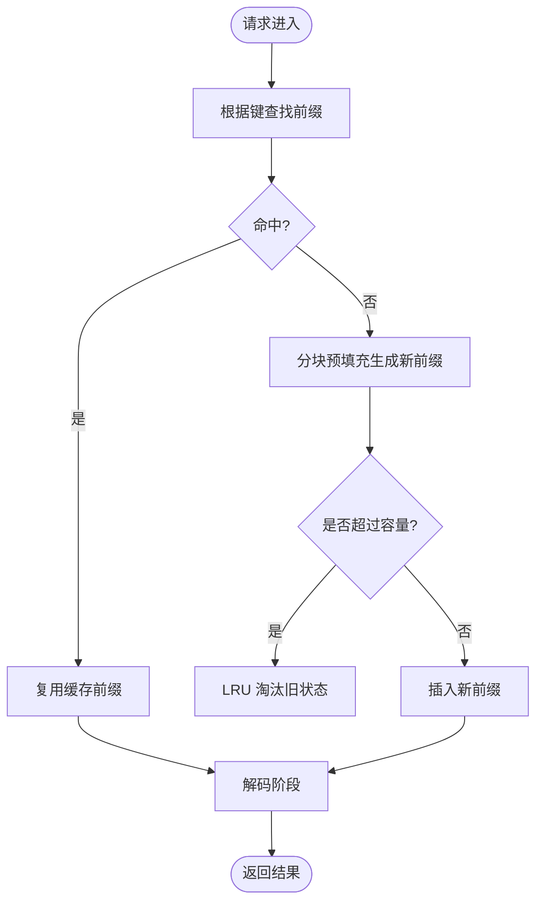
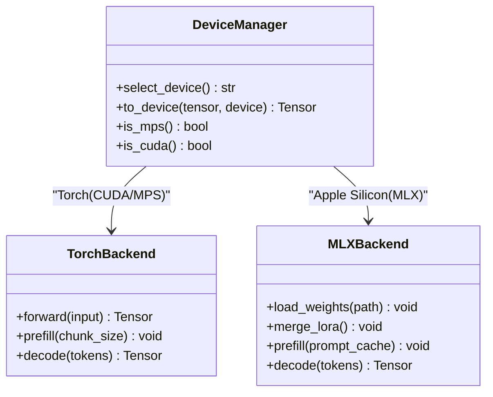
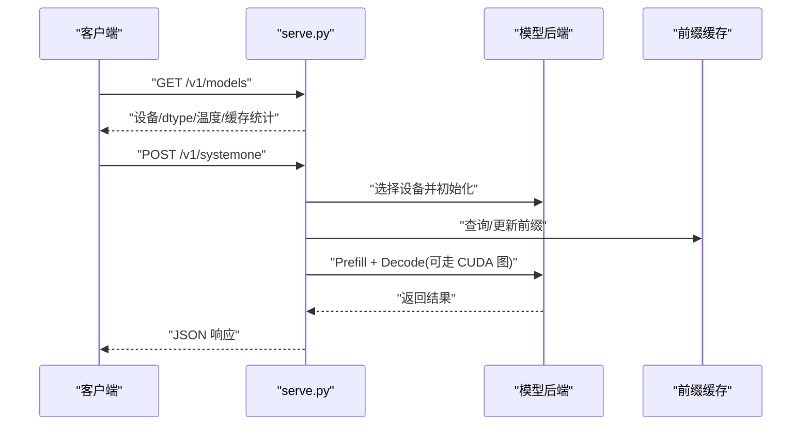
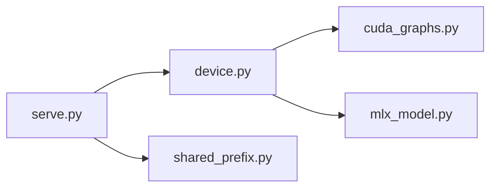

# 性能优化技术

<cite>
**本文引用的文件**   
- [README.md](file://README.md)
- [AGENTS.md](file://AGENTS.md)
- [cuda_graphs.py](file://kev/cuda_graphs.py)
- [device.py](file://kev/device.py)
- [mlx_model.py](file://kev/mlx_model.py)
- [shared_prefix.py](file://kev/shared_prefix.py)
- [serve.py](file://kev/serve.py)
</cite>

## 目录
1. [简介](#简介)
2. [项目结构](#项目结构)
3. [核心组件](#核心组件)
4. [架构总览](#架构总览)
5. [详细组件分析](#详细组件分析)
6. [依赖关系分析](#依赖关系分析)
7. [性能考量](#性能考量)
8. [故障排查指南](#故障排查指南)
9. [结论](#结论)

## 简介
本文件聚焦 Kev 在推理与服务阶段的性能优化实践，覆盖以下主题：
- CUDA 图优化：通过 torch.cuda.CUDAGraphs 减少内核启动开销、提升吞吐。
- 内存管理与前缀缓存（Prefix Cache）：复用状态前缀以降低重复计算与显存占用。
- 并行计算策略：多 GPU 训练、批量处理优化与流水线并行的思路与实践要点。
- 设备抽象层：在 CPU、GPU、Apple Silicon（MLX）之间无缝切换。
- 性能监控与分析：内存使用跟踪、瓶颈识别与吞吐优化技巧。
- 量化与部署优化：量化对性能的影响及部署建议。

## 项目结构
Kev 的核心实现位于 kev 包内，关键性能相关模块如下：
- cuda_graphs.py：CUDA Graph 封装与调用入口，用于加速推理。
- device.py：设备选择与抽象，统一 CPU/GPU/MPS 等后端。
- mlx_model.py：Apple Silicon 后端（MLX），与 Torch 路径保持一致的接口。
- shared_prefix.py：前缀缓存实现，负责状态前缀的命中、填充与淘汰。
- serve.py：FastAPI 服务入口，持有模型与前缀缓存，暴露推理 API。
- README.md / AGENTS.md：项目说明、运行方式与性能指标参考。

**图表来源**
- [serve.py](file://kev/serve.py)
- [shared_prefix.py](file://kev/shared_prefix.py)
- [device.py](file://kev/device.py)
- [cuda_graphs.py](file://kev/cuda_graphs.py)
- [mlx_model.py](file://kev/mlx_model.py)

**章节来源**
- [README.md](file://README.md)
- [AGENTS.md](file://AGENTS.md)

## 核心组件
- CUDA 图优化（cuda_graphs.py）
  - 目标：将多次内核调用合并为一次图执行，降低 Python/CUDA 调度开销，提高吞吐。
  - 适用场景：固定形状输入、稳定批次的推理阶段。
- 设备抽象（device.py）
  - 目标：屏蔽底层设备差异，提供统一的设备选择与张量放置逻辑。
  - 支持：CPU、NVIDIA GPU、Apple MPS/MLX。
- Apple Silicon 后端（mlx_model.py）
  - 目标：在 M 系列芯片上以 MLX 引擎高效推理，保持与 Torch 路径一致的接口。
  - 特点：权重加载、LoRA 合并、提示词缓存（prompt cache）分块预填充。
- 前缀缓存（shared_prefix.py）
  - 目标：复用历史状态前缀，避免重复计算；LRU 淘汰策略控制显存占用。
  - 关键参数：最大状态数、最大 token 数、最小 token 阈值、形状桶大小等。
- 服务入口（serve.py）
  - 目标：对外暴露 REST API，管理模型实例与前缀缓存生命周期。
  - 集成：与设备抽象、前缀缓存、CUDA 图优化协同工作。

**章节来源**
- [cuda_graphs.py](file://kev/cuda_graphs.py)
- [device.py](file://kev/device.py)
- [mlx_model.py](file://kev/mlx_model.py)
- [shared_prefix.py](file://kev/shared_prefix.py)
- [serve.py](file://kev/serve.py)

## 架构总览
下图展示从请求到推理的关键流程，包括设备选择、前缀缓存命中、CUDA 图执行与结果返回。

**图表来源**
- [serve.py](file://kev/serve.py)
- [shared_prefix.py](file://kev/shared_prefix.py)
- [device.py](file://kev/device.py)
- [cuda_graphs.py](file://kev/cuda_graphs.py)
- [mlx_model.py](file://kev/mlx_model.py)

## 详细组件分析

### CUDA 图优化（torch.cuda.CUDAGraphs）
- 设计要点
  - 将稳定的推理子图捕获为 CUDA Graph，减少内核启动与同步开销。
  - 适用于固定形状与批次大小的推理路径，典型于问答/分类任务。
- 使用流程
  - 预热：构造代表性输入，触发图构建与基准测量。
  - 执行：后续相同形状的输入直接重放图，避免 Python 层调度。
- 注意事项
  - 动态形状或频繁变化的批次需要重建图或回退到普通执行路径。
  - 需确保输入输出张量在正确设备上且形状一致。

**图表来源**
- [cuda_graphs.py](file://kev/cuda_graphs.py)

**章节来源**
- [cuda_graphs.py](file://kev/cuda_graphs.py)

### 前缀缓存（Prefix Cache）
- 工作原理
  - 基于会话或文本内容生成键，缓存中间状态前缀（如注意力 KV 或隐藏态）。
  - LRU 策略：当缓存超过上限时，淘汰最久未使用的条目。
  - 分块预填充：每次读取/写入按固定 chunk 大小进行，平衡延迟与吞吐。
- 关键配置
  - KEV_PREFIX_CACHE：最大状态数。
  - KEV_PREFIX_MAX_TOKENS：所有状态累计的最大 token 数。
  - KEV_PREFIX_MIN_TOKENS：低于该阈值的条目不缓存（避免无效缓存）。
  - KEV_SHAPE_BUCKET：MPS 上的形状桶大小，减少形状碎片。
- 行为特性
  - 对于纯注意力模型，默认 prefix_min_tokens=384；混合架构与 MLX 后端为 0（miss 路径会重新计算状态）。
  - 批量处理前会提前预留空间（make_room），必要时丢弃即将被驱逐的状态。

**图表来源**
- [shared_prefix.py](file://kev/shared_prefix.py)

**章节来源**
- [shared_prefix.py](file://kev/shared_prefix.py)
- [AGENTS.md](file://AGENTS.md)

### 设备抽象层（CPU / GPU / Apple Silicon）
- 设计目标
  - 统一设备选择与张量放置，屏蔽不同后端差异。
  - 在 Torch（CUDA/MPS）与 MLX 之间提供一致接口。
- 行为特征
  - 自动检测可用设备（CUDA、MPS、CPU）。
  - 在 Apple Silicon 上，MLX 后端加载权重、执行 LoRA 合并（fp32 CPU 流）或直接加载完整权重。
  - 与 CUDA 图优化协作：仅在支持的设备上启用图加速。

**图表来源**
- [device.py](file://kev/device.py)
- [mlx_model.py](file://kev/mlx_model.py)

**章节来源**
- [device.py](file://kev/device.py)
- [mlx_model.py](file://kev/mlx_model.py)
- [AGENTS.md](file://AGENTS.md)

### 服务入口与性能集成（serve.py）
- 职责
  - 暴露 FastAPI 端点（/v1/systemone、/v1/models）。
  - 持有模型实例与前缀缓存，协调设备选择与推理流程。
- 性能集成点
  - 与 CUDA 图优化结合，在支持的硬件上启用图执行。
  - 与前缀缓存联动，减少重复计算，提升吞吐。
  - 暴露设备、dtype、温度与前缀缓存统计信息，便于监控。

**图表来源**
- [serve.py](file://kev/serve.py)
- [shared_prefix.py](file://kev/shared_prefix.py)
- [cuda_graphs.py](file://kev/cuda_graphs.py)

**章节来源**
- [serve.py](file://kev/serve.py)
- [AGENTS.md](file://AGENTS.md)

## 依赖关系分析
- 模块耦合
  - serve.py 依赖 device.py、shared_prefix.py、以及具体后端（cuda_graphs.py 或 mlx_model.py）。
  - shared_prefix.py 独立于后端，仅关注状态前缀的存储与淘汰。
  - device.py 作为抽象层，向上为 serve.py 提供统一接口，向下对接 Torch/MLX。
- 外部依赖
  - PyTorch（CUDA/MPS）、MLX（Apple Silicon）、FastAPI。
- 潜在循环依赖
  - 当前结构无循环依赖；前后端通过设备抽象解耦。

**图表来源**
- [serve.py](file://kev/serve.py)
- [device.py](file://kev/device.py)
- [shared_prefix.py](file://kev/shared_prefix.py)
- [cuda_graphs.py](file://kev/cuda_graphs.py)
- [mlx_model.py](file://kev/mlx_model.py)

**章节来源**
- [serve.py](file://kev/serve.py)
- [device.py](file://kev/device.py)
- [shared_prefix.py](file://kev/shared_prefix.py)
- [cuda_graphs.py](file://kev/cuda_graphs.py)
- [mlx_model.py](file://kev/mlx_model.py)

## 性能考量
- CUDA 图优化
  - 适合固定形状与稳定批次的推理；动态输入需回退或重建图。
  - 预热阶段应包含代表性样本，确保图构建准确。
- 前缀缓存
  - 合理设置 KEV_PREFIX_CACHE 与 KEV_PREFIX_MAX_TOKENS，避免显存溢出。
  - 针对长上下文场景，优先启用缓存以减少重复计算。
- 批量处理
  - 增大 batch size 可提升吞吐，但需权衡显存与延迟。
  - 在服务端采用队列与并发控制，平滑请求峰值。
- 设备选择
  - 在 NVIDIA GPU 上优先启用 CUDA 图；在 Apple Silicon 上使用 MLX 后端。
  - 监控设备利用率，避免 CPU/GPU 间数据搬运成为瓶颈。
- 量化与部署
  - 量化可降低显存占用与带宽压力，但需评估精度影响。
  - 部署时固定 dtype（如 bf16），减少类型转换开销。
  - 在 H100/L40S 等高端 GPU 上，结合 CUDA 图与前缀缓存可获得显著吞吐提升。

[本节为通用指导，不直接分析具体文件]

## 故障排查指南
- 常见问题
  - CUDA 图构建失败：输入形状变化或设备不一致导致。
  - 前缀缓存命中率低：键生成不稳定或缓存容量过小。
  - Apple Silicon 推理慢：未启用 MLX 后端或权重加载路径不正确。
- 诊断步骤
  - 检查设备选择日志，确认后端与 dtype。
  - 观察前缀缓存统计（命中/未命中/淘汰次数）。
  - 使用性能剖析工具（如 nvprof、nsys、MLX 内置 profiler）定位瓶颈。
- 优化建议
  - 固定输入形状与批次大小，确保 CUDA 图稳定。
  - 调整前缀缓存参数，平衡命中率与显存占用。
  - 在服务端增加限流与重试机制，提升稳定性。

**章节来源**
- [AGENTS.md](file://AGENTS.md)
- [README.md](file://README.md)

## 结论
Kev 通过 CUDA 图优化、前缀缓存、设备抽象与 MLX 后端，构建了高性能的推理与服务体系。在生产环境中，建议：
- 启用 CUDA 图优化以提升吞吐。
- 合理配置前缀缓存参数，最大化命中率。
- 根据硬件选择合适后端（CUDA/MLX），并固定 dtype。
- 持续监控性能指标，迭代优化批量大小与缓存策略。

[本节为总结性内容，不直接分析具体文件]