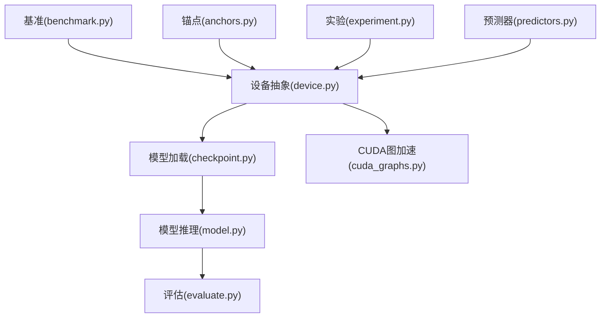
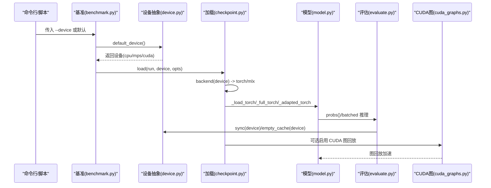
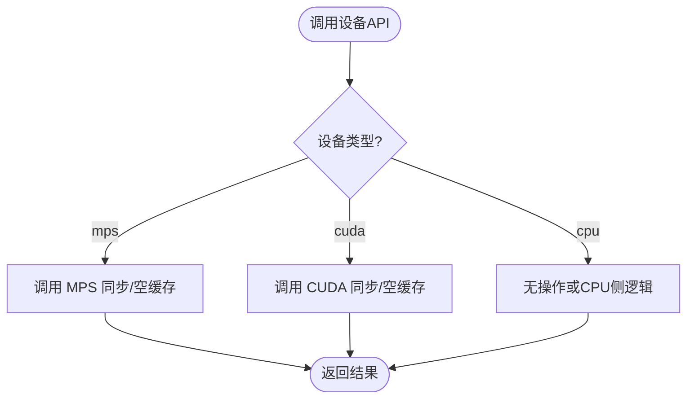
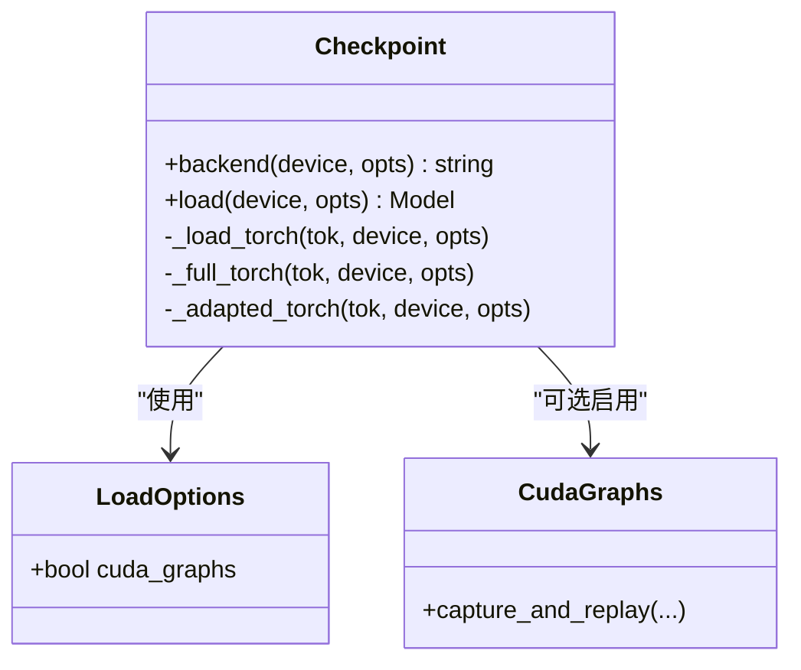
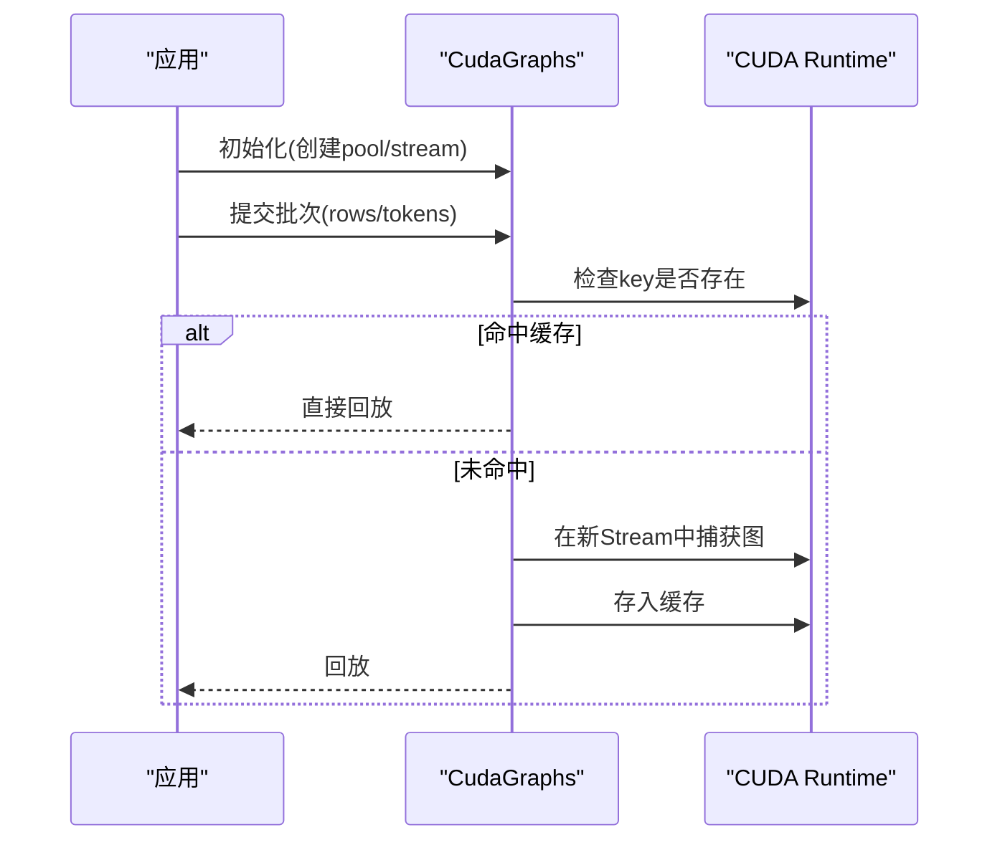
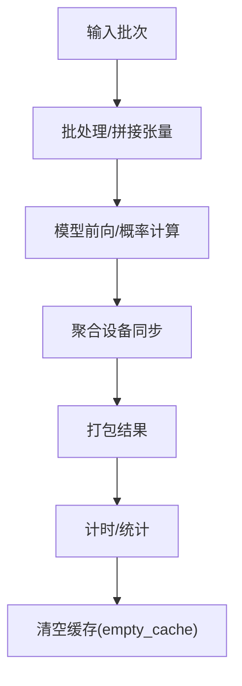
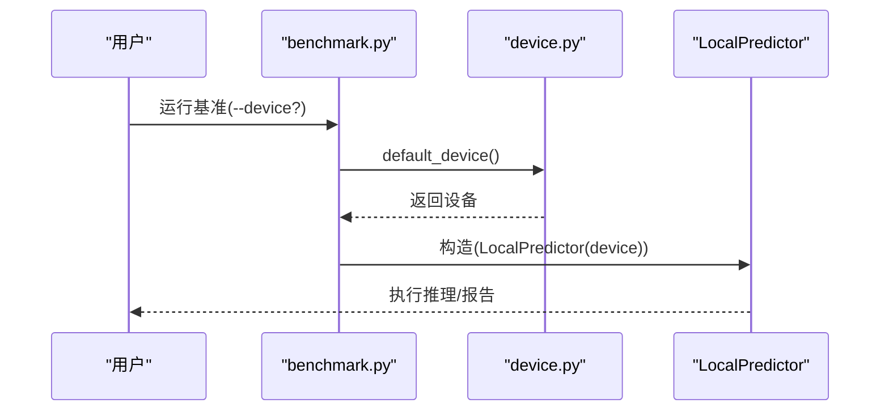
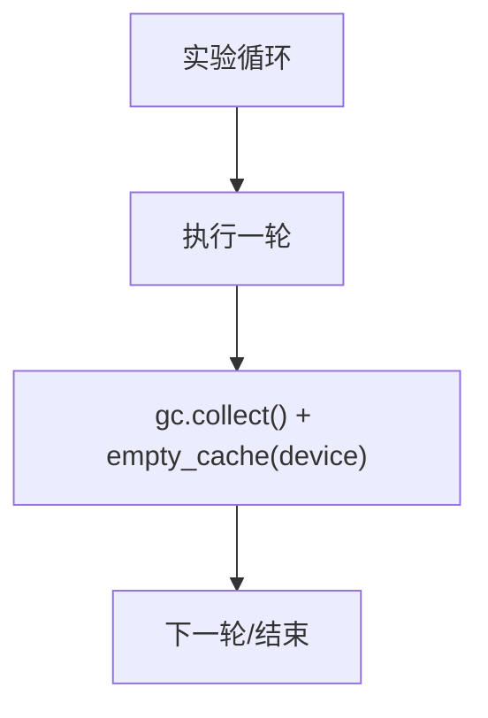
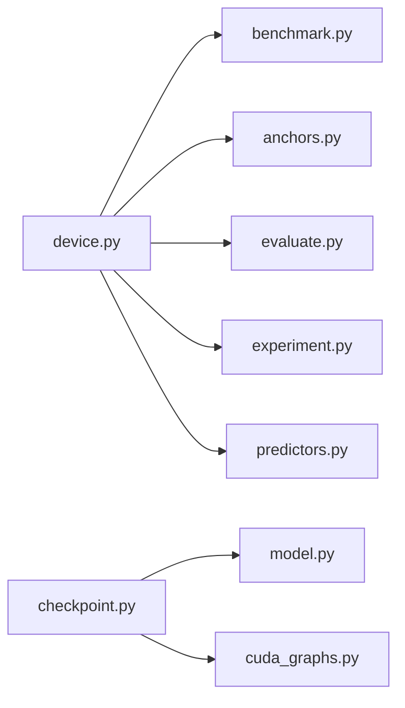

# 设备抽象层

<cite>
**本文引用的文件**   
- [device.py](file://kev/device.py)
- [checkpoint.py](file://kev/checkpoint.py)
- [cuda_graphs.py](file://kev/cuda_graphs.py)
- [model.py](file://kev/model.py)
- [evaluate.py](file://kev/evaluate.py)
- [benchmark.py](file://kev/benchmark.py)
- [anchors.py](file://kev/anchors.py)
- [experiment.py](file://kev/experiment.py)
- [predictors.py](file://kev/predictors.py)
</cite>

## 目录
1. [简介](#简介)
2. [项目结构](#项目结构)
3. [核心组件](#核心组件)
4. [架构总览](#架构总览)
5. [详细组件分析](#详细组件分析)
6. [依赖关系分析](#依赖关系分析)
7. [性能考量](#性能考量)
8. [故障诊断指南](#故障诊断指南)
9. [结论](#结论)
10. [附录](#附录)

## 简介
本技术文档聚焦于“设备抽象层”，系统化阐述如何在 CPU、GPU（CUDA）与 Apple Silicon（MPS）之间实现无缝切换的统一接口设计。内容涵盖：
- 设备检测与优先级选择策略
- 内存管理抽象（分配、释放、同步）
- 张量操作的设备无关封装（类型转换、形状处理、精度控制）
- 设备特定优化（CUDA 流与图、Metal 后端、CPU 向量化）
- 多设备并行模式与性能对比思路
- 常见设备问题的诊断与解决方案

## 项目结构
围绕设备抽象的关键代码集中在以下模块：
- 设备抽象与默认选择：device.py
- 模型加载与后端选择（Torch/Metal/MLX）：checkpoint.py
- CUDA 图加速与流管理：cuda_graphs.py
- 推理与评估中的设备使用：model.py、evaluate.py
- 基准测试入口与参数：benchmark.py
- 锚点构建与设备传递：anchors.py
- 实验执行与资源清理：experiment.py
- 预测器中的同步调用：predictors.py

**图示来源**
- [device.py:4-25](file://kev/device.py#L4-L25)
- [checkpoint.py:219-262](file://kev/checkpoint.py#L219-L262)
- [cuda_graphs.py:149-248](file://kev/cuda_graphs.py#L149-L248)
- [model.py:413-495](file://kev/model.py#L413-L495)
- [evaluate.py:16-200](file://kev/evaluate.py#L16-L200)
- [benchmark.py:179-201](file://kev/benchmark.py#L179-L201)
- [anchors.py:18-38](file://kev/anchors.py#L18-L38)
- [experiment.py:30-359](file://kev/experiment.py#L30-L359)
- [predictors.py:25-141](file://kev/predictors.py#L25-L141)

**章节来源**
- [device.py:4-25](file://kev/device.py#L4-L25)
- [checkpoint.py:219-262](file://kev/checkpoint.py#L219-L262)
- [cuda_graphs.py:149-248](file://kev/cuda_graphs.py#L149-L248)
- [model.py:413-495](file://kev/model.py#L413-L495)
- [evaluate.py:16-200](file://kev/evaluate.py#L16-L200)
- [benchmark.py:179-201](file://kev/benchmark.py#L179-L201)
- [anchors.py:18-38](file://kev/anchors.py#L18-L38)
- [experiment.py:30-359](file://kev/experiment.py#L30-L359)
- [predictors.py:25-141](file://kev/predictors.py#L25-L141)

## 核心组件
- 设备抽象与默认选择
  - 提供统一接口以获取默认设备，并在不同后端上执行同步与缓存清理。
  - 关键能力：default_device()、sync(device)、empty_cache(device)、allocated_bytes(device)。
- 模型加载与后端选择
  - 根据设备与基础模型特征自动选择 Torch 或 MLX 后端；在 MPS 且为混合基座时倾向 MLX。
  - 支持通过环境变量启用 CUDA 图回放以提升服务吞吐。
- CUDA 图与流管理
  - 基于 torch.cuda.graph 捕获并复用计算图，配合独立 Stream 与共享内存池减少重复开销。
- 模型推理与评估
  - 在推理路径中批量聚合设备同步，降低同步次数；在评估流程中插入同步与缓存清理以稳定计时与显存占用。
- 基准与工具链
  - 基准脚本暴露 --device 选项，默认采用 default_device()；锚点构建将设备向下传递至模型与分词器。
- 实验与预测器
  - 实验执行在每轮后触发垃圾回收与空缓存；预测器在请求前后进行设备同步以保证时序正确性。

**章节来源**
- [device.py:4-25](file://kev/device.py#L4-L25)
- [checkpoint.py:219-262](file://kev/checkpoint.py#L219-L262)
- [cuda_graphs.py:149-248](file://kev/cuda_graphs.py#L149-L248)
- [model.py:413-495](file://kev/model.py#L413-L495)
- [evaluate.py:16-200](file://kev/evaluate.py#L16-L200)
- [benchmark.py:179-201](file://kev/benchmark.py#L179-L201)
- [anchors.py:18-38](file://kev/anchors.py#L18-L38)
- [experiment.py:30-359](file://kev/experiment.py#L30-L359)
- [predictors.py:25-141](file://kev/predictors.py#L25-L141)

## 架构总览
下图展示从高层脚本到设备抽象的调用链路，以及在不同硬件上的分支行为。

**图示来源**
- [benchmark.py:179-201](file://kev/benchmark.py#L179-L201)
- [device.py:4-25](file://kev/device.py#L4-L25)
- [checkpoint.py:219-262](file://kev/checkpoint.py#L219-L262)
- [model.py:413-495](file://kev/model.py#L413-L495)
- [evaluate.py:16-200](file://kev/evaluate.py#L16-L200)
- [cuda_graphs.py:149-248](file://kev/cuda_graphs.py#L149-L248)

## 详细组件分析

### 设备抽象与默认选择（device.py）
- 功能要点
  - default_device(): 返回当前环境下的首选设备（cpu/mps/cuda）。
  - sync(device): 对 mps 与 cuda 分别调用对应同步 API。
  - empty_cache(device): 针对 mps/cuda 调用空缓存 API。
  - allocated_bytes(device): 查询已分配字节数，用于显存/内存监控。
- 设计意图
  - 将设备差异收敛为统一函数，避免上层逻辑耦合具体后端。
  - 在评估、训练、预测等路径中以统一方式插入同步与缓存清理，保证可重复性与稳定性。

**图示来源**
- [device.py:4-25](file://kev/device.py#L4-L25)

**章节来源**
- [device.py:4-25](file://kev/device.py#L4-L25)

### 模型加载与后端选择（checkpoint.py）
- 功能要点
  - backend(device, opts): 当 device 为 mps 且非精确匹配、存在 MLX 且基础模型为混合时，选择 mlx 后端；否则使用 torch。
  - load(run, device, opts): 根据后端选择加载路径（mlx 或 torch）。
  - _load_torch / _full_torch / _adapted_torch: 提供 Torch 侧的不同加载变体。
  - 环境变量 KEV_CUDA_GRAPHS 控制是否在服务路径启用 CUDA 图回放。
- 设计意图
  - 将“设备→后端”映射集中化，便于扩展新后端或调整选择策略。
  - 通过配置项与环境变量解耦优化开关，便于在不同部署场景下灵活开启。

**图示来源**
- [checkpoint.py:106-143](file://kev/checkpoint.py#L106-L143)
- [checkpoint.py:219-262](file://kev/checkpoint.py#L219-L262)
- [cuda_graphs.py:149-248](file://kev/cuda_graphs.py#L149-L248)

**章节来源**
- [checkpoint.py:106-143](file://kev/checkpoint.py#L106-L143)
- [checkpoint.py:219-262](file://kev/checkpoint.py#L219-L262)

### CUDA 图与流管理（cuda_graphs.py）
- 功能要点
  - 初始化共享内存池与独立 Stream，用于图捕获与回放。
  - 在 capture 阶段避免阻塞式同步与 GC，防止繁忙服务器卡顿。
  - 使用 torch.cuda.CUDAGraph 捕获子图，并通过 key 缓存已捕获图，减少重复开销。
- 设计意图
  - 将“捕获→缓存→回放”流程封装，使上层无需关心底层细节。
  - 通过线程局部状态隔离不同线程的 CUDA 调用，避免跨线程干扰。

**图示来源**
- [cuda_graphs.py:149-248](file://kev/cuda_graphs.py#L149-L248)

**章节来源**
- [cuda_graphs.py:149-248](file://kev/cuda_graphs.py#L149-L248)

### 模型推理与评估（model.py、evaluate.py）
- 推理路径（model.py）
  - 在批处理输出时聚合设备同步，减少多次同步带来的开销。
  - 固定内核数量与一次设备同步完成多个问题选项的计算，提升吞吐。
- 评估路径（evaluate.py）
  - 在关键步骤前后插入 sync(model.device)，确保计时准确。
  - 在评估结束后调用 empty_cache(dev) 释放显存，避免后续任务受影响。

**图示来源**
- [model.py:413-495](file://kev/model.py#L413-L495)
- [evaluate.py:16-200](file://kev/evaluate.py#L16-L200)

**章节来源**
- [model.py:413-495](file://kev/model.py#L413-L495)
- [evaluate.py:16-200](file://kev/evaluate.py#L16-L200)

### 基准与工具链（benchmark.py、anchors.py）
- benchmark.py
  - 暴露 --device 参数，choices 包含 cpu/mps/cuda，默认值来自 default_device()。
  - 将设备传递给 LocalPredictor，驱动后续推理路径。
- anchors.py
  - 接收 device 参数，若未指定则调用 default_device()。
  - 将设备传递给模型与分词器，确保数据与权重在同一设备上。

**图示来源**
- [benchmark.py:179-201](file://kev/benchmark.py#L179-L201)
- [anchors.py:18-38](file://kev/anchors.py#L18-L38)
- [device.py:4-25](file://kev/device.py#L4-L25)

**章节来源**
- [benchmark.py:179-201](file://kev/benchmark.py#L179-L201)
- [anchors.py:18-38](file://kev/anchors.py#L18-L38)

### 实验与预测器（experiment.py、predictors.py）
- experiment.py
  - 在实验循环末尾触发 gc.collect() 与 empty_cache(device)，稳定内存占用。
- predictors.py
  - 在请求前后调用 sync(self.device)，保证异步流水线时序一致。

**图示来源**
- [experiment.py:30-359](file://kev/experiment.py#L30-L359)
- [predictors.py:25-141](file://kev/predictors.py#L25-L141)

**章节来源**
- [experiment.py:30-359](file://kev/experiment.py#L30-L359)
- [predictors.py:25-141](file://kev/predictors.py#L25-L141)

## 依赖关系分析
- 组件耦合
  - device.py 被多处引用，作为统一的设备访问入口，耦合度低但内聚度高。
  - checkpoint.py 依赖 device 语义（如 str(device) == "mps"），并可选择性地引入 cuda_graphs。
  - model.py 与 evaluate.py 通过 device 抽象进行同步与缓存管理，避免直接调用后端 API。
- 外部依赖
  - PyTorch（CUDA/MPS）、可选 MLX（Apple Silicon 后端）。
- 潜在循环依赖
  - 未见明显循环导入；cuda_graphs 仅在需要时动态导入，降低启动成本。

**图示来源**
- [device.py:4-25](file://kev/device.py#L4-L25)
- [checkpoint.py:219-262](file://kev/checkpoint.py#L219-L262)
- [cuda_graphs.py:149-248](file://kev/cuda_graphs.py#L149-L248)
- [benchmark.py:179-201](file://kev/benchmark.py#L179-L201)
- [anchors.py:18-38](file://kev/anchors.py#L18-L38)
- [evaluate.py:16-200](file://kev/evaluate.py#L16-L200)
- [experiment.py:30-359](file://kev/experiment.py#L30-L359)
- [predictors.py:25-141](file://kev/predictors.py#L25-L141)

**章节来源**
- [device.py:4-25](file://kev/device.py#L4-L25)
- [checkpoint.py:219-262](file://kev/checkpoint.py#L219-L262)
- [cuda_graphs.py:149-248](file://kev/cuda_graphs.py#L149-L248)
- [benchmark.py:179-201](file://kev/benchmark.py#L179-L201)
- [anchors.py:18-38](file://kev/anchors.py#L18-L38)
- [evaluate.py:16-200](file://kev/evaluate.py#L16-L200)
- [experiment.py:30-359](file://kev/experiment.py#L30-L359)
- [predictors.py:25-141](file://kev/predictors.py#L25-L141)

## 性能考量
- CUDA 图回放
  - 通过 CudaGraphs 捕获并复用子图，显著减少重复开销；适合服务端批处理场景。
  - 建议结合环境变量 KEV_CUDA_GRAPHS 按需开启，避免在不适用场景引入额外复杂度。
- 同步与批处理
  - 在 model.py 中对批输出进行聚合同步，减少同步次数；在 evaluate.py 中在关键节点插入同步以确保计时准确性。
- 内存管理
  - 在实验循环末尾进行 gc.collect() 与 empty_cache(device)，有助于稳定长时运行的内存占用。
- 设备选择
  - 默认设备选择应优先 GPU（CUDA/MPS），回退到 CPU；在 MPS 且为混合基座时倾向 MLX 后端以获得更好性能。

[本节为通用指导，不直接分析具体文件]

## 故障诊断指南
- 显存不足
  - 现象：CUDA/OOM 错误或在 MPS 上内存增长异常。
  - 排查：
    - 使用 allocated_bytes(device) 监控已分配内存。
    - 在评估或实验结束后调用 empty_cache(device) 释放缓存。
    - 减小 batch size 或启用更低的 dtype（如 bfloat16）。
  - 参考位置：
    - [device.py:25-25](file://kev/device.py#L25-L25)
    - [evaluate.py:200-200](file://kev/evaluate.py#L200-L200)
    - [experiment.py:359-359](file://kev/experiment.py#L359-L359)
- 驱动兼容性
  - 现象：CUDA 版本与驱动不匹配导致无法初始化或图捕获失败。
  - 排查：
    - 确认 CUDA 运行时可用；必要时关闭 CUDA 图（KEV_CUDA_GRAPHS=0）。
    - 在 MPS 环境下优先使用 MLX 后端（由 backend(device) 自动选择）。
  - 参考位置：
    - [checkpoint.py:219-224](file://kev/checkpoint.py#L219-L224)
    - [checkpoint.py:143-143](file://kev/checkpoint.py#L143-L143)
    - [cuda_graphs.py:227-248](file://kev/cuda_graphs.py#L227-L248)
- 性能瓶颈
  - 现象：吞吐低、延迟高。
  - 排查：
    - 检查是否启用 CUDA 图回放；在服务端批处理场景中建议开启。
    - 检查同步频率：确保在 model.py 中进行聚合同步，避免频繁 sync。
    - 检查设备选择：确保 default_device() 返回预期设备。
  - 参考位置：
    - [cuda_graphs.py:149-248](file://kev/cuda_graphs.py#L149-L248)
    - [model.py:413-495](file://kev/model.py#L413-L495)
    - [device.py:4-25](file://kev/device.py#L4-L25)

**章节来源**
- [device.py:4-25](file://kev/device.py#L4-L25)
- [checkpoint.py:143-143](file://kev/checkpoint.py#L143-L143)
- [checkpoint.py:219-224](file://kev/checkpoint.py#L219-L224)
- [cuda_graphs.py:227-248](file://kev/cuda_graphs.py#L227-L248)
- [model.py:413-495](file://kev/model.py#L413-L495)
- [evaluate.py:200-200](file://kev/evaluate.py#L200-L200)
- [experiment.py:359-359](file://kev/experiment.py#L359-L359)

## 结论
本设备抽象层通过统一的接口封装了 CPU、GPU（CUDA）与 Apple Silicon（MPS）的差异，实现了：
- 设备检测与优先级选择的自动化
- 内存管理与同步的统一封装
- 模型加载与后端选择的策略化
- CUDA 图与流的优化封装
- 在推理与评估路径中的性能优化实践

该设计使得上层业务代码无需感知底层设备差异，同时保留了针对不同设备的精细化优化空间。

[本节为总结性内容，不直接分析具体文件]

## 附录
- 设备兼容性矩阵（基于代码行为归纳）
  - CPU：始终可用；dtype 通常使用 float32。
  - MPS（Apple Silicon）：可与 MLX 后端组合使用；在混合基座场景下优先 MLX。
  - CUDA（NVIDIA GPU）：需安装匹配的 CUDA 运行时；可启用 CUDA 图回放以提升吞吐。
- 版本要求说明
  - PyTorch：需支持 CUDA 与 MPS；建议使用较新版本以获得更好的图捕获与性能。
  - MLX：可选依赖，用于 MPS 场景下的混合基座优化。
  - CUDA 驱动：需与 PyTorch/CUDA 版本匹配，避免图捕获失败。

[本节为补充信息，不直接分析具体文件]