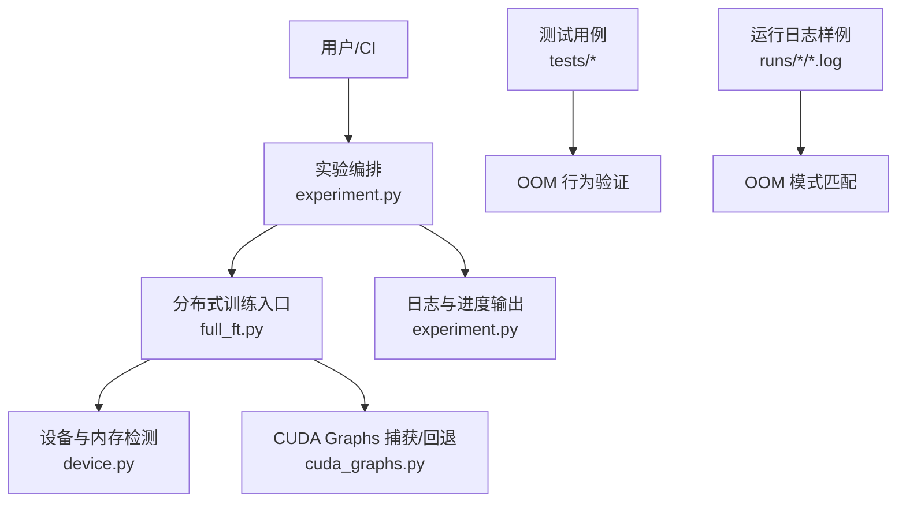
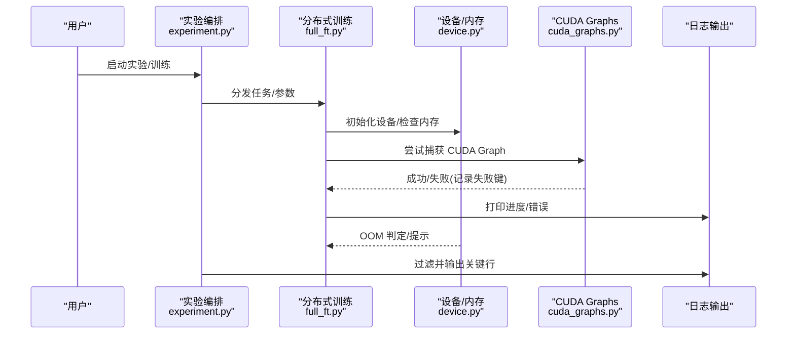
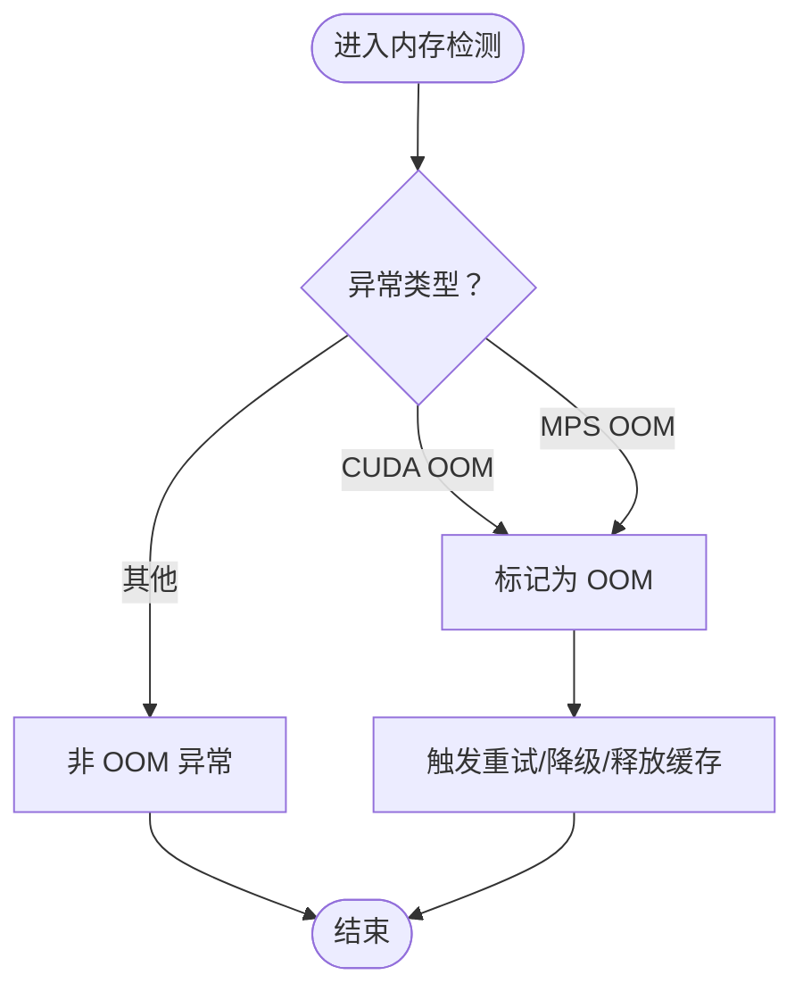
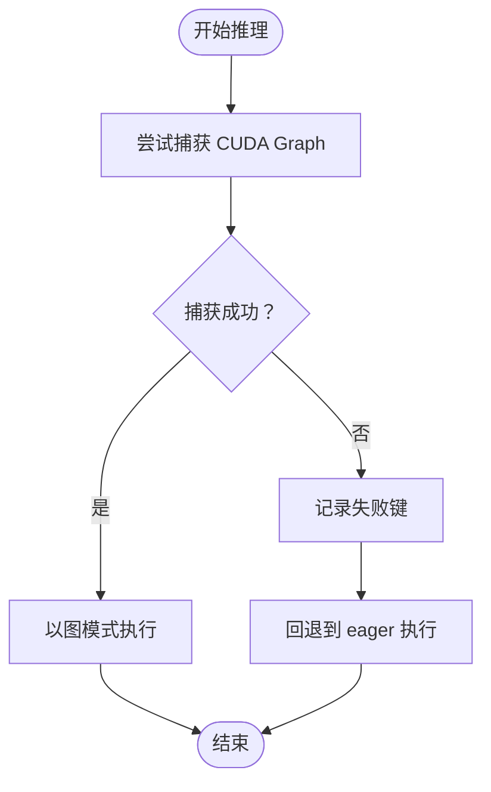
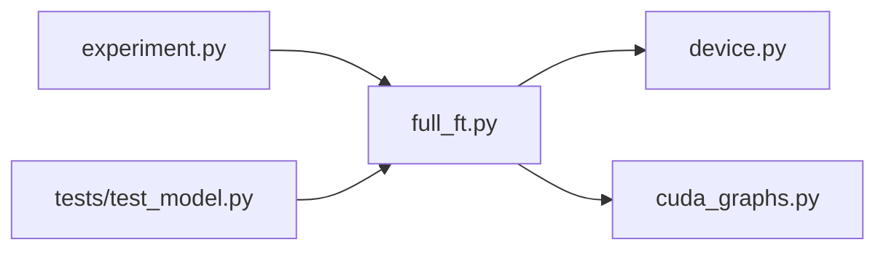
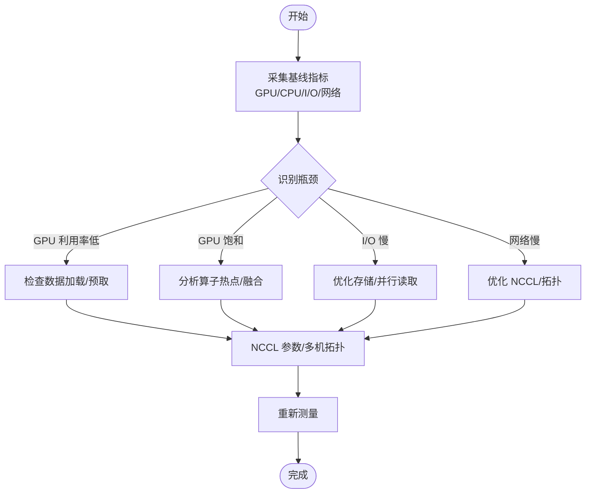

<cite>
**本文引用的文件**   
- [README.md](file://README.md)
- [pyproject.toml](file://pyproject.toml)
- [device.py](file://kev/device.py)
- [cuda_graphs.py](file://kev/cuda_graphs.py)
- [experiment.py](file://kev/experiment.py)
- [full_ft.py](file://kev/full_ft.py)
- [test_model.py](file://tests/test_model.py)
- [test_rounds.py](file://tests/test_rounds.py)
- [train-r21_step62_rank1.log](file://runs/sft-probe/r22-ceiling-27b-8xh200/train-r21_step62_rank1.log)
- [train.log](file://runs/sft-probe/sft-probe-27b-h200/train.log)
</cite>

## 目录
1. [简介](#简介)
2. [项目结构](#项目结构)
3. [核心组件](#核心组件)
4. [架构总览](#架构总览)
5. [详细组件分析](#详细组件分析)
6. [依赖关系分析](#依赖关系分析)
7. [性能考量](#性能考量)
8. [故障排除指南](#故障排除指南)
9. [结论](#结论)
10. [附录](#附录)

## 简介
本指南面向 Kev 训练与推理过程中的常见问题，提供系统化的排查步骤、日志分析方法、调试工具使用建议与环境配置方案。重点覆盖：
- CUDA 内存不足（OOM）的诊断与缓解
- 模型加载失败的原因定位与修复
- 训练不收敛的常见原因与调参思路
- 日志分析与异常追踪
- PyTorch 调试器、内存分析、性能剖析的使用
- 环境配置问题（依赖冲突、版本兼容、平台差异）
- 性能瓶颈识别（CPU/GPU 利用率、I/O、网络通信）
- 如何收集问题报告信息并有效求助社区

## 项目结构
Kev 仓库包含训练脚本、评估流程、实验编排、分布式训练支持、CUDA Graphs 优化以及大量评测与运行记录。与故障排除直接相关的代码集中在设备与内存处理、分布式训练、CUDA Graphs 捕获与回退、实验日志输出等模块；同时仓库内包含大量真实 OOM 日志样例，便于对照诊断。

图表来源
- [experiment.py:299-480](file://kev/experiment.py#L299-L480)
- [full_ft.py:32-34](file://kev/full_ft.py#L32-L34)
- [device.py:20-22](file://kev/device.py#L20-L22)
- [cuda_graphs.py:248](file://kev/cuda_graphs.py#L248)
- [test_model.py:392-467](file://tests/test_model.py#L392-L467)
- [train-r21_step62_rank1.log:75-551](file://runs/sft-probe/r22-ceiling-27b-8xh200/train-r21_step62_rank1.log#L75-L551)

章节来源
- [README.md](file://README.md)
- [pyproject.toml](file://pyproject.toml)

## 核心组件
- 设备与内存检测：统一判断 CUDA/MPS 的 OOM 错误类型，便于上层逻辑进行重试或降级。
- 分布式训练：基于 torch.distributed 与 FSDP，涉及多进程/多卡训练时的资源分配与状态同步。
- CUDA Graphs：在推理路径中尝试图捕获以提升吞吐，失败时回退到 eager 执行并记录失败键。
- 实验编排：负责任务调度、日志过滤、结果汇总与继续训练/评估的流程控制。
- 测试用例：对 OOM 行为进行断言与回归保护，确保关键路径的健壮性。

章节来源
- [device.py:20-22](file://kev/device.py#L20-L22)
- [full_ft.py:32-34](file://kev/full_ft.py#L32-L34)
- [cuda_graphs.py:248](file://kev/cuda_graphs.py#L248)
- [experiment.py:299-480](file://kev/experiment.py#L299-L480)
- [test_model.py:392-467](file://tests/test_model.py#L392-L467)

## 架构总览
下图展示从实验编排到训练/评估执行的典型调用链，以及与设备、CUDA Graphs、日志输出的交互关系。

图表来源
- [experiment.py:299-480](file://kev/experiment.py#L299-L480)
- [full_ft.py:32-34](file://kev/full_ft.py#L32-L34)
- [device.py:20-22](file://kev/device.py#L20-L22)
- [cuda_graphs.py:248](file://kev/cuda_graphs.py#L248)

## 详细组件分析

### 设备与内存检测（device.py）
- 功能：识别 CUDA 的 OutOfMemoryError 与 MPS 的“后端显存不足”运行时错误，供上层做统一处理。
- 影响：当检测到 OOM 时，可触发重试、缓存清理或降级策略，避免训练/推理中断。
- 建议：
  - 在自定义扩展或第三方算子中抛出标准 OOM 异常，以便被正确识别。
  - 结合日志关键字快速定位 OOM 发生位置。

图表来源
- [device.py:20-22](file://kev/device.py#L20-L22)

章节来源
- [device.py:20-22](file://kev/device.py#L20-L22)

### CUDA Graphs 捕获与回退（cuda_graphs.py）
- 功能：在推理阶段尝试将计算图固化以提升性能；若捕获失败，记录失败键并以 eager 方式执行。
- 影响：捕获失败不会导致崩溃，但可能降低吞吐；失败键可用于后续分析哪些输入形状/操作无法被图化。
- 建议：
  - 关注失败键对应的输入维度或算子组合，必要时调整批大小或序列长度。
  - 在 CI 中监控失败率，防止退化。

图表来源
- [cuda_graphs.py:248](file://kev/cuda_graphs.py#L248)

章节来源
- [cuda_graphs.py:248](file://kev/cuda_graphs.py#L248)

### 分布式训练入口（full_ft.py）
- 功能：导入 torch.distributed 与 FSDP，用于多卡/多进程全量微调。
- 影响：分布式环境下需关注进程间通信、显存分配与状态同步；不同 rank 的日志需要按 rank 筛选。
- 建议：
  - 使用环境变量控制 NCCL 行为（如 NCCL_DEBUG=INFO）以定位通信问题。
  - 在多卡场景下优先检查每个 GPU 的显存占用是否均衡。

章节来源
- [full_ft.py:32-34](file://kev/full_ft.py#L32-L34)

### 实验编排与日志过滤（experiment.py）
- 功能：负责实验调度、继续训练/评估、关键日志行过滤与结果汇总。
- 影响：通过过滤关键字（如 Error、device、ablation 等）帮助快速定位异常与关键事件。
- 建议：
  - 在报告中保留完整日志，同时在摘要中仅输出关键行，便于审阅。
  - 对“继续训练/评估”的路径增加幂等校验，避免重复写入。

章节来源
- [experiment.py:299-480](file://kev/experiment.py#L299-L480)

### 测试用例中的 OOM 行为（tests/test_model.py）
- 功能：验证在真实 OOM 后是否能通过重试/缓存清理恢复，或在无缓存时再次失败。
- 影响：作为回归测试，保障服务在 OOM 下的鲁棒性。
- 建议：
  - 新增 OOM 相关分支时，补充对应断言，确保行为符合预期。

章节来源
- [test_model.py:392-467](file://tests/test_model.py#L392-L467)

## 依赖关系分析
- 外部依赖：PyTorch（含 torch.distributed、FSDP）、NCCL（多卡通信）、可选 MPS（Apple Silicon）。
- 内部耦合：
  - experiment.py 驱动 full_ft.py 的训练流程。
  - device.py 为上层提供统一的 OOM 判定能力。
  - cuda_graphs.py 在推理路径中与 model/predictors 协作，失败时不影响主流程。
- 潜在循环依赖：未见明显循环；各模块职责清晰，依赖方向明确。

图表来源
- [experiment.py:299-480](file://kev/experiment.py#L299-L480)
- [full_ft.py:32-34](file://kev/full_ft.py#L32-L34)
- [device.py:20-22](file://kev/device.py#L20-L22)
- [cuda_graphs.py:248](file://kev/cuda_graphs.py#L248)
- [test_model.py:392-467](file://tests/test_model.py#L392-L467)

章节来源
- [pyproject.toml](file://pyproject.toml)

## 性能考量
- CPU/GPU 利用率：
  - 使用 nvidia-smi、nvtop、torch.profiler 观察 GPU 利用率与内核耗时。
  - 若 GPU 利用率低，检查数据加载（num_workers、prefetch_factor）、算子融合与 CUDA Graphs 启用情况。
- I/O 瓶颈：
  - 大模型权重加载与数据集读取常成为瓶颈；建议使用 SSD/NVMe，开启预取与异步加载。
  - 对于长上下文场景，注意 KV Cache 与 prefix cache 的内存占用。
- 网络通信：
  - 多卡训练时关注 NCCL 带宽与延迟；必要时调整 NCCL_IB_DISABLE、NCCL_SOCKET_IFNAME 等环境变量。
  - 使用 NCCL_DEBUG=INFO 抓取通信栈信息。

[本节为通用指导，不涉及具体文件]

## 故障排除指南

### 常见问题一：CUDA 内存不足（OOM）
现象
- 训练或推理过程中出现 CUDA out of memory 报错，伴随“已分配/保留未分配”显存统计。
- 多卡训练中多个 rank 同时报 OOM。

定位步骤
1. 确认 OOM 类型：
   - 使用 device.py 的 OOM 判定逻辑，区分 CUDA 与 MPS 的 OOM。
2. 查看日志中的显存统计：
   - 参考 runs 目录下的真实 OOM 日志，关注“allocated by PyTorch”和“reserved but unallocated”。
3. 缩小范围：
   - 降低 batch size、序列长度或激活保存开关。
   - 关闭不必要的日志与指标采集。
4. 缓解碎片化：
   - 设置 PYTORCH_CUDA_ALLOC_CONF=expandable_segments:True（日志中已有提示）。
5. 分布式场景：
   - 检查各 rank 显存分布是否均衡；必要时调整每卡并行度或梯度累积步数。

缓解措施
- 减小批大小/序列长度
- 启用混合精度（FSDP MixedPrecisionPolicy）
- 使用梯度检查点（activation checkpointing）
- 调整 CUDA 分配器策略（expandable segments）
- 清理 KV Cache / Prefix Cache（结合测试用例中的行为）

章节来源
- [device.py:20-22](file://kev/device.py#L20-L22)
- [train-r21_step62_rank1.log:75-551](file://runs/sft-probe/r22-ceiling-27b-8xh200/train-r21_step62_rank1.log#L75-L551)
- [train.log:38](file://runs/sft-probe/sft-probe-27b-h200/train.log#L38)
- [test_model.py:392-467](file://tests/test_model.py#L392-L467)

### 常见问题二：模型加载失败
可能原因
- 权重路径不存在或权限不足
- 权重格式不匹配（例如分片/合并不一致）
- 显存不足导致加载中途失败
- 依赖库版本不兼容（如 transformers、torch 版本）

排查步骤
1. 检查路径与权限：确认权重目录可读且完整。
2. 校验权重完整性：对比哈希或分片数量。
3. 观察加载阶段的 OOM：结合 device.py 的 OOM 判定与日志中的显存统计。
4. 升级/对齐依赖：根据 pyproject.toml 锁定版本，避免动态依赖导致的 API 变更。

缓解措施
- 使用更小的初始模型或 LoRA 适配器先行验证
- 在 CPU 上预加载并转存为适合目标设备的格式
- 固定依赖版本，使用 uv.lock/pyproject.toml 管理环境

章节来源
- [pyproject.toml](file://pyproject.toml)
- [device.py:20-22](file://kev/device.py#L20-L22)

### 常见问题三：训练不收敛
常见迹象
- 损失震荡、不下降或突然发散
- 验证集指标停滞或下降
- 梯度范数爆炸或消失

排查步骤
1. 学习率与调度器：
   - 检查 warmup、cosine/step 调度是否与数据规模匹配。
2. 数据质量：
   - 检查标签噪声、类别不平衡、长尾分布。
3. 数值稳定性：
   - 启用梯度裁剪、混合精度、FP16/BF16 切换。
4. 分布式同步：
   - 检查 FSDP 配置、梯度同步是否正常。

缓解措施
- 降低学习率、增大 warmup
- 梯度裁剪与稳定化技巧
- 数据清洗与重采样
- 检查 FSDP 的分片策略与通信开销

章节来源
- [full_ft.py:32-34](file://kev/full_ft.py#L32-L34)

### 日志分析与异常追踪
- 关键日志行过滤：
  - experiment.py 会过滤包含特定关键字的行（如 Error、device、ablation、snapshot、resumed 等），便于快速定位。
- 多 rank 日志：
  - 使用 rank 前缀筛选（如 [rank0]、[rank1]），分别分析各卡行为。
- OOM 日志模式：
  - 关注“CUDA out of memory”、“allocated by PyTorch”、“reserved but unallocated”等关键词。

实用命令
- grep -E "(Error|OOM|rank)" train.log
- awk '/^\\[rank[0-9]+\\]/' train.log > rank0.log

章节来源
- [experiment.py:299-480](file://kev/experiment.py#L299-L480)
- [train-r21_step62_rank1.log:75-551](file://runs/sft-probe/r22-ceiling-27b-8xh200/train-r21_step62_rank1.log#L75-L551)

### 调试工具与技巧
- PyTorch 调试器：
  - pdb/ipdb：在关键函数处插入断点，逐步检查张量形状与设备。
  - torch.autograd.detect_anomaly：定位 NaN/Inf 的来源。
- 内存分析：
  - torch.cuda.memory_summary()、memory_allocated()/max_memory_allocated()
  - pynvml/nvidia-smi 监控显存峰值
- 性能剖析：
  - torch.profiler：记录算子耗时与内存占用
  - nvprof/nsys：GPU 内核级剖析（需安装 NVIDIA 工具链）

[本节为通用指导，不涉及具体文件]

### 环境配置问题
- 依赖冲突：
  - 使用 pyproject.toml 与 uv.lock 锁定依赖版本，避免 pip/conda 环境漂移。
- 版本兼容性：
  - 确保 torch、transformers、accelerate 等版本与代码期望一致。
- 平台特定问题：
  - Apple Silicon（MPS）：注意 MPS 的 OOM 错误类型与 CUDA 不同，需使用 device.py 的统一判定。
  - Linux vs Windows：NCCL 与 CUDA 驱动版本需匹配。

章节来源
- [pyproject.toml](file://pyproject.toml)
- [device.py:20-22](file://kev/device.py#L20-L22)

### 性能调优诊断流程

[本节为通用指导，不涉及具体文件]

### 如何收集问题报告信息
必备信息
- 环境信息：Python、PyTorch、CUDA、操作系统、GPU 型号与驱动版本
- 复现步骤：最小可复现代码/命令、输入数据样例
- 日志与堆栈：完整训练/推理日志、关键错误行
- 资源信息：nvidia-smi 截图、torch.cuda.memory_summary()
- 配置快照：pyproject.toml、uv.lock、实验配置文件

提交渠道
- GitHub Issues：附上上述信息与最小复现
- 社区论坛/讨论区：描述背景与已尝试的解决方案

[本节为通用指导，不涉及具体文件]

## 结论
通过统一的 OOM 判定、CUDA Graphs 的回退机制、实验日志过滤与分布式训练支持，Kev 在复杂训练与推理场景中具备较好的可观测性与鲁棒性。实际排障时，建议先利用 device.py 与日志关键字快速定位问题域，再结合 PyTorch 调试器与性能剖析工具深入分析，最后通过环境与依赖锁定确保可复现性。

[本节为总结性内容，不涉及具体文件]

## 附录
- 常用环境变量
  - PYTORCH_CUDA_ALLOC_CONF=expandable_segments:True
  - NCCL_DEBUG=INFO
  - CUDA_VISIBLE_DEVICES=0,1,2,3
- 参考日志样例
  - runs/sft-probe/r22-ceiling-27b-8xh200/train-r21_step62_rank1.log
  - runs/sft-probe/sft-probe-27b-h200/train.log

章节来源
- [train-r21_step62_rank1.log:75-551](file://runs/sft-probe/r22-ceiling-27b-8xh200/train-r21_step62_rank1.log#L75-L551)
- [train.log:38](file://runs/sft-probe/sft-probe-27b-h200/train.log#L38)