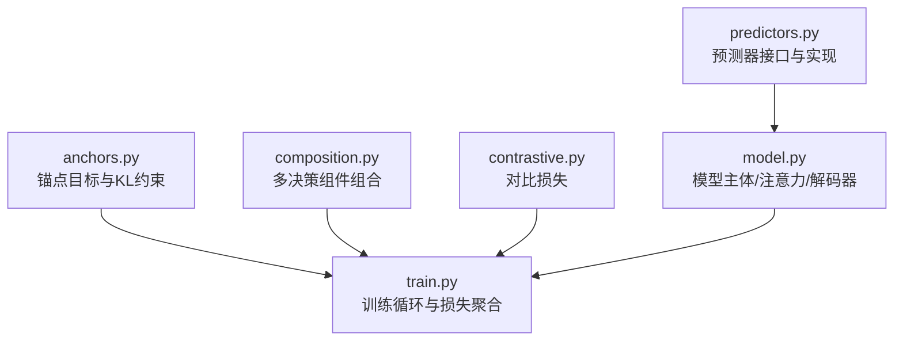
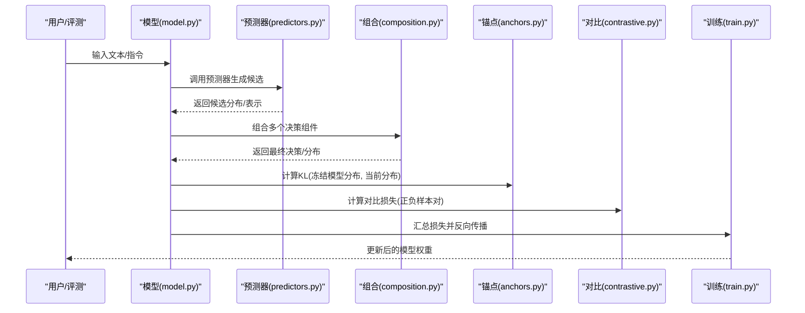
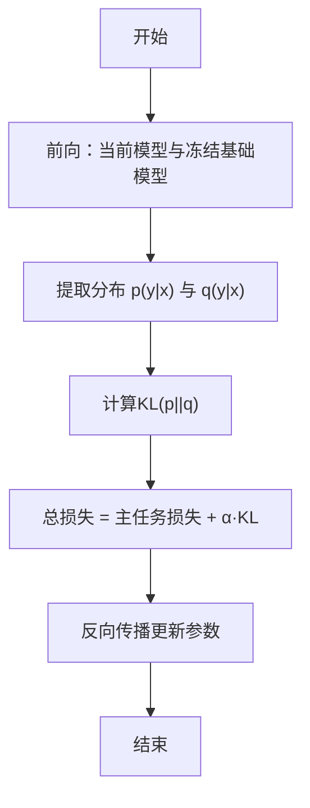
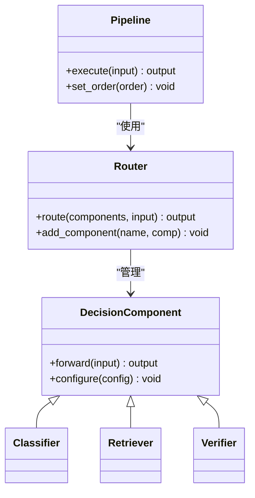
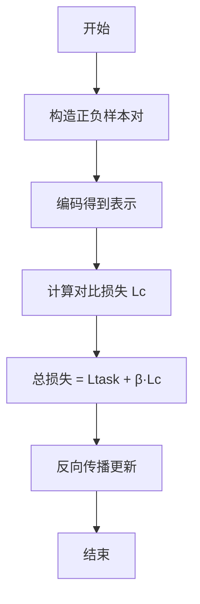
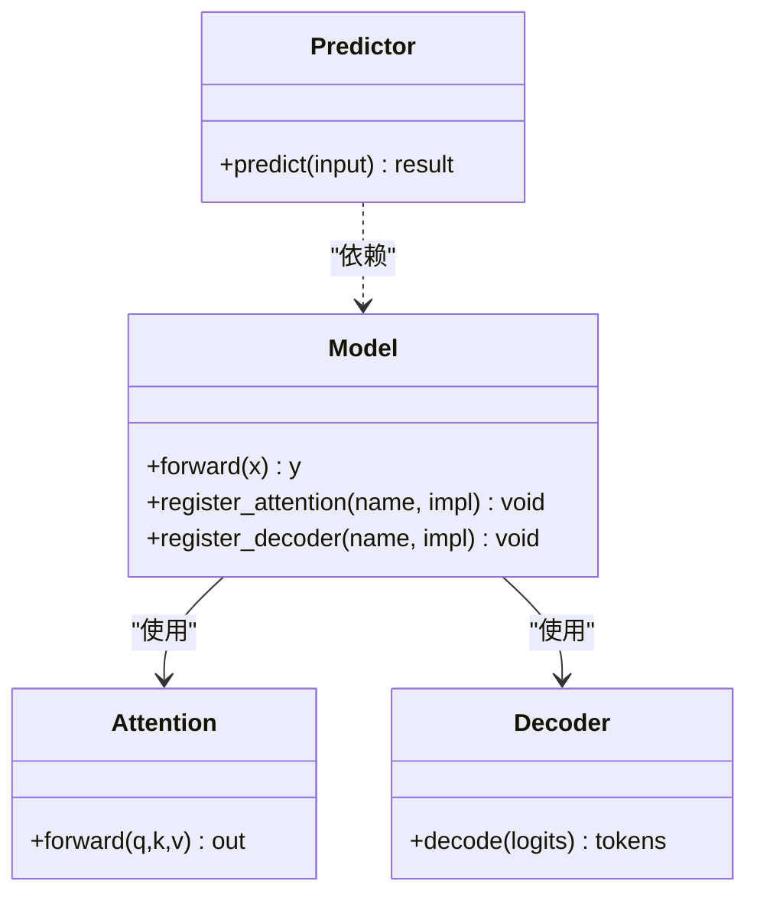
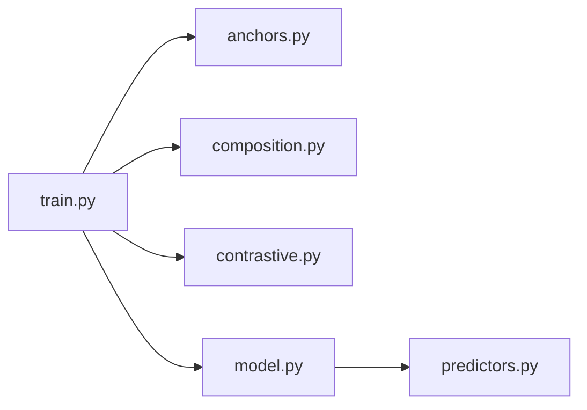

<cite>
**本文引用的文件**   
- [anchors.py](file://kev/anchors.py)
- [composition.py](file://kev/composition.py)
- [contrastive.py](file://kev/contrastive.py)
- [model.py](file://kev/model.py)
- [train.py](file://kev/train.py)
- [predictors.py](file://kev/predictors.py)
</cite>

## 目录
1. [引言](#引言)
2. [项目结构](#项目结构)
3. [核心组件](#核心组件)
4. [架构总览](#架构总览)
5. [详细组件分析](#详细组件分析)
6. [依赖关系分析](#依赖关系分析)
7. [性能考虑](#性能考虑)
8. [故障排查指南](#故障排查指南)
9. [结论](#结论)
10. [附录](#附录)

## 引言
本文件系统性阐述 Kev 模型的扩展机制，重点覆盖以下主题：
- 锚点机制（Anchor Targets）：以冻结基础模型的零样本分布为 KL 目标，抑制微调过程中的“基础能力侵蚀”。
- 组合策略：将多个决策组件组合成复杂推理系统。
- 对比学习：通过对比损失函数提升判别能力。
- 扩展点：如何添加新问题类型、自定义注意力机制、扩展指针头解码器，以及集成新的层类型、激活函数与正则化技术。
- 实践建议：性能优化与最佳实践。

## 项目结构
Kev 的核心扩展能力集中在以下模块：
- anchors.py：实现锚点目标与 KL 约束，用于稳定微调。
- composition.py：提供多决策组件的组合编排与路由逻辑。
- contrastive.py：定义对比损失与训练流程。
- model.py：模型主体、注意力、解码器等可插拔组件的注册与装配。
- train.py：训练循环、损失聚合、优化器调度等。
- predictors.py：预测器接口与具体实现，支撑问题类型扩展。

**图示来源**
- [anchors.py:1-200](file://kev/anchors.py#L1-L200)
- [composition.py:1-200](file://kev/composition.py#L1-L200)
- [contrastive.py:1-200](file://kev/contrastive.py#L1-L200)
- [model.py:1-200](file://kev/model.py#L1-L200)
- [train.py:1-200](file://kev/train.py#L1-L200)
- [predictors.py:1-200](file://kev/predictors.py#L1-L200)

**章节来源**
- [anchors.py:1-200](file://kev/anchors.py#L1-L200)
- [composition.py:1-200](file://kev/composition.py#L1-L200)
- [contrastive.py:1-200](file://kev/contrastive.py#L1-L200)
- [model.py:1-200](file://kev/model.py#L1-L200)
- [train.py:1-200](file://kev/train.py#L1-L200)
- [predictors.py:1-200](file://kev/predictors.py#L1-L200)

## 核心组件
- 锚点机制（Anchor Targets）
  - 使用冻结的基础模型输出作为目标分布，对当前模型输出施加 KL 散度约束，防止微调过程中基础能力的退化。
  - 关键要点：目标分布来自冻结模型；KL 项在总损失中加权；支持按任务或 token 粒度控制权重。
- 组合策略（Composition）
  - 将多个决策组件（如分类器、检索器、验证器）组合为流水线或图结构，支持条件分支与动态路由。
  - 关键要点：组件接口统一；组合规则可配置；支持并行与串行执行模式。
- 对比学习（Contrastive Learning）
  - 通过正负样本对构造对比损失，增强模型对相似/不相似输入的判别力。
  - 关键要点：温度参数调节；批次内负样本采样；可与主任务损失联合优化。
- 模型主体与扩展点（Model & Extensions）
  - 注意力、解码器、层类型、激活函数、正则化均可通过注册表或工厂方法替换。
  - 关键要点：统一的接口契约；可扩展的配置字典；向后兼容的默认实现。

**章节来源**
- [anchors.py:1-200](file://kev/anchors.py#L1-L200)
- [composition.py:1-200](file://kev/composition.py#L1-L200)
- [contrastive.py:1-200](file://kev/contrastive.py#L1-L200)
- [model.py:1-200](file://kev/model.py#L1-L200)

## 架构总览
下图展示从输入到输出的整体数据流，包括锚点 KL 约束、对比损失与组合决策的参与位置。

**图示来源**
- [model.py:1-200](file://kev/model.py#L1-L200)
- [predictors.py:1-200](file://kev/predictors.py#L1-L200)
- [composition.py:1-200](file://kev/composition.py#L1-L200)
- [anchors.py:1-200](file://kev/anchors.py#L1-L200)
- [contrastive.py:1-200](file://kev/contrastive.py#L1-L200)
- [train.py:1-200](file://kev/train.py#L1-L200)

## 详细组件分析

### 锚点机制（Anchor Targets）
- 工作原理
  - 冻结基础模型产生目标分布 q(y|x)。
  - 当前模型 p(y|x) 通过 KL(p||q) 被约束，避免偏离基础能力。
  - 可在不同任务、token 或时间步上设置不同的权重系数。
- 训练流程
  - 前向：同时运行当前模型与冻结基础模型。
  - 损失：主任务损失 + KL 锚点损失（加权）。
  - 反向：仅对可训练参数更新，冻结模型不参与梯度。
- 扩展方式
  - 新增锚点目标：在 anchors.py 中注册新的目标分布来源（例如基于外部知识库的软标签）。
  - 调整 KL 权重：通过配置字典或超参搜索进行调优。

**图示来源**
- [anchors.py:1-200](file://kev/anchors.py#L1-L200)
- [train.py:1-200](file://kev/train.py#L1-L200)

**章节来源**
- [anchors.py:1-200](file://kev/anchors.py#L1-L200)
- [train.py:1-200](file://kev/train.py#L1-L200)

### 组合策略（Composition）
- 设计思想
  - 将多个决策组件抽象为统一接口，支持串行、并行、条件分支与循环。
  - 通过组合规则描述组件间的依赖与数据流向。
- 典型用法
  - 先由检索器召回候选，再由分类器打分，最后由验证器校验。
  - 根据置信度阈值动态选择后续组件。
- 扩展方式
  - 新增决策组件：实现统一接口并在组合注册表中登记。
  - 自定义路由策略：编写条件判断或学习式门控。

**图示来源**
- [composition.py:1-200](file://kev/composition.py#L1-L200)

**章节来源**
- [composition.py:1-200](file://kev/composition.py#L1-L200)

### 对比学习（Contrastive Learning）
- 目标与动机
  - 通过拉近正样本对、推远负样本对，提升模型表征的判别性。
- 实现要点
  - 温度参数 τ 控制分布尖锐程度。
  - 批次内负样本采样或外部负样本池。
  - 与主任务损失联合优化，比例系数 β 可调。
- 训练流程
  - 构造正负样本对 → 计算对比损失 → 与主任务损失加权求和 → 反向传播。

**图示来源**
- [contrastive.py:1-200](file://kev/contrastive.py#L1-L200)
- [train.py:1-200](file://kev/train.py#L1-L200)

**章节来源**
- [contrastive.py:1-200](file://kev/contrastive.py#L1-L200)
- [train.py:1-200](file://kev/train.py#L1-L200)

### 模型主体与扩展点（Model & Extensions）
- 注意力机制
  - 支持多头注意力、相对位置偏置、稀疏注意力等变体。
  - 扩展点：在 model.py 中注册新的注意力实现，并通过配置切换。
- 解码器（指针头）
  - 支持标准 softmax 解码与指针网络解码。
  - 扩展点：在 predictors.py 或 model.py 中扩展新的解码策略（如结构化输出、约束解码）。
- 层类型、激活函数、正则化
  - 层类型：线性、卷积、归一化、残差连接等可替换。
  - 激活函数：ReLU、GELU、Swish 等可通过配置注入。
  - 正则化：Dropout、LayerNorm、Weight Decay、Stochastic Depth 等。
- 问题类型扩展
  - 在 predictors.py 中定义新问题的预测器类，实现统一接口。
  - 在组合策略中注册该预测器，并配置其输入输出格式。

**图示来源**
- [model.py:1-200](file://kev/model.py#L1-L200)
- [predictors.py:1-200](file://kev/predictors.py#L1-L200)

**章节来源**
- [model.py:1-200](file://kev/model.py#L1-L200)
- [predictors.py:1-200](file://kev/predictors.py#L1-L200)

### 实操示例（代码片段路径）
- 添加新问题类型
  - 参考路径：[predictors.py:1-200](file://kev/predictors.py#L1-L200)
  - 步骤：定义新预测器类 → 实现 predict 接口 → 在组合策略中注册 → 配置输入输出。
- 自定义注意力机制
  - 参考路径：[model.py:1-200](file://kev/model.py#L1-L200)
  - 步骤：实现 Attention 接口 → 在模型中注册 → 通过配置启用。
- 扩展指针头解码器
  - 参考路径：[model.py:1-200](file://kev/model.py#L1-L200), [predictors.py:1-200](file://kev/predictors.py#L1-L200)
  - 步骤：实现 Decoder 接口 → 注册解码器 → 在推理时选择。

**章节来源**
- [predictors.py:1-200](file://kev/predictors.py#L1-L200)
- [model.py:1-200](file://kev/model.py#L1-L200)

## 依赖关系分析
- 模块耦合
  - train.py 依赖 anchors.py、contrastive.py、model.py 以聚合损失并驱动优化。
  - composition.py 与 predictors.py 解耦良好，便于独立扩展。
- 外部依赖
  - 框架级张量运算与自动微分（由底层深度学习框架提供）。
  - 可选：分布式训练、混合精度、CUDA Graphs 等加速特性。

**图示来源**
- [train.py:1-200](file://kev/train.py#L1-L200)
- [anchors.py:1-200](file://kev/anchors.py#L1-L200)
- [composition.py:1-200](file://kev/composition.py#L1-L200)
- [contrastive.py:1-200](file://kev/contrastive.py#L1-L200)
- [model.py:1-200](file://kev/model.py#L1-L200)
- [predictors.py:1-200](file://kev/predictors.py#L1-L200)

**章节来源**
- [train.py:1-200](file://kev/train.py#L1-L200)
- [anchors.py:1-200](file://kev/anchors.py#L1-L200)
- [composition.py:1-200](file://kev/composition.py#L1-L200)
- [contrastive.py:1-200](file://kev/contrastive.py#L1-L200)
- [model.py:1-200](file://kev/model.py#L1-L200)
- [predictors.py:1-200](file://kev/predictors.py#L1-L200)

## 性能考虑
- 锚点 KL 约束
  - 冻结基础模型的前向开销需计入训练成本；可采用缓存或批处理减少重复计算。
  - 合理设置 KL 权重 α，避免过度约束导致收敛缓慢。
- 对比学习
  - 温度参数 τ 影响数值稳定性；建议使用稳定的 log-sum-exp 实现。
  - 负样本数量与批次大小相关，需平衡显存与判别效果。
- 组合策略
  - 串行组件可能成为瓶颈；尽量并行化无依赖的组件。
  - 动态路由引入额外开销，应评估收益是否值得。
- 解码器与注意力
  - 指针网络解码在长序列上可能较慢；可结合剪枝或早停策略。
  - 稀疏注意力可降低复杂度，但需权衡表达能力。

[本节为通用指导，无需特定文件引用]

## 故障排查指南
- KL 发散或不收敛
  - 检查冻结模型输出是否有效；确认 KL 权重 α 不过大。
  - 参考路径：[anchors.py:1-200](file://kev/anchors.py#L1-L200), [train.py:1-200](file://kev/train.py#L1-L200)
- 对比损失不稳定
  - 调整温度参数 τ；确保正负样本对构造正确。
  - 参考路径：[contrastive.py:1-200](file://kev/contrastive.py#L1-L200)
- 组合路由异常
  - 检查组件接口一致性；确认路由条件逻辑。
  - 参考路径：[composition.py:1-200](file://kev/composition.py#L1-L200)
- 解码器输出异常
  - 验证解码器实现与配置；检查指针头维度对齐。
  - 参考路径：[model.py:1-200](file://kev/model.py#L1-L200), [predictors.py:1-200](file://kev/predictors.py#L1-L200)

**章节来源**
- [anchors.py:1-200](file://kev/anchors.py#L1-L200)
- [contrastive.py:1-200](file://kev/contrastive.py#L1-L200)
- [composition.py:1-200](file://kev/composition.py#L1-L200)
- [model.py:1-200](file://kev/model.py#L1-L200)
- [predictors.py:1-200](file://kev/predictors.py#L1-L200)
- [train.py:1-200](file://kev/train.py#L1-L200)

## 结论
Kev 的扩展机制围绕锚点 KL 约束、组合决策与对比学习三大支柱构建，提供了清晰的扩展点与灵活的配置方式。通过遵循统一接口与注册机制，用户可以便捷地添加新问题类型、自定义注意力与解码器，并集成新的层类型、激活函数与正则化技术。在实践中，应关注 KL 权重、温度参数与组合开销等关键超参，以获得稳定且高效的训练与推理性能。

[本节为总结性内容，无需特定文件引用]

## 附录
- 术语表
  - 锚点目标：冻结基础模型产生的目标分布，用于 KL 约束。
  - 组合策略：将多个决策组件编排为复杂推理系统的机制。
  - 对比学习：通过正负样本对优化表征判别性的方法。
  - 指针头解码器：基于指针网络的解码策略，支持抽取式输出。

[本节为概念性内容，无需特定文件引用]