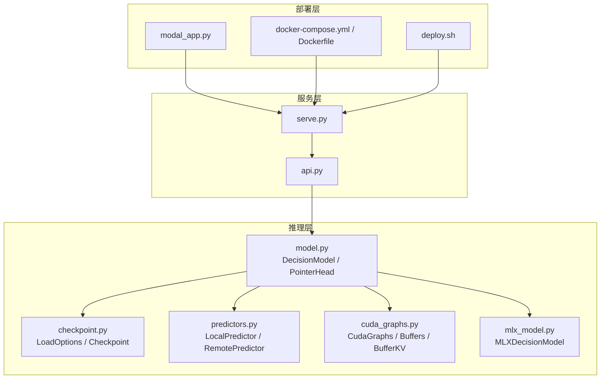
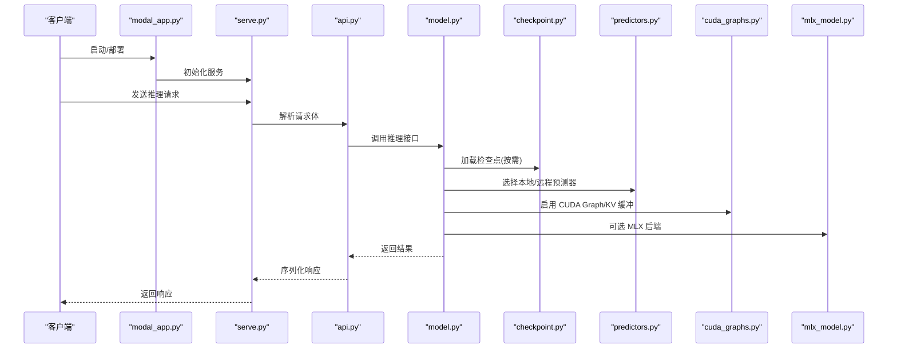
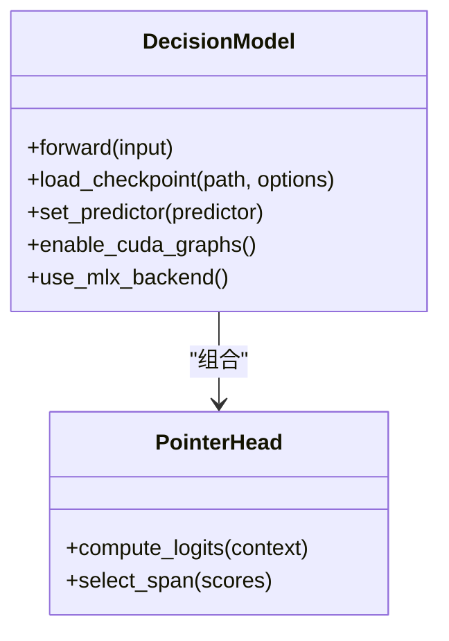
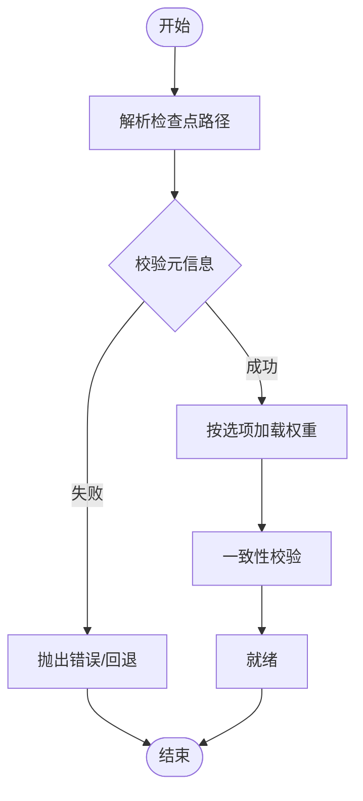
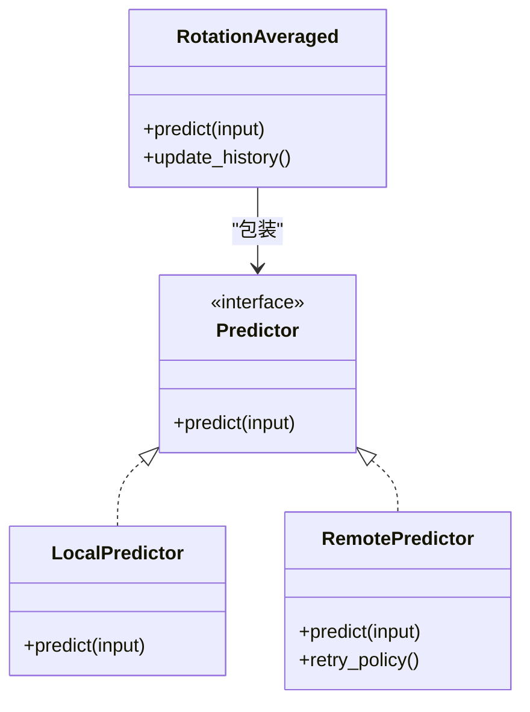
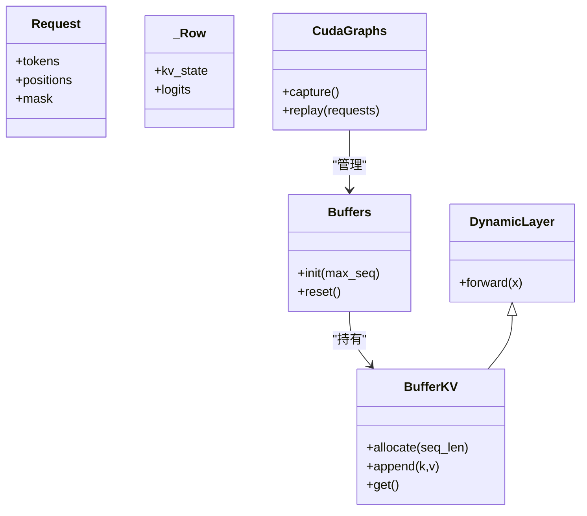
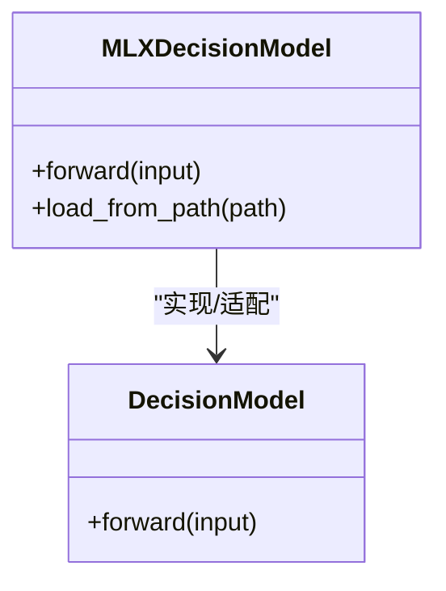
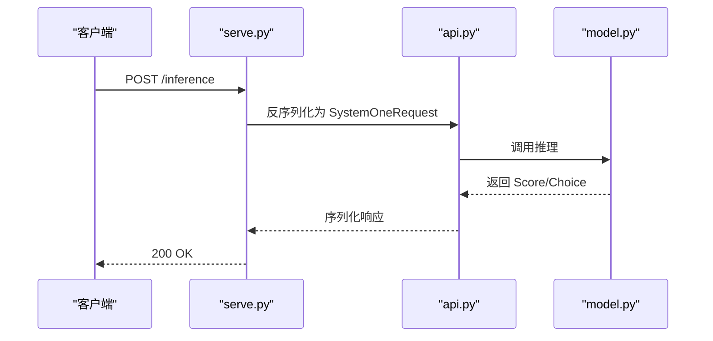
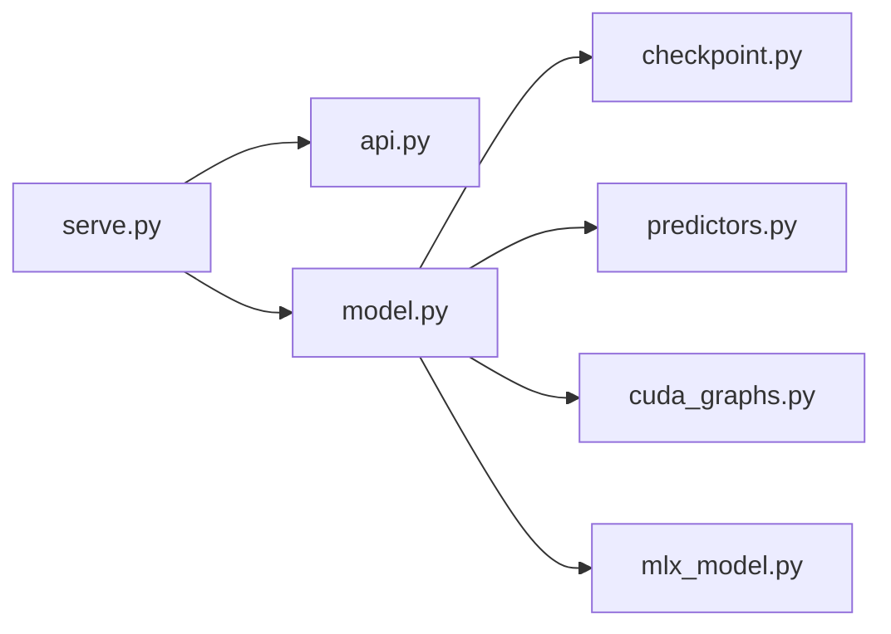

# 知识图谱系统

<cite>
**本文引用的文件**   
- [README.md](file://README.md)
- [pyproject.toml](file://pyproject.toml)
- [modal_app.py](file://modal_app.py)
- [docker-compose.yml](file://docker-compose.yml)
- [Dockerfile](file://Dockerfile)
- [deploy.sh](file://deploy.sh)
- [kev/api.py](file://kev/api.py)
- [kev/model.py](file://kev/model.py)
- [kev/checkpoint.py](file://kev/checkpoint.py)
- [kev/predictors.py](file://kev/predictors.py)
- [kev/cuda_graphs.py](file://kev/cuda_graphs.py)
- [mlx_model.py](file://mlx_model.py)
- [serve.py](file://kev/serve.py)
</cite>

## 目录
1. [简介](#简介)
2. [项目结构](#项目结构)
3. [核心组件](#核心组件)
4. [架构总览](#架构总览)
5. [详细组件分析](#详细组件分析)
6. [依赖关系分析](#依赖关系分析)
7. [性能考量](#性能考量)
8. [故障排查指南](#故障排查指南)
9. [结论](#结论)
10. [附录](#附录)

## 简介
本项目是一个面向推理与部署的“知识图谱系统”，围绕决策模型（DecisionModel）提供训练、评估、服务化与云端部署能力。系统以模块化方式组织，涵盖：
- 模型定义与推理接口
- 检查点加载与管理
- 本地与远程预测器
- CUDA Graph 加速与 KV 缓存
- MLX 后端适配
- API 与服务编排
- Docker/Modal 部署脚本

本仓库同时包含大量实验与评测数据，但本文聚焦于核心代码结构与运行流程，帮助读者快速理解并上手该系统。

## 项目结构
- 顶层脚本与配置
  - README.md：项目说明与使用指引
  - pyproject.toml：Python 包与依赖声明
  - modal_app.py：Modal 云端应用入口
  - docker-compose.yml：容器编排
  - Dockerfile：镜像构建
  - deploy.sh：部署脚本
- 核心模块（kev/）
  - api.py：请求/响应数据模型
  - model.py：决策模型与指针头
  - checkpoint.py：检查点元信息与加载选项
  - predictors.py：本地/远程预测器与旋转平均策略
  - cuda_graphs.py：CUDA Graph 与 KV 缓冲管理
  - mlx_model.py：MLX 后端决策模型封装
  - serve.py：服务化入口（HTTP/WS 等）
- 其他辅助模块（未在本节展开）
  - anchors.py、benchmark.py、budget.py、calibrate.py、compare.py、composition.py、contrastive.py、data.py、device.py、evaluate.py、experiment.py、full_ft.py、fused_qwen35.py、jev.py、metrics.py、mirror.py、plot.py、publish.py、rounds.py、shared_prefix.py、study_v3.py、suite.py、train.py、transfer_v9.py

**图示来源**
- [modal_app.py:1-200](file://modal_app.py#L1-L200)
- [docker-compose.yml:1-200](file://docker-compose.yml#L1-L200)
- [Dockerfile:1-200](file://Dockerfile#L1-L200)
- [deploy.sh:1-200](file://deploy.sh#L1-L200)
- [serve.py:1-200](file://kev/serve.py#L1-L200)
- [kev/api.py:1-200](file://kev/api.py#L1-L200)
- [kev/model.py:1-300](file://kev/model.py#L1-L300)
- [kev/checkpoint.py:1-200](file://kev/checkpoint.py#L1-L200)
- [kev/predictors.py:1-300](file://kev/predictors.py#L1-L300)
- [kev/cuda_graphs.py:1-200](file://kev/cuda_graphs.py#L1-L200)
- [mlx_model.py:1-200](file://mlx_model.py#L1-L200)

**章节来源**
- [README.md:1-200](file://README.md#L1-L200)
- [pyproject.toml:1-200](file://pyproject.toml#L1-L200)

## 核心组件
- 决策模型（DecisionModel）
  - 负责核心推理逻辑，包含指针头（PointerHead）用于定位关键信息
  - 对外暴露统一的推理接口，供上层服务调用
- 检查点管理（Checkpoint / LoadOptions）
  - 统一检查点元数据与加载参数，支持不同后端与设备
- 预测器（LocalPredictor / RemotePredictor）
  - 本地预测器直接调用模型；远程预测器通过 HTTP/gRPC 等方式调用远端服务
  - 支持旋转平均（RotationAveraged）提升稳定性
- CUDA Graph 与 KV 缓冲（CudaGraphs / Buffers / BufferKV）
  - 利用 CUDA Graph 减少内核启动开销
  - 动态层（DynamicLayer）与 KV 缓冲优化长上下文推理
- MLX 后端（MLXDecisionModel）
  - 为 MLX 平台提供决策模型封装，便于跨平台推理
- API 与服务（api.py / serve.py）
  - 定义请求/响应数据结构
  - 提供服务化入口，将外部请求路由到模型推理

**章节来源**
- [kev/model.py:1-300](file://kev/model.py#L1-L300)
- [kev/checkpoint.py:1-200](file://kev/checkpoint.py#L1-L200)
- [kev/predictors.py:1-300](file://kev/predictors.py#L1-L300)
- [kev/cuda_graphs.py:1-200](file://kev/cuda_graphs.py#L1-L200)
- [mlx_model.py:1-200](file://mlx_model.py#L1-L200)
- [kev/api.py:1-200](file://kev/api.py#L1-L200)
- [serve.py:1-200](file://kev/serve.py#L1-L200)

## 架构总览
系统采用分层架构：
- 部署层：Modal/Docker/Shell 脚本负责环境准备与资源调度
- 服务层：serve.py 暴露 HTTP/WS 接口，api.py 定义结构化请求/响应
- 推理层：model.py 为核心模型，checkpoint.py 负责权重加载，predictors.py 抽象本地/远程推理路径，cuda_graphs.py 提供 GPU 侧优化，mlx_model.py 适配 MLX 后端

**图示来源**
- [modal_app.py:1-200](file://modal_app.py#L1-L200)
- [serve.py:1-200](file://kev/serve.py#L1-L200)
- [kev/api.py:1-200](file://kev/api.py#L1-L200)
- [kev/model.py:1-300](file://kev/model.py#L1-L300)
- [kev/checkpoint.py:1-200](file://kev/checkpoint.py#L1-L200)
- [kev/predictors.py:1-300](file://kev/predictors.py#L1-L300)
- [kev/cuda_graphs.py:1-200](file://kev/cuda_graphs.py#L1-L200)
- [mlx_model.py:1-200](file://mlx_model.py#L1-L200)

## 详细组件分析

### 决策模型与指针头（model.py）
- DecisionModel：封装模型前向逻辑，统一输入输出格式，协调各子模块
- PointerHead：用于从上下文中定位关键片段或实体，增强可解释性与检索能力

**图示来源**
- [kev/model.py:1-300](file://kev/model.py#L1-L300)

**章节来源**
- [kev/model.py:1-300](file://kev/model.py#L1-L300)

### 检查点管理（checkpoint.py）
- Meta：描述检查点元信息（版本、哈希、配置等）
- LoadOptions：控制加载行为（设备、精度、分片等）
- Checkpoint：统一加载与校验流程

**图示来源**
- [kev/checkpoint.py:1-200](file://kev/checkpoint.py#L1-L200)

**章节来源**
- [kev/checkpoint.py:1-200](file://kev/checkpoint.py#L1-L200)

### 预测器抽象（predictors.py）
- LocalPredictor：本地进程内推理，低延迟
- RemotePredictor：通过网络调用远端服务，适合分布式部署
- RotationAveraged：对多轮预测进行旋转平均，提高鲁棒性

**图示来源**
- [kev/predictors.py:1-300](file://kev/predictors.py#L1-L300)

**章节来源**
- [kev/predictors.py:1-300](file://kev/predictors.py#L1-L300)

### CUDA Graph 与 KV 缓冲（cuda_graphs.py）
- Request/_Row：定义请求与行级数据结构
- DynamicLayer：动态层基类，支持运行时形状变化
- BufferKV：KV 缓存管理，降低重复计算
- Buffers/CudaGraphs：批量管理与图执行优化

**图示来源**
- [kev/cuda_graphs.py:1-200](file://kev/cuda_graphs.py#L1-L200)

**章节来源**
- [kev/cuda_graphs.py:1-200](file://kev/cuda_graphs.py#L1-L200)

### MLX 后端适配（mlx_model.py）
- MLXDecisionModel：在 MLX 平台上实现决策模型推理，屏蔽底层差异

**图示来源**
- [mlx_model.py:1-200](file://mlx_model.py#L1-L200)
- [kev/model.py:1-300](file://kev/model.py#L1-L300)

**章节来源**
- [mlx_model.py:1-200](file://mlx_model.py#L1-L200)

### API 与服务（api.py / serve.py）
- api.py：定义 Noul、Choice、Score、SystemOneRequest 等结构化数据模型
- serve.py：服务化入口，处理请求生命周期、日志、监控与错误处理

**图示来源**
- [serve.py:1-200](file://kev/serve.py#L1-L200)
- [kev/api.py:1-200](file://kev/api.py#L1-L200)
- [kev/model.py:1-300](file://kev/model.py#L1-L300)

**章节来源**
- [kev/api.py:1-200](file://kev/api.py#L1-L200)
- [serve.py:1-200](file://kev/serve.py#L1-L200)

## 依赖关系分析
- 模块耦合
  - serve.py 依赖 api.py 与 model.py
  - model.py 依赖 checkpoint.py、predictors.py、cuda_graphs.py、mlx_model.py
  - predictors.py 与 cuda_graphs.py 被 model.py 组合使用
- 外部依赖
  - 部署层依赖 Modal/Docker/Shell 工具链
  - 推理层依赖 PyTorch/TensorFlow（具体取决于后端），以及可能的网络库（RemotePredictor）

**图示来源**
- [serve.py:1-200](file://kev/serve.py#L1-L200)
- [kev/api.py:1-200](file://kev/api.py#L1-L200)
- [kev/model.py:1-300](file://kev/model.py#L1-L300)
- [kev/checkpoint.py:1-200](file://kev/checkpoint.py#L1-L200)
- [kev/predictors.py:1-300](file://kev/predictors.py#L1-L300)
- [kev/cuda_graphs.py:1-200](file://kev/cuda_graphs.py#L1-L200)
- [mlx_model.py:1-200](file://mlx_model.py#L1-L200)

**章节来源**
- [serve.py:1-200](file://kev/serve.py#L1-L200)
- [kev/api.py:1-200](file://kev/api.py#L1-L200)
- [kev/model.py:1-300](file://kev/model.py#L1-L300)

## 性能考量
- CUDA Graph 与 KV 缓冲
  - 通过捕获静态计算图减少内核启动开销
  - KV 缓存复用避免重复计算，显著降低长上下文推理时延
- 预测器选择
  - 本地预测器适合低延迟场景；远程预测器适合横向扩展与资源隔离
- 旋转平均
  - 对多次预测结果进行融合，提升稳定性与泛化能力
- 批处理与并行
  - 建议结合服务层的并发模型与队列机制，最大化吞吐

[本节为通用指导，不直接分析具体文件]

## 故障排查指南
- 检查点加载失败
  - 确认路径与权限正确
  - 核对元信息版本与配置是否匹配
  - 查看 LoadOptions 的设备与精度设置
- 服务不可用
  - 检查 serve.py 端口占用与监听状态
  - 验证 API 请求体是否符合 schema
  - 查看日志中的异常堆栈与超时信息
- 推理性能不佳
  - 确认是否启用 CUDA Graph 与 KV 缓冲
  - 调整批大小与并发度
  - 评估是否切换至本地预测器或优化网络链路

**章节来源**
- [kev/checkpoint.py:1-200](file://kev/checkpoint.py#L1-L200)
- [serve.py:1-200](file://kev/serve.py#L1-L200)
- [kev/api.py:1-200](file://kev/api.py#L1-L200)

## 结论
本系统以 DecisionModel 为核心，结合检查点管理、预测器抽象、CUDA Graph/KV 优化与 MLX 后端适配，形成一套完整的知识图谱推理与服务化方案。通过模块化设计与清晰的职责划分，既保证了可扩展性，也兼顾了部署与运维的便利性。建议在真实场景中优先启用 CUDA Graph 与 KV 缓冲，并根据负载特征选择合适的预测器与并发策略。

[本节为总结性内容，不直接分析具体文件]

## 附录
- 部署参考
  - Modal：参见 modal_app.py
  - Docker：参见 docker-compose.yml 与 Dockerfile
  - Shell 脚本：参见 deploy.sh
- 依赖与环境
  - Python 包与依赖：参见 pyproject.toml
  - 项目说明与快速上手：参见 README.md

**章节来源**
- [modal_app.py:1-200](file://modal_app.py#L1-L200)
- [docker-compose.yml:1-200](file://docker-compose.yml#L1-L200)
- [Dockerfile:1-200](file://Dockerfile#L1-L200)
- [deploy.sh:1-200](file://deploy.sh#L1-L200)
- [pyproject.toml:1-200](file://pyproject.toml#L1-L200)
- [README.md:1-200](file://README.md#L1-L200)