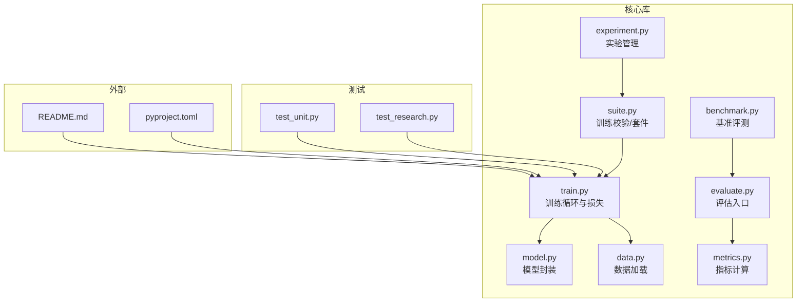
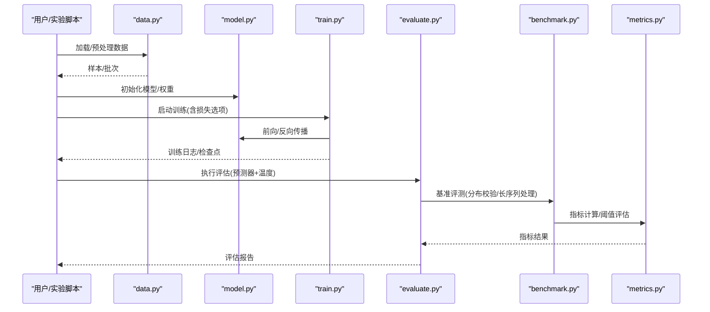
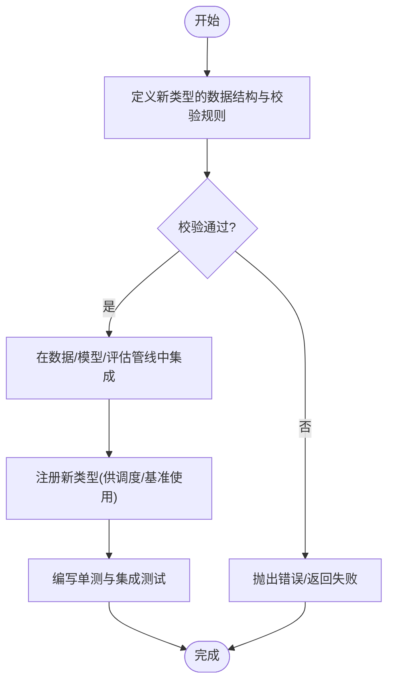
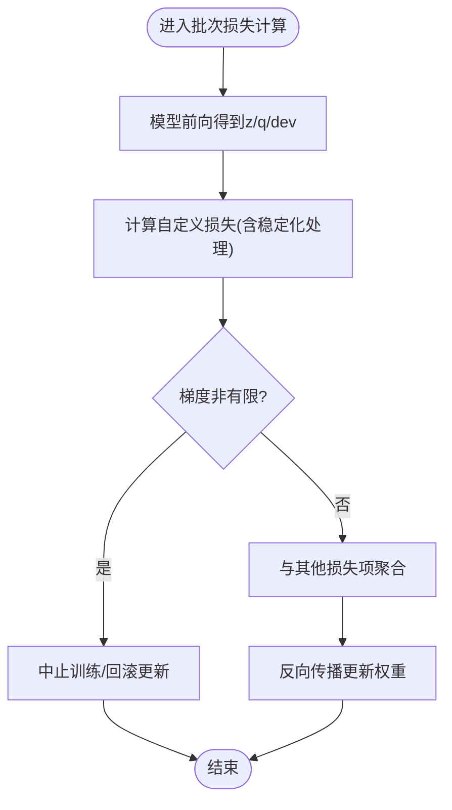
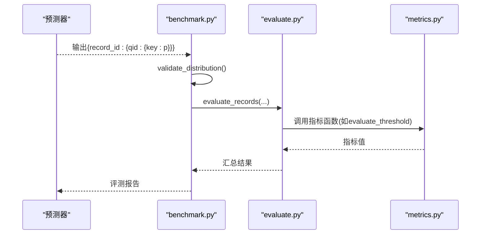
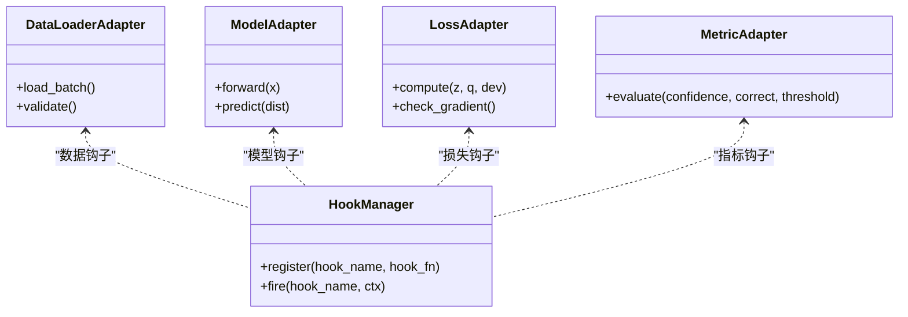
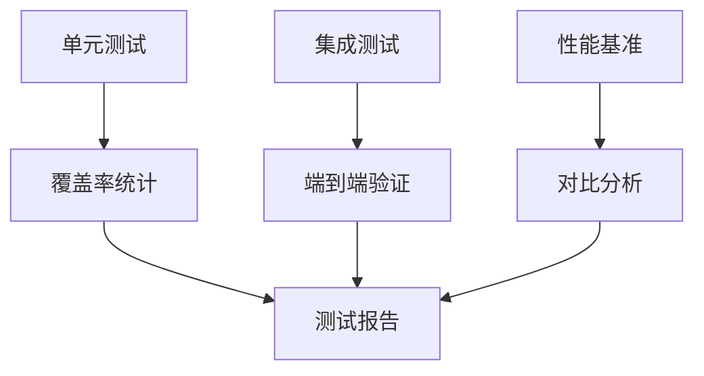
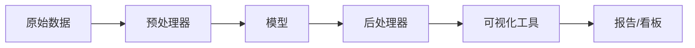
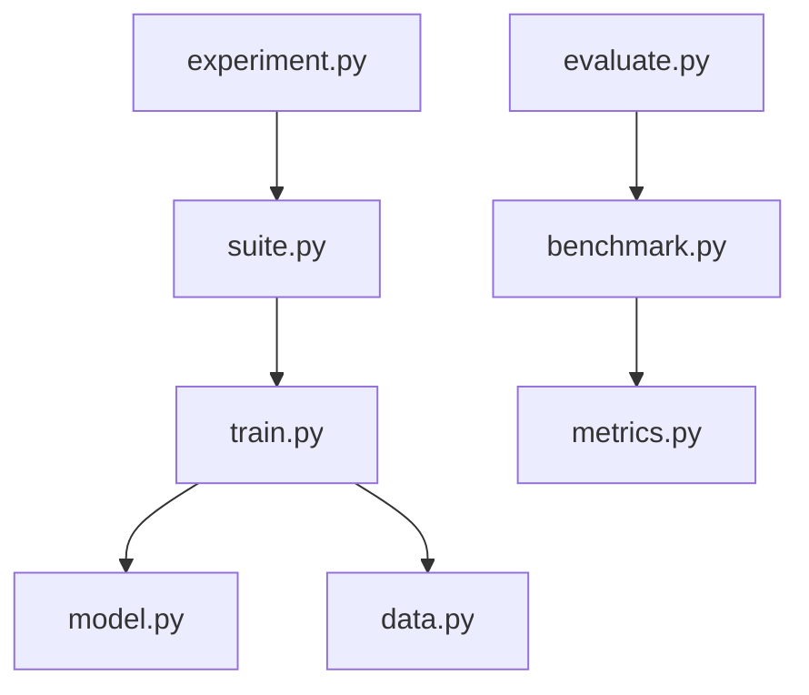

<cite>
**本文引用的文件**   
- [README.md](file://README.md)
- [pyproject.toml](file://pyproject.toml)
- [kev/train.py](file://kev/train.py)
- [kev/metrics.py](file://kev/metrics.py)
- [kev/evaluate.py](file://kev/evaluate.py)
- [kev/benchmark.py](file://kev/benchmark.py)
- [kev/model.py](file://kev/model.py)
- [kev/data.py](file://kev/data.py)
- [kev/suite.py](file://kev/suite.py)
- [kev/experiment.py](file://kev/experiment.py)
- [tests/test_research.py](file://tests/test_research.py)
- [tests/test_unit.py](file://tests/test_unit.py)
</cite>

## 目录
1. [简介](#简介)
2. [项目结构](#项目结构)
3. [核心组件](#核心组件)
4. [架构总览](#架构总览)
5. [详细组件分析](#详细组件分析)
6. [依赖关系分析](#依赖关系分析)
7. [性能考量](#性能考量)
8. [故障排查指南](#故障排查指南)
9. [结论](#结论)
10. [附录](#附录)

## 简介
本指南面向希望在 Kev 框架中进行“自定义扩展”的开发者，覆盖以下主题：
- 如何添加新的问题类型（继承基类、实现验证逻辑、注册新类型）
- 如何开发自定义损失函数（梯度计算、数值稳定性、与训练流程集成）
- 如何扩展评估指标（实现自定义评估函数、接入基准测试框架）
- 插件化模式（适配器接口、钩子机制、事件系统的使用思路）
- 调试与测试最佳实践（单元测试、集成测试、性能基准）
- 扩展现有组件（预处理器、后处理器、可视化工具）

Kev 是一个围绕模型训练、评估与实验管理的工程化框架，提供数据加载、模型封装、训练循环、损失定义、指标计算、基准评测与可视化等能力。通过理解其核心模块与扩展点，你可以以最小侵入的方式扩展系统能力。

## 项目结构
仓库采用“功能域 + 工具脚本”的组织方式：
- kev/：核心库代码，包含训练、模型、数据、评估、指标、基准、实验编排等
- tests/：单元与集成测试
- scripts/：数据处理、构建数据集、报告生成等工具脚本
- experiments/：实验配置与运行记录
- evals/：基准评测集与评测脚本
- docs/：文档与说明
- runs/：训练与评测的运行产物

图表来源
- [kev/train.py:1-450](file://kev/train.py#L1-L450)
- [kev/model.py:1-200](file://kev/model.py#L1-L200)
- [kev/data.py:1-200](file://kev/data.py#L1-L200)
- [kev/metrics.py:1-400](file://kev/metrics.py#L1-L400)
- [kev/evaluate.py:1-200](file://kev/evaluate.py#L1-L200)
- [kev/benchmark.py:1-200](file://kev/benchmark.py#L1-L200)
- [kev/suite.py:1-200](file://kev/suite.py#L1-L200)
- [kev/experiment.py:1-200](file://kev/experiment.py#L1-L200)
- [tests/test_research.py:1-500](file://tests/test_research.py#L1-L500)
- [tests/test_unit.py:1-1200](file://tests/test_unit.py#L1-L1200)
- [pyproject.toml:1-200](file://pyproject.toml#L1-L200)
- [README.md:1-200](file://README.md#L1-L200)

章节来源
- [README.md:1-200](file://README.md#L1-L200)
- [pyproject.toml:1-200](file://pyproject.toml#L1-L200)

## 核心组件
- 训练与损失：train.py 定义了训练循环、批次损失聚合、锚定损失以及多种损失选项；支持标签平滑、Brier 项、Focal Gamma 等。
- 指标与校准：metrics.py 提供阈值评估、温度校准交叉验证等工具。
- 评估与基准：evaluate.py 与 benchmark.py 负责将预测器接入评测流程，统一处理分布校验、长序列跳过、温度参数等。
- 模型与数据：model.py 与 data.py 分别封装模型推理与数据加载，为训练与评估提供基础。
- 套件与实验：suite.py 提供训练数据的校验与套件管理；experiment.py 提供实验配置与试验级校验。

章节来源
- [kev/train.py:1-450](file://kev/train.py#L1-L450)
- [kev/metrics.py:1-400](file://kev/metrics.py#L1-L400)
- [kev/evaluate.py:1-200](file://kev/evaluate.py#L1-L200)
- [kev/benchmark.py:1-200](file://kev/benchmark.py#L1-L200)
- [kev/model.py:1-200](file://kev/model.py#L1-L200)
- [kev/data.py:1-200](file://kev/data.py#L1-L200)
- [kev/suite.py:1-200](file://kev/suite.py#L1-L200)
- [kev/experiment.py:1-200](file://kev/experiment.py#L1-L200)

## 架构总览
下图展示了从数据到训练、评估与基准评测的整体流程，以及各模块之间的调用关系。

图表来源
- [kev/data.py:1-200](file://kev/data.py#L1-L200)
- [kev/model.py:1-200](file://kev/model.py#L1-L200)
- [kev/train.py:1-450](file://kev/train.py#L1-L450)
- [kev/evaluate.py:1-200](file://kev/evaluate.py#L1-L200)
- [kev/benchmark.py:1-200](file://kev/benchmark.py#L1-L200)
- [kev/metrics.py:1-400](file://kev/metrics.py#L1-L400)

## 详细组件分析

### 新增问题类型（继承基类、验证逻辑、注册）
目标：在不改动核心训练/评估流程的前提下，增加一种新的问题类型。

建议步骤：
1. 在数据层定义新类型的解析与校验逻辑（如字段约束、格式检查）。
2. 在模型或预测器中为新类型提供特定的输入构造或输出解析。
3. 在评估/基准流程中注册该类型，使其能被自动发现与处理。
4. 编写单测与集成用例，确保数据流端到端正确。

图表来源
- [kev/data.py:1-200](file://kev/data.py#L1-L200)
- [kev/model.py:1-200](file://kev/model.py#L1-L200)
- [kev/evaluate.py:1-200](file://kev/evaluate.py#L1-L200)
- [kev/benchmark.py:1-200](file://kev/benchmark.py#L1-L200)

章节来源
- [kev/data.py:1-200](file://kev/data.py#L1-L200)
- [kev/model.py:1-200](file://kev/model.py#L1-L200)
- [kev/evaluate.py:1-200](file://kev/evaluate.py#L1-L200)
- [kev/benchmark.py:1-200](file://kev/benchmark.py#L1-L200)

### 自定义损失函数（梯度、数值稳定性、训练集成）
Kev 的训练循环已内置多种损失选项，并支持标签平滑、Brier 项、Focal Gamma 等。扩展自定义损失时，需关注：
- 梯度计算：确保对关键张量求导路径完整且可微。
- 数值稳定性：避免 log/exp 溢出、除零、NaN/Inf 传播。
- 与训练流程集成：在批次损失聚合处接入，并与现有损失选项兼容。

图表来源
- [kev/train.py:1-450](file://kev/train.py#L1-L450)
- [tests/test_unit.py:970-1010](file://tests/test_unit.py#L970-L1010)

章节来源
- [kev/train.py:1-450](file://kev/train.py#L1-L450)
- [tests/test_unit.py:970-1010](file://tests/test_unit.py#L970-L1010)

### 扩展评估指标（自定义评估函数、基准集成）
评估流程通常包括：
- 预测器输出概率分布
- 基准侧进行分布校验与长序列过滤
- 指标计算（如阈值评估、温度校准）

图表来源
- [kev/benchmark.py:1-200](file://kev/benchmark.py#L1-L200)
- [kev/evaluate.py:1-200](file://kev/evaluate.py#L1-L200)
- [kev/metrics.py:1-400](file://kev/metrics.py#L1-L400)

章节来源
- [kev/benchmark.py:1-200](file://kev/benchmark.py#L1-L200)
- [kev/evaluate.py:1-200](file://kev/evaluate.py#L1-L200)
- [kev/metrics.py:1-400](file://kev/metrics.py#L1-L400)

### 插件化模式（适配器接口、钩子机制、事件系统）
虽然仓库未显式暴露“事件总线”，但可通过以下方式实现插件化：
- 适配器接口：为数据加载、模型推理、损失计算、指标计算定义统一接口，便于替换实现。
- 钩子机制：在训练循环的关键阶段（前向、损失、优化步、保存检查点）插入钩子，用于监控、日志、早停等。
- 事件系统：在评估/基准流程中发布事件（如“开始评测”、“指标计算完成”），供外部监听与记录。

图表来源
- [kev/data.py:1-200](file://kev/data.py#L1-L200)
- [kev/model.py:1-200](file://kev/model.py#L1-L200)
- [kev/train.py:1-450](file://kev/train.py#L1-L450)
- [kev/metrics.py:1-400](file://kev/metrics.py#L1-L400)

章节来源
- [kev/data.py:1-200](file://kev/data.py#L1-L200)
- [kev/model.py:1-200](file://kev/model.py#L1-L200)
- [kev/train.py:1-450](file://kev/train.py#L1-L450)
- [kev/metrics.py:1-400](file://kev/metrics.py#L1-L400)

### 调试与测试最佳实践
- 单元测试：针对损失函数、指标函数、数据校验等进行断言；覆盖边界条件与异常路径。
- 集成测试：端到端验证数据→训练→评估→基准的链路；确保新类型与新损失能无缝接入。
- 性能基准：对比不同损失/指标实现的吞吐与内存占用；使用固定随机种子保证可比性。

图表来源
- [tests/test_research.py:1-500](file://tests/test_research.py#L1-L500)
- [tests/test_unit.py:1-1200](file://tests/test_unit.py#L1-L1200)

章节来源
- [tests/test_research.py:1-500](file://tests/test_research.py#L1-L500)
- [tests/test_unit.py:1-1200](file://tests/test_unit.py#L1-L1200)

### 扩展现有组件（预处理器、后处理器、可视化工具）
- 预处理器：在数据加载后、模型输入前，对文本/结构化数据进行清洗、分词、特征提取。
- 后处理器：在模型输出后，对概率分布进行归一化、阈值化、格式化。
- 可视化工具：将训练曲线、指标趋势、分布变化等绘制成图表，辅助分析。

图表来源
- [kev/data.py:1-200](file://kev/data.py#L1-L200)
- [kev/model.py:1-200](file://kev/model.py#L1-L200)
- [kev/plot.py:1-200](file://kev/plot.py#L1-L200)

章节来源
- [kev/data.py:1-200](file://kev/data.py#L1-L200)
- [kev/model.py:1-200](file://kev/model.py#L1-L200)
- [kev/plot.py:1-200](file://kev/plot.py#L1-L200)

## 依赖关系分析
- 训练模块依赖模型与数据模块，并在内部组合多种损失项。
- 评估模块依赖基准模块进行数据校验与流程控制，最终调用指标模块计算得分。
- 套件与实验模块提供训练数据校验与实验配置管理，贯穿训练与评估生命周期。

图表来源
- [kev/train.py:1-450](file://kev/train.py#L1-L450)
- [kev/model.py:1-200](file://kev/model.py#L1-L200)
- [kev/data.py:1-200](file://kev/data.py#L1-L200)
- [kev/evaluate.py:1-200](file://kev/evaluate.py#L1-L200)
- [kev/benchmark.py:1-200](file://kev/benchmark.py#L1-L200)
- [kev/metrics.py:1-400](file://kev/metrics.py#L1-L400)
- [kev/suite.py:1-200](file://kev/suite.py#L1-L200)
- [kev/experiment.py:1-200](file://kev/experiment.py#L1-L200)

章节来源
- [kev/train.py:1-450](file://kev/train.py#L1-L450)
- [kev/evaluate.py:1-200](file://kev/evaluate.py#L1-L200)
- [kev/benchmark.py:1-200](file://kev/benchmark.py#L1-L200)
- [kev/metrics.py:1-400](file://kev/metrics.py#L1-L400)
- [kev/suite.py:1-200](file://kev/suite.py#L1-L200)
- [kev/experiment.py:1-200](file://kev/experiment.py#L1-L200)

## 性能考量
- 训练阶段：合理设置批大小、学习率、混合精度；对自定义损失进行数值稳定化处理，避免梯度爆炸/消失。
- 评估阶段：批量处理样本，减少 I/O 与重复计算；对长序列进行跳过策略，提升吞吐。
- 指标计算：缓存中间结果，避免重复计算；对阈值扫描进行向量化优化。

[本节为通用指导，不直接分析具体文件]

## 故障排查指南
- 非有限梯度：当检测到 NaN/Inf 梯度时，训练应中止或拒绝更新，防止污染权重。
- 损失选项校验：在训练开始前对损失选项进行合法性检查，避免运行时崩溃。
- 数据分布校验：基准评测中对输入分布进行校验，确保与预期一致。

章节来源
- [tests/test_unit.py:970-1010](file://tests/test_unit.py#L970-L1010)
- [tests/test_research.py:400-450](file://tests/test_research.py#L400-L450)
- [kev/benchmark.py:1-200](file://kev/benchmark.py#L1-L200)

## 结论
通过遵循本指南，你可以在 Kev 中以最小侵入的方式扩展问题类型、损失函数、评估指标与可视化工具。结合适配器接口、钩子机制与事件系统，能够构建灵活可扩展的机器学习流水线。同时，完善的测试与性能基准有助于保障扩展的稳定性和效率。

[本节为总结，不直接分析具体文件]

## 附录
- 快速上手：参考 README 与 pyproject.toml 了解环境安装与依赖。
- 示例与案例：查看 experiments/ 与 evals/ 中的配置与评测集，学习如何组织实验与评测。

章节来源
- [README.md:1-200](file://README.md#L1-L200)
- [pyproject.toml:1-200](file://pyproject.toml#L1-L200)