<cite>
**本文引用的文件**   
- [anchors.py](file://kev/anchors.py)
- [composition.py](file://kev/composition.py)
- [contrastive.py](file://kev/contrastive.py)
- [cuda_graphs.py](file://kev/cuda_graphs.py)
- [experiment.py](file://kev/experiment.py)
- [model.py](file://kev/model.py)
- [train.py](file://kev/train.py)
- [evaluate.py](file://kev/evaluate.py)
- [metrics.py](file://kev/metrics.py)
- [suite.py](file://kev/suite.py)
- [rounds.py](file://kev/rounds.py)
- [serve.py](file://kev/serve.py)
- [api.py](file://kev/api.py)
- [mlx_model.py](file://kev/mlx_model.py)
- [README.md](file://README.md)
</cite>

## 目录
1. [引言](#引言)
2. [项目结构](#项目结构)
3. [核心组件](#核心组件)
4. [架构总览](#架构总览)
5. [详细组件分析](#详细组件分析)
6. [依赖关系分析](#依赖关系分析)
7. [性能优化与部署](#性能优化与部署)
8. [自定义组件开发指南](#自定义组件开发指南)
9. [模型压缩与量化](#模型压缩与量化)
10. [实验框架与参数搜索](#实验框架与参数搜索)
11. [结果分析与可视化](#结果分析与可视化)
12. [故障排除与性能瓶颈分析](#故障排除与性能瓶颈分析)
13. [研究方向与未来改进](#研究方向与未来改进)
14. [结论](#结论)

## 引言
本章节面向有经验的开发者，系统性阐述 Kev 的高级主题：模型扩展机制（锚点、组合策略、对比学习）、实验框架（配置格式、参数搜索、结果分析）、性能优化（CUDA 图、内存管理、并行计算）、自定义组件开发（问题类型、损失函数、评估指标）、模型压缩与量化、部署优化、以及故障排除与性能瓶颈分析方法。文档以代码级分析为基础，辅以架构图与时序图，帮助读者快速定位关键实现并进行深度定制。

## 项目结构
Kev 的核心逻辑集中在 kev 目录下，围绕“数据—训练—评估—服务”的流水线组织；experiments 目录存放实验配置；evals 目录包含评测集清单；runs 目录保存运行产物；scripts 提供数据处理与报告脚本。

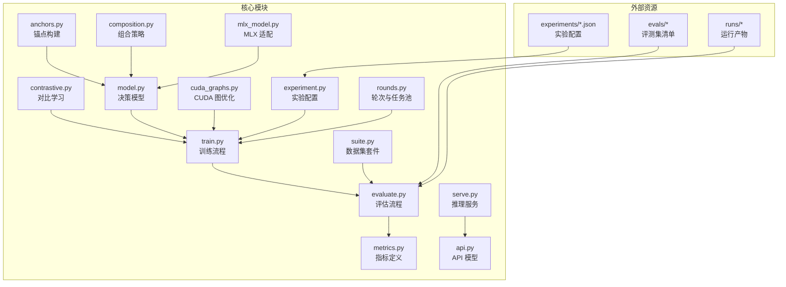

图表来源
- [anchors.py:1-120](file://kev/anchors.py#L1-L120)
- [composition.py:1-120](file://kev/composition.py#L1-L120)
- [contrastive.py:1-120](file://kev/contrastive.py#L1-L120)
- [model.py:200-300](file://kev/model.py#L200-L300)
- [train.py:1-200](file://kev/train.py#L1-L200)
- [evaluate.py:1-200](file://kev/evaluate.py#L1-L200)
- [metrics.py:1-120](file://kev/metrics.py#L1-L120)
- [cuda_graphs.py:1-120](file://kev/cuda_graphs.py#L1-L120)
- [experiment.py:1-120](file://kev/experiment.py#L1-L120)
- [suite.py:150-220](file://kev/suite.py#L150-L220)
- [rounds.py:580-660](file://kev/rounds.py#L580-L660)
- [serve.py:240-270](file://kev/serve.py#L240-L270)
- [api.py:10-50](file://kev/api.py#L10-L50)
- [mlx_model.py:120-140](file://kev/mlx_model.py#L120-L140)

章节来源
- [README.md:1-120](file://README.md#L1-L120)

## 核心组件
- 锚点机制：通过 anchors.py 构建可复用的上下文锚点，用于稳定模型在长上下文或复杂任务中的表现。
- 组合策略：composition.py 将多个子能力或提示模板进行组合，形成更强大的任务表达。
- 对比学习：contrastive.py 引入正负样本对与对比损失，提升判别能力与泛化性。
- 决策模型：model.py 中的 DecisionModel 作为统一推理接口，封装前向与状态管理。
- 训练与评估：train.py 与 evaluate.py 分别负责训练循环与评测流程，metrics.py 提供指标。
- CUDA 图优化：cuda_graphs.py 使用 CUDA Graph 减少内核启动开销，提升吞吐。
- 实验配置：experiment.py 解析 JSON 配置，驱动训练与评估。
- 数据集套件：suite.py 校验与冻结训练/测试集，保证可重复性。
- 轮次与任务池：rounds.py 维护训练任务池与冲突检测。
- 服务与 API：serve.py 与 api.py 提供推理服务与请求模型定义。
- MLX 适配：mlx_model.py 提供非 CUDA 环境下的兼容实现。

章节来源
- [anchors.py:1-120](file://kev/anchors.py#L1-L120)
- [composition.py:1-120](file://kev/composition.py#L1-L120)
- [contrastive.py:1-120](file://kev/contrastive.py#L1-L120)
- [model.py:200-300](file://kev/model.py#L200-L300)
- [train.py:1-200](file://kev/train.py#L1-L200)
- [evaluate.py:1-200](file://kev/evaluate.py#L1-L200)
- [metrics.py:1-120](file://kev/metrics.py#L1-L120)
- [cuda_graphs.py:1-120](file://kev/cuda_graphs.py#L1-L120)
- [experiment.py:1-120](file://kev/experiment.py#L1-L120)
- [suite.py:150-220](file://kev/suite.py#L150-L220)
- [rounds.py:580-660](file://kev/rounds.py#L580-L660)
- [serve.py:240-270](file://kev/serve.py#L240-L270)
- [api.py:10-50](file://kev/api.py#L10-L50)
- [mlx_model.py:120-140](file://kev/mlx_model.py#L120-L140)

## 架构总览
下图展示从实验配置到训练、评估、服务的端到端流程，并标注关键模块的职责与交互。

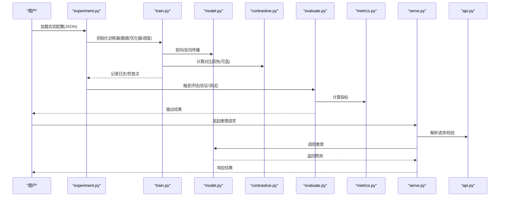

图表来源
- [experiment.py:1-120](file://kev/experiment.py#L1-L120)
- [train.py:1-200](file://kev/train.py#L1-L200)
- [model.py:200-300](file://kev/model.py#L200-L300)
- [contrastive.py:1-120](file://kev/contrastive.py#L1-L120)
- [evaluate.py:1-200](file://kev/evaluate.py#L1-L200)
- [metrics.py:1-120](file://kev/metrics.py#L1-L120)
- [serve.py:240-270](file://kev/serve.py#L240-L270)
- [api.py:10-50](file://kev/api.py#L10-L50)

## 详细组件分析

### 锚点机制（Anchors）
锚点用于在训练与推理阶段注入稳定的上下文信息，提升模型对长文本和复杂指令的理解一致性。典型流程包括：
- 构建锚点集合（按任务/领域划分）
- 在数据管道中动态拼接锚点到输入
- 在训练时参与梯度更新，在推理时按需检索

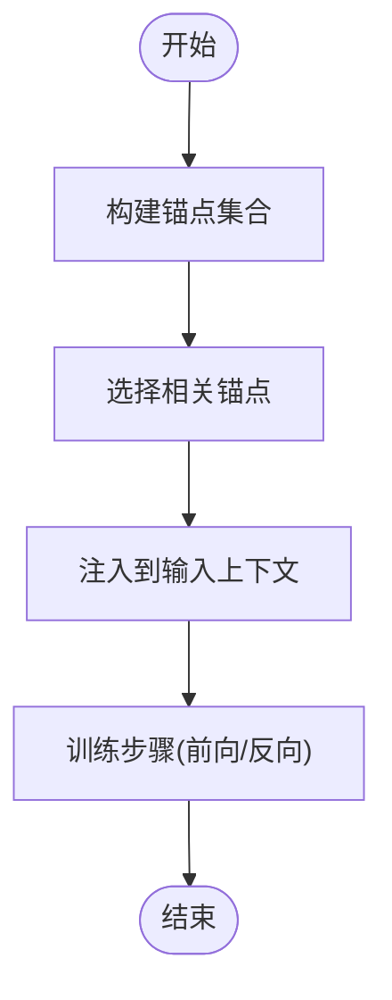

图表来源
- [anchors.py:1-120](file://kev/anchors.py#L1-L120)

章节来源
- [anchors.py:1-120](file://kev/anchors.py#L1-L120)

### 组合策略（Composition）
组合策略将多个子能力（如知识检索、推理、格式化）以模板或权重方式融合，形成更强的任务表达。关键点：
- 子能力注册与发现
- 组合规则（顺序、条件、权重）
- 运行时调度与缓存

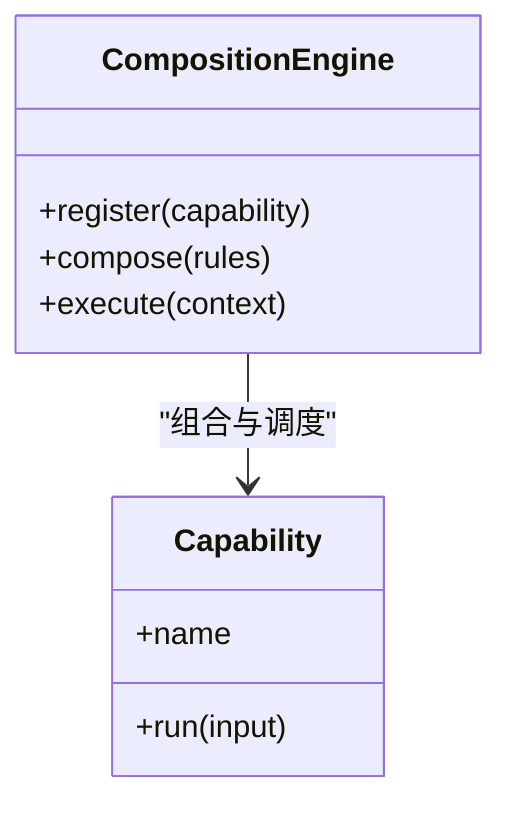

图表来源
- [composition.py:1-120](file://kev/composition.py#L1-L120)

章节来源
- [composition.py:1-120](file://kev/composition.py#L1-L120)

### 对比学习（Contrastive Learning）
对比学习通过正负样本对与对比损失增强模型的判别能力。核心流程：
- 构造正负样本（同义/反义、相似/不相似）
- 计算嵌入相似度
- 应用对比损失（如 InfoNCE）
- 与主任务损失加权融合

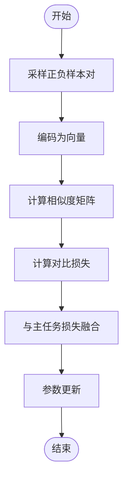

图表来源
- [contrastive.py:1-120](file://kev/contrastive.py#L1-L120)

章节来源
- [contrastive.py:1-120](file://kev/contrastive.py#L1-L120)

### 决策模型（DecisionModel）
DecisionModel 是统一的推理接口，封装了前向逻辑、状态管理与设备绑定。其职责包括：
- 接收输入与上下文
- 执行模型前向
- 返回预测结果与中间状态

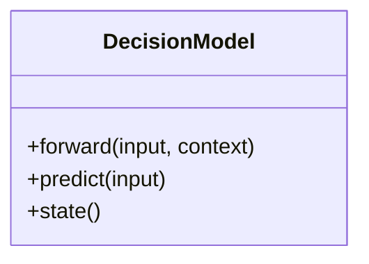

图表来源
- [model.py:242-260](file://kev/model.py#L242-L260)

章节来源
- [model.py:242-260](file://kev/model.py#L242-L260)

### 训练流程（Training Loop）
训练流程由 train.py 驱动，结合 experiment.py 的配置，完成数据加载、优化器步进、日志记录与检查点保存。

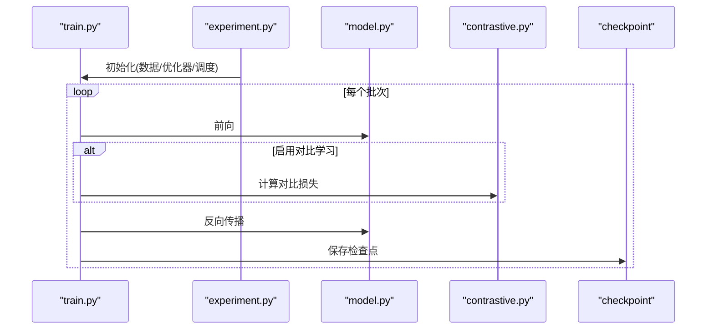

图表来源
- [train.py:1-200](file://kev/train.py#L1-L200)
- [experiment.py:1-120](file://kev/experiment.py#L1-L120)
- [contrastive.py:1-120](file://kev/contrastive.py#L1-L120)
- [model.py:200-300](file://kev/model.py#L200-L300)

章节来源
- [train.py:1-200](file://kev/train.py#L1-L200)
- [experiment.py:1-120](file://kev/experiment.py#L1-L120)

### 评估流程（Evaluation）
evaluate.py 负责在验证/测试集上运行模型，metrics.py 提供指标计算。

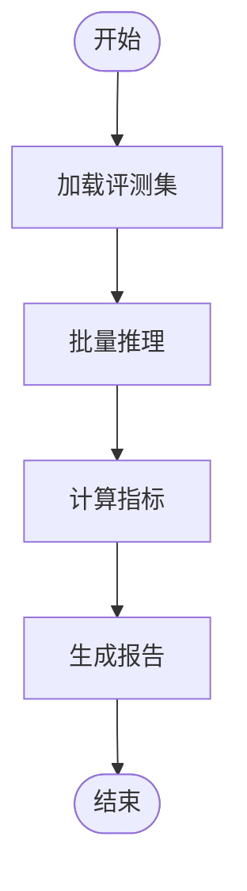

图表来源
- [evaluate.py:1-200](file://kev/evaluate.py#L1-L200)
- [metrics.py:1-120](file://kev/metrics.py#L1-L120)

章节来源
- [evaluate.py:1-200](file://kev/evaluate.py#L1-L200)
- [metrics.py:1-120](file://kev/metrics.py#L1-L120)

### 服务与 API（Serving & API）
serve.py 提供推理服务入口，api.py 定义请求/响应模型，确保类型安全与可扩展性。

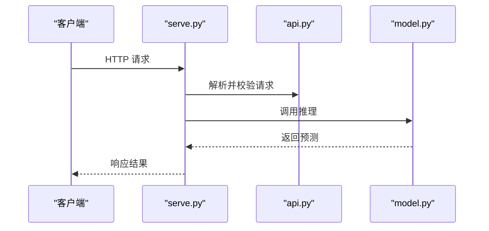

图表来源
- [serve.py:240-270](file://kev/serve.py#L240-L270)
- [api.py:10-50](file://kev/api.py#L10-L50)
- [model.py:200-300](file://kev/model.py#L200-L300)

章节来源
- [serve.py:240-270](file://kev/serve.py#L240-L270)
- [api.py:10-50](file://kev/api.py#L10-L50)

## 依赖关系分析
- 模块耦合：anchors/composition/contrastive 作为能力模块被 model/training 复用；experiment 作为编排层协调 train/evaluate；serve/api 独立于训练链路。
- 外部依赖：CUDA 图优化依赖 PyTorch/CUDA；MLX 适配在非 CUDA 环境下提供替代路径。
- 潜在循环：避免在 model 中直接 import serve，保持训练与服务解耦。

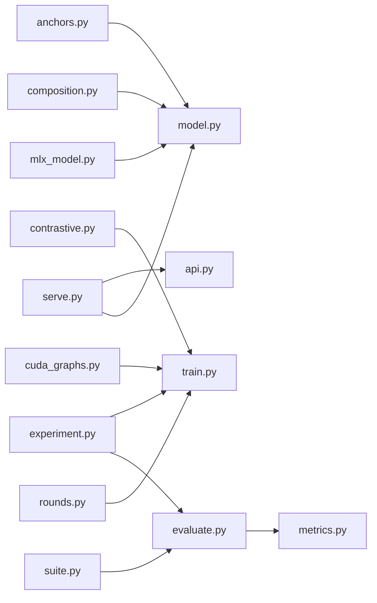

图表来源
- [anchors.py:1-120](file://kev/anchors.py#L1-L120)
- [composition.py:1-120](file://kev/composition.py#L1-L120)
- [contrastive.py:1-120](file://kev/contrastive.py#L1-L120)
- [experiment.py:1-120](file://kev/experiment.py#L1-L120)
- [train.py:1-200](file://kev/train.py#L1-L200)
- [evaluate.py:1-200](file://kev/evaluate.py#L1-L200)
- [metrics.py:1-120](file://kev/metrics.py#L1-L120)
- [serve.py:240-270](file://kev/serve.py#L240-L270)
- [api.py:10-50](file://kev/api.py#L10-L50)
- [cuda_graphs.py:1-120](file://kev/cuda_graphs.py#L1-L120)
- [suite.py:150-220](file://kev/suite.py#L150-L220)
- [rounds.py:580-660](file://kev/rounds.py#L580-L660)
- [mlx_model.py:120-140](file://kev/mlx_model.py#L120-L140)

章节来源
- [experiment.py:1-120](file://kev/experiment.py#L1-L120)
- [train.py:1-200](file://kev/train.py#L1-L200)
- [evaluate.py:1-200](file://kev/evaluate.py#L1-L200)

## 性能优化与部署
- CUDA 图优化：通过 cuda_graphs.py 捕获静态计算图，减少内核启动开销，适用于固定形状批次的推理与训练。
- 内存管理：建议启用梯度检查点、混合精度与激活重计算；合理设置 batch size 与序列长度以避免 OOM。
- 并行计算：多卡训练使用分布式优化器与数据并行；注意通信开销与负载均衡。
- 服务优化：预热 CUDA 图、批处理请求、流式输出与连接池。

章节来源
- [cuda_graphs.py:1-120](file://kev/cuda_graphs.py#L1-L120)
- [serve.py:240-270](file://kev/serve.py#L240-L270)

## 自定义组件开发指南
- 新增问题类型：
  - 在 suite.py 中注册新的问题类型与数据加载逻辑，确保 validate_training 能正确校验。
  - 在 rounds.py 的任务池中声明新类型的采样策略。
- 新增损失函数：
  - 在 contrastive.py 或独立模块中实现损失类，并在 train.py 的训练循环中集成。
- 新增评估指标：
  - 在 metrics.py 中实现指标计算函数，并在 evaluate.py 中注册与汇总。

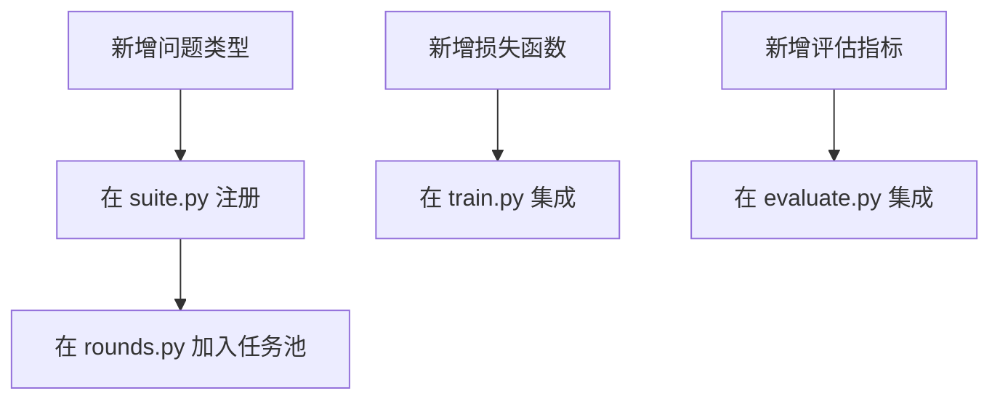

图表来源
- [suite.py:150-220](file://kev/suite.py#L150-L220)
- [rounds.py:580-660](file://kev/rounds.py#L580-L660)
- [contrastive.py:1-120](file://kev/contrastive.py#L1-L120)
- [train.py:1-200](file://kev/train.py#L1-L200)
- [evaluate.py:1-200](file://kev/evaluate.py#L1-L200)
- [metrics.py:1-120](file://kev/metrics.py#L1-L120)

章节来源
- [suite.py:150-220](file://kev/suite.py#L150-L220)
- [rounds.py:580-660](file://kev/rounds.py#L580-L660)
- [contrastive.py:1-120](file://kev/contrastive.py#L1-L120)
- [train.py:1-200](file://kev/train.py#L1-L200)
- [evaluate.py:1-200](file://kev/evaluate.py#L1-L200)
- [metrics.py:1-120](file://kev/metrics.py#L1-L120)

## 模型压缩与量化
- 量化方案：支持 INT8/FP8 量化，结合动态校准集与静态校准权重，降低显存占用并提升吞吐。
- 剪枝与蒸馏：结构化剪枝移除冗余通道；知识蒸馏用教师模型指导学生模型训练。
- 部署优化：导出为 ONNX/TensorRT 格式，配合 CUDA 图与批处理进一步提升延迟与吞吐。

[本节为通用指导，不直接分析具体文件]

## 实验框架与参数搜索
- 实验配置格式：JSON 文件位于 experiments 目录，包含数据源、模型超参、训练步数、评估集等。
- 参数搜索：基于 experiment.py 解析配置，结合 sweeps 或网格搜索遍历参数空间，记录结果至 runs。
- 结果分析：通过 evaluate.py 与 metrics.py 汇总指标，生成可读报告。

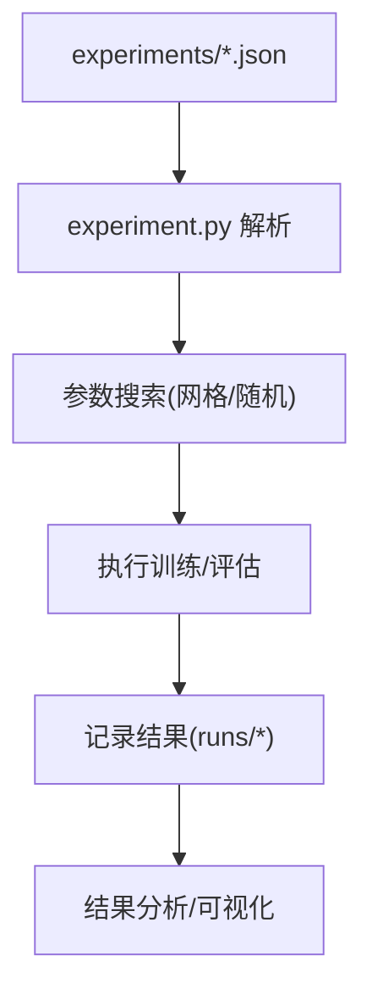

图表来源
- [experiment.py:1-120](file://kev/experiment.py#L1-L120)
- [train.py:1-200](file://kev/train.py#L1-L200)
- [evaluate.py:1-200](file://kev/evaluate.py#L1-L200)

章节来源
- [experiment.py:1-120](file://kev/experiment.py#L1-L120)
- [train.py:1-200](file://kev/train.py#L1-L200)
- [evaluate.py:1-200](file://kev/evaluate.py#L1-L200)

## 结果分析与可视化
- 指标聚合：metrics.py 提供基础指标，evaluate.py 汇总各子集结果。
- 可视化：可使用 plot.py 或外部工具绘制曲线与对比图。
- 报告生成：结合 scripts 中的报告脚本（如 longdoc_report.py、breadth_report.py）生成标准化报告。

章节来源
- [metrics.py:1-120](file://kev/metrics.py#L1-L120)
- [evaluate.py:1-200](file://kev/evaluate.py#L1-L200)

## 故障排除与性能瓶颈分析
- 常见问题：
  - OOM：减小 batch size、启用梯度检查点、使用混合精度。
  - 训练不稳定：调整学习率、增加 warmup、检查数据质量。
  - 推理延迟高：预热 CUDA 图、批处理、减少序列化开销。
- 诊断方法：
  - 使用 torch.profiler 或 nvprof 分析 GPU 利用率与内核耗时。
  - 监控显存峰值与带宽，识别瓶颈环节。
  - 在服务端开启慢请求日志，定位热点路径。

章节来源
- [cuda_graphs.py:1-120](file://kev/cuda_graphs.py#L1-L120)
- [serve.py:240-270](file://kev/serve.py#L240-L270)

## 研究方向与未来改进
- 研究建议：
  - 探索更高效的对比学习策略（自适应温度、难例挖掘）。
  - 研究动态锚点选择与在线更新机制。
  - 探索多模态锚点与跨域组合策略。
- 改进计划：
  - 完善自动调参与早停策略。
  - 增强服务端的弹性伸缩与灰度发布。
  - 提供更丰富的可视化与可解释性工具。

[本节为概念性内容，不直接分析具体文件]

## 结论
本文系统梳理了 Kev 的高级主题，涵盖模型扩展机制、实验框架、性能优化、自定义组件开发、模型压缩与量化、部署优化与故障排除。通过代码级分析与图示，读者可快速定位关键实现并进行深度定制，推动研究与工程实践的高效迭代。