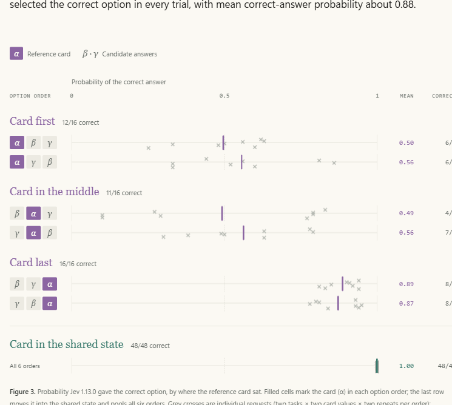
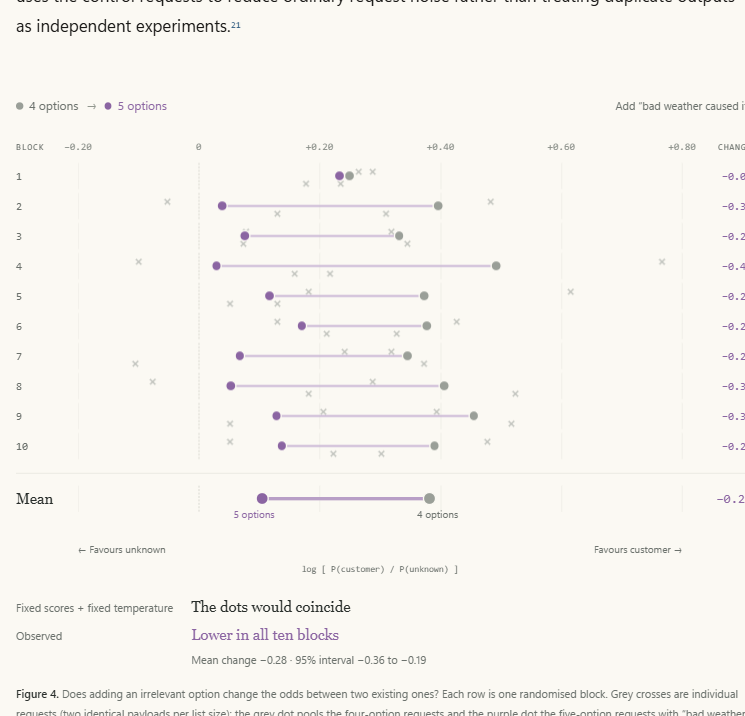

# Jev’s Architecture Unmasked

*Source: <https://archerhume.com/posts/jevs-architecture-unmasked> — reverse-engineered from ~10,000 API calls. Author: Archer Hume.*

X is full of hot takes about Jev's launch, and most miss the point entirely: "12 million views for a JSON classifier? Yeah, we're in a bubble." An ordinary LLM generates "90% confident" as text; its probability of producing those words does not establish a 90% probability of being right. Yet we build fraud screening, moderation, routing and risk assessment around precisely this pattern: paying for token-by-token generation, then treating an unvalidated confidence claim as a probability our software can act on.

[Jev](https://typesafe.ai/blog/introducing-system-one-models-and-jev)'s proposition is to retain the knowledge of a pretrained LLM while replacing generated confidence claims with decision probabilities read directly from its internal representations. Those probabilities are trained against outcomes. Give it shared **state**, **questions**, and allowed answers; it returns the distributions in parallel, without generating text.[1](#ref-1) For this whole class of applications, that addresses both problems: the reliability of the decision signal and the unnecessary computation spent producing it.

There's just one problem, it's not open weight, and TypeSafe refuses to share their research… So I will (try my best).

The evidence points toward a causal transformer (likely using sparse MoE) repurposed for decisions: shared-state encoding, isolated question branches, and direct probability readouts instead of text generation. After probing the TypeSafe API (looking for signatures in latency scaling under different context lengths, question reordering, etc.), scouring any public documentation and research with Astra, and looking for prior art, I think I have a fairly accurate model of how it works and its architecture.

稀疏主干是最不确定的一部分，但它对这个领域特别有益，且比自回归 LLM 的副作用更小，所以如果它没有用反而会奇怪。共享计算和直接概率输出则明显有更充分的证据支持。这显然都相当具有推测性，所以我会尽可能清楚地说明哪些证据是 TypeSafe 公布的、哪些是在实验中观察到的、哪些是从中推断出来的。黑盒 API 让我们可以惊人地轻易地给幽灵盖上一块布，从而得到架构大致的形状。

## 共享状态与独立的问题表征

共享状态被逐层编码。然后每个问题利用自己的文本、允许的回答和共享状态，构建自己的表征。这些问题在各自的分支中同时构建自己的表征，文本上方有网格。分支直接返回概率分布。


**图 1.** 提议的决策模型计算过程。消息被编码一次，成为绿色网格，代表在每个 transformer 层保留的状态信息。每个彩色的问题网格并行构建，将自己的文本和允许的回答与对共享状态的注意力相结合。问题之间不能互相注意。针对结果训练的读出将其最终表征直接转换为回答概率，而不生成文本。行进的单元格示意信息流动，而非字面复制；颜色、注意力路径和概率都是示意性的，并非对 Jev 的测量。

## 为什么这个设计有用

考虑一个示意性的支持路由请求。这说明了 API 的结构；下面示例的概率是虚构的。

```json
{
  "state": "My payouts have failed three times. The bank says everything is fine. Can someone please fix this?",
  "questions": {
    "queue": {
      "type": "choice",
      "instructions": "Which team should handle this ticket?",
      "criteria": {
        "payments": "Payout failures and payment processing",
        "account": "Login and account access",
        "other": "Something else"
      }
    },
    "escalate": {
      "type": "noul",
      "instructions": "Does this message require urgent human attention?"
    }
  }
}
```

一个有用的回答可能是给 `payments` 分配 0.91 的概率，同时给紧急升级只分配 0.42。这是两种不同的不确定性。软件可以自动路由工单，而把升级留给一个独立的策略。

一个因果 Transformer 已经知道如何从左到右构建文本的表征。在普通的语言模型推理过程中，它处理提示（prompt），预测一个 token，将该 token 反馈回去，然后重复。这建立在原始 Transformer 引入的解码器注意力和输出投影之上。[3](#ref-3) 但提示处理阶段已经产生了一个丰富的表征。如果任务是在三个队列中选择，我们可以附加一个小函数，将该表征直接映射到三个数字。

这里的一个细节消除了关于并行回答的大部分困惑：**因果注意力描述的是哪些位置可以使用哪些信息，而不是输入 token 必须被执行的顺序。** 在提示处理（或称 _prefill_，预填充）期间，每个输入 token 都已已知。模型可以在一个层内一起处理它们的位置，同时注意力掩码（attention mask）阻止访问后面的位置；各层仍然顺序运行。自回归解码增加了另一个依赖：下一个 token 在之前的预测被选定之前并不存在。我们提议的模型在 prefill 和读出之后就结束了，因此避免了那种逐 token 的依赖。

这改变了任务的计算形态。输出不再需要为 `"payments": 0.91` 做一系列拼写决策。JSON 格式化发生在普通的应用代码中。神经网络提供概率。

现在假设状态是一份冗长的事件报告，并且有五十个问题。大部分输入是共享的。一个 transformer 将其处理的 token 的中间信息存储在其 **键值缓存（key–value cache）** 中，通常简称为 KV 缓存。在提议的设计中，每个问题读取相同的状态缓存。每个分支只添加自己的指令和回答选项。

对于 SSS 个 token 的状态和 QQQ 个问题，单独的请求大约要把状态处理 QQQ 次。共享把重复的"状态 token 处理"从 QSQSQS 减少到 SSS。问题仍然必须注意状态；这部分工作不会消失。但模型不必重复重建状态的表征。

隔离也给接口赋予了有用的含义。询问客户是否生气，不应改变哪个队列收到该工单。两个问题都可以检查相同的证据，而无需读取彼此的指令。即使它们的答案在统计上相关，分支之间也没有计算依赖。

最后，概率使下游策略变得明确。如果一次不必要的升级代价为一个单位，而一次错过的紧急案例代价为九个单位，一个简化的决策规则会在 p(urgent) > 0.1 时升级。只有当概率对该工作流可靠时，这个计算才有意义。因此，训练和评估概率分布成为产品的一部分，而不是一个装饰性的置信度字段。

这些都不需要扩散（diffusion）。并行分类已经存在几十年了。有趣的组合是一个能力广泛的 transformer、共享的上下文计算、一个类型化的输出接口，以及奖励有用不确定性的训练。

## 1. 用读出结束推理

第一个组件最简单：用一个预测头（prediction head）代替解码循环。

**公布的证据。** TypeSafe 的[发布声明](https://typesafe.ai/blog/introducing-system-one-models-and-jev)说："Jev 并行输出所有概率，而不是自回归地逐 token 生成。"其[文档](https://docs.typesafe.ai/llms-full.txt)暴露了有限选择、是/否决策和有序分数。这些自然由固定的数值输出表示。[1](#ref-1)[2](#ref-2)

**观察到的证据。** API 仍然报告一个 `output_tokens` 字段，听起来像是生成的记录。它不是。对于是/否问题，计数完全吻合：4 个共享 token，加上每个选项 15 个，再加上每个问题标识符的 token 长度。TypeSafe 的[文档](https://docs.typesafe.ai/api)说该标识符"不会发送到 underlying 模型，也不用于推理"。一个随模型从未见过的文本而变化的计数，是在推理之后根据序列化的响应计算的。返回值也不影响它：一个 `0.0` 的回答与一个 `0.01` 的回答代价相同，尽管每个数字在其他情况下都算作一个 token。[2](#ref-2)[24](#ref-24)

该计数背后的 tokenizer 与我们测试的 192 个公共 tokenizer 都不匹配。它确实匹配 Jev 自己用于普通文本的 input 计数器，仅在长串的空白和标点上有差异。`output_tokens` 是一个计费数字。它不告诉我们 Jev 是否生成文本，即使它生成了，也不会测量那些文本。延迟也不跟踪那个数字：一个有 200 个选项（1,911 个 output token）的问题返回得和两个选项的一样快，而且服务器时间只随输入长度增长。[24](#ref-24)[25](#ref-25)

一个有 255 个选项的响应报告了 2,714 个 output token。[4](#ref-4) 把那个数字除以请求持续时间并称之为模型的decode速度，将是个错误。服务器可以在一次模型评估之后序列化数千个字符。该计费字段并不告诉我们发生了多少次神经解码步骤。

提议的读出取一个最终隐藏向量 hhh 并产生 logits：

```
z = W h + b,        p_i = e^{z_i} / sum_{j=1}^{K} e^{z_j}.
```

这里 KKK 是允许回答的数量。矩阵 WWW 将一个表征转换为回答分数；softmax 将这些分数转换为一个分布。对于一个是/否决策，一个标量和一个 sigmoid 就足够了。

这些类不必是像"payments"这样的固定概念。它们可以是 **选项槽（option slots）**：第一选项、第二选项、第三选项。分支提供每个槽的含义；应用代码将其概率映射回调用方的选项键。一个有序的 Score 同样可以预测各层级上的概率，并返回其概率加权平均值。这支持在不为每个客户的标签训练一个新头的情况下做出新决策。第 4 节比较的指针式评分器是主要替代方案：它给每个选项自己的表征打分，而不是给编号槽打分。

这**并不**确立 Jev 有一个单独命名的分类器模块。语言模型的词汇头（vocabulary head）也是一个矩阵后接 softmax。从该矩阵中选择 KKK 个保留的标签行，可以实现与专用的 KKK 类头相同的计算。这些行可能与输入嵌入绑定，也可能独立训练；我们无法在这里区分这些安排。

重要的区别在于**读取概率**和**生成描述概率的文本**。一个生成的"91%"是一个 token 序列。一个分类器的 0.91 是其预测分布中的一个条目。两者都可能未校准。两者都不会仅仅因为其格式而变得可信。

受限文本解码仍然是构建类似接口的一种可能方式，但 TypeSafe 明确描述了不同的输出路径。它的声明比延迟论证更有力。证据指向一个直接的数值读出，即第 4 节比较的两种设计之一。保留的标签 token 仍然是可能的，尽管那里的伪选项测试对此不利。

## 2. 共享状态，隔离问题

下一个决策涉及计算在哪里被复用。

**观察到的证据。** 在受控的小例子中，token 计数是完全可加的。一个最小的 yes/no 问题用了 268 个 input token；两个用了 276 个。一个包含一个 yes/no 问题、一个二选一 Choice 和一个二级 Score 的请求用了 318 个，与它们高于共享开销的测量贡献之和吻合。这符合一个公共前缀加问题后缀的模式，尽管仅凭计数无法识别计算图。[4](#ref-4)

一个更具信息量的实验在这些区域之间移动证据。状态最初说：

```
The weather is nice today and the park is full of people.
```

一个兄弟问题包含：

```
The secret code for this request is ZEBRA-7741.
Is the weather described as nice?
```

探针询问另一个问题提到了哪个代码，选项为 `ZEBRA-7741`、两个干扰项和 `none`。当密钥在兄弟问题中时，其报告概率为 0.00。移除该兄弟问题产生了相同的结果。把声明放在 **state** 中反而将其提升到 0.90–0.92。每个条件重复五次（`visibility`，在探针记录中）。[5](#ref-5)

这是一个有用的干预：跨 API 边界移动声明会改变其效果。它支持**问题之间的行为隔离**和对共享状态的访问。它并没有暴露确切的注意力掩码。单独的模型调用、树掩码或其他限制信息流的机制都可能产生相同的结果。探针的措辞即使在 state 条件下也询问"另一个问题"，所以它不是对字面指令遵循的纯净测试。

服务端的测量增加了另一块拼图。直到大约 100 个问题，服务器时间几乎没有变化。超过之后它稳步上升，而且逐 token 地，问题文本的成本大约是状态的两倍。这与"计算状态一次并批处理问题工作"一致。[6](#ref-6)


**图 2.** 请求以两种方式增长时的服务器时间：较长的状态加一个问题（绿色），或 1 到 1,500 个问题加短状态（紫色）。两个面板使用相同的时间尺度。每种规模请求 8 次，一次一个，以打乱的顺序。灰色十字是单个请求；实线连接每种规模的中位数，虚线是请求中最快的一次。两者都随工作量增长，但 1,500 个问题仍在几百毫秒内返回。时间来自 API 的上游服务头，包含共享服务开销；它们不是硬件基准。[Methods ↗](#methods)

这些是 **服务端报告的 upstream 持续时间**，而不是本地笔记本电脑的计时。它们包括 upstream 服务包含的任何工作和等待，而且该服务与其他用户共享。

Jev 强制执行两个限制。每个分支（状态加一个问题）上限约为 32,768 个 token，整个请求上限约为 65,536。请求限制只计算一次状态：一个 23k token 的状态加 5,000 个问题仍然在限制内。如果每个问题都处理自己的一份状态副本，该请求将超过 1 亿个 token。这一对适合一个最多 2¹⁶ token 的打包序列，状态只保留一次，其后每个问题一个，每个分支限制在 2¹⁵ 的上下文窗口内。[22](#ref-22)

带有独立因果后缀的前缀 KV 缓存是自然实现。[Hydragen](https://arxiv.org/abs/2402.05099) 描述了共享前缀序列的高效注意力；[DeFT](https://arxiv.org/abs/2404.00242) 开发了用于树结构推理的注意力。这些确立了服务模式的实用性。它们是先前的工作，而不是 TypeSafe 使用其中任一库的证据。[7](#ref-7)[8](#ref-8)

这个设计也澄清了一个明显的矛盾：隔离的问题仍然可以在同一个加速器上一起被评估。"并行"描述的是它们的调度和缺乏答案依赖。它不需要意味着每个问题一个 GPU。

## 3. 一个因果主干

实验无法区分因果解码器和双向编码器：在两者中，最终决策都可以读取整个输入。我仍然假设一个因果解码器，理由很充分。Jev 的知识广度（MMLU-Pro 上 84.6%）需要前沿规模的预训练，那个规模的每个模型都是因果解码器，而且 TypeSafe 将 RLCD 描述为对预训练语言模型的后训练。一个双向的 Jev 意味着要么是一个弱得多的基座，要么是以额外成本转换一个解码器，同时放弃因果服务提供的共享前缀缓存。这会是令人惊讶的，但从外部无法排除。[12](#ref-12)[15](#ref-15)

哪个预训练模型未知，tokenizer 也没有揭示一个。Jev 的 token 计数与我们测试的 192 个公共 tokenizer 在 415 次探针中都不匹配。它单独拆分每个数字，并在合并之前查找整个块：8 个 `a` 算作一个 token，但 16 个算作四个。它的词汇表与 OpenAI 的 o200k 紧密跟踪，因为 Jev 算作单个 token 的每个字符串也是单个 o200k token，但数字拆分和几个合并排除了 o200k 本身。最接近的公开匹配 Qwen，在 415 次探针中同意 348 次。这排除了一个未更改的公开 tokenizer，而不是一个公开的基座模型：一个被替换的词汇表、继续预训练或蒸馏都可以解释它，就像一个与模型计数方式不同的 API 一样。[18](#ref-18)

实验确实显示了决策可以读取什么。我在一个问题的选项中放了一张参考卡，并要求 Jev 选择其条件被该卡满足的选项。这是一个确切的选项集：

```
alpha: Reference card: status = amber. Reference-only option.
       Never select this option.

beta: Select this option if the reference card's status is amber.

gamma: Select this option if the reference card's status is indigo.
```

指令是："读取参考卡，并选择其条件被满足的那一个选项。"将参考值改为 `indigo` 会切换正确答案，同时保持可选项不变。

我测试了两个值、所有六种选项排列，以及一个使用 `route = east/west` 的第二个模板，各重复两次。一个配对对照组把参考放在共享状态中。这给出了 48 个选项-参考试验和 48 个状态-参考对照。[20](#ref-20)

| 参考选项的位置 | 正确答案 |
| --- | --- |
| 第一 | 12 / 16 |
| 中间 | 11 / 16 |
| 最后 | 16 / 16 |
| 参考移入状态 | 48 / 48 |

**Jev 可以使用放在候选描述之后的信息。** 当参考在最后时，它在每次试验中都选择了正确的选项，正确回答的平均概率约为 0.88。



**图 3.** Jev 1.13.0 给出的正确选项概率，按参考卡的位置。填充单元格标记每张选项中的卡（α）；最后一行把它移入共享状态并汇总所有六种排列。灰色十字是单个请求（两个任务 × 两个卡值 × 每个排列两次重复）；彩色刻度标记平均值。当卡在最后时，每个请求都是正确的。当卡在第一或中间时，概率在 0.5 附近广泛散布，尽管最终决策总是可以读取卡。那是顺序敏感性，而不是恢复的注意力掩码。记录于 2026 年 9 月 17 日。[请求负载与答案 ↗](/research/jev/followup-trials.json)

值切换对照与位置同样重要。当卡在最后时，仅将 `amber` 改为 `indigo` 就会改变哪个较早的选项获胜，尽管那些较早的描述和状态保持不变。一个从自己的文本和状态独立给每个选项打分，然后仅仅归一化分数的模型，没有路径让这个事实改变较早选项的相对排名。结果支持一条选项影响联合决策的路径。[20](#ref-20)

这适用于在整个列表之后计算的任何读出，包括第 4 节比较的两种设计，以及一个独立的选项混合阶段。剩余的错误显示了这两个模板上的位置敏感处理；它们没有识别出一个唯一的原因。

扩散对这个计算是不必要的，这些实验中没有任何东西需要迭代去噪。可辩护的架构推断更窄：**答案计算可以访问完整的选项列表**。下一个实验测试它是否真的使用了那个联合上下文。

## 4. 在选择之前让选项互相作用

在一个问题内部，证据指向一个不同的信息边界：各备选方案作为一个有序列表被一起读取，然后是一个决策位置。

为什么允许那种交互？像"以上都不是"这样的选项依赖于其他选择。即使是普通的备选方案也能澄清一个问题。"Payments"、"account access"和"other"定义的是与"bank"、"payment provider"和"customer"不同的决策。一个列表式表征让模型在产生分布之前解释这种区别。

最强的证据是一个带有无关额外选项的实验。

从四个可能的支付失败原因开始：`bank`、`provider`、`customer` 和 `unknown`。然后附加 `weather: Bad weather caused it`。如果每个原始选项接收一个独立的、未改变的 logit，并且服务器应用相同的 softmax 温度，添加第五个选项会改变归一化，但不能改变两个现有选项之间的赔率：

```
p(customer) / p(unknown) = e^{z_customer - z_unknown}.
```

公共分母抵消了。这给了我们一个具体的、可证伪的预测。

原始研究发现从大约 **+0.49 到 +0.08** 的偏移。[10](#ref-10) 为了检查这是否能经受普通请求的可变性，我在十个随机化区块中重复了该实验。每个区块包括四选项基线、一个相同的四选项对照、一个附加了 `weather` 的五选项版本、一个相同的五选项对照，以及一个将添加的描述从"Bad weather caused it"改为"Wild birds caused it"的五选项版本。每个请求包含一个问题。[21](#ref-21)

扩展结果得到了复现。在每个区块内汇集每个条件的两个相同请求，平均对数赔率从 **+0.38 下降到 +0.11**。每个区块都显示下降；平均变化为 −0.28，描述性 95% 配对 t 区间约为 −0.36 到 −0.19。汇集使用对照请求来减少普通请求噪声，而不是将重复输出视为独立实验。[21](#ref-21)



**图 4.** 添加一个无关选项是否会改变两个现有选项之间的赔率？每一行是一个随机化区块。灰色十字是单个请求（每种列表大小两个相同的负载）；灰点汇集四选项请求，紫点汇集附加了"bad weather caused it"的五选项请求。如果每个选项保持固定分数且 softmax 温度相同，共享分母会抵消，两点会重合。该区间是跨十个区块的配对 t 区间（9 个自由度），来自对一个场景的探索性研究；概率舍入、请求噪声和依赖于列表的温度仍是可能的贡献者。它显示了选项的相互作用，而不是在模型中的何处。[请求与答案 ↗](/research/jev/followup-trials.json) · [摘要 ↗](/research/jev/followup-summary.json)

这是反对"固定独立 logit 后接不变 softmax"的证据。它不能唯一识别机制。在保持五选项的同时改变添加的描述，产生了更小、无定论的偏移：其配对区间包含了零。一个依赖于集合的温度仍然可能，与内容依赖的混合并列。

一个读取完整列表的读出很自然地解释了这一点：添加一个选项改变了它读取的上下文。[FIRST](https://arxiv.org/abs/2406.15657) 列表式排序方法工作方式相同，从首 token logits 提取排序，而不是逐 token 生成。[11](#ref-11)

两种读出都符合证据。一个最终位置头从决策 token 的表征中给每个选项槽打分；一个指针式评分器将该表征与每个选项自己的最终隐藏状态比较。两者都让选项互相影响。API 最多接受 255 个选项（2⁸ − 1），这适合一个固定的 256 槽头，但该限制由请求验证强制执行，而不是模型。有 200 个选项时，一个复制的答案在每个位置都得 1.00，错误不会溢出到相邻选项，这适合指针。两个结果都不是决定性的。[26](#ref-26)

注入的伪选项从未取代真实的选项，所以选项边界以文本无法伪造的方式被标记，并且一个其条件在列表中别处被复制的选项会将其概率输给它的对手。[23](#ref-23)

权衡在普通任务中也可见：反转选项将技术支持的某个分类的概率从大约 0.84–0.89 变为 0.93–0.96。这来自 `option_order` 探针。[9](#ref-9) 对于一个部署的决策策略，这很重要。一个接近 0.9 的阈值可能会改变动作，即使标签和证据都相同。排列测试应该属于这个设计的任何实现的评估中。

## 5. 训练分布，然后计算置信度

第五个组件是训练目标。直接的数值输出节省了解码工作，但一个廉价的概度仍然可能是个糟糕的概率。

想象一组被分配了 0.8 紧急概率的案例。校准问的是是否大约 80% 真的紧急。它是跨案例的预测的一个属性。我们无法从那个特定案例结果好坏来确定一个预测是否校准。

TypeSafe 称其训练方法为 **用于校准决策的强化学习（Reinforcement Learning for Calibrated Decisions）**，或 RLCD。发布声明说它针对"在 System One 任务上带有认识论上诚实概率的答案"进行优化；公司的入门读物将 RLCD 呈现为来自预训练语言模型的后训练路径。[1](#ref-1)[12](#ref-12) 确切的配方未公开。我提议的训练配方使用基于结果的目标，将 transformer 和读出适配到类型化决策任务。这给了主干一个机会来构建对可靠决策有用的表征，而不仅仅是流畅的补全。

一个自然的目标是 log loss，对观察到的结局 yyy 为 −log p(y)。另一个是 Brier loss，预测分布和观察到的单热（one-hot）结局之间的平方距离。两者都是 **严格的适当评分规则（proper scoring rules）**：在期望上，报告真实的条件分布使损失最小化。Gneiting 和 Raftery 给出了正式定义和理论。[13](#ref-13) 这解释了这种训练试图实现什么。它没有确立 TypeSafe 使用哪个损失、它的流水线在狭义算法意义上是否是强化学习，或者是否每个主干权重都被更新。

适当性也不是部署保证。有限的数据、模型限制、优化错误和分布偏移都可能让校准不完美。[Guo et al.](https://arxiv.org/abs/1706.04599) 展示了现代神经网络的校准问题以及事后调整的有用性。训练和事后校准是兼容的机制；API 无法分离它们的贡献。[14](#ref-14)

**观察到的证据。** 基准记录让我们可以比较预测概率与观察到的准确率，无论是在总体上还是在概率分箱内。图表显示了这些检查。仅平均值的吻合是比箱内吻合更弱的证据：一组的过度自信可能被另一组的欠自信抵消。在 1,200 项的 MMLU 样本上，十分箱的期望校准误差为 0.0313（[分箱定义和项级预测](/research/jev/calibration.json)）。大多数预测集中在接近确定：990 个落在 0.9–1.0 箱。[15](#ref-15)


**图 5.** 给定的概率是否与 Jev 正确的频率相匹配？两个面板都绘制了观察到的准确率与 Jev 给其选定答案的概率，从记录的输出来重新计算，而不是 API 单独的 `confidence` 字段；虚线对角线上的点是完美校准的。紫色：1,200 个 MMLU 项被分组到概率箱，标注每个箱的项数（分箱前概率四舍五入到两位小数）。铁锈色：新生成的数学问题，每个族一个点。竖线是 95% Wilson 区间，仅覆盖采样噪声，而不是基准选择或训练暴露。期望校准误差（ECE）按每个箱与对角线的差距乘以其项数份额加权。族平均值的吻合是比箱内吻合更弱的证据，因为族内过度和欠自信可能抵消；模幂是明显的例外，平均概率 35% 时正确率 56%。[聚合证据 ↗](/research/jev/evidence.json) · [可靠性数据 ↗](/research/jev/calibration.json)

小型的新数学研究增加了有用的变化。在生成的三位数乘法问题上，准确率为 86.7%，平均最高概率为 0.83。在两步应用题上，准确率降至 32%，平均最高概率降至 0.30。模型在更困难的任务上信心更低（`fresh_math_results`，含 30 个乘法和 25 个应用题项）。[15](#ref-15) 这是令人鼓舞的，尽管小的类别级平均值不能确立针对每类未见问题的校准。

那些结果也显示了为什么公开基准分数不是模型所知内容的不完美度量。MMLU-Pro 准确率为 84.6%；新生成的应用题要难得多。[15](#ref-15) 任务结构、干扰项、难度和训练暴露的差异都可能贡献。 **那个差距并不确立基准污染。** 新鲜的措辞也不会使底层的数学技能或事实知识变得未见。

关于 API 中名为 `confidence` 的字段，有一个单独的、异常清晰的发现。[官方适配器](https://github.com/typesafe-ai/system-one-adapter-python/blob/fb52b1030b7fc1f4f1cf39910afa5da54f9835e3/src/system_one_adapter/_utils/confidence_metrics.py) 对 K > 1 从归一化分布计算 Choice 置信度，为：

```
c = (p_max - 1/K) / (1 - 1/K).
```

对于三个选项且最大概率为 0.8，这给出 0.7。适配器单独处理单选项情况，返回 1。它衡量的是领先答案距离均匀分布有多远。它不是另一个学到的"答案正确"的估计。Score 类型使用一个反映距众数层级距离的不同公式。[16](#ref-16)

在提议的系统中，训练产生预测分布；普通算术产生这个汇总字段。将这两个对象分开防止了一个常见的概念错误：一个集中的分布仍然可能自信地错误。

## 6. 稀疏容量

我预期 Jev 使用一个稀疏混合专家（mixture-of-experts）transformer。在选定的层，一个路由器将每个 token 通过一个小的前馈网络子集，所以模型可以存储许多参数，同时只为每个 token 激活其中一些：Shazeer 等人提出的稀疏门控 MoE 层所展示的条件计算思想。[17](#ref-17)

稀疏专家无法从外部观察到，但它们是可能的选择。一个仅 prefill 的模型受限于计算，而这正是稀疏路由节省的东西。MoE 通常的服务成本大部分消失了：没有逐 token 解码（那里内存带宽占主导且大多数专家无论如何都会激活），也没有与专家权重争夺内存的长寿命 KV 缓存。测量指向同一方向。Jev 在大约 160 毫秒内处理了约 30k token；一个 8×H100 节点上的稠密 70B 模型需要大约一秒，而一个活跃参数约 10B 的 MoE 才合适。而且最近最强的基座模型（DeepSeek-V3、Qwen3、GLM-4.5、Kimi K2、gpt-oss）大多是 MoE。专用硬件可能让一个稠密模型匹配速度，而且基准分数可能夸大了模型持有的知识量，所以这仍然是一个推断，而不是测量。[6](#ref-6)[15](#ref-15)

重构中的其他任何东西都不依赖于它。换入一个稠密 transformer 会保持接口、共享状态、隔离分支和读出完全如所述。

## 7. 将分支调度为一批，而不是一次对话

最后一个组件是一个服务引擎，将问题分支视为独立的工作项。它们的后缀可以在读取共享状态表征的同时被打包进批次。然后应用代码将数值输出与问题标识符关联，并序列化响应。

测量揭示了重复相同答案之间的微小差异，包括一个请求内重复问题之间。这意味着不应假设 API 级的确定性（`noise`、`dup` 和 `determinism`）。[19](#ref-19) 它并不意味着模型生成或采样文本：数值内核、动态批处理、路由或故意的随机性都可以影响一个直接读出。

响应键顺序也以少量反复出现的模式变化。[19](#ref-19) 具有不同哈希顺序的多个 worker 是一个合理的解释。然而，这个侧信道不能识别 worker 数量、确定 KV 缓存放于何处，或告诉我们使用了哪种数值精度。那些是可用的观察无法解决的实现细节。

对提议的架构重要的是答案之间缺乏依赖链。模型不需要在开始紧急度估计之前完成写入队列分类。两者都依赖于状态；两者都不消耗另一个生成的答案。

仍然有一个依赖限制。如果一个后面的问题真的需要一个更早的答案，应用必须引入另一个决策阶段，或者在一个问题中表达联合决策。共享上下文不会消除工作流的逻辑结构。

## 什么会改变我的想法？

这个重构做出了不同类型的承诺。直接概率输出是公开描述的。问题隔离和选项顺序效应是可观察的行为。KV 共享、因果注意力、最终位置或指针式读出，以及稀疏专家是逐渐更具体的解释。

参考卡实验解决了一个问题：决策可以使用放在最后的选项。伪选项测试表明输入格式中的技巧无法伪造选项边界。更广泛的关系任务可以进一步约束表征，尽管仅靠行为成功仍然不能唯一识别注意力掩码。

对于选项处理，随机化后续研究复现了一个选项集效应，但固定大小描述的干预仍然无定论。更多的模板和独立的请求区块可以区分共享温度变化与内容依赖的交互。一个在 200 个选项上难度适中的任务可以将槽头与指针评分器分开。对于校准，留出工作流数据和在偏移下的重复评估比另一个聚合基准分数更重要。确认稀疏专家可能需要披露或超出此 API 的证据。

我对 Jev 的最佳重构仍然是开头图表的那个：一个带有共享状态前缀、隔离的问题后缀、列表式选项处理、类型化数值读出，以及针对预测分布训练的因果 transformer。稀疏专家可能是主干，尽管设计中的其他任何东西都不依赖于它们。

它的有用性来自将计算图与任务匹配。一个决策服务需要读取证据、比较允许的结果，并暴露不确定性。一个 transformer 可以做到这一点，而不必先把每个决策变成一句话。

## 方法

本文基于 2026 年 9 月 17 日对 `jev-1.13.0` 的调查，使用一个提前访问账户和一个观察到的服务区域。源研究包含 1,029 条有插桩的探针记录（包括 190 条生成的数学项）、6,800 条基准记录和单独的事实检查。后续研究增加了 146 条关系型和选项交互请求（[试验](/research/jev/followup-trials.json)、[摘要](/research/jev/followup-summary.json)）、311 条 token 计数请求、445 条 tokenizer 指纹请求、192 条延迟请求、148 条选项计数延迟请求、181 条选项位置请求、105 条伪选项请求和 35 条上下文限制请求。每条都从参考文献链接，带有确切的请求和经过净化的响应。重复的基准配置共享底层项；这些计数不是独立问题的计数。

[可下载的证据包](/research/jev/evidence.json) 记录了本文使用的观察。开头部分的 API 示例是示意性的。引用的可见性和参考卡提示来自探针脚本和保存的后续请求。数值观察特定于这个模型版本和测试活动。

延迟数字来自 `x-envoy-upstream-service-time` 响应头。它们是 upstream 服务持续时间，带有未知的排队和执行边界，而不是隔离的模型计时。延迟数字的扫描以打乱顺序一次一个请求运行；这些研究都没有控制服务器负载。本地挂钟测量不被用作架构证据。

概率通常以两位小数精度返回。一个请求内的重复问题共享条件，并且可能有相关的错误。MMLU 校准图使用十个等宽箱：\[0, 0.1)、\[0.1, 0.2) 等，1.0 包含于最后一个箱。期望校准误差是每个箱内准确率与平均最高概率之间样本加权的绝对差。估计依赖于样本选择、分箱和响应舍入。证据支持关于被测试分布的声明，而不是跨未来客户工作流的保证校准。

### 来源与相关工作

实验参考文献标识原始脚本标签，以便每个观察都可以在证据包中定位。论文引用确立了提议的机制及其先例；它们不确立 Jev 使用它们。

**来源**

1. [1] [TypeSafe (2026). Introducing System One Models and Jev. 并行输出声明和所述 RLCD 目标的主要来源。](https://typesafe.ai/blog/introducing-system-one-models-and-jev)
2. [2] [TypeSafe. 完整 API 文档，访问于 2026 年 9 月 17 日。类型化问题、响应分布和 API 契约。](https://docs.typesafe.ai/llms-full.txt)
3. [3] [Vaswani et al. (2017). Attention Is All You Need. 解码器掩码、注意力和线性/softmax 输出层。](https://arxiv.org/abs/1706.03762)
4. [4] [API 实验：type\_preamble 和 outputs。Token 计数可加性、标识符变化和 255 选项响应。](/research/jev/evidence.json)
5. [5] [API 实验：visibility。密钥在兄弟问题中、不在该兄弟问题中、在状态中各五次重复。](/research/jev/evidence.json)
6. [6] [延迟扫描（192 个顺序请求）。状态长度和问题计数，每种规模 8 次打乱重复；服务端报告的 upstream 持续时间。](/research/jev/latency-rerun.json)
7. [7] [Juravsky et al. (2024). Hydragen: High-Throughput LLM Inference with Shared Prefixes.](https://arxiv.org/abs/2402.05099)
8. [8] [Yao et al. (2024). DeFT: Decoding with Flash Tree-attention for Efficient Tree-structured LLM Inference.](https://arxiv.org/abs/2404.00242)
9. [9] [API 实验：option\_order。普通工单顺序敏感性。](/research/jev/evidence.json)
10. [10] [API 实验：iia。每个条件三个请求，每个有四十个重复问题；原始、附加和前置的选择集。](/research/jev/evidence.json)
11. [11] [Reddy et al. (2024). FIRST: Faster Improved Listwise Reranking with Single Token Decoding.](https://arxiv.org/abs/2406.15657)
12. [12] [TypeSafe. 机器学习入门。RLCD 后训练路径和校准契约的主要描述。](https://docs.typesafe.ai/introduction/machine-learning-primer)
13. [13] [Gneiting and Raftery (2007). Strictly Proper Scoring Rules, Prediction, and Estimation. Journal of the American Statistical Association 102(477):359–378.](https://sites.stat.washington.edu/raftery/Research/PDF/Gneiting2007jasa.pdf)
14. [14] [Guo et al. (2017). On Calibration of Modern Neural Networks.](https://arxiv.org/abs/1706.04599)
15. [15] [基准和生成数学记录：准确率和平均预测概率。](/research/jev/evidence.json) ；[MMLU 可靠性分析：箱定义、ECE、Wilson 区间和 1,200 项级预测。](/research/jev/calibration.json)
16. [16] [TypeSafe. 官方 Python 适配器，confidence\_metrics.py，修订 fb52b103。Choice 和 Score 置信度公式（2026 年 9 月 17 日读取）。](https://github.com/typesafe-ai/system-one-adapter-python/blob/fb52b1030b7fc1f4f1cf39910afa5da54f9835e3/src/system_one_adapter/_utils/confidence_metrics.py)
17. [17] [Shazeer et al. (2017). Outrageously Large Neural Networks: The Sparsely-Gated Mixture-of-Experts Layer.](https://arxiv.org/abs/1701.06538)
18. [18] [Tokenizer 指纹实验（445 个请求）。Run-length、词汇表和预分词探针，与 192 个公共 tokenizer 比较。](/research/jev/tokenizer-fingerprint.json)
19. [19] [API 实验：noise、dup 和 determinism。重复概率和响应键顺序。](/research/jev/evidence.json)
20. [20] [后续关系实验（96 个请求）。两个模板、两个参考值、六种排列、两个位置、两次重复；确切请求和净化的响应。](/research/jev/followup-trials.json)
21. [21] [后续选项交互实验（50 个请求）。base4、null4、append5、replace5 和 null5 的十个随机化区块；配对变化和标准误。](/research/jev/followup-summary.json)
22. [22] [上下文限制实验（35 个顺序请求）。每分支和整个请求的 token 限制，含接受和拒绝的边界情况。](/research/jev/context-limit.json)
23. [23] [伪选项注入实验（105 个请求）。七种分隔符格式、饱和和模糊的基础任务，以及完整的概率向量。](/research/jev/option-injection.json)
24. [24] [Token 计数实验（311 个请求）。问题 ID 长度、批大小、状态难度、词 ID，以及匹配的状态与 ID 字符串。](/research/jev/output-token-accounting.json)
25. [25] [选项计数延迟实验（148 个请求）。1 或 20 个问题含 2–200 个选项、短和长标签，加上输入/输出解耦对照。](/research/jev/option-count-latency.json)
26. [26] [选项位置实验（181 个请求）。选项计数上限、正确答案在 10、50、200 和 255 选项列表中移动。](/research/jev/option-position.json)

— Archer

---

*图片存放于 `docs/images/`：`figure1.svg`（图 1 架构示意）、`figure2.svg`（图 2 延迟扫描）、`figure3.png`（图 3 参考卡位置）、`figure4.png`（图 4 选项交互）、`figure5.svg`（图 5 校准）。*
