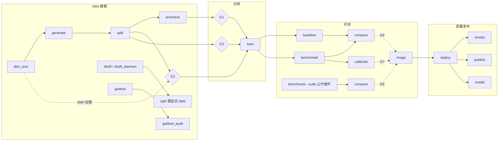

# 控制台流水线全景 · Console Pipeline Reference

> 双语文档：章节标题与关键结论（Key Point）为英文 + 中文，正文中文。
> Bilingual: section titles and key-point lines are EN+ZH; body text is Chinese.
>
> 所有结论均以代码为据，标注 `file:line`；不含推测。All claims are code-backed with `file:line` references.
> 评估结论与增强计划见 §4 与 `docs/enhancement-plan.md`。

---

## 0. 全局架构 Pipeline Architecture

**Key Point:** 18 个 stage 组成 6 段流水线，全部走同一套「作业模型 + 产物 id + 闸门」契约。
18 stages across 6 phases share one contract: job model, artifact ids, gates.

### 0.1 总图

### 0.2 stage 清单与执行顺序 Recommended Execution Order

| 顺序 | stage | 阶段 | 作用 | 产物（artifacts_out） |
|---|---|---|---|---|
| 1 | `plan_size` | data | 算计划记录数 | **无注册**（见 L1） |
| 2a | `generate` | data | 程序化规则合成 | `dataset:{dir}` |
| 2b | `distill` / `distill_daemon` | data | LLM 蒸馏 | `dataset:{dir}/{category}`（resolve 优先指向 `.jsonl` 文件本身） |
| 3 | `goldset` | data | 金标抽样 | `dataset:{dir}.gold` |
| 3b | `goldset_audit` | data | A/B 分歧审计 | 无 |
| 4 | `split` | data | 切分 train/calibration/development | `dataset:{dir}/{split}`、`dataset:{dir}/summary` |
| 5 | `precheck` | data | token 超限预检 | `precheck:{dir}/{split}` |
| 6 | `train` | train | SFT 训练 | `run:{run_name}` |
| 7 | `baseline` | eval | 零样本对照打分 | `eval:{run_name}-baseline` |
| 8 | `benchmark` | eval | 开发集打分 | `eval:{run_name}` |
| 9 | `compare` | eval | 配对 bootstrap 对比 | `comparison:{run_name}` |
| 9b | `benchmark --suite` + `compare` | eval | 公开套件回归（G6 证据） | `comparison:{run_name}`（与 G4 撞车，见 L3） |
| 10 | `calibrate` | eval | 温度拟合 | `calibration:{run_name}` |
| 11 | `image` | deploy | 构建部署镜像 | `image:{tag}` |
| 12 | `deploy` | deploy | 启动 System One 端点 | `endpoint:8008` |
| 13 | `smoke` | deploy | 5 场景冒烟 | `smoke:{run_name}` |
| 14a | `publish` | publish | 发布到 HF Hub | 无（远端） |
| 14b | `modal` | modal | Modal 远端部署 | 无（远端） |

串行硬约束：**generate/split 必须串行**（G2 的设计动机，`gates.py:81-97`）；baseline 与 benchmark 必须打同一份 development 文件（`suite_sha256` 配对前提，`eval.py:36-43, 14-17`）。

### 0.3 闸门矩阵 Gate Matrix

**Key Point:** train 前三道数据质量闸（G1–G3），image/deploy 前四道模型质量闸（G4–G7）。
Three data gates before train; four model gates before image/deploy.

| 闸门 | 判据 | 证据产物 | 挂载阶段 |
|---|---|---|---|
| G1 | precheck `over_limit == 0` | `precheck:{dir}/train` | train |
| G2 | split `summary.records == plan.total_records` | `dataset:{dir}/summary` + **request.params.plan** | train |
| G3 | `invalid_lines == 0` 且无 `label_warnings` | `dataset:{dir}/summary` | train |
| G4 | compare 配对 CI95 下限 `> 0` | `comparison:{run_name}` | image, deploy |
| G5 | `calibrated_clean.ece < clean.ece` 且 candidate `confident_error_rate` 不劣于 baseline | `eval:{run_name}` + `comparison:{run_name}` | image, deploy |
| G6 | 公开套件 CI95 下限 `>= -0.02`（`REGRESSION_TOLERANCE`，`gates.py:20`） | `comparison:{run_name}`（与 G4 同源，见 L3） | image, deploy |
| G7 | `arms.workload_oof.ece <= arms.shipped.ece` | `calibration:{run_name}` | image, deploy |

挂载关系定义于 `gates.py:223-230`（`STAGE_GATES`）；闸门判据在 `gates.py:60-207`。
提交作业时闸门**硬拦截**（422 + 逐闸 detail，`app.py:356-362`），闸门预检产物装配在 `app.py:67-95`。

---

## 1. 配置面总览 Configuration Surface

**Key Point:** 配置分三层——阶段表单参数（每 stage）、管理配置页（跨 stage）、凭据（只注入不落库）。
Three layers: per-stage form params, management pages, credentials (inject-only).

### 1.1 管理配置页

| 页面 | 管理内容 | 后端 |
|---|---|---|
| 场景管理 `/console/scenarios` | 两级域/场景（中英双语）、`spec_path`、分类、排序；**spec JSON 在线查看/编辑/保存**（仓库根沙箱 + JSON 校验） | `/console/api/scenario-domains`、`/console/api/scenarios/{slug}/spec` |
| API Keys `/console/apikeys` | 蒸馏用 key 池（hash 存储、key_hints 展示） | `kev/console/db.py` key store |
| 蒸馏配置 `/console/distill-providers` | provider：模型/Base URL/Key/每日阈值 | distill-providers CRUD |
| 用量 `/console/usage` | Kev 核心接口用量 + 第三方蒸馏用量（按 job/日） | `/console/api/usage`、`distill/{job}/usage` |
| Jobs `/console/jobs` | 作业状态/日志/事件流/重试 | `/console/api/jobs/*` |
| 端点（部署页内） | `endpoint:8008` 产物列表 | `/console/api/endpoints` |

### 1.2 凭据注入原则 Credential Injection

**Key Point:** 凭据只在 spawn 时经 `executor.SECRET_ENV` 注入子进程，永不落库、永不下发浏览器。
Credentials are injected into the subprocess at spawn only; never persisted, never sent to the browser.

- `/console/api/config` 的 `credentials` 只回**布尔态**（`app.py` config 端点）。
- 蒸馏 key 由 provider 配置存 hash；作业 spawn 时解密注入 `KEV_GEN_API_KEY(S)`（`data.py:_distill_build` 的 provider 分支）。
- `HF_TOKEN`、`KEV_SERVE_SECRET` 等同理（`publish.py:1-9`、`modal.py:5-9`）。
- 温度**不读 `KEV_TEMPERATURE`**，只能显式传（`deploy.py:9-12, 67-82`）。

### 1.3 参数透传规则（评估的关键前提）

`JobStagePage` 只把**表单里声明过的字段**放进 `params`（`JobStagePage.tsx:89-94`：`fields.some((f) => f.key === key)`）。后端 build 函数里读取了但表单未声明的参数（如 train/benchmark 的 `data`）**无法从 UI 设置**。下文各参数表以「UI 可设」与「后端默认」分列。

---

## 2. 阶段详解 Stage Walkthrough

## 2.1 数据 Data

### plan_size 算记录数

- UI 字段：无（`datasets/page.tsx:14` `fields: []`）
- 固定 argv：`plan_size.py <spec> --baseline-acc 0.75 --json`（`data.py:113-116`）
- 产物：**无 artifacts_out**；`parse_plan_size()`（`data.py:123-132`）可解析 stdout，但**当前无消费方**（见 L1）
- 下游：G2 需要 `plan` 证据 —— 断链（L1）

### generate 程序化规则合成

| 参数 | UI 可设 | 默认 | 说明 |
|---|---|---|---|
| `n` | ✔ | 787（`PLANNED_RECORDS`） | 记录数 |
| `seed` | ✔ | 0 | 随机种子 |
| `data` | ✔ | `data/{scenario}` | 输出前缀，产物 `data/{scenario}.jsonl`（`data.py:143-144`） |

- 约束：`FOUR_B_ONLY` 场景拒绝；输出已存在 → 409 Conflict（`skip_exists_check` 可跳过）
- 产物：`dataset:{scenario-dir}` → `data/{dir}`（`artifacts.py:41-47`）

### distill / distill_daemon LLM 蒸馏

**Key Point:** 蒸馏 prompt = `domain + state + state_example(形状样板) + questions(题面+标签空间) + guidance(裁决规则) + variety(多样性轴) + --examples(few-shot 范例)`，标签配额由 `batch_targets` 按题自动均衡。
Distill prompt composition; per-question label quotas are auto-balanced.

| 参数 | UI 可设 | 默认 | 说明 |
|---|---|---|---|
| `provider_id` | ✔（下拉，来自蒸馏配置页） | 空=进程环境 | 决定模型/Base URL/Key/每日阈值 |
| `category` | ✔ | `{scenario}` | 仅影响**输出文件名**：`data/{scenario}/{category}.jsonl`（`data.py:180-182`） |
| `n` | ✔ | 787 | 目标总记录数（已有合法记录计入，追加续跑） |
| `model` | ✔ | `Ling-3.0-tiny` | 蒸馏模型 |
| `concurrency` | ✔ | 3 | 并发调用数 |
| `examples` | ✔ | 空=无 few-shot | 真实标注 JSONL，每批取 `n_examples` 条作风格参考（`data.py:201-206`） |
| `n_examples` | ✔ | 4 | 每批注入的范例条数 |
| `schedule` | 守护必填 | — | `HH:MM`，每日蒸馏到份额后睡到该时刻 |
| `state_dir` | ✔ | `paths.DEFAULT_DISTILL_STATE_DIR` | 每日 token 用量状态目录（用量采集依据） |
| `daily_limit` | （随 provider） | 500000 | 每 key 每日 token 软上限，0 = 不限 |

- spec 以**文件路径位置参数**传入（`data.py:190-196`），已与冻结脚本的 `CATEGORY_SPECS` 解耦
- distill 与 distill_daemon 唯一差异：`require_schedule`（守护模式必须给 `--schedule`，`data.py:186-189`）
- 产出为追加写 + 逐条 flush，按 `normalized_state` 去重；中断重跑自动续

### goldset 金标抽样 / goldset_audit 分歧审计

| stage | 参数（默认） | 输入 → 输出 |
|---|---|---|
| `goldset` | `n`(200)、`seed`(0)、`data`(`data/{scenario}`)、`out`(`data/{scenario}.gold.jsonl`) | 读 `{data_dir}.jsonl` → 金标集（`data.py:253-260`） |
| `goldset_audit` | `a`、`b`、`out`(可空)、`threshold`(0.05) | 两份标注 JSONL → 分歧审计；最差问题分歧率超阈值则作业失败 |

### split 切分 / precheck 预检

| stage | 参数（默认） | 输入 → 输出 |
|---|---|---|
| `split` | `calibration`(0.15)、`development`(0.15)、`seed`(0)、`holdout`、`data`(`data/{scenario}`) | 读 `{data_dir}.jsonl` → `{data_dir}/{train,calibration,development}.jsonl` + `summary.json`（`data.py:300-304`） |
| `precheck` | `data`、`split`(train/calibration/development) | 分区文件 → `precheck:{dir}/{split}` 报告（`over_limit` 供 G1） |

## 2.2 训练 Train

**Key Point:** 三种方式 A1（LoRA 热启动，推荐）/ A2（LoRA 裸基座）/ B（全参数），默认值由服务端 `methods_for()` 单一供给；`FOUR_B_ONLY` 场景只允许 B。
Three methods with server-side defaults; FOUR_B_ONLY scenarios allow method B only.

| 参数 | UI 可设 | 默认（A1/A2/B） | 说明 |
|---|---|---|---|
| `method` | ✔ | a1 | 决定 init_from/base/full_ft 等一组默认（`train.py:51-66`） |
| `lr` | ✔ | 8b=4e-5，4b=2e-5 | 沿用各自 init 的训练参数 |
| `lora` / `lora_targets` | ✔ | 16 / all | B 方式无效 |
| `replay` | ✔ | 2000（B=0） | 混入公开 decision-v7 记录防遗忘 |
| `epochs/batch/accum` | ✔ | 1/4/2 | COMMON 固定项 |
| `head_dim`、`checkpointing` | ✔ | 256、— | — |
| `max_steps` / `snapshot_fractions` | ✔（仅 B） | — | 写快照必须给 max_steps（`MAX_SNAPSHOTS=8` 硬约束，`train.py:118-129`） |
| ADVANCED 21 项 | ✔ 全暴露 | 不传=kev.train 默认 | `anchor/perm_kl/.../snapshot_every_steps`（`train.py:36-42`、`train/page.tsx:14-36`） |
| `data` | **✘ UI 不可设** | `data/{scenario}/train.jsonl`（`train.py:111`） | 断链风险，见 L2 |

- 闸门：G1/G2/G3 全部通过才能提交
- 产物：`run:{run_name}` → `runs/{run_name}`（含 `training_config.json`）

## 2.3 评测 Eval

**Key Point:** 增益（G4）与回归（G6）都必须靠 baseline + benchmark + compare 三件套——单次 benchmark 的 report.json 只有 `paired_flip`，没有 bootstrap。
Both G4 and G6 require the baseline+benchmark+compare triple; a single benchmark cannot decide them.

| stage | UI 参数 | 默认 | 产物 |
|---|---|---|---|
| `baseline` | `baseline`(checkpoint)、`device` | `jaredpalmer/kev-0.8b` | `eval:{run}-baseline` |
| `benchmark` | `device`、`remote/remote_model/remote_concurrency`、`suite`（**已暴露**，替代 --data）、`split`、`allow_test`、`date_facts`、`rotations` | 本地 `data/{scenario}/development.jsonl`（`eval.py:36-43`；**`data` 不可从 UI 设**，见 L2） | `eval:{run}` |
| `compare` | 无 | candidate=`runs/{run}-eval`、reference=`runs/{run}-baseline-eval` | `comparison:{run}` |
| `calibrate` | 无 | rows=`runs/{run}-eval/rows.json` | `calibration:{run}` |

- compare 硬前提：两侧 `suite_sha256` 一致（内容哈希，路径可不同）；后端预检成 409（`app.py:352-354`、`eval.py:46-73`）
- 校准温度只从 `calibration.json` 的 `workload_temperature` 取，绝不拟合 development

## 2.4 部署 Deploy

| stage | UI 参数 | 约束 | 产物 |
|---|---|---|---|
| `image` | `temperature`（必填） | 必须来自 calibrate；闸门 G4–G7 | `image:kev-{run}:{temp}` |
| `deploy` | `temperature`、`run` | 端口固定 8008；`busy_port` 预检；`persist=start`（长驻作业 spawn 后即注册端点） | `endpoint:8008` |
| `smoke` | `base_url` | 5 场景各 1 例，看 p 分布与 argmax 形状 | `smoke:{run}` |

## 2.5 发布 Publish / Modal

| stage | UI 参数 | 说明 |
|---|---|---|
| `publish` | `run`、`repo`、`card`、`message`、`private`、`replace`、`tag`、`revision` | `kev.publish`；`HF_TOKEN` spawn 注入；无 artifacts_out |
| `modal` | `run`(KEV_SERVE_RUN)、`gpu`(L4)、`app_name`、`ref` | 全 env 驱动无 argparse；**端点不在本地 endpoint 产物**（`modal.py:52-54`，见 L4） |

---

## 3. 数据与产物地图 Data & Artifact Map

**Key Point:** 产物 id ↔ 路径的唯一真相源是 `artifacts.resolve()`；`data/` 全目录 gitignore。
`artifacts.resolve()` is the single source of truth for artifact id → path; `data/` is gitignored.

| 产物 id | 路径（`artifacts.py:38-64`） | 生产者 | 主要消费者 |
|---|---|---|---|
| `dataset:{dir}` | `data/{dir}` | generate（distill 产出不经此注册） | split、goldset |
| `dataset:{dir}/{split}` | `data/{dir}/{split}.jsonl` | split | precheck、train、benchmark |
| `dataset:{dir}/summary` | `data/{dir}/summary.json` | split | G2、G3 |
| `dataset:{dir}.gold` | `data/{dir}.gold.jsonl` | goldset | 人工复核 |
| `precheck:{dir}/{split}` | `data/console/precheck-{dir}-{split}.json` | precheck | G1 |
| `run:{name}` | `runs/{name}` | train | benchmark、image、publish |
| `eval:{name}` | `runs/{name}-eval`（report.json + rows.json） | benchmark | compare、calibrate、G5 |
| `comparison:{name}` | `runs/{name}-compare` | compare | G4、G6 |
| `calibration:{name}` | `runs/{name}-eval/calibration.json` | calibrate | G7、image/deploy 温度 |
| `smoke:{name}` | `runs/{name}-smoke.json` | smoke | 人工判读 |
| `image:{tag}` | docker tag | image | deploy |
| `endpoint:{port}` | `http://127.0.0.1:{port}` | deploy | smoke、问答页 |

**已知路径陷阱 Path Pitfalls:**

1. `generate` 输出 `data/{scenario}.jsonl`，而 `distill` 输出 `data/{scenario}/{category}.jsonl`（`data.py:143-144` vs `180-182`）——generate→split 默认自洽，**distill→split 必须显式传 `data=data/{scenario}/{category}`**。
2. split 产出 `data/{dir}/train.jsonl`，train 默认读 `data/{scenario}/train.jsonl`——`dir == scenario` 时自洽，否则 train 无法对齐（L2）。

---

## 4. 评估结论 Assessment

## 4.1 功能覆盖范围 Coverage (What the console already supports)

**Key Point:** 端到端每个环节都有表单 + argv 预览 + 闸门预检，契约一致性（产物 id、路径、凭据）做得扎实。
Every phase has a form + argv preview + gate preflight; contract consistency is solid.

1. **全链路可编排**：18 个 stage 全部有 UI 表单与实时 argv 预览（`ArgvPreview`），作业可观测（日志/事件流/重试）。
2. **闸门完整接线**：G1–G7 判据、产物装配、422 硬拦截齐备；失败信息可读（「缺什么、该先跑什么」）。
3. **场景体系可自定义**：两级域/场景（双语）+ spec 在线编辑（仓库根沙箱、JSON 校验、`spec_path` 解析已与冻结脚本解耦）。
4. **蒸馏可运营**：provider/key 管理、每 key 每日限额、用量按 job/日采集展示；few-shot `--examples` 已接入。
5. **凭据零泄露**：spawn 注入、布尔态下发、温度显式传。
6. **评测三件套 + 公开套件模式**：`--suite` 已在 UI 暴露（`eval/page.tsx:34-35`），G6 的**运行手段**存在。
7. **部署回滚语义**：旧产物永久保留、重试换名（`-r{attempt}`）、端口冲突预检。

## 4.2 局限性 Limitations（按严重度排序，均含证据）

> **落地状态（2026-10-06）**：L1–L8 已全部按 `docs/enhancement-plan.md` 修复，各项原始差距与修复方式保留在下文，状态以 ✅ 标注。

**Key Point（修复前）:** 蒸馏→训练的主链存在三处硬断链（L1–L3），纯蒸馏路径走不到部署。
Three hard breaks (L1–L3) in the distill→train path existed before the enhancement batch.

### L1 · G2 的 plan 证据链断开（阻断 train 提交）Blocking — ✅ 已修复

- `plan_size` 无 `artifacts_out`（`data.py:113-116`）；`parse_plan_size` 导出但**全仓库无消费方**（仅测试引用）
- G2 的 plan 来自 `request.params.get("plan")`（`app.py:91`），而前端无任何页面声明 `plan` 字段（`datasets/page.tsx:14` 为空字段表）
- 后果：G2 恒失败（`gates.py:89-90`「缺少…plan_size 的计划」）→ train 提交被 422 拦（`app.py:356-362`）
- **✅ 修复**：`plan_size` 声明 `plan:{scenario}` 产物（`data.py`）；作业成功后 `app.register_finished` 解析日志落盘 `data/console/plan-<scenario>.json`（`parse_plan_size` 支持含噪日志取最后命中）；`_gate_products` 按 dataset 名查找、回退场景 slug

### L2 · train / benchmark 的 `data` 参数 UI 不可设（蒸馏链路断链）Blocking — ✅ 已修复

- `JobStagePage` 参数过滤只放行 fields 声明的键（`JobStagePage.tsx:89-94`）
- train 页无 `data` 字段（`train/page.tsx:47-71`），默认 `data/{scenario}/train.jsonl`（`train.py:111`）
- benchmark 页无 `data` 字段（`eval/page.tsx:22-46`），默认 `data/{scenario}/development.jsonl`（`eval.py:36-43`）
- 而 distill 产物在 `data/{scenario}/{category}.jsonl`（`data.py:180-182`）→ split 显式传 data 后产出 `data/{scenario}/{category}/train.jsonl`，**train 无法指向它**
- 后果：蒸馏数据的训练/评测必须手改默认目录约定或走 API，UI 内蒸馏→训练不通
- **✅ 修复**：train 页与 eval 页（baseline/benchmark）均暴露 `data` 字段；benchmark 另暴露 `run`（公开套件回归时分别打 candidate 与 baseline）

### L3 · G4 与 G6 共用同一 comparison 产物（语义冲突）Blocking — ✅ 已修复

- `_gate_products` 只装配一个 `comparison: load("comparison", request.run_name)`（`app.py:93`）
- G4 与 G6 都读 `p.get("comparison")`（`gates.py:211-216`），但 G4 需要 **workload** compare、G6 需要**公开套件** compare——语义上应两份产物
- 后果：两次 compare 后者覆盖前者（同 `comparison:{run_name}` id），G4/G6 不可能同时以正确语义通过
- **✅ 修复**：`compare` 增加 `public=1` 模式，产出独立 `regression:{run}` 产物（resolve → `runs/{run}-compare-public`）；G6 改读 `comparison_public`；eval 页 compare 暴露 `public/candidate/reference`

### L4 · 温度需手工搬运（可自动化而未自动化）High — ✅ 已修复

- `calibration` 产物 meta 已含 `workload_temperature`（`artifacts.py:98-103`），数据已在库
- 但 image/deploy 表单为手填必填项（`images/page.tsx:22-27`、`deploy/page.tsx:46-50`），无自动带出/校验「与最近一次 calibrate 一致」
- **✅ 修复**：image/deploy 页自动带出最近 calibrate 产物的 `workload_temperature` 并标注来源 run；无产物时给出引导

### L5 · few-shot 范例无生产闭环 High — ✅ 已修复

- `--examples` 已接入（`data.py:201-206`）但需**手工准备**标注 JSONL
- 没有「从已有合法数据/金标抽样生成范例文件」的作业，冷启动时该参数形同虚设
- **✅ 修复**：新增 `make_examples` 作业（按第一题标签分层轮询抽样，`docs/medical/console/make_examples.py`），datasets 页可发起，产物 `dataset:{dir}/examples` 路径直接填进 distill 的 `--examples`

### L6 · Modal 端点状态分叉 Medium — ✅ 已修复

- Modal 部署的端点不在本地 `endpoint:` 产物（`modal.py:52-54`），部署页端点表只渲染本地产物（`deploy/page.tsx:69-103`）——Modal 在线状态在 UI 无处可见
- **✅ 修复**：modal 部署注册 `endpoint:modal-{run}`（meta 带 `modal=True` 与 run 名），部署页端点表以「Modal」徽标区分

### L7 · distill 产物解析不到真实文件 Medium — ✅ 已修复（含原文更正）

- generate 经 `artifacts_out=[f"dataset:{_dataset_id(data_dir)}"]` 注册（`data.py:150`），distill 的 BuiltCommand 无对应产物声明——蒸馏产物的血缘在产物页断头，只能看 job 记录
- **✅ 更正与修复**：复核后确认 distill **本就声明** `dataset:{dir}/{category}`（`data.py:243-244`），原判断有误；真实缺口是 `artifacts.resolve` 把它解析到**不存在的目录**（无扩展名，bytes/meta 恒空）。已在 resolve 增加 `.jsonl` 存在性回退：文件存在则指向文件本身，不存在保留目录语义

### L8 · 其他 Low — ✅ 已修复

- deploy 端口固定 8008，双端点需手改 playground rewrite（`deploy.py:18, 105-108`）
- 蒸馏 `daily_limit` 为 per-key 软上限，无全局预算/成本预估/告警
- spec 在线编辑直接写回文件，无版本/回滚（依赖 git）
- **✅ 修复**：deploy `--port` 可配（默认 8008 不变，产物 `endpoint:{port}`）；用量页增加按日汇总与每日预算告警（`GET /console/api/distill-usage/totals`）；spec 保存前自动留档到 `data/console/spec-history/<slug>/`（保留 20 版），场景管理页可载入历史版本回滚

---

## 附录 A · 参考 References

- 阶段定义：`kev/console/stages/{data,train,eval,deploy,publish,modal}.py`
- 闸门：`kev/console/gates.py`；产物：`kev/console/artifacts.py`；凭据：`kev/console/secrets.py`
- 蒸馏脚本（冻结）：`skills/kev-finetune/scripts/generate_data.py`；spec：`docs/medical/specs/*.json`
- 增强计划：`docs/enhancement-plan.md`
